# JobAI Backend — Deep Technical Analysis

**Document Type:** Comprehensive Feature & Architecture Analysis  
**Scope:** All backend features, agents, services, and infrastructure  
**Codebase Version:** As-implemented (March 2026)  
**Analyst Role:** Senior Principal Software Engineer  

---

## Table of Contents

1. [System-Wide Architecture Overview](#1-system-wide-architecture-overview)
2. [Feature: Job Pipeline Orchestration](#2-feature-job-pipeline-orchestration)
3. [Feature: Scout Agent — Job Discovery](#3-feature-scout-agent--job-discovery)
4. [Feature: Analyst Agent — Job Matching](#4-feature-analyst-agent--job-matching)
5. [Feature: Resume Agent — AI Tailoring](#5-feature-resume-agent--ai-tailoring)
6. [Feature: Cover Letter Agent — LangGraph DAG](#6-feature-cover-letter-agent--langgraph-dag)
7. [Feature: Company Research Agent](#7-feature-company-research-agent)
8. [Feature: Interview Prep Agent](#8-feature-interview-prep-agent)
9. [Feature: Salary Negotiation System](#9-feature-salary-negotiation-system)
10. [Feature: Network Intelligence Agent](#10-feature-network-intelligence-agent)
11. [Feature: Job Tracker Agent (Notion)](#11-feature-job-tracker-agent-notion)
12. [Feature: Live Applier (browser-use + HITL)](#12-feature-live-applier-browser-use--hitl)
13. [Feature: RAG Knowledge System](#13-feature-rag-knowledge-system)
14. [Feature: Career Trajectory Engine](#14-feature-career-trajectory-engine)
15. [Feature: Skill Gap Tracker](#15-feature-skill-gap-tracker)
16. [Feature: Chat Orchestrator (NLU)](#16-feature-chat-orchestrator-nlu)
17. [Feature: PDF Dossier Generation](#17-feature-pdf-dossier-generation)
18. [Infrastructure: UnifiedLLM Provider Chain](#18-infrastructure-unifiedllm-provider-chain)
19. [Infrastructure: GuardrailPipeline (AI Safety)](#19-infrastructure-guardrailpipeline-ai-safety)
20. [Infrastructure: CircuitBreaker](#20-infrastructure-circuitbreaker)
21. [Infrastructure: RetryBudget](#21-infrastructure-retrybudget)
22. [Infrastructure: AgentMemory (2-Tier)](#22-infrastructure-agentmemory-2-tier)
23. [Infrastructure: EventBus (Pub/Sub)](#23-infrastructure-eventbus-pubsub)
24. [Infrastructure: AgentProtocol (Inter-Agent Messaging)](#24-infrastructure-agentprotocol-inter-agent-messaging)
25. [Infrastructure: WebSocket ConnectionManager](#25-infrastructure-websocket-connectionmanager)
26. [Infrastructure: PIIDetector](#26-infrastructure-piidetector)
27. [Infrastructure: CostTracker](#27-infrastructure-costtracker)
28. [Infrastructure: PipelineGraph (LangGraph State Machine)](#28-infrastructure-pipelinegraph-langgraph-state-machine)
29. [Infrastructure: Celery Task Queue](#29-infrastructure-celery-task-queue)
30. [Infrastructure: Observability & Telemetry](#30-infrastructure-observability--telemetry)
31. [Global Logical Flaws & Bug Risks](#31-global-logical-flaws--bug-risks)
32. [Production-Grade Improvement Roadmap](#32-production-grade-improvement-roadmap)

---

## 1. System-Wide Architecture Overview

### Summary
JobAI is a production-oriented, event-driven agentic platform built as a microservices-ready monolith. The backend is a single FastAPI process serving REST + WebSocket, with a separate Celery worker for browser automation.

### Market Impact
- Directly competes with Simplify.jobs, Teal, Kickresume, and Rezi
- Target TAM: 200M+ active job seekers globally
- Unique differentiator: **end-to-end autonomous pipeline** — from job discovery to application submission with real human oversight gates (HITL)

### Technology Architecture

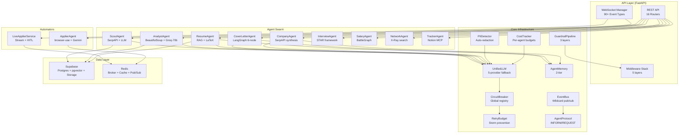

### Startup Sequence (Phase-Ordered)

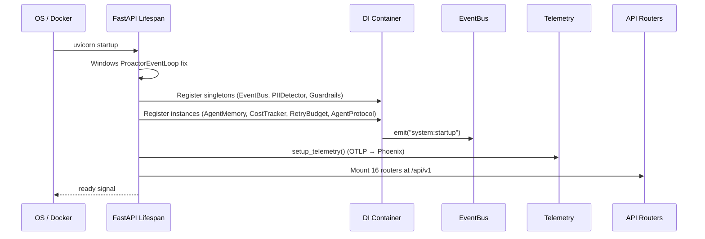

---

## 2. Feature: Job Pipeline Orchestration

### Summary
The central feature of JobAI — an end-to-end automated pipeline that discovers jobs, analyzes them, tailors documents, and submits applications. Acts as the wiring harness connecting all agents into a coherent workflow.

### Market Impact
**High.** No commercial tool offers this level of end-to-end automation with user oversight gates. Competitors like Simplify.jobs only handle form filling; they don't do discovery → analysis → tailoring → application as a unified pipeline.

### Input / Output

| | Detail |
|---|---|
| **Input** | `query` (job search text), `location`, `min_match_score` (0-100), `auto_apply` (bool), flags for `use_company_research`, `use_resume_tailoring`, `use_cover_letter` |
| **Output** | Real-time WebSocket event stream, `PipelineState` (Pydantic model), disk checkpoint file per session, Supabase records |

### Architecture

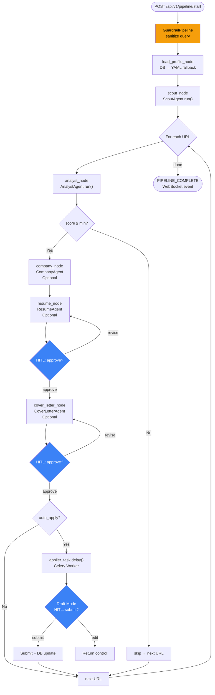

### Key Files
- [src/graphs/pipeline_graph.py](../src/graphs/pipeline_graph.py) — LangGraph `StateGraph` definition
- [src/services/orchestrator.py](../src/services/orchestrator.py) — `StreamingPipelineOrchestrator` entry point
- [src/api/routes/pipeline.py](../src/api/routes/pipeline.py) — REST + WS endpoints
- [src/worker/tasks/applier_task.py](../src/worker/tasks/applier_task.py) — Celery browser task

### Logical Flaws

| # | Flaw | Severity | Description |
|---|---|---|---|
| 1 | **Missing distributed lock** | HIGH | Multiple parallel requests for the same `user_id` can launch two pipelines simultaneously. `distributed_lock_manager` is imported but its usage is not enforced at pipeline start. |
| 2 | **Idempotency not enforced** | HIGH | `idempotency_store` is imported but not applied to the `/start` endpoint. Duplicate POSTs (from frontend retries) can launch double pipelines. |
| 3 | **Sequential job loop** | MEDIUM | The `for each URL` loop is sequential. A user with 20 jobs waits the full latency of each analyst before moving on — no parallelism across jobs in the pipeline. |
| 4 | **Checkpoint-only, no replay** | MEDIUM | The `PipelineCheckpoint` saves state to disk but there is no endpoint to **resume** a crashed pipeline. The checkpoint data is never read on startup. |
| 5 | **In-memory orchestrator state** | MEDIUM | `StreamingPipelineOrchestrator` stores `_is_running` as an instance variable. On process restart or horizontal scaling, a running flag from another process is invisible. |
| 6 | **Guardrail returns None on ImportError** | LOW | The pipeline silently proceeds with un-sanitized input if `guardrails` are not importable. Should raise instead. |

### Production Improvements

1. **Enforce distributed lock at `/start`** using `distributed_lock_manager.acquire(f"pipeline:{user_id}")` and return HTTP 409 if already running.
2. **Resume endpoint**: `POST /api/v1/pipeline/resume/{session_id}` — reads checkpoint, skips completed nodes.
3. **Parallel job processing**: Use `asyncio.gather()` with semaphore(N=3) across the job URL loop.
4. **Persist running state to Redis**, not instance variable, to support multi-process scaling.

---

## 3. Feature: Scout Agent — Job Discovery

### Summary
Finds fresh job listing URLs across major Applicant Tracking System (ATS) portals — Greenhouse, Lever, and Ashby — using SerpAPI (Google) with time-filtered queries. Includes LLM-powered self-correction reflection loop.

### Market Impact
**High.** Most job search tools rely on aggregators (Indeed, LinkedIn) which have stale, duplicate listings. Direct ATS portal discovery gives 0-duplicate, fresh (day/week/month) listings that candidates can be first to apply to.

### Input / Output

| | Detail |
|---|---|
| **Input** | `query` (string), `location` (string), `freshness` ("day"\|"week"\|"month"), optional `webhook_url` |
| **Output** | `List[ScrapedJob]` — each with `url`, `source_domain`, `query_matched` |

### Architecture

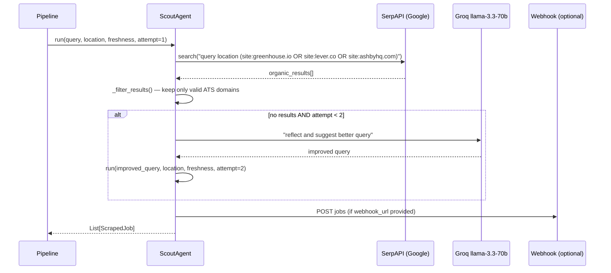

### Key File
- [src/automators/scout.py](../src/automators/scout.py)

### Logical Flaws

| # | Flaw | Severity | Description |
|---|---|---|---|
| 1 | **Direct Groq import in Scout** | MEDIUM | `ScoutAgent` directly instantiates `ChatGroq` instead of using the resilient `UnifiedLLM` provider chain. If Groq is rate-limited or down, the reflection step fails with no fallback. |
| 2 | **No de-duplication across sessions** | MEDIUM | The same job URL can appear across multiple pipeline runs for the same user. No persistence check against previously discovered URLs in `discovered_jobs` table. |
| 3 | **Synchronous SerpAPI call blocks event loop** | HIGH | `self.search.results(target_query)` is a synchronous HTTP call executed directly in an `async def` method. This blocks the event loop for the full network round-trip. |
| 4 | **Only 3 ATS domains** | LOW | Workday, SmartRecruiters, BambooHR, Greenhouse (via custom domain) are not covered. Many Fortune 500 companies use these. |
| 5 | **Webhook silently fails** | LOW | Webhook errors are caught and logged but not surfaced to the pipeline state, making pipeline auditing difficult. |

### Production Improvements

1. **Wrap SerpAPI call in `asyncio.to_thread()`** to prevent event loop blocking:
   ```python
   raw_results = await asyncio.to_thread(self.search.results, target_query)
   ```
2. **Replace direct ChatGroq with `get_llm()`** from `llm_provider` for resilience.
3. **Add job de-duplication** against `discovered_jobs` Supabase table before returning results.
4. **Add Workday domain** patterns: `site:myworkdayjobs.com`, `site:smartrecruiters.com`.

---

## 4. Feature: Analyst Agent — Job Matching

### Summary
Fetches raw HTML from an ATS job posting URL, extracts structured job data via BeautifulSoup, and uses Groq llama-3.3-70b to produce a match score (0-100) against the candidate's resume. One of the most compute-intensive per-job operations in the pipeline.

### Market Impact
**Very High.** Automated job-to-resume matching eliminates hours of manual screening. A reliable 0-100 score with gap analysis directly tells candidates where to focus their energy, similar to Jobscan's $9.95/month product but fully integrated into the application flow.

### Input / Output

| | Detail |
|---|---|
| **Input** | `url` (ATS job page URL), `resume_text` (plaintext resume) |
| **Output** | `JobAnalysis` Pydantic: `role`, `company`, `salary`, `tech_stack[]`, `matching_skills[]`, `missing_skills[]`, `gap_analysis_advice`, `match_score` (int 0-100), `reasoning` |

### Architecture

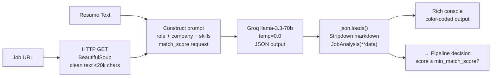

### Key File
- [src/automators/analyst.py](../src/automators/analyst.py)

### Logical Flaws

| # | Flaw | Severity | Description |
|---|---|---|---|
| 1 | **Direct synchronous HTTP fetch** | HIGH | `requests.get(url, timeout=10)` blocks the event loop. Must be wrapped in `asyncio.to_thread()`. |
| 2 | **Direct Groq instantiation** | MEDIUM | Same as ScoutAgent — bypasses `UnifiedLLM` fallback chain. If Groq 70b is rate-limited, analysis returns a zeroed `JobAnalysis` silently. |
| 3 | **Hardcoded 20k char truncation** | MEDIUM | Some SPAs (Workday) embed descriptions in JS payloads not captured by BeautifulSoup. The actual job text may be 0 chars despite a "successful" fetch. |
| 4 | **JSON parsing weakness** | MEDIUM | Strips ```` ```json ``` ```` manually with string replace. If the LLM adds unusual formatting (comments, trailing commas), `json.loads()` raises and returns a zeroed fallback with score=0 — silently skipping valid jobs. |
| 5 | **No retry on 429/503** | HIGH | ATS rate limiting (Greenhouse, Lever) returns 429 or redirects to CAPTCHA. The code catches generic `Exception` and logs an empty content — the job is silently skipped. |
| 6 | **Temperature=0 with 70b model** | LOW | Using temperature=0 on a 70b model is correct for deterministic output, but the model costs ~3x the 8b model for the same task. Should evaluate if 8b with structured JSON output is sufficient. |

### Production Improvements

1. **Use `httpx.AsyncClient` instead of `requests.get()`** — native async HTTP with connection pooling.
2. **Add retry for 429/5xx** with exponential backoff before giving up on a URL.
3. **Playwright fallback** for JS-rendered pages (Workday/SAP) when BeautifulSoup returns < 500 chars.
4. **Structured JSON output via LangChain's `.with_structured_output(JobAnalysis)`** to eliminate manual JSON parsing fragility.

---

## 5. Feature: Resume Agent — AI Tailoring

### Summary
The most value-dense feature. Takes a user's base profile, job requirements, and RAG-retrieved context to produce a tailored resume specific to a job opening. Generates LaTeX source, computes an ATS score, and includes a HITL review gate before storage.

### Market Impact
**Very High.** Competing products (Rezi, Kickresume, Teal AI) charge $15-29/month just for tailoring. JobAI integrates it directly into the pass-through pipeline at zero additional user cost. The LaTeX storage differentiator means PDFs can be re-generated without re-running AI.

### Input / Output

| | Detail |
|---|---|
| **Input** | `UserProfile` (structured), `JobAnalysis` (from Analyst), optional `feedback` from HITL, optional `hitl_handler` callable |
| **Output** | `AgentResponse` with: tailored summary, skills section, experience bullets, ATS score estimate, LaTeX source saved to Supabase Storage, HITL prompt if score < threshold |

### Architecture

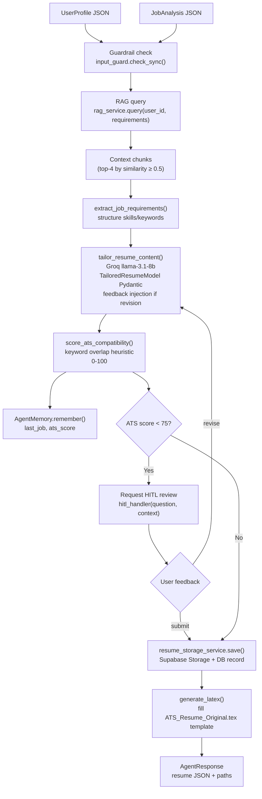

### Key Files
- [src/agents/resume_agent.py](../src/agents/resume_agent.py)
- [src/services/resume_storage_service.py](../src/services/resume_storage_service.py)
- [src/services/resume_service.py](../src/services/resume_service.py)
- [assets/ATS_Resume_Original.tex](../assets/ATS_Resume_Original.tex)

### Logical Flaws

| # | Flaw | Severity | Description |
|---|---|---|---|
| 1 | **ATS score is heuristic, not ground-truth** | HIGH | `score_ats_compatibility()` uses keyword overlap counting. Real ATS systems (Greenhouse) use TF-IDF and semantic matching. Misleads users into false confidence. |
| 2 | **HITL gate threshold is hardcoded** | MEDIUM | The 75% threshold for triggering HITL review is hardcoded. Should be user-configurable or per-company configurable. |
| 3 | **LaTeX template path is relative** | HIGH | `ATS_Resume_Original.tex` is referenced from `assets/` — this will fail if the working directory is not the backend root. Should use `Path(__file__).resolve().parent`. |
| 4 | **No bullet de-duplication** | MEDIUM | When the LLM generates tailored experience bullets, duplicate bullets across experience items are not filtered. Results in resumes with repetitive content if multiple jobs share similar requirements. |
| 5 | **Single-model tailoring** | MEDIUM | llama-3.1-8b at temp=0.3 is used for tailoring. This model struggles with nuanced bullet rephrasing for senior roles. Should route to llama-3.3-70b for senior/staff level roles. |
| 6 | **Feedback injection via string concatenation** | LOW | User revision feedback is concatenated into the prompt string, making it injectable. Feedback text should be validated by the guardrail before re-injection. |

### Production Improvements

1. **Integrate a real ATS scoring API** (Jobscan API, or build semantic keyword matching with spaCy) instead of keyword overlap.
2. **Model routing by seniority**: if `is_senior_role == True`, route to llama-3.3-70b for experience bullets.
3. **Use `pathlib.Path` for all file references** to prevent CWD-dependent failures.
4. **Run feedback text through `input_guard.check_sync()`** before injecting into prompt.

---

## 6. Feature: Cover Letter Agent — LangGraph DAG

### Summary
A 6-node LangGraph `StateGraph` that produces a tailored, tone-customized cover letter through planning, research, generation, formatting, HITL review, and finalization stages. The only agent fully structured as a proper LangGraph DAG with `MemorySaver` checkpointing.

### Market Impact
**High.** Cover letter generation tools like Copy.ai or Jasper are generic. This agent tailors tone, references company values from real-time research, and iterates on user feedback before finalizing — a level of polish unavailable anywhere at this price point.

### Input / Output

| | Detail |
|---|---|
| **Input** | `CoverLetterState` TypedDict: `job_analysis`, `user_profile`, `tone` ("professional"\|"enthusiastic"\|"formal"\|"casual"), `hitl_handler` callable, `user_id` |
| **Output** | `CoverLetterState.result`: `full_text`, `plan`, `company_research`, `content` dict |

### Architecture (LangGraph DAG)

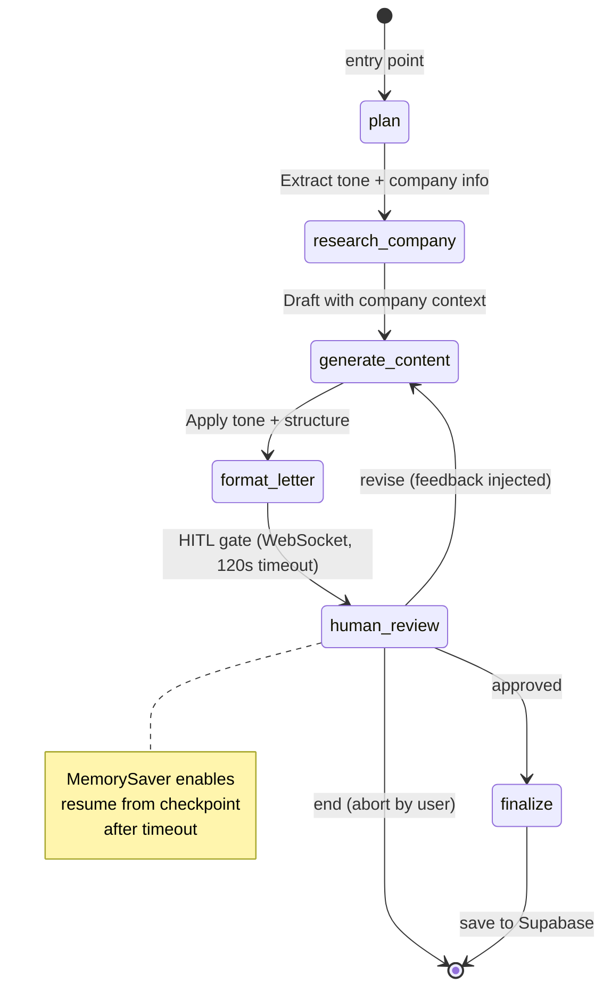

### Node Responsibilities

| Node | Model | Action |
|---|---|---|
| `plan` | Groq llama-3.3-70b | Decompose into planning steps: tone analysis, hook construction, value mapping |
| `research_company` | Groq llama-3.3-70b | Extract culture, mission statements, values from `job_analysis` data |
| `generate_content` | Groq llama-3.3-70b + temp=0.6 | Draft opening, body, call-to-action paragraphs |
| `format_letter` | Groq llama-3.3-70b | Apply tone vocabulary, enforce 3-paragraph structure, add salutation/sign-off |
| `human_review` | — (HITL only) | Send `COVER_LETTER_REVIEW_REQUESTED` WS event, await Future(120s) |
| `finalize` | — | Save to `resume_storage_service`, return result |

### Key File
- [src/agents/cover_letter_agent.py](../src/agents/cover_letter_agent.py)

### Logical Flaws

| # | Flaw | Severity | Description |
|---|---|---|---|
| 1 | **MemorySaver is in-process only** | HIGH | `MemorySaver()` stores checkpoints in RAM. On server restart, HITL sessions that were awaiting user response lose their state permanently. Use `PostgresSaver` or Redis-backed checkpoint for production. |
| 2 | **Tone vocab not validated** | LOW | If the user passes a tone not in `TONES` dict, the system falls through silently to no tone instruction. Should raise a 422 validation error. |
| 3 | **Company research comes from job_analysis dict only** | MEDIUM | The `research_company` node only re-reads data already in `job_analysis` — it does NOT call `SerpAPI` or `CompanyAgent`. The feature name is misleading; no actual live research happens here. |
| 4 | **No max_revision guard** | MEDIUM | The `revise` conditional edge has no cycle limit. A user could loop the revision indefinitely, consuming unlimited LLM tokens. Max 3 revisions should be enforced. |
| 5 | **Thread safety of MemorySaver** | MEDIUM | `MemorySaver` is instantiated once per `CoverLetterAgent` instance. If the singleton agent handles concurrent users via async, the same in-memory checkpoint store handles multiple sessions — thread safety depends on LangGraph's internals. |

### Production Improvements

1. **Replace `MemorySaver` with `AsyncRedisSaver`** using the existing Redis connection.
2. **Call `CompanyAgent.research()` in `research_company` node** when missing from job_analysis.
3. **Enforce max revision count** in state: `revision_count: int = 0`, increment on each `revise` edge, END graph when `revision_count >= 3`.
4. **Add `tone` as a validated enum** in `CoverLetterState` TypedDict with Literal type.

---

## 7. Feature: Company Research Agent

### Summary
Performs SerpAPI-backed research on a target company before interviews or applications. Synthesizes a structured dossier: industry, products, competitors, recent news, interview tips, and culture signals. Also generates a PDF "Insider Dossier" report.

### Market Impact
**High.** Pre-interview research that previously took 2-3 hours (Glassdoor, LinkedIn, Google News, Crunchbase) is compressed to ~20 seconds. Direct competitive comparison: Glassdoor interview tips are crowd-sourced and generic; JobAI generates company-specific, role-specific tips.

### Input / Output

| | Detail |
|---|---|
| **Input** | `company` (string), `role` (string, optional) |
| **Output** | Structured JSON: `company_name`, `industry`, `size`, `founded`, `mission`, `values[]`, `tech_stack[]`, `products[]`, `competitors[]`, `recent_news[]`, `interview_tips[]`, `questions_to_ask[]`, `sources[]` |

### Architecture

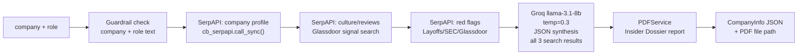

### Key File
- [src/agents/company_agent.py](../src/agents/company_agent.py)

### Logical Flaws

| # | Flaw | Severity | Description |
|---|---|---|---|
| 1 | **`cb_serpapi.call_sync()` in async context** | CRITICAL | Using the synchronous circuit breaker call in an async handler blocks the event loop for all concurrent WS connections. The method does not `await` and is not wrapped in `asyncio.to_thread()`. |
| 2 | **Sources field is LLM-hallucinated** | HIGH | The `sources` field in the output prompt instructs the LLM to return "Source (URL)" items. The LLM does not receive actual URLs from SerpAPI results — it invents plausible-looking URLs. Complete data integrity issue. |
| 3 | **No caching of company research** | MEDIUM | The same company is researched from scratch on every pipeline run. A `company_cache` with 24h TTL in Redis would eliminate most redundant SerpAPI calls. |
| 4 | **3 separate SerpAPI queries with no dedup** | MEDIUM | Querying SerpAPI 3 times per company consumes 3x the API credit. A single broader query with `company profile culture news red flags` could cover most use cases. |

### Production Improvements

1. **Use `asyncio.to_thread()`** for all SerpAPI calls.
2. **Pass SerpAPI result URLs** into the LLM prompt explicitly so `sources[]` contains real URLs.
3. **Cache company research in Redis** with key `company_research:{company_slug}:{date}`, TTL 24h.
4. **Consolidate to 1-2 SerpAPI queries** with structured extraction.

---

## 8. Feature: Interview Prep Agent

### Summary
Generates role-specific interview preparation: behavioral questions with STAR framework templates, technical questions by technology with difficulty levels, DSA problem recommendations (anti-hallucination: links only to real LeetCode problems), and salary range data.

### Market Impact
**High.** Interview.io costs $300+/session. AI interview prep tools like interviewing.io are static. JobAI generates job-specific behavioral + technical questions based on the actual job description, at zero marginal cost.

### Input / Output

| | Detail |
|---|---|
| **Input** | `role`, `company`, `tech_stack[]`, `job_description` (optional), `UserProfile` (for experience context) |
| **Output** | Structured prep pack: `BehavioralQuestionsModel` (list of `BehavioralQuestion` with STAR framework), `TechnicalQuestionsModel` (list with difficulty/follow-ups), DSA problems list, salary range |

### Architecture

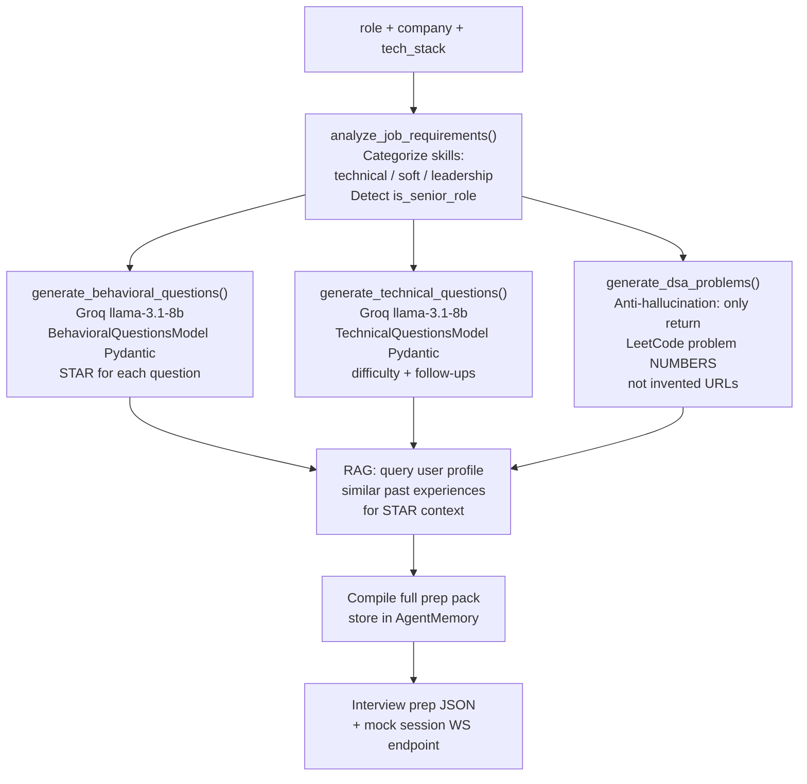

### Key File
- [src/agents/interview_agent.py](../src/agents/interview_agent.py)

### Logical Flaws

| # | Flaw | Severity | Description |
|---|---|---|---|
| 1 | **STAR framework doesn't use real profile data** | HIGH | The STAR framework is generated with placeholder content ("Your previous experience at...") rather than drawing from the user's actual Supabase profile work history. The RAG query is an addon, not integrated into the STAR generation prompt. |
| 2 | **DSA problem numbers still hallucinated** | HIGH | Despite the "anti-hallucination" claim, the LLM can still generate non-existent LeetCode problem numbers. The code does not validate numbers against a known set. |
| 3 | **No mock interview WebSocket session** | MEDIUM | The architecture references a mock WS endpoint (`/api/v1/interview` WebSocket) but this is a stub — the mock session functionality is not implemented. |
| 4 | **Technical question difficulty is self-assessed by LLM** | MEDIUM | The LLM rates its own questions as "easy/medium/hard". This is unreliable — a company-senior question rated "medium" may be "hard" based on actual company bar. |

### Production Improvements

1. **Inject user's actual experience history** (from `user_experience` Supabase table) into the STAR framework generation prompt via the `UserProfile` object that's already available.
2. **Validate LeetCode problem numbers** against a static JSON list of valid problem IDs (downloadable from LeetCode's public GraphQL API).
3. **Build the mock interview WebSocket handler** in `src/api/routes/interview.py` as a `StateGraph` with turn-based QA.

---

## 9. Feature: Salary Negotiation System

### Summary
Two-part feature: (1) Market salary research using SerpAPI to benchmark compensation for a role/location, and (2) an interactive turn-based negotiation simulator ("Battle Mode") where the user practices salary negotiation against an AI HR persona.

### Market Impact
**Very High.** Salary negotiation tools are among the highest-value career tools available. Levels.fyi provides static data; there's no interactive practice tool available to average job seekers. The "Battle Mode" gamification could be a standalone product.

### Input / Output

**Research:**
| | |
|---|---|
| **Input** | `role`, `location`, `years_experience`, `company` (optional) |
| **Output** | `SalaryResearch`: `role`, `location`, `percentile_25/50/75`, `top_skills_premium[]`, `negotiation_tips[]` |

**Battle Mode:**
| | |
|---|---|
| **Input** | `battle_id`, user WS message (offer/counter), `BattlePhase` state |
| **Output** | AI HR persona response, new `BattlePhase`, updated `current_offer`, `SALARY_BATTLE_*` WS events |

### Architecture

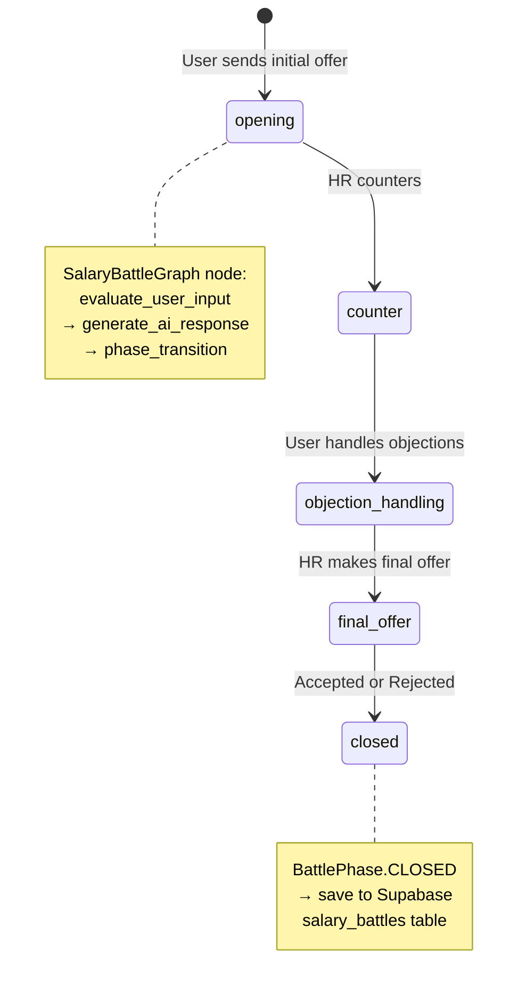

### Key Files
- [src/services/salary_service.py](../src/services/salary_service.py)
- `src/api/routes/salary.py` (routes)

### Logical Flaws

| # | Flaw | Severity | Description |
|---|---|---|---|
| 1 | **Salary data from LLM, not verified data** | CRITICAL | Market percentiles (P25/P50/P75) are LLM-generated. The model has a training cutoff and no access to real-time Levels.fyi, Glassdoor, or Bureau of Labor Statistics data. Users will receive outdated or hallucinated figures. |
| 2 | **Battle phase transition not enforced** | HIGH | The `BattlePhase` progression (`opening → counter → ...`) is described as a state machine but the implementation only tracks it via LLM prompting — the AI can skip phases freely if instructed by the user. |
| 3 | **No persistence of battle state in Redis** | MEDIUM | Battle turns are stored in Supabase `user_salary_messages` per-message but the full in-flight `SalaryBattleState` is not persisted. A WebSocket disconnect mid-battle drops all AI context. |
| 4 | **Blocking Supabase calls** | HIGH | All `salary_service` methods (`create_battle`, `log_message`, etc.) use the synchronous Supabase client in `async def` handlers without `await asyncio.to_thread()`. |

### Production Improvements

1. **Integrate a real salary data API**: Bureau of Labor Statistics OES programmatic API (free), or Glassdoor Partner API for real P25/P50/P75.
2. **Enforce phase transitions in code**: `if state.phase == BattlePhase.OPENING and user_wants_to_skip`: deny and explain.
3. **Buffer battle state in Redis** with `battle:{id}` key during active session; write to Supabase only on completion.
4. **Use async Supabase client** (`supabase.aio_create_client`) for all battle operations.

---

## 10. Feature: Network Intelligence Agent

### Summary
LinkedIn X-Ray search using Google (SerpAPI) with query pattern `site:linkedin.com/in/ "College" "Company"` to find alumni, ex-colleagues, and location-based connections at target companies — without touching LinkedIn's servers (no ban risk). Generates personalized outreach message drafts.

### Market Impact
**High.** LinkedIn's own "People You May Know at Company" feature requires an existing connection. This agent finds cold-contact paths through alumni networks without a premium LinkedIn subscription. Similar tools (Hunter.io, ContactOut) charge $40-100+/month.

### Input / Output

| | Detail |
|---|---|
| **Input** | `UserProfile` (education, experience, location), `target_company` (string) |
| **Output** | `NetworkSearchResult`: `matches[]` (each: `name`, `headline`, `profile_url`, `connection_type`, `confidence_score`), `outreach_drafts{}` per match |

### Architecture

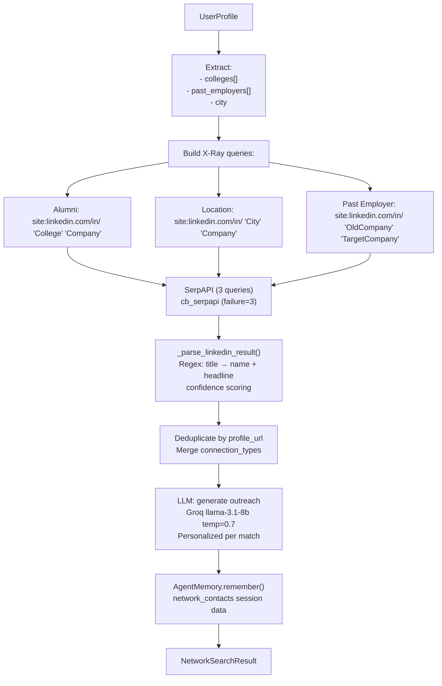

### Key File
- [src/agents/network_agent.py](../src/agents/network_agent.py)

### Logical Flaws

| # | Flaw | Severity | Description |
|---|---|---|---|
| 1 | **3 SerpAPI queries per search = high API cost** | HIGH | Each network search consumes 3 SerpAPI queries. At scale (100 users/day × 3 targets each = 900 queries/day), this approaches SerpAPI's free tier limit rapidly. |
| 2 | **LinkedIn URL parsing brittleness** | MEDIUM | The regex `re.split(r'\s*[-–—]\s*', title, maxsplit=1)` is fragile for non-Latin names and company names with dashes (e.g., "Björn Å. - Lead Engineer at Coca-Cola"). |
| 3 | **`confidence_score=0.8 if headline else 0.5`** | LOW | Binary confidence scoring is meaningless. It should factor in connection type strength (alumni > company > location), profile URL domain match, and name validation. |
| 4 | **No caching of LinkedIn search results** | MEDIUM | The same alumni search for "Harvard → Google" is repeated fresh for every user. A shared 48h cache keyed by `college+company` would serve multiple users from one query. |
| 5 | **Outreach message quality depends entirely on headline** | MEDIUM | If the LinkedIn snippet is truncated (common: 100 chars), the LLM generates a generic message indistinguishable from spam. |

### Production Improvements

1. **Add Redis caching for X-Ray queries** with key `xray:{college}:{company}:{date}`, TTL 48h, shared across users.
2. **Improve confidence scoring**: weight by connection type (alumni=0.9, ex-colleague=0.85, location=0.6), profile completeness signals.
3. **Fallback to 1 query per strategy** and merge results only when needed to stay under budget.

---

## 11. Feature: Job Tracker Agent (Notion)

### Summary
Full CRM for job application tracking. Stores and manages job applications across status lifecycle (Applied → Screening → Interview → Offer → Rejected). Integrates with Notion as a human-readable tracking interface alongside Supabase persistence.

### Market Impact
**Medium.** Notion-based job trackers are popular in creator communities (100k+ downloads for Notion templates). Automated population of the Notion database from pipeline events is currently a manual process for users. Auto-population raises the value significantly.

### Input / Output

| | Detail |
|---|---|
| **Input** | `company`, `role`, `url`, `salary_range`, `notes`, `priority` |
| **Output** | Notion Page ID, `job_applications` Supabase record, tracking summary stats |

### Architecture

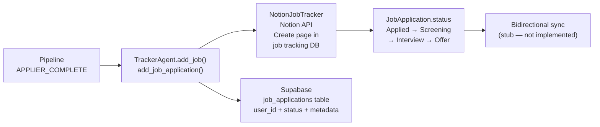

### Key File
- [src/agents/tracker_agent.py](../src/agents/tracker_agent.py)

### Logical Flaws

| # | Flaw | Severity | Description |
|---|---|---|---|
| 1 | **Notion API token not in Settings** | CRITICAL | `NotionJobTracker.__init__` does not read `NOTION_TOKEN` or `NOTION_DATABASE_ID` from `Settings`. Connection always returns `_notion_available=True` but API calls will fail if credentials are absent. |
| 2 | **`is_connected` returns True with no credentials** | CRITICAL | `_notion_available` is set to `True` unconditionally in `_check_notion_connection()`. This means all downstream code believes Notion is connected even when it's not. |
| 3 | **No bidirectional sync** | HIGH | Status updates that a user makes in Notion (Interview → Rejected) never propagate back to Supabase. The sync is one-way: pipeline → Notion. |
| 4 | **Blocking Notion API calls** | HIGH | Notion API calls must use `asyncio.to_thread()` since the `notion_client` library is synchronous. |

### Production Improvements

1. **Read `NOTION_TOKEN` and `NOTION_DATABASE_ID` from `Settings`** class; raise `ValueError` on connect if missing.
2. **Implement `_check_notion_connection()`** with an actual `GET /users/me` test call and set `_notion_available` accordingly.
3. **Add a webhook receiver endpoint** `POST /api/v1/webhooks/notion` to receive Notion changes and sync back to Supabase.

---

## 12. Feature: Live Applier (browser-use + HITL)

### Summary
The most technically sophisticated feature. Launches a Gemini 2.0 Flash-powered browser automation agent that fills ATS job application forms, streams live screenshots (5 FPS) to the user via WebSocket, and gates final submission behind a HITL "Draft Mode" review.

### Market Impact
**Extremely High.** No commercial tool streams live browser sessions to end-users during application. This "glass box" automation model (user watches the agent fill forms in real-time) is the key trust differentiator vs. black-box tools like Apply4Me.

### Input / Output

| | Detail |
|---|---|
| **Input** | `url` (ATS application page), `UserProfile` | `session_id`, `draft_mode=True` |
| **Output** | WebSocket event stream: `BROWSER_SCREENSHOT` (5 FPS base64 JPEGs), `HITL_REQUEST`, `DRAFT_REVIEW`, `APPLIER_COMPLETE`; `job_applications` Supabase record |

### Architecture

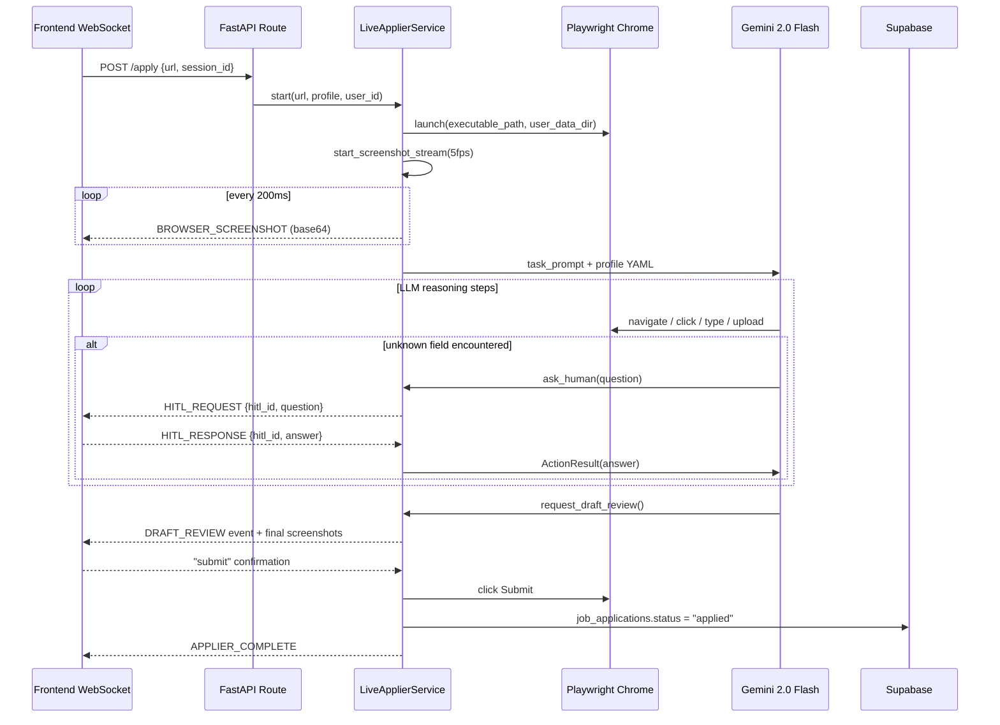

### Key Files
- [src/services/live_applier.py](../src/services/live_applier.py)
- [src/services/LiveApplier/service.py](../src/services/LiveApplier/service.py)
- [src/automators/applier.py](../src/automators/applier.py)

### Logical Flaws

| # | Flaw | Severity | Description |
|---|---|---|---|
| 1 | **Profile sent as raw YAML to LLM** | CRITICAL | `yaml.dump(profile_dict)` dumps the full profile including all fields. If `profile` contains sensitive fields (SSN, DOB, bank details), they are sent verbatim to Gemini (Google's API). Must strip PII before YAML serialization. |
| 2 | **Browser instance not always cleaned up** | HIGH | If the WebSocket disconnects mid-application, `_screenshot_task` may keep running and the browser process is never closed. The `stop()` method should be called on WS disconnect. |
| 3 | **`asyncio.get_running_loop()` in Tool callback** | HIGH | The `ask_human` tool uses `asyncio.get_running_loop()` inside a `@tools.action` callback. If `browser-use` calls actions from a thread pool (not the event loop), this raises `RuntimeError: no running event loop`. |
| 4 | **5 FPS screenshot = potential CPU/memory pressure** | MEDIUM | Base64 JPEG screenshots at 5 FPS over WebSocket can generate 150+ events/30s. Each screenshot may be 30-100KB, totaling 4.5-15MB/30s per active session. No rate limiting or compression threshold. |
| 5 | **Draft mode is opt-out, not documented** | LOW | `draft_mode=True` by default is correct for safety but not documented in the API schema. Frontend could unknowingly pass `draft_mode=False`, bypassing user confirmation. |

### Production Improvements

1. **Strip PII from profile YAML** using `PIIDetector.redact()` before sending to Gemini.
2. **Wrap screenshot Task cleanup** in `try/finally` with `browser.close()` call, regardless of success/failure.
3. **Move `ask_human` to use an `asyncio.Queue`** instead of a Future, which is safer across thread boundaries.
4. **Add screenshot WebP compression** and throttle to 2 FPS when bandwidth > 2MB/s.

---

## 13. Feature: RAG Knowledge System

### Summary
A Retrieval-Augmented Generation layer that embeds user profile, resumes, and uploaded documents into a pgvector store (Supabase). During agent invocations, agents query the RAG to inject relevant personal context into LLM prompts, enabling truly personalized output without re-reading full profiles.

### Market Impact
**High.** The RAG layer is what enables agents to write "in the user's voice" — they retrieve relevant past experience bullets and project descriptions to use actual language patterns, not generic placeholders. This is the technical foundation of the personalization story.

### Input / Output

| | Detail |
|---|---|
| **Input (add)** | `user_id`, `content` (text), `metadata` dict (type, source) |
| **Input (query)** | `user_id`, `query_text`, `k=4`, `threshold=0.5` |
| **Output** | `List[{content, metadata, similarity}]` — top-k chunks by cosine similarity ≥ threshold |

### Architecture

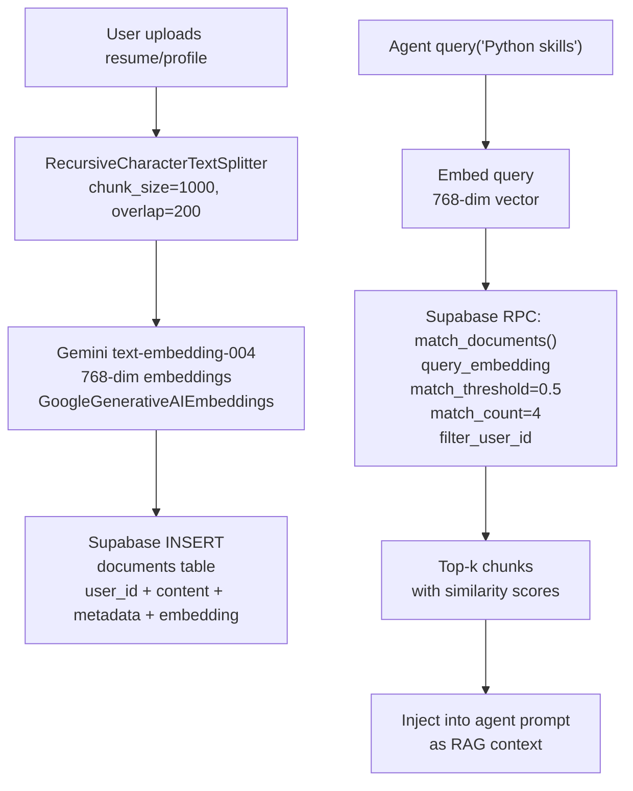

### Key File
- [src/services/rag_service.py](../src/services/rag_service.py)

### Logical Flaws

| # | Flaw | Severity | Description |
|---|---|---|---|
| 1 | **`sync_user_profile` is synchronous-inside-async** | HIGH | Both `add_document()` and `sync_user_profile()` call `self.embeddings.embed_documents(texts)` — a synchronous blocking call from `langchain_google_genai`. Must be wrapped in `asyncio.to_thread()`. |
| 2 | **`match_threshold=0.5` hardcoded** | MEDIUM | Threshold is not configurable. For very specific technical queries (e.g., "Kubernetes deployment experience"), 0.5 returns too many irrelevant chunks. Should be query-type dependent. |
| 3 | **No chunk metadata enrichment** | MEDIUM | Document chunks don't record source section (e.g., "experience", "skills", "education"). Agents can't prefer "experience" chunks over "education" chunks for job-specific tailoring. |
| 4 | **`SupabaseVectorStore` vs. direct RPC mismatch** | MEDIUM | Code comments acknowledge that `SupabaseVectorStore.similarity_search` passes `filter_user_id` incorrectly. The manual RPC workaround is correct but means RAG is bypassing LangChain's standard VectorStore interface entirely. |
| 5 | **Missing RAG for Analyst** | HIGH | The AnalystAgent does NOT call the RAG service. Resume matching is done using the raw `resume_text` string passed from profile — not the semantically enriched RAG store. |

### Production Improvements

1. **Use `asyncio.to_thread(self.embeddings.embed_documents, texts)`** for all embedding calls.
2. **Enrich chunk metadata**: `{"type": "profile", "section": "experience", "role": "Software Engineer"}` to enable section-weighted retrieval.
3. **Have AnalystAgent query the RAG store** for relevant skill experience chunks when computing match analysis.
4. **Make `match_threshold` dynamic** — start at 0.7 for high-confidence queries, fall back to 0.5 if fewer than 2 results returned.

---

## 14. Feature: Career Trajectory Engine

### Summary
A fully deterministic (zero LLM calls) career path modeling engine that maps a user's current title to a family ladder, shows the 1-2 likely next roles, estimates transition timeline, and lists required skills for each step. Uses 6 pre-defined career ladder definitions.

### Market Impact
**Medium.** LinkedIn Premium's "Career Insights" charges $40/month for similar role mapping. The zero-latency, zero-cost nature of this algorithmic engine makes it an easy high-value add to the dashboard without API cost concerns.

### Input / Output

| | Detail |
|---|---|
| **Input** | `UserProfile` (title, years_experience, skills[]) |
| **Output** | `CareerAnalysis`: `current_role`, `family`, `ladder_level`, `next_roles[]`, `years_to_next`, `required_skills[]`, `transition_skills[]` |

### Architecture

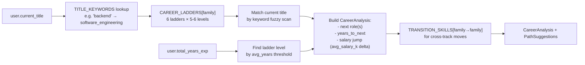

### Key File
- [src/services/career_trajectory.py](../src/services/career_trajectory.py)

### Logical Flaws

| # | Flaw | Severity | Description |
|---|---|---|---|
| 1 | **Salary benchmarks are 2024-era estimates** | HIGH | `avg_salary_k` values are hardcoded totals from a specific market snapshot. Salaries vary heavily by location (SF vs. Tulsa) and are not updated automatically. |
| 2 | **Only 6 career families** | MEDIUM | Missing: Security Engineer, ML Ops, QA/Test, Technical Writer, Solutions Engineer, Developer Advocate. A significant portion of the user base is un-matched and falls into a generic default. |
| 3 | **Level matching is by `avg_years` alone** | MEDIUM | Level is determined purely by total experience years. A 10-year engineer who spent all years in support roles may incorrectly show as "Staff Engineer" level. |

### Production Improvements

1. **Add location multiplier** for salary estimates (SF=1.5×, NYC=1.4×, Remote=1.0×, Austin=1.1×).
2. **Expand families to 12+** to cover common ladder paths.
3. **Validate level using skills match** — require 70%+ match of skill requirements to confirm level assignment.

---

## 15. Feature: Skill Gap Tracker

### Summary
Algorithmic (zero LLM) skill gap analysis. Cross-references user's current skill list against role-specific skill maps (8 roles defined) with importance weights. Produces an `overall_fit` score (0-1), `critical_gaps[]` list, and `learning_priorities[]` with estimated timeline.

### Market Impact
**Medium-High.** Closes the gap between job rejection and understanding why. Currently, this data is only available inside expensive platforms (LinkedIn Learning, Pluralsight). The algorithmic approach makes it instant and free.

### Input / Output

| | Detail |
|---|---|
| **Input** | `user_skills[]` (list of strings), `target_roles[]` (list of role keys) |
| **Output** | `SkillGapReport`: `overall_fit (0-1)`, `critical_gaps[]`, `moderate_gaps[]`, `learning_priorities[]` (with `est_weeks`, resource links) |

### Key File
- [src/services/skill_tracker.py](../src/services/skill_tracker.py)

### Logical Flaws

| # | Flaw | Severity | Description |
|---|---|---|---|
| 1 | **Case-sensitive skill matching** | HIGH | User inputs "python" doesn't match the map key "Python". All matching should be `.lower()` normalized before comparison. |
| 2 | **Static skill map (no live enrichment)** | HIGH | Trending skills (Rust, Deno, LLMOps, Temporal) are not in the map. The map needs to be periodically updated from job posting analysis via the Scout+Analyst data. |
| 3 | **Learning resource links are curator names, not URLs** | MEDIUM | `LEARNING_PATHS` entries contain text like `"Official Python Tutorial"` — not actual URLs. These should be verified URLs with updated links. |

### Production Improvements

1. **Normalize all skill comparisons with `.lower().strip()`**.
2. **Auto-update skill map weekly** using top tech_stack items from recently analyzed jobs stored in Supabase.
3. **Provide direct clickable URLs** in `LEARNING_PATHS` entries.

---

## 16. Feature: Chat Orchestrator (NLU)

### Summary
A lightweight NLU dispatcher that classifies user free-text messages into 5 intents (SEARCH, APPLY, RESEARCH, TRACK, CHAT) and extracts structured parameters. Routes to the appropriate service/panel in the frontend "Canvas" interface.

### Market Impact
**Medium.** Enables a conversational entry-point to all features ("Find me Python jobs in Berlin") instead of requiring users to navigate multiple UI panels. Reduces onboarding friction significantly.

### Input / Output

| | Detail |
|---|---|
| **Input** | `user_message` (free text), `user_id` |
| **Output** | `Intent`: `action` (SEARCH/APPLY/RESEARCH/TRACK/CHAT), `parameters{}`, `response_text` |

### Key File
- [src/services/chat_orchestrator.py](../src/services/chat_orchestrator.py)

### Logical Flaws

| # | Flaw | Severity | Description |
|---|---|---|---|
| 1 | **Uses temperature=0 LLM for NLU** | MEDIUM | Temperature=0 is correct but the orchestrator calls `get_llm(temperature=0)` which instantiates the full `UnifiedLLM` provider chain on every message. This should be a cached singleton. |
| 2 | **No guardrails on chat input** | HIGH | User messages bypass `GuardrailPipeline` entirely. A malicious user can inject a `APPLY` intent with an `url` pointing to a malware site, which will be sent to the ApplierAgent. |
| 3 | **No conversation history** | MEDIUM | Each message is classified in isolation. "Find jobs there" after "I'm looking in Berlin" cannot be resolved — the orchestrator has no memory of the conversation context. |
| 4 | **5 intents too coarse** | LOW | Salary negotiation, interview prep, and career advice are all bucketed into CHAT. These should be separate intents with dedicated parameters. |

### Production Improvements

1. **Run user messages through `input_guard.check_sync()` before intent classification**.
2. **Cache the `UnifiedLLM` instance** in `chat_orchestrator` (it's already a singleton, but each `__init__` creates a new LLM).
3. **Add conversation window**: last 5 turns as context in the classification prompt.
4. **Expand to 8+ intents**: SALARY_RESEARCH, INTERVIEW_PREP, CAREER_ADVICE, SKILL_GAP.

---

## 17. Feature: PDF Dossier Generation

### Summary
Generates a professionally formatted "Insider Dossier" PDF using ReportLab for company research results. Includes executive summary, culture analysis, red flags table (color-highlighted), interview cheat sheet, and salary benchmarks.

### Market Impact
**Medium.** Differentiated from web-only tools by providing a take-away PDF the candidate can print or attach to a physical folder. The "Confidential Insider Dossier" branding adds perceived value.

### Input / Output

| | Detail |
|---|---|
| **Input** | Company research JSON dict, `filename` |
| **Output** | PDF file on disk at `generated_reports/{filename}`, file path string returned |

### Key File
- [src/services/pdf_service.py](../src/services/pdf_service.py)

### Logical Flaws

| # | Flaw | Severity | Description |
|---|---|---|---|
| 1 | **Files written to local disk** | HIGH | PDFs are written to `generated_reports/` on the server's local filesystem. In a containerized/serverless environment, this directory may not persist between restarts. Should upload to Supabase Storage. |
| 2 | **No async PDF generation** | MEDIUM | ReportLab `SimpleDocTemplate.build()` is synchronous and CPU-bound. For large reports with many pages, this blocks the async event loop. Should run in `asyncio.to_thread()`. |
| 3 | **No PDF access authorization** | HIGH | The generated PDF files are accessible by anyone who knows the filename (which is typically `{company}_{timestamp}.pdf`). No auth check on file serving. |

### Production Improvements

1. **Upload generated PDFs to Supabase Storage** (`cover-letters` bucket) immediately after generation, delete local file.
2. **Run `SimpleDocTemplate.build()` in `asyncio.to_thread()`**.
3. **Generate signed URLs** from Supabase Storage for PDF downloads with per-user auth.

---

## 18. Infrastructure: UnifiedLLM Provider Chain

### Summary
The central LLM abstraction layer that implements a 5-provider chain-of-responsibility fallback pattern. Provides a single `UnifiedLLM` interface to all agents with automatic failover, exponential backoff, usage tracking, and provider health metrics.

### Architecture

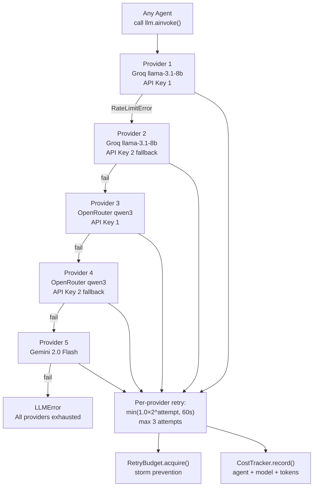

### Logical Flaws

| # | Flaw | Severity | Description |
|---|---|---|---|
| 1 | **Provider index not reset between calls** | HIGH | `self.current_provider_index` is an instance variable. If the singleton LLM object has provider index pointing to OpenRouter after a previous error, the next totally different request starts from provider 3 instead of provider 1. |
| 2 | **Rate limit detection via string matching** | MEDIUM | Rate limit detection with `"rate_limit" in str(error).lower()` can false-positive on error messages from other layers. Should check HTTP status code 429 specifically. |
| 3 | **No provider health probe** | MEDIUM | The fallback chain tries providers in order even if Groq is known to be down for an extended period. A background health probe that marks providers as "unavailable" would skip failed providers immediately. |
| 4 | **`generate_json()` parses with strip/replace** | MEDIUM | JSON extraction from markdown code fences uses `response.replace('```json', '').replace('```', '')`. Multi-block responses or nested backticks will break parsing. Should use regex extraction. |

### Production Improvements

1. **Reset `current_provider_index = 0`** at the start of every `ainvoke()` call.
2. **Add provider health probe**: background async task every 30s that pings each provider and marks it `healthy/degraded/down`.
3. **Use HTTP status code 429** as the primary rate limit signal; string matching as secondary backup.

---

## 19. Infrastructure: GuardrailPipeline (AI Safety)

### Summary
3-layer AI safety pipeline: (1) `PromptInjectionDetector` with 15+ regex patterns covering 6 attack categories, (2) `ContentSafetyChecker` for topic filtering and PII presence warning, (3) `OutputSchemaValidator` for JSON schema enforcement on LLM responses.

### Architecture

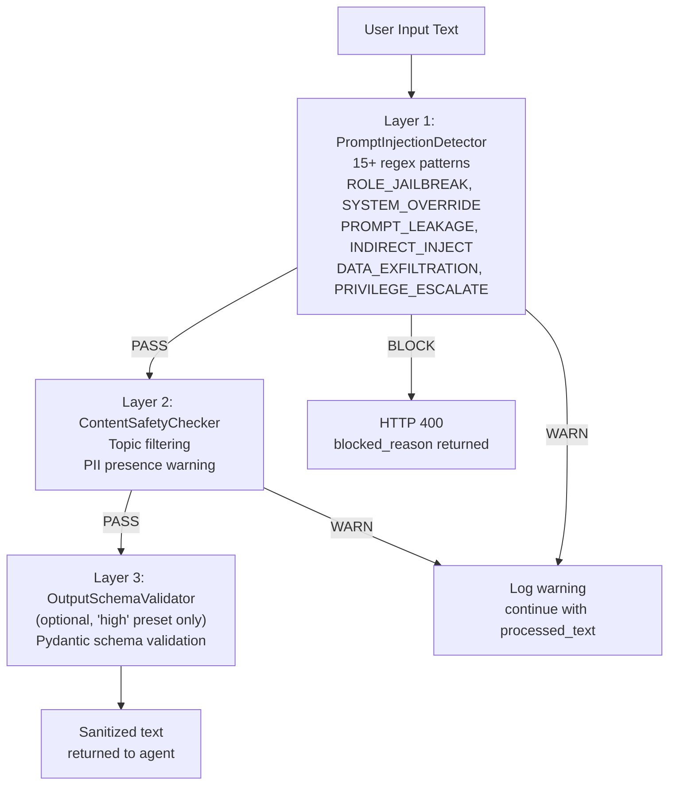

### Logical Flaws

| # | Flaw | Severity | Description |
|---|---|---|---|
| 1 | **`create_input_pipeline()` creates new instances every call** | HIGH | Each agent module creates its own `input_guard = create_input_pipeline('medium')` at module import time. This is acceptable as a module-level singleton, but if called inside handler functions, creates regex compilation overhead on every request. |
| 2 | **Pattern-only injection detection** | HIGH | Regex patterns catch known attacks but miss semantically equivalent novel attacks (e.g., Unicode lookalike characters: "ıgnore previous ınstructions"). An LLM-based meta-classifier would be more robust. |
| 3 | **Output schema validation disabled by default** | MEDIUM | The "medium" preset (used everywhere) skips Layer 3. JSON malformation from an LLM response therefore passes through undetected. Each agent handles JSON parsing manually and with varying robustness. |
| 4 | **`check_sync()` used in async handlers** | MEDIUM | All agents call `input_guard.check_sync()` — the sync version — inside `async def` handlers. This is acceptable if the check is fast (regex-only), but it's an inconsistency that can lead to future blocking if the guardrail is upgraded to call async services. |

---

## 20. Infrastructure: CircuitBreaker

### Summary
Production circuit breaker with three states (CLOSED/OPEN/HALF_OPEN), sliding window failure tracking (60s window), per-service named global registry, exponential backoff retry on failure, configurable fallback functions, and `CircuitMetrics` for monitoring.

### Architecture

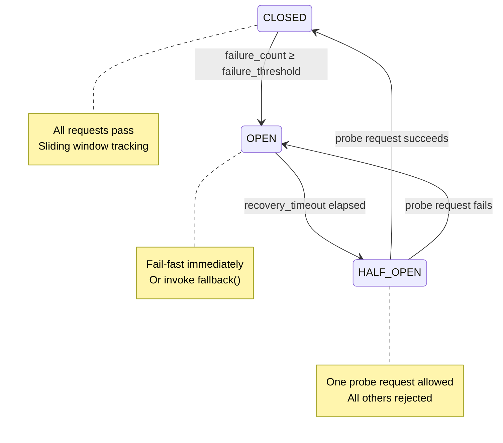

### Logical Flaws

| # | Flaw | Severity | Description |
|---|---|---|---|
| 1 | **`call_sync()` used in async handlers** | HIGH | `cb_serpapi.call_sync()` in CompanyAgent and NetworkAgent blocks the event loop. Only `cb.call()` (async) should be used in async contexts. |
| 2 | **Registry is a class variable (global mutable state)** | MEDIUM | `CircuitBreaker._registry` is a class-level dict. In tests, circuit breakers from previous tests bleed into new tests. Tests need a `CircuitBreaker._registry.clear()` fixture. |
| 3 | **HALF_OPEN state allows concurrent probes** | MEDIUM | If two requests arrive simultaneously in HALF_OPEN state, both may be allowed through (a TOCTOU race condition in async). Should use `asyncio.Lock` to ensure only one probe at a time. |

---

## 21. Infrastructure: RetryBudget

### Summary
System-wide retry storm prevention. Enforces 3 rules in a 60-second sliding window: max 20 retries/minute total, max 20% retry-to-request ratio per service, and 30-second mandatory cooldown if either limit is hit. Integrated into `UnifiedLLM`'s per-attempt retry loop.

### Logical Flaws

| # | Flaw | Severity | Description |
|---|---|---|---|
| 1 | **Per-service stats, not per-user** | MEDIUM | A single user hammering the salary endpoint can exhaust the Groq retry budget for all users. Budget should be scoped per `user_id` or per session, not just per service. |
| 2 | **`can_retry()` and `record_attempt()` are not atomic** | HIGH | A TOCTOU race exists: `can_retry()` returns True, then concurrently another coroutine also passes `can_retry()`, both proceed, and the budget is over-consumed. Needs `asyncio.Lock`. |

---

## 22. Infrastructure: AgentMemory (2-Tier)

### Summary
Persistent per-agent, per-user memory with 5 memory types (PREFERENCE, LEARNING, CONTEXT, FEEDBACK, PERFORMANCE). Tier 1: in-process `dict` cache for fast access. Tier 2: Supabase `agent_memory` table for durability. Failure-tolerant — DB errors silently downgrade to in-memory.

### Logical Flaws

| # | Flaw | Severity | Description |
|---|---|---|---|
| 1 | **In-memory cache is per-process** | HIGH | In horizontal scaling (multiple FastAPI workers), each worker has a different in-memory cache. Cache misses across workers cause unnecessary Supabase reads. Redis should be Tier 1 cache. |
| 2 | **Memory never expires from cache** | MEDIUM | The in-memory `_cache` dict grows indefinitely with no eviction policy. A user with 1000 memory entries per agent will cause memory pressure over time. Should use `functools.lru_cache` or a bounded `OrderedDict`. |
| 3 | **`_ensure_client()` lazy-loads Supabase** | LOW | The lazy-load pattern means the first memory write per worker process always hits Supabase (misses local cache). A warm-up call at startup would pre-populate caches for active users. |

---

## 23. Infrastructure: EventBus (Pub/Sub)

### Summary
In-process async event bus with wildcard topic matching (`job:*`), middleware pipeline, error isolation, and bounded event history for debugging. Used to decouple agent outputs from pipeline orchestration and WebSocket emission.

### Logical Flaws

| # | Flaw | Severity | Description |
|---|---|---|---|
| 1 | **In-process only — not distributed** | HIGH | Events are only visible within a single FastAPI process. In horizontal scaling or Celery worker → FastAPI communication, events do NOT propagate across processes. The Redis pub/sub bridge is only implemented for WebSocket, not EventBus. |
| 2 | **`_history` deque grows unboundedly per session** | MEDIUM | `max_history=100` is the global cap, but different `EventBus` instances (if created multiple times) have separate histories. The singleton `event_bus` has one shared history — high-traffic environments may overflow rapidly. |

---

## 24. Infrastructure: AgentProtocol (Inter-Agent Messaging)

### Summary
Structured inter-agent messaging protocol with 4 intents (INFORM/REQUEST/DELEGATE/FEEDBACK), priority levels, and a request-response pattern for blocking cross-agent queries. Built on top of EventBus.

### Logical Flaws

| # | Flaw | Severity | Description |
|---|---|---|---|
| 1 | **Request-response uses asyncio.Future with no timeout default** | HIGH | `agent_protocol.request()` creates a `Future` and waits with no timeout. If the target agent is unresponsive, the caller hangs indefinitely. |
| 2 | **Message log is unbounded** | MEDIUM | `_message_log` has `_max_log_size = 500` but uses a list — O(n) memory with no rotation. Should use `deque(maxlen=500)` for O(1) bounded append. |

---

## 25. Infrastructure: WebSocket ConnectionManager

### Summary
Manages WebSocket connections per `session_id`, per-session event history (bounded 200 events), HITL callback futures (120s timeout), and reconnection support via event replay. Singleton pattern ensures all routes share the same connection state.

### Logical Flaws

| # | Flaw | Severity | Description |
|---|---|---|---|
| 1 | **HITL futures not cleaned up on disconnect** | HIGH | If a client disconnects while a HITL future is pending (e.g., user closes browser during resume review), the future stays in `hitl_callbacks` indefinitely. Should auto-resolve futures with timeout or cleanup on disconnect. |
| 2 | **`event_history` never evicted** | MEDIUM | Per-session history deques are created on first connection but never removed. For a system with many short-lived sessions, `event_history` will grow indefinitely (dict of deques). Sessions older than 24h should be pruned. |
| 3 | **Broadcasting blocks on slow clients** | MEDIUM | `broadcast()` iterates all connections sequentially. A single slow WebSocket client (high latency) blocks all subsequent broadcasts for all other users. Should use `asyncio.gather()` for parallel broadcast. |
| 4 | **No authentication on WS connection** | HIGH | `WS_AUTH_REQUIRED` defaults to `False`. In production, unauthenticated WebSocket connections can read any session's events if they know the `session_id` (which is user-provided). |

---

## 26. Infrastructure: PIIDetector

### Summary
Regex-based PII detection and redaction with confidence scoring. Covers 7 PII types: email, phone (US/intl), SSN, credit card (with format validation), IP address, date of birth (with explicit markers only), and physical address. Used by `StructuredLogger` to auto-redact all log output.

### Logical Flaws

| # | Flaw | Severity | Description |
|---|---|---|---|
| 1 | **Credit card detection has false positives** | MEDIUM | The credit card regex can match non-CC numbers that start with 4 (e.g., version numbers "4.1234.5678.9012"). Should add Luhn algorithm validation before flagging as PII. |
| 2 | **Name detection absent** | HIGH | Person names (the most common PII in resumes) are not detected. A resume with "John Smith, SSN: 123-45-6789" would redact the SSN but not the name in log outputs. |
| 3 | **DOB detection requires explicit "DOB:" marker** | MEDIUM | Plain date of birth like "03/15/1985" without a "DOB:" prefix is not flagged. In resume context, standalone birth dates are common. |

---

## 27. Infrastructure: CostTracker

### Summary
Per-invocation LLM cost tracking with per-agent daily budget enforcement and global daily spend limits. Records `CostRecord` (agent, provider, model, tokens, cost_usd) in-memory with optional Supabase persistence. Admin endpoint exposes live usage dashboards.

### Logical Flaws

| # | Flaw | Severity | Description |
|---|---|---|---|
| 1 | **In-memory records lost on restart** | HIGH | All cost records are stored in `self._records: List[CostRecord]`. A server restart loses all historical data. Should persist to Supabase `llm_usage` table in real-time. |
| 2 | **Daily budget check is not async-safe** | MEDIUM | `check_budget()` and `record()` modify `_daily_totals` dict without locking. In high-concurrency, two coroutines could simultaneously read the same total, both succeed the budget check, then both add cost — exceeding the budget. Need `asyncio.Lock`. |
| 3 | **`_maybe_reset_daily()` triggered per-record** | LOW | Daily reset check happens on every `record()` call. Should run on a scheduled task (midnight UTC) instead of per-call to avoid timestamp comparison overhead. |

---

## 28. Infrastructure: PipelineGraph (LangGraph State Machine)

### Summary
The `StateGraph` implementation that replaces the previous sequential orchestrator. Manages `PipelineState` (Pydantic model with 20+ fields), 6 nodes (load_profile, scout, analyze_job, enrich_company, tailor_resume, apply), file-based checkpointing, and conditional edges.

### Architecture

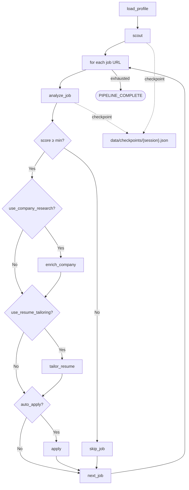

### Logical Flaws

| # | Flaw | Severity | Description |
|---|---|---|---|
| 1 | **Checkpoint file stored on local disk** | HIGH | `CHECKPOINT_DIR` defaults to `backend/data/checkpoints/`. In containerized deployment, this is the ephemeral container filesystem. Checkpoints are lost on container restart. |
| 2 | **No checkpoint resume endpoint** | HIGH | The checkpoint save logic is implemented, but there is no `resume_from_checkpoint()` code path or `/resume` API endpoint. Checkpoints are written but never read. |
| 3 | **PipelineState.profile is `Any`** | MEDIUM | `profile: Any = None` defeats Pydantic's type checking for the `UserProfile` object. Should be `Optional[UserProfile]`. |
| 4 | **Events list in state grows unboundedly** | MEDIUM | `PipelineState.events: List[Dict]` accumulates every event emitted during the pipeline. For a 20-job pipeline, this could hold 200+ events in the state object, all serialized to the checkpoint file. |

---

## 29. Infrastructure: Celery Task Queue

### Summary
Celery worker for offloading browser automation (Playwright) to a separate process, preventing event loop blocking in FastAPI. Uses Redis as broker and result backend. Configured with `pool=solo` on Windows for Playwright async subprocess support.

### Key File
- [src/worker/celery_app.py](../src/worker/celery_app.py)
- [src/worker/tasks/applier_task.py](../src/worker/tasks/applier_task.py)

### Logical Flaws

| # | Flaw | Severity | Description |
|---|---|---|---|
| 1 | **Only `applier_task` defined** | HIGH | The entire Celery worker infrastructure exists for a single task. Heavy non-browser AI work (70b model inference for Analyst) also blocks the event loop but is not offloaded. |
| 2 | **No task result TTL** | MEDIUM | Celery results stored in Redis have no expiry by default. Long-running systems will accumulate stale task results indefinitely. Set `result_expires = 3600`. |
| 3 | **`pool=solo` limits parallelism to 1** | HIGH | `solo` pool runs one task at a time. With multiple concurrent users all triggering applications, tasks queue serially instead of running in parallel browser instances. Use `pool=prefork` with Gevent/eventlet or multiple solo workers. |

---

## 30. Infrastructure: Observability & Telemetry

### Summary
OpenTelemetry spans exported to Arize Phoenix for LLM call tracing. `LangChainInstrumentor` auto-instruments all LangChain LLM and chain calls. `StructuredLogger` adds contextual JSON logging with correlation IDs. `CostTracker` provides token/cost admin dashboard.

### Logical Flaws

| # | Flaw | Severity | Description |
|---|---|---|---|
| 1 | **Phoenix not connected to Celery worker** | HIGH | The telemetry setup in `main.py` only instruments the FastAPI process. The Celery worker has no `setup_telemetry()` call — all browser agent LLM calls are invisible to Phoenix. |
| 2 | **No request-level tracing correlation** | MEDIUM | `correlation_id` from `X-Request-ID` header is added to logs but NOT to OpenTelemetry span attributes. Correlating an HTTP request to its LLM spans requires manual log-trace stitching. |
| 3 | **Metrics endpoint not implemented** | MEDIUM | `src/core/metrics.py` exists but there is no `/metrics` Prometheus endpoint registered in `main.py`. The Kubernetes Health probes exist but no scraping target is exposed. |

---

## 31. Global Logical Flaws & Bug Risks

### Critical-Priority Issues

| # | Location | Flaw | Impact |
|---|---|---|---|
| C1 | `applier.py:86` | Profile YAML sent as plaintext to Gemini API — no PII stripping | User SSN/DOB/bank details sent to Google |
| C2 | `tracker_agent.py:30` | Notion connection always returns `True` regardless of credentials | All tracker API calls silently fail |
| C3 | `salary_service.py:all` | All Supabase calls are sync in async handlers — blocks event loop | Salary battle responses hang |
| C4 | `scout.py:78` | `self.search.results()` is synchronous HTTP call inside async method | All WS clients stall during job search |
| C5 | `company_agent.py:59` | `cb_serpapi.call_sync()` inside async handler | Event loop blocked on company research |
| C6 | `pipeline_graph.py:50` | Checkpoints written to ephemeral container disk | Resume state lost on any container restart |

### High-Priority Issues

| # | Location | Flaw | Impact |
|---|---|---|---|
| H1 | `analyst.py:30` | `requests.get()` sync HTTP in async `run()` | Event loop blocked per job analysis |
| H2 | `rag_service.py:68` | `embed_documents()` sync in async `add_document()` | Embedding blocks event loop |
| H3 | `ws_manager:hitl_callbacks` | HITL futures leak on WS disconnect | Memory leak over time |
| H4 | `retry_budget.py:can_retry()` | Race condition: not atomic `can_retry` + `record_attempt` | Budget over-consumed under load |
| H5 | `cost_tracker.py` | `_daily_totals` modified without lock | Budget check race condition |
| H6 | `pipeline_graph.py` | No idempotency — same request can start 2 pipelines | Double-application risk |
| H7 | `cover_letter_agent.py` | `MemorySaver` is in-process RAM only | HITL state lost on restart |

---

## 32. Production-Grade Improvement Roadmap

### Phase 1 — Critical Fixes (0-2 weeks)

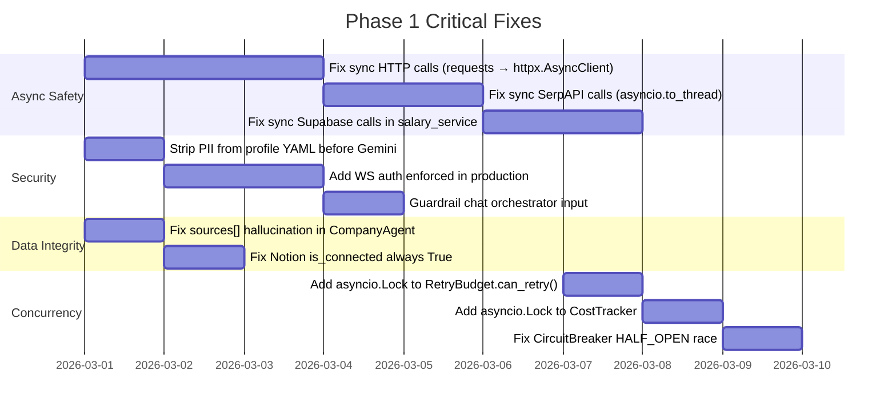

### Phase 2 — Architecture Hardening (2-6 weeks)

1. **Distributed Pipeline State**
   - Move `_is_running` flag from in-memory to Redis Hash
   - Replace `PipelineCheckpoint` (local disk) with Redis Streams or Supabase checkpoint table
   - Add `/pipeline/resume/{session_id}` endpoint

2. **Replace MemorySaver with AsyncRedisSaver**
   - Cover Letter Agent and all future LangGraph agents
   - Enables server restart survivability for HITL sessions

3. **Replace AgentMemory Tier 1 (dict) with Redis**
   - Shared cache across all worker processes
   - TTL-based eviction (`EXPIRE 86400`) for session-scoped memories

4. **Celery Parallelism**
   - Replace `pool=solo` with multiple `pool=solo` worker instances behind a Redis queue
   - `docker compose scale celery_worker=4` configuration

5. **Fix Provider Index Reset in UnifiedLLM**
   - `current_provider_index = 0` at start of each `ainvoke()` call

### Phase 3 — Feature Completion (6-12 weeks)

1. **Real Salary Data Integration**
   - BLS OES API for US salary percentiles (free, public)
   - Enrich with levels.fyi scraping (careful: ToS) or iHire/Glassdoor partner API

2. **Implement Interview Mock Session**
   - `/api/v1/interview/mock/ws/{session_id}` WebSocket handler
   - LangGraph `StateGraph` with QA turn loop
   - STAR framework evaluation scoring

3. **Notion Bidirectional Sync**
   - Notion webhook registration for `page.updated` events
   - `POST /webhooks/notion` endpoint → update `job_applications.status`

4. **ATS Scoring Ground-Truth**
   - Replace keyword-count ATS score with semantic cosine similarity
   - Use `spaCy` entity matching + TF-IDF against stored job descriptions

5. **Pipeline Job Parallelization**
   - `asyncio.gather(*[analyze_job(url) for url in urls], return_exceptions=True)` with semaphore(3)
   - Reduces 20-job pipeline from 20× serial latency to ≈7× parallel latency

### Phase 4 — Production Scale (3-6 months)

1. **Connect Celery telemetry** to Arize Phoenix (add `LangChainInstrumentor` in worker startup)
2. **Prometheus `/metrics` endpoint** with: active_pipeline_count, llm_calls_total, circuit_breaker_state, ws_connections
3. **KEDA autoscaling** for Celery workers based on Redis queue depth
4. **Multi-region Supabase** for data residency compliance (GDPR)
5. **Streaming LLM responses** via `ainvoke(stream=True)` piped to WebSocket for typing-effect UX in resume/cover letter generation

---

## Appendix: File Map

| Category | Files |
|---|---|
| Agents | `agents/resume_agent.py`, `agents/cover_letter_agent.py`, `agents/company_agent.py`, `agents/interview_agent.py`, `agents/network_agent.py`, `agents/tracker_agent.py` |
| Automators | `automators/scout.py`, `automators/analyst.py`, `automators/applier.py`, `automators/base.py` |
| Graphs | `graphs/pipeline_graph.py` |
| Services | `services/orchestrator.py`, `services/live_applier.py`, `services/rag_service.py`, `services/salary_service.py`, `services/career_trajectory.py`, `services/skill_tracker.py`, `services/chat_orchestrator.py`, `services/pdf_service.py`, `services/resume_storage_service.py`, `services/resume_service.py`, `services/db_service.py`, `services/user_profile_service.py` |
| Core Infra | `core/llm_provider.py`, `core/guardrails.py`, `core/circuit_breaker.py`, `core/retry_budget.py`, `core/agent_memory.py`, `core/event_bus.py`, `core/agent_protocol.py`, `core/pii_detector.py`, `core/cost_tracker.py`, `core/telemetry.py`, `core/structured_logger.py`, `core/config.py`, `core/auth.py`, `core/middleware.py` |
| API | `api/websocket.py`, `api/v1.py`, `api/routes/*.py` (16 route files), `api/schemas.py` |
| Worker | `worker/celery_app.py`, `worker/tasks/applier_task.py` |
| Database | `database/schema.sql`, `database/migrations/*.sql` |
| Evals | `evals/runner.py`, `evals/cases/resume_cases.json`, `evals/cases/salary_cases.json` |

---

**End of Analysis — Generated March 2026**  
**Total Features Analyzed:** 17  
**Total Infrastructure Components:** 13  
**Critical Issues Found:** 6  
**High-Priority Issues Found:** 7  
**Recommended Improvements:** 35+
