# JobStream — Advanced System Design & Architecture

> **Date:** March 2026  
> **Stack:** FastAPI · LangGraph · Next.js 14 · Supabase · browser-use · Groq / OpenRouter / Gemini  
> **Status:** Production-ready multi-tenant AI career automation platform

---

## Table of Contents

1. [Executive Overview](#1-executive-overview)
2. [High-Level Architecture](#2-high-level-architecture)
3. [Frontend Architecture](#3-frontend-architecture)
4. [Backend Architecture](#4-backend-architecture)
5. [AI Agent Layer](#5-ai-agent-layer)
6. [Automator Layer (Pipeline Workers)](#6-automator-layer-pipeline-workers)
7. [LangGraph Pipeline State Machine](#7-langgraph-pipeline-state-machine)
8. [Database Design](#8-database-design)
9. [Real-Time WebSocket Architecture](#9-real-time-websocket-architecture)
10. [LLM Provider Fallback Chain](#10-llm-provider-fallback-chain)
11. [Core Infrastructure Systems](#11-core-infrastructure-systems)
12. [Security & Auth Architecture](#12-security--auth-architecture)
13. [Observability & Monitoring](#13-observability--monitoring)
14. [User Journey Flows](#14-user-journey-flows)
15. [Data Flow: Job Application Pipeline](#15-data-flow-job-application-pipeline)
16. [Inter-Agent Communication Protocol](#16-inter-agent-communication-protocol)
17. [Deployment Architecture](#17-deployment-architecture)

---

## 1. Executive Overview

JobStream is a **full-stack AI career automation platform** that acts as an autonomous job application command centre. It orchestrates multiple specialised AI agents — each an expert in a narrow domain — across a LangGraph state machine pipeline, exposing a real-time Next.js dashboard for human-in-the-loop oversight.

### Core Capabilities

| Capability | Technology | Description |
|---|---|---|
| Autonomous job discovery | ScoutAgent + SerpAPI | Searches Greenhouse, Lever, Ashby ATS platforms |
| Resume-to-job matching | AnalystAgent + Groq LLaMA-3 | Per-job match score, gap analysis, skill diff |
| Resume tailoring | ResumeAgent | ATS-optimised LaTeX resume generation |
| Cover letter generation | CoverLetterAgent | Company-aware personalised letters |
| Company intelligence | CompanyAgent | Dossiers, culture, red flags, interview tips |
| Live browser application | ApplierAgent + browser-use | Actual form-filling via headless Chromium |
| Human-in-the-loop | WebSocket HITL | Real-time override at any pipeline node |
| Network outreach | NetworkAgent | LinkedIn connection research + message templates |
| Interview preparation | InterviewAgent | Role-specific Q&A, STAR answers, coaching |
| Salary negotiation | SalaryService | Benchmarking, offer analysis, counter scripts |
| Career path planning | CareerTrajectory | Skills gap map, timeline projections |
| Application tracking | TrackerAgent | Full lifecycle from lead to offer |
| RAG profile enrichment | RAGService + pgvector | Semantic resume/profile search |

---

## 2. High-Level Architecture

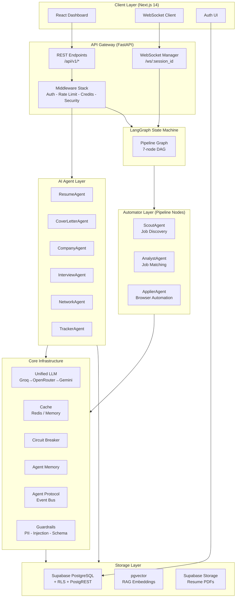

---

## 3. Frontend Architecture

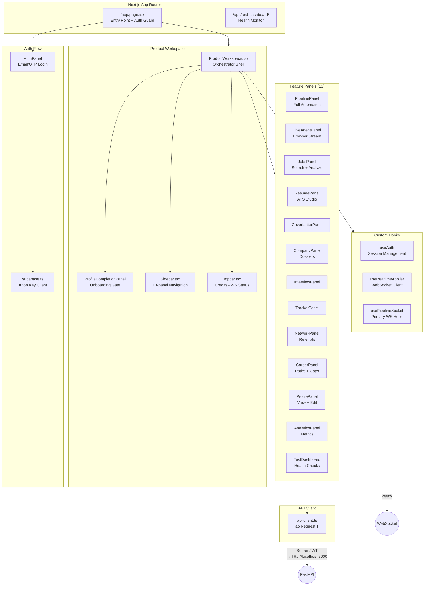

### State Flow in ProductWorkspace

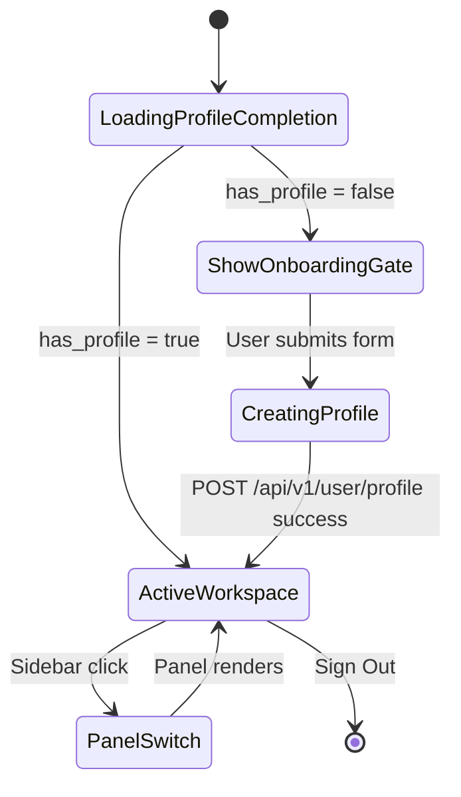

---

## 4. Backend Architecture

```mermaid
graph TD
    subgraph ENTRY["Entry Point: main.py"]
        LIFESPAN["Lifespan Manager\nStartup and Shutdown"]
        APP["FastAPI App"]
        ROUTES["Route Registration\n15 route groups"]
    end

    subgraph MIDDLEWARE_STACK["Middleware Stack in order"]
        M1["CORSMiddleware\nOrigin whitelist"]
        M2["SecurityHeadersMiddleware\nCSP, HSTS, X-Frame"]
        M3["RequestSizeLimitMiddleware\n10 MB max body"]
        M4["RequestLoggingMiddleware\nStructured access logs"]
        M5["RateLimitMiddleware\nIn-memory sliding window"]
        M6["ProductionRateLimitMiddleware\nPer-route burst protection"]
        M7["CreditGuardrailMiddleware\nQuery and token budget enforcement"]
    end

    subgraph ROUTE_GROUPS["API Route Groups api/v1"]
        R1["user: Profile CRUD\nOnboarding, Completion, Readiness"]
        R2["jobs: Scout + Analyst\nSearch, Analyze, Discover"]
        R3["resume: ATS Studio\nUpload, Tailor, Generate, Download"]
        R4["cover-letter: Generation\nCustom, Company-Aware"]
        R5["company: Intel\nDossier, Culture, Risks, Interview Tips"]
        R6["interview: Prep\nQuestions, STAR, Roleplay"]
        R7["network: Outreach\nLeads, Messages, LinkedIn"]
        R8["tracker: Applications\nPipeline, Status, Notes"]
        R9["career: Trajectory\nPaths, Gaps, Timeline"]
        R10["salary: Benchmarks\nOffers, Negotiation"]
        R11["pipeline: Full Run\nLangGraph execution"]
        R12["analytics: Metrics\nCredits, Costs, Health"]
        R13["rag: Vector Search\nIndex, Query, Sync"]
        R14["agents: Protocol\nMemory, Feedback, Insights"]
        R15["chat: Orchestrator\nMulti-Agent Chat"]
    end

    ENTRY --> MIDDLEWARE_STACK
    MIDDLEWARE_STACK --> ROUTE_GROUPS
```

### Request Lifecycle

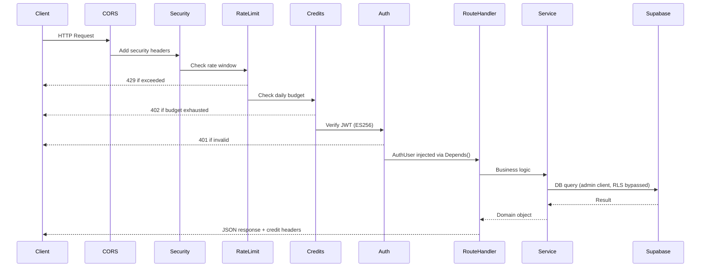

---

## 5. AI Agent Layer

Six specialised agents, each encapsulating a narrow domain of expertise. All inherit from a common protocol and share agent memory.

```mermaid
graph LR
    subgraph AGENTS["Domain Agents (src/agents/)"]
        direction TB
        RA["ResumeAgent\n— ATS scoring\n— LaTeX generation\n— Tailoring for JD"]
        CA["CompanyAgent\n— Company dossiers\n— Culture analysis\n— Red flag detection\n— Interview tip sets"]
        CLA["CoverLetterAgent\n— Personalised letters\n— Company-aware tone\n— JD keyword inject"]
        IA["InterviewAgent\n— Q&A generation\n— STAR coaching\n— Technical drills\n— Role play sessions"]
        NA["NetworkAgent\n— LinkedIn lead search\n— Referral paths\n— Outreach messages\n— Connection templates"]
        TA["TrackerAgent\n— Application states\n— Follow-up reminders\n— Offer comparison\n— Pipeline analytics"]
    end

    subgraph SHARED["Shared Infrastructure"]
        LLM2[UnifiedLLM\nFallback Provider]
        MEM2[AgentMemory\nPreference + Feedback]
        PROTO2[AgentProtocol\nBroadcast + Request]
        GUARD2[Guardrails\nInput/Output Safety]
        RAG2[RAGService\nProfile + Resume Index]
    end

    AGENTS --> SHARED
```

### Agent Memory System

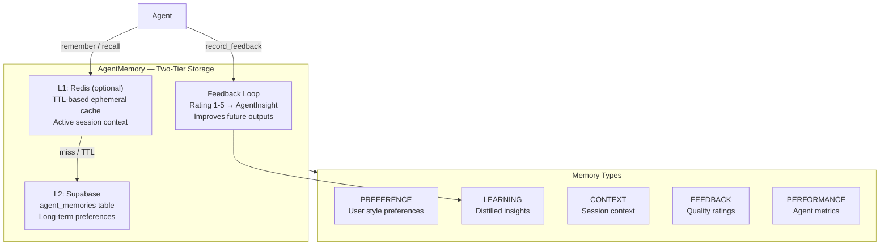

---

## 6. Automator Layer (Pipeline Workers)

Three specialised automators form the core pipeline execution units.

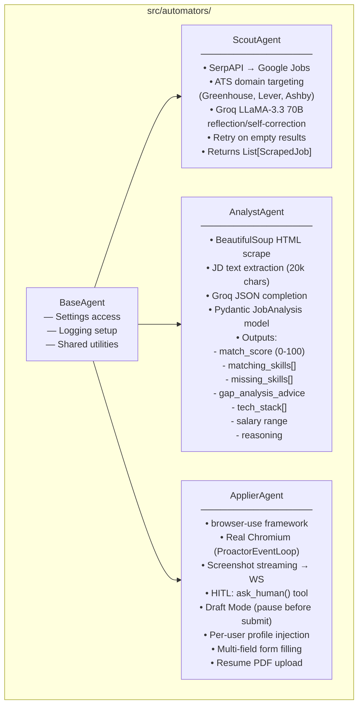

### Scout Agent Flow

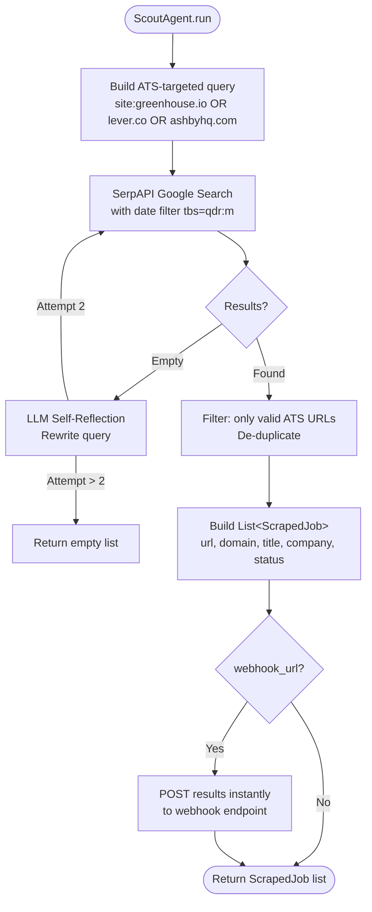

### Analyst Agent Flow

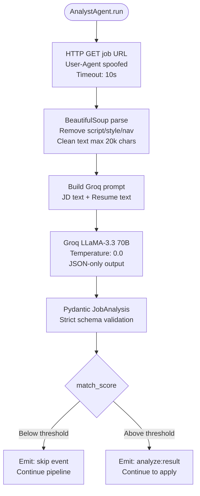

---

## 7. LangGraph Pipeline State Machine

The autonomous pipeline is a **7-node directed acyclic graph** built with LangGraph, with conditional edges, parallel execution, HITL checkpoints, and disk-based checkpoint resume.

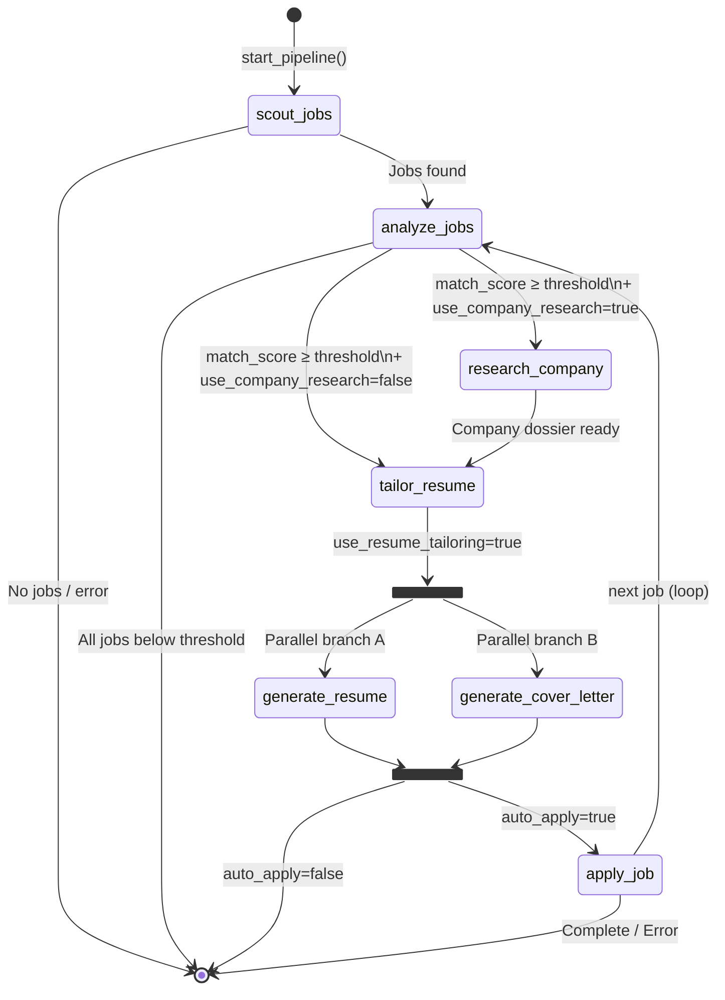

### Pipeline State Schema

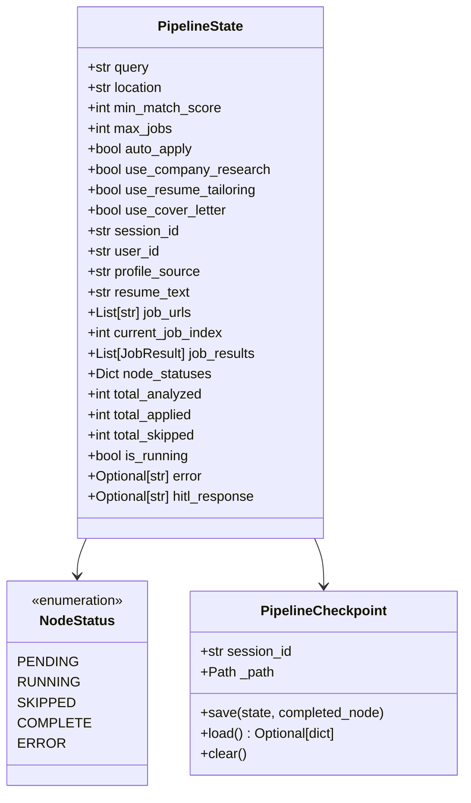

### Checkpoint Recovery Flow

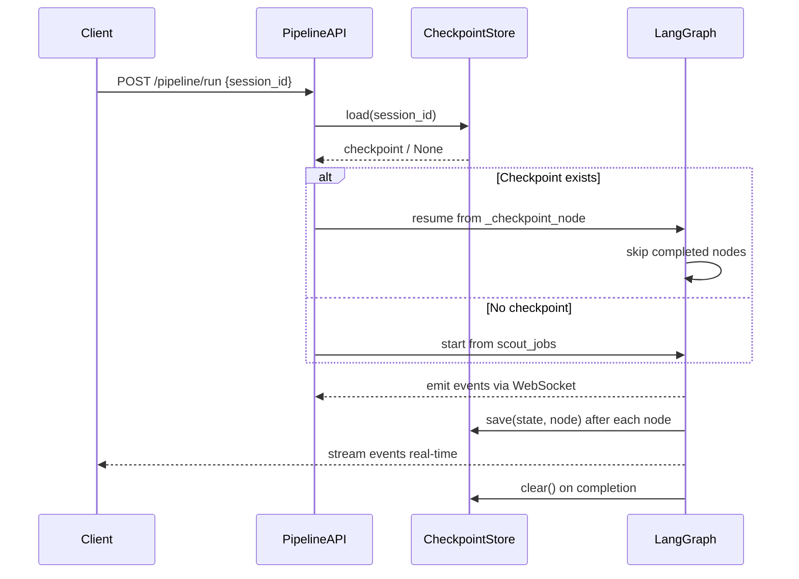

---

## 8. Database Design

### Entity Relationship Overview

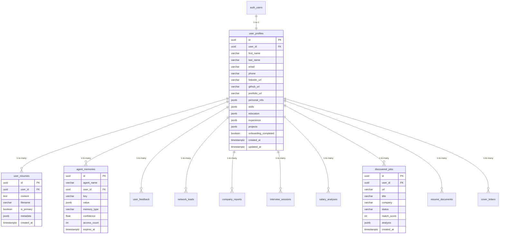

### JSONB Column Architecture

The profile uses embedded JSONB for structured sub-objects — avoiding excessive joins for read-heavy profile lookups:

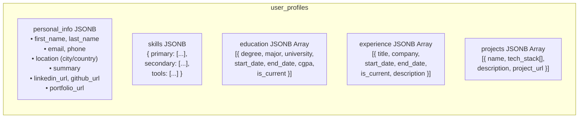

### Row Level Security (RLS) Policy Pattern

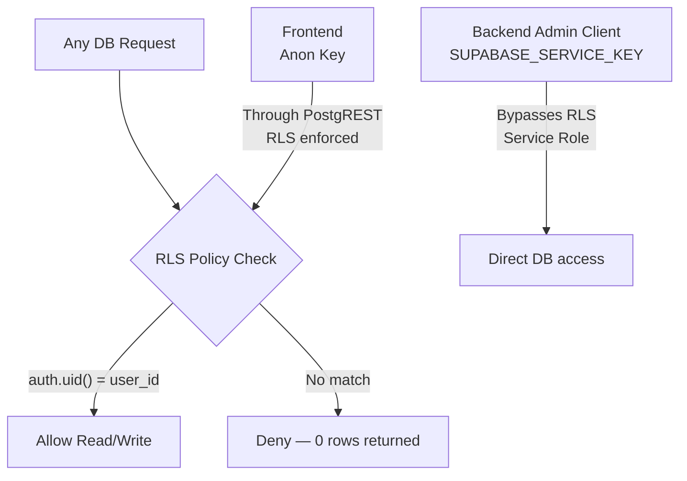

### pgvector RAG Architecture

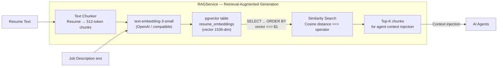

---

## 9. Real-Time WebSocket Architecture

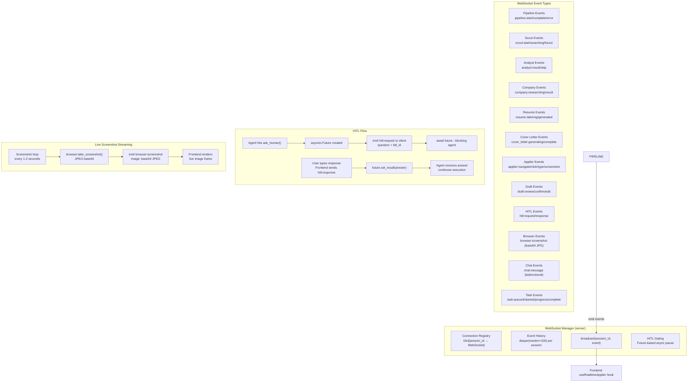

### WebSocket Message Protocol

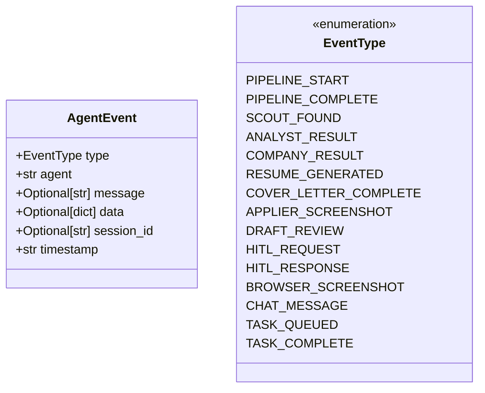

---

## 10. LLM Provider Fallback Chain

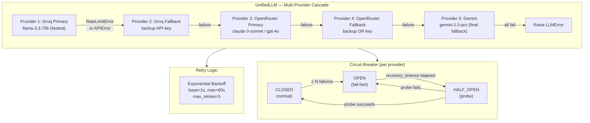

### Model Routing Policy

```mermaid
graph LR
    TASK{Task Type} --> |"Speed critical\nSimple extraction"| GROQ_FAST[Groq LLaMA-3.3 70B\nSub-second inference]
    TASK --> |"Complex reasoning\nCreative writing"| OR[OpenRouter\nClaude-3/GPT-4o]
    TASK --> |"Long context\nDocument analysis"| GEM[Gemini 1.5 Pro\n1M context window]
    TASK --> |"Embeddings"| EMBED_MODEL[text-embedding-3-small\nOpenAI API]
```

---

## 11. Core Infrastructure Systems

### DI Container Architecture

```mermaid
graph LR
    subgraph CONTAINER["DI Container (src/core/container.py)"]
        SINGLETON["register_singleton(name, factory)\nLazy-init, one instance"]
        INSTANCE["register_instance(name, obj)\nPre-built object"]
        RESOLVE["resolve(name)\nGet dependency"]
    end

    subgraph REGISTERED["Registered Services"]
        EB[event_bus]
        PII[pii_detector]
        IG[input_guardrails]
        CG[chat_guardrails]
        OG[output_guardrails]
        AM[agent_memory]
        CT[cost_tracker]
        SL[structured_logger]
        RB[retry_budget]
        AP[agent_protocol]
    end

    CONTAINER --> REGISTERED
```

### Caching Architecture

```mermaid
graph TD
    subgraph CACHE["Cache Layer (cache.py)"]
        CHECK_REDIS{REDIS_URL\nconfigured?}
        CHECK_REDIS -- Yes --> REDIS["Redis Client\nasync aioredis\nTTL support"]
        CHECK_REDIS -- No --> MEMORY["In-Memory Dict\nTTL-based\nThread-safe"]
    end

    subgraph CACHE_OPS["Cache Operations"]
        GET["get(key) → Optional[V]"]
        SET["set(key, value, ttl)"]
        DEL["delete(key)"]
        GET_MODEL["get_model(key, Model)\nPydantic deserialize"]
        SET_MODEL["set_model(key, obj, ttl)\nPydantic serialize"]
    end

    CACHE --> CACHE_OPS

    subgraph CACHED_DATA["What Is Cached"]
        PROFILE_CACHE["User Profiles\nTTL: 5min\nKey: profile:user_id"]
        LLM_CACHE["LLM Responses\nTTL: 1h\nKey: llm:prompt_hash"]
        COMPANY_CACHE["Company Dossiers\nTTL: 24h\nKey: company:name"]
    end
```

### Rate Limiting Architecture

```mermaid
graph TD
    subgraph RATELIMIT["Multi-Layer Rate Limiting"]
        L1["Layer 1: RateLimitMiddleware\nGlobal: 100 req/60s per IP\nIn-memory sliding window"]
        L2["Layer 2: ProductionRateLimitMiddleware\nPer-route burst protection\nCustom limits per endpoint"]
        L3["Layer 3: rate_limit_check Dependency\nPer-user JWT-based\nApplied to write operations"]
        L4["Layer 4: CreditGuardrailMiddleware\nPer-user daily query budget\nPer-user daily token budget"]
    end

    L1 --> L2
    L2 --> L3
    L3 --> L4
    L4 --> HANDLER[Route Handler]
```

### Guardrails Pipeline

```mermaid
graph LR
    subgraph INPUT_PIPELINE["Input Guardrail Pipeline"]
        IS["InputSanitizer\nStrip HTML, normalize whitespace"]
        PID["PromptInjectionDetector\nPattern: ignore/bypass/jailbreak\nHeuristic scoring"]
        PII2["PIIDetector\nEmail/Phone/SSN/CC masking"]
    end

    subgraph OUTPUT_PIPELINE["Output Guardrail Pipeline"]
        OV["OutputValidator\nPydantic schema enforcement"]
        CS["ContentSafety\nToxicity filter for chat"]
    end

    USER_INPUT --> IS --> PID --> PII2 --> AGENT
    AGENT_OUTPUT --> OV --> CS --> USER_RESPONSE

    style PID fill:#f9a,stroke:#f33
    style OV fill:#adf,stroke:#33f
```

### Idempotency & Distributed Locking

```mermaid
graph TD
    subgraph IDEMP["Idempotency (idempotency.py)"]
        IKEY["Idempotency-Key header\nUUID from client"]
        ISTORE["Redis/Memory store\nkey → result, 24h TTL"]
        ICHECK{Key seen before?}
        ICHECK -- Yes --> REPLAY[Return cached result\nno re-execution]
        ICHECK -- No --> EXEC[Execute + store result]
    end

    subgraph DLOCK["Distributed Lock (distributed_lock.py)"]
        LOCK["Acquire lock\nRedis SET NX EX\nor threading.Lock() fallback"]
        WORK["Execute critical section"]
        RELEASE["Release lock\nDEL key"]
    end

    PIPELINE_RUN --> IDEMP
    PROFILE_UPDATE --> DLOCK
```

---

## 12. Security & Auth Architecture

```mermaid
graph TD
    subgraph AUTH_FLOW["Authentication Flow"]
        EMAIL["User: Email + Password\nor Magic Link OTP"]
        SUPA_AUTH["Supabase Auth\n(email/OTP provider)"]
        JWT["JWT issued\n(ES256 algorithm\nHS256 fallback)"]
        FRONTEND_STORE["Frontend stores JWT\nin React state / memory"]

        EMAIL --> SUPA_AUTH
        SUPA_AUTH --> JWT
        JWT --> FRONTEND_STORE
    end

    subgraph BACKEND_VERIFY["Backend JWT Verification"]
        HEADER["Authorization: Bearer TOKEN"]
        DECODE["PyJWT decode\nES256 → HS256 fallback"]
        CLAIM["Extract: sub=user_id, email"]
        AUTH_USER["AuthUser object\ninjected via Depends()"]

        HEADER --> DECODE
        DECODE --> CLAIM
        CLAIM --> AUTH_USER
    end

    subgraph MULTITENANT["Multi-Tenant Isolation"]
        RLS2["Supabase RLS\nauth.uid() = user_id\nAll queries row-filtered"]
        ADMIN["Admin Client\nSERVICE_KEY bypasses RLS\nBackend-only, never sent to client"]
        ANON["Anon Client\nFrontend direct queries\nRLS enforced"]
    end

    FRONTEND_STORE --> HEADER
    AUTH_USER --> RLS2
```

### Security Headers Applied

```mermaid
graph LR
    RESP[Every HTTP Response] --> SH["SecurityHeadersMiddleware adds:"]
    SH --> H1["X-Content-Type-Options: nosniff"]
    SH --> H2["X-Frame-Options: DENY"]
    SH --> H3["X-XSS-Protection: 1; mode=block"]
    SH --> H4["Content-Security-Policy: default-src 'self'"]
    SH --> H5["Strict-Transport-Security: max-age=31536000"]
    SH --> H6["Referrer-Policy: strict-origin-when-cross-origin"]
```

---

## 13. Observability & Monitoring

```mermaid
graph LR
    subgraph OBS["Observability Stack"]
        STRUCT["Structured Logger\nJSON log lines\nrequest_id correlation"]
        METRICS["Prometheus Metrics\n/metrics endpoint\nRequest counts, latencies"]
        TELEMETRY["OpenTelemetry\nPhoenix collector integration\n(optional — env-gated)"]
        COST["Cost Tracker\nPer-agent token accounting\nLLM spend attribution"]
        LLM_TRACK["LLM Usage Tracker\nmodel, tokens, latency\nper-request logging"]
        CIRCUIT["Circuit Breaker Events\nState transitions logged\nHealth metrics emitted"]
        EVENTS["Event Bus\nasync pub/sub\nsystem:startup, agent:*, task:*"]
    end

    subgraph HEALTH["Health Check Endpoints"]
        READY["/api/ready\nService availability check"]
        HEALTH2["/api/v1/analytics/health\nsupabase + redis status"]
        CREDITS["/api/v1/analytics/credits\nQuery/token remaining"]
    end

    OBS --> HEALTH
```

### Cost Tracking Flow

```mermaid
sequenceDiagram
    participant Agent
    participant CostTracker
    participant CreditBudget
    participant CreditMiddleware
    participant Client

    Agent->>CostTracker: record_usage(model, tokens, cost)
    CostTracker->>CostTracker: Accumulate per-user daily spend
    CostTracker-->>Agent: usage logged

    CreditBudget->>CreditBudget: Decrement query_remaining
    CreditBudget->>CreditBudget: Decrement token_remaining

    CreditMiddleware->>CreditMiddleware: Read credit headers post-request
    CreditMiddleware-->>Client: X-Credits-Queries-Remaining: N
    CreditMiddleware-->>Client: X-Credits-Tokens-Remaining: N

    Client->>Client: Update credit display\nin Topbar
```

---

## 14. User Journey Flows

### New User Onboarding

```mermaid
journey
    title New User Onboarding Journey
    section Registration
      Visit app           : 5: User
      Click Sign Up       : 5: User
      Enter email         : 4: User
      Receive OTP / set password : 3: User, Supabase
      JWT issued          : 5: Supabase
    section Profile Setup
      Redirect to workspace      : 5: App
      See ProfileCompletionPanel : 4: App
      Enter name + location      : 4: User
      Enter professional summary : 3: User
      Submit → POST /profile     : 4: User, API
      Profile created in Supabase: 5: API
      has_profile = true         : 5: API
    section First Use
      Workspace unlocks          : 5: App
      See 13-panel sidebar       : 5: User
      Upload resume (RAG index)  : 3: User
      Run first job search       : 5: User
      View match scores          : 5: App
```

### Full Autonomous Pipeline Flow

```mermaid
sequenceDiagram
    participant User
    participant Frontend
    participant WS
    participant PipelineAPI
    participant Scout
    participant Analyst
    participant CompanyResearcher
    participant ResumeTailor
    participant CoverLetter
    participant Applier
    participant DB

    User->>Frontend: Set query + options\nClick "Start Pipeline"
    Frontend->>PipelineAPI: POST /api/v1/pipeline/run
    PipelineAPI->>WS: emit pipeline:start

    PipelineAPI->>Scout: ScoutAgent.run(query, location)
    Scout->>Scout: SerpAPI search → filter ATS URLs
    Scout-->>PipelineAPI: List[ScrapedJob] (8 jobs)
    PipelineAPI->>WS: emit scout:found {count: 8}

    loop For each job
        PipelineAPI->>Analyst: AnalystAgent.run(url, resume)
        Analyst->>Analyst: Fetch + parse JD
        Analyst->>Analyst: Groq LLM → JobAnalysis
        Analyst-->>PipelineAPI: match_score=82
        PipelineAPI->>WS: emit analyst:result {score: 82}

        alt match_score ≥ threshold AND use_company_research
            PipelineAPI->>CompanyResearcher: research(company)
            CompanyResearcher-->>PipelineAPI: CompanyDossier
            PipelineAPI->>WS: emit company:result
        end

        alt use_resume_tailoring
            PipelineAPI->>ResumeTailor: tailor(jd, profile)
            ResumeTailor-->>PipelineAPI: LaTeX resume
            PipelineAPI->>WS: emit resume:generated
        end

        alt use_cover_letter
            PipelineAPI->>CoverLetter: generate(jd, company, profile)
            CoverLetter-->>PipelineAPI: Cover letter text
            PipelineAPI->>WS: emit cover_letter:complete
        end

        alt auto_apply=true
            PipelineAPI->>Applier: apply(url, profile, resume_pdf)
            Applier->>WS: stream screenshots (1/s)
            Applier->>WS: emit hitl:request (if needed)
            User->>WS: hitl:response (answer)
            Applier->>WS: emit draft:review (before submit)
            User->>WS: draft:confirm
            Applier-->>PipelineAPI: applied=true
            PipelineAPI->>DB: Save to discovered_jobs
            PipelineAPI->>WS: emit applier:complete
        end
    end

    PipelineAPI->>WS: emit pipeline:complete {applied:3, skipped:5}
    PipelineAPI->>DB: clear checkpoint
```

### Live Agent (Direct URL) Flow

```mermaid
flowchart TD
    USER([User pastes job URL]) --> LIVE_FORM[Fill URL in LiveAgentPanel\nToggle Draft Mode]
    LIVE_FORM --> POST_WS[POST /api/v1/pipeline/live-apply\n+ WS session_id]
    POST_WS --> LIVE_SVC[LiveApplierService\n init with user_id]
    LIVE_SVC --> LOAD_PROFILE[Load UserProfile from Supabase\nBuild YAML task file]
    LOAD_PROFILE --> BROWSER[browser-use: start Chrome\nProactorEventLoop on Windows]
    BROWSER --> NAVIGATE[Navigate to job URL]
    NAVIGATE --> FILL[Form fill loop\nUsing profile data]
    FILL --> SCREENSHOT[Screenshot every 1-2s\n→ WS broadcast]
    FILL --> HITL_CHECK{Need human input?}
    HITL_CHECK -- Yes --> HITL2[emit hitl:request\nBlock on asyncio.Future]
    HITL2 --> USER_REPLY[User types in chat]
    USER_REPLY --> RESOLVE2[Future resolved → agent continues]
    FILL --> DRAFT_CHECK{Draft mode on\n+ Submit button?}
    DRAFT_CHECK -- Yes --> DRAFT2[emit draft:review\nShow form preview]
    DRAFT2 --> USER_CONFIRM[User confirms / edits]
    USER_CONFIRM --> SUBMIT[Submit form]
    SUBMIT --> DONE([emit applier:complete])
```

---

## 15. Data Flow: Job Application Pipeline

```mermaid
flowchart LR
    subgraph INPUT["Input Layer"]
        USER_QUERY["user query\n'AI Engineer remote'"]
        USER_PROFILE["UserProfile JSONB\nfrom Supabase"]
        RESUME_PDF["Primary Resume PDF\nfrom Storage"]
    end

    subgraph DISCOVERY["Discovery Layer"]
        SERPAPI2["SerpAPI\nGoogle Jobs"]
        ATS_FILTER["ATS URL filter\nGreenhouse - Lever - Ashby"]
        SCRAPED["ScrapedJob list\nurl, title, company, status"]
    end

    subgraph ANALYSIS["Analysis Layer"]
        HTML_SCRAPE["BeautifulSoup\nJD text extraction"]
        GROQ_ANALYST["Groq LLaMA-3.3 70B\nJSON completion"]
        JOB_ANALYSIS["JobAnalysis\nmatch_score, skills, gaps"]
        THRESHOLD["Threshold Gate\nmin_match_score filter"]
    end

    subgraph ENRICHMENT["Enrichment Layer"]
        COMPANY_DOSSIER["CompanyAgent\nCulture + Risks + Tips"]
        TAILORED_RESUME["ResumeAgent\nATS-optimised LaTeX"]
        COVER["CoverLetterAgent\nPersonalised letter"]
    end

    subgraph APPLICATION["Application Layer"]
        BROWSER2["browser-use\nHeadless Chrome"]
        FORM_FILL["Form field population\nfrom UserProfile"]
        PDF_UPLOAD["Resume PDF upload\nBytes from Storage"]
        CONFIRM["Draft confirmation\nor auto-submit"]
    end

    subgraph PERSISTENCE["Persistence Layer"]
        DISC_JOBS["discovered_jobs\nSupabase table"]
        TRACKER2["tracker_applications\nStatus lifecycle"]
        CACHE2["Cache\nCompany + Profile TTL"]
    end

    INPUT --> DISCOVERY
    DISCOVERY --> ANALYSIS
    USER_PROFILE --> ANALYSIS
    ANALYSIS --> |"score ≥ threshold"| ENRICHMENT
    INPUT --> ENRICHMENT
    ENRICHMENT --> APPLICATION
    APPLICATION --> PERSISTENCE
    ANALYSIS --> PERSISTENCE
```

---

## 16. Inter-Agent Communication Protocol

```mermaid
graph TD
    subgraph PROTOCOL["AgentProtocol — Event-Bus-Backed Messaging"]
        BROADCAST2["broadcast(from, intent, payload)\nDelivers to all subscribed agents"]
        REQUEST2["request(from, to, task, payload)\nDirect request with timeout"]
        DELEGATE2["delegate(from, to, task, payload)\nFire-and-forget sub-task"]
    end

    subgraph INTENTS["MessageIntent Types"]
        INFORM["INFORM\nShare discovery\nno reply needed"]
        REQUEST3["REQUEST\nAsk for data\nawaits response"]
        DELEGATE3["DELEGATE\nHand off sub-task\nfire and forget"]
        FEEDBACK2["FEEDBACK\nQuality rating\npropagates to memory"]
    end

    subgraph EXAMPLE["Example: Cross-Agent Collaboration"]
        CLA2["CoverLetterAgent\nneeds company culture"] -->|"request(to='company_agent',\ntask='get_culture')"| CA2["CompanyAgent\nlookup + return dossier"]
        CA2 -->|"INFORM: red_flag found"| RA2["ResumeAgent\nadjust framing"]
        IA2["InterviewAgent\ngot insight"] -->|"INFORM: common question"| TA2["TrackerAgent\nlog for prep reminder"]
    end

    PROTOCOL --> INTENTS
```

### Message Schema

```mermaid
classDiagram
    class AgentMessage {
        +str from_agent
        +str to_agent
        +MessageIntent intent
        +Dict payload
        +Priority priority
        +str correlation_id
        +float timestamp
        +str reply_to
    }

    class MessageIntent {
        <<enumeration>>
        INFORM
        REQUEST
        DELEGATE
        FEEDBACK
    }

    class Priority {
        <<enumeration>>
        LOW
        NORMAL
        HIGH
        CRITICAL
    }

    AgentMessage --> MessageIntent
    AgentMessage --> Priority
```

---

## 17. Deployment Architecture

### Current Development Topology

```mermaid
graph TB
    subgraph LOCAL["Developer Machine (Windows)"]
        FE_DEV["Next.js Dev Server\nnpm run dev\nlocalhost:3000"]
        BE_DEV["FastAPI + Uvicorn\nuvicorn src.main:app\nlocalhost:8000\nProactorEventLoop"]
        VENV[".venv Python 3.11\npip install -r requirements.txt"]
        CHROME["Google Chrome\nfor browser-use\nauto-detected path"]
    end

    subgraph CLOUD["Cloud Services"]
        SUPA_CLOUD["Supabase Cloud\nPostgreSQL + Auth + Storage\n+ PostgREST API\n+ pgvector"]
        GROQ_API["Groq API\nllama-3.3-70b-versatile"]
        OR_API["OpenRouter API\nClaude-3 / GPT-4o"]
        GEMINI_API["Google Gemini API\ngemini-1.5-pro"]
        SERPAPI3["SerpAPI\nGoogle Jobs search"]
    end

    FE_DEV --> |"HTTP/WS\nlocalhost:8000"| BE_DEV
    BE_DEV --> SUPA_CLOUD
    BE_DEV --> GROQ_API
    BE_DEV --> OR_API
    BE_DEV --> GEMINI_API
    BE_DEV --> SERPAPI3
```

### Production-Ready Architecture (Target)

```mermaid
graph TB
    subgraph CDN["Edge / CDN"]
        VERCEL["Vercel / Cloudflare\nNext.js Static + SSR\nEdge caching"]
    end

    subgraph API_TIER["API Tier"]
        LB["Load Balancer\nnginx / AWS ALB"]
        API1["FastAPI instance 1\ngunicorn + uvicorn workers"]
        API2["FastAPI instance 2"]
    end

    subgraph WORKER_TIER["Background Workers"]
        CELERY["Celery Workers\nsrc/worker/\nLong-running pipeline jobs"]
        REDIS_Q["Redis Broker\nTask queue + results backend"]
    end

    subgraph DATA_TIER["Data Tier"]
        SUPA_PROD["Supabase\nProduction Project\nPostgreSQL + pgvector"]
        STORAGE["Supabase Storage\nResume PDFs, generated docs"]
        REDIS_CACHE["Redis Cache\nProfile cache, LLM cache"]
    end

    CDN --> LB
    LB --> API1
    LB --> API2
    API1 --> REDIS_Q
    API2 --> REDIS_Q
    REDIS_Q --> CELERY
    API1 --> DATA_TIER
    API2 --> DATA_TIER
    CELERY --> DATA_TIER
```

---

## Appendix: Technology Stack Reference

| Layer | Technology | Purpose |
|---|---|---|
| Frontend framework | Next.js 14 (App Router) | SSR + React client |
| Frontend state | useState / useCallback | Local component state |
| Frontend real-time | WebSocket (native) | Pipeline event streaming |
| Backend framework | FastAPI 0.111 | Async REST + WebSocket |
| Backend runtime | Python 3.11 (uvicorn) | ASGI server |
| AI orchestration | LangGraph | State machine pipeline |
| LLM primary | Groq (LLaMA-3.3 70B) | Fast inference |
| LLM fallback 1 | OpenRouter | Claude-3 / GPT-4o |
| LLM fallback 2 | Google Gemini | Long context |
| LLM embeddings | OpenAI text-embedding-3-small | RAG index |
| Browser automation | browser-use | Chrome form filling |
| Web scraping | BeautifulSoup4 + requests | JD extraction |
| Job search | SerpAPI | Google Jobs results |
| Database | Supabase PostgreSQL | Primary data store |
| Vector search | pgvector | RAG similarity search |
| Auth | Supabase Auth | JWT ES256 |
| File storage | Supabase Storage | Resume PDFs |
| Cache | Redis (optional) / in-memory | TTL cache |
| Task queue | Celery + Redis | Async background jobs |
| Validation | Pydantic v2 | Request/response schemas |
| Config | pydantic-settings | Env var management |
| Observability | Prometheus + OpenTelemetry | Metrics + traces |
| PDF generation | pdflatex / reportlab | Resume PDFs |
| ORM | Supabase Python client | Admin + user queries |
