# JobStream Backend — Complete Technical Reference v2.0

> **Deep Dive Edition** — Written from live source-code analysis, not README files.  
> Every section explains *what it does*, *how it works*, *why we chose it*, and what would break without it — in both technical and plain-English terms.

---

## Table of Contents

1. [What Is This System?](#1-what-is-this-system)
2. [Bird's-Eye Architecture](#2-birds-eye-architecture)
3. [Technology Stack Rationale](#3-technology-stack-rationale)
4. [Application Bootstrap — `main.py`](#4-application-bootstrap--mainpy)
5. [Configuration System — `core/config.py`](#5-configuration-system--coreconfigpy)
6. [LLM Provider Layer — `core/llm_provider.py`](#6-llm-provider-layer--corellm_providerpy)
7. [LLM Token Tracker — `core/llm_tracker.py`](#7-llm-token-tracker--corellm_trackerpy)
8. [Circuit Breaker — `core/circuit_breaker.py`](#8-circuit-breaker--corecircuit_breakerpy)
9. [Agent Memory — `core/agent_memory.py`](#9-agent-memory--coreagent_memorypy)
10. [AI Guardrails — `core/guardrails.py`](#10-ai-guardrails--coreguardrailspy)
11. [PII Detector — `core/pii_detector.py`](#11-pii-detector--corepii_detectorpy)
12. [Event Bus — `core/event_bus.py`](#12-event-bus--coreevent_buspy)
13. [Cost Tracker — `core/cost_tracker.py`](#13-cost-tracker--corecost_trackerpy)
14. [Retry Budget — `core/retry_budget.py`](#14-retry-budget--coreretry_budgetpy)
15. [Distributed Lock — `core/distributed_lock.py`](#15-distributed-lock--coredistributed_lockpy)
16. [Idempotency Store — `core/idempotency.py`](#16-idempotency-store--coreidempotencypy)
17. [Feature Flags — `core/feature_flags.py`](#17-feature-flags--corefeature_flagspy)
18. [Model Routing Policy — `core/model_routing_policy.py`](#18-model-routing-policy--coremodel_routing_policypy)
19. [Agent Protocol — `core/agent_protocol.py`](#19-agent-protocol--coreagent_protocolpy)
20. [Credit Budget Manager — `core/credit_budget.py`](#20-credit-budget-manager--corecredit_budgetpy)
21. [Credit Middleware — `core/credit_middleware.py`](#21-credit-middleware--corecredit_middlewarepy)
22. [Structured Logger — `core/structured_logger.py`](#22-structured-logger--corestructured_loggerpy)
23. [Telemetry & Tracing — `core/telemetry.py`](#23-telemetry--tracing--coretelemetrypy)
24. [Prometheus Metrics — `core/metrics.py`](#24-prometheus-metrics--coremetricspy)
25. [DI Container — `core/container.py`](#25-di-container--corecontainerpy)
26. [Middleware Stack — `core/middleware.py`](#26-middleware-stack--coremiddlewarepy)
27. [Scout Automator — `automators/scout.py`](#27-scout-automator--automatorsscoutpy)
28. [Analyst Automator — `automators/analyst.py`](#28-analyst-automator--automatorsanalystpy)
29. [Applier Automator — `automators/applier.py`](#29-applier-automator--automatorsapplierpy)
30. [Resume Agent — `agents/resume_agent.py`](#30-resume-agent--agentsresume_agentpy)
31. [Cover Letter Agent — `agents/cover_letter_agent.py`](#31-cover-letter-agent--agentscover_letter_agentpy)
32. [Interview Agent — `agents/interview_agent.py`](#32-interview-agent--agentsinterview_agentpy)
33. [Company Agent — `agents/company_agent.py`](#33-company-agent--agentscompany_agentpy)
34. [Network Agent — `agents/network_agent.py`](#34-network-agent--agentsnetwork_agentpy)
35. [Tracker Agent — `agents/tracker_agent.py`](#35-tracker-agent--agentstracker_agentpy)
36. [RAG Service — `services/rag_service.py`](#36-rag-service--servicesrag_servicepy)
37. [Step Planner — `services/step_planner.py`](#37-step-planner--servicesstep_plannerpy)
38. [Skill Tracker — `services/skill_tracker.py`](#38-skill-tracker--servicesskill_trackerpy)
39. [Credential Service — `services/credential_service.py`](#39-credential-service--servicescredential_servicepy)
40. [WebSocket Applier — `services/ws_applier.py`](#40-websocket-applier--servicesws_applierpy)
41. [Live Applier Service — `services/live_applier.py`](#41-live-applier-service--serviceslive_applierpy)
42. [Career Trajectory Engine — `services/career_trajectory.py`](#42-career-trajectory-engine--servicescareer_trajectorypy)
43. [Salary Service — `services/salary_service.py`](#43-salary-service--servicessalary_servicepy)
44. [Interview Service — `services/interview_service.py`](#44-interview-service--servicesinterview_servicepy)
45. [Pipeline Orchestrator — `services/orchestrator.py`](#45-pipeline-orchestrator--servicesorchestratpy)
46. [Chat Orchestrator — `services/chat_orchestrator.py`](#46-chat-orchestrator--serviceschat_orchestratorpy)
47. [Prompt Management Layer — `prompts/`](#47-prompt-management-layer--prompts)
48. [LangGraph Pipeline — `graphs/pipeline_graph.py`](#48-langgraph-pipeline--graphspipeline_graphpy)
49. [WebSocket Manager — `api/websocket.py`](#49-websocket-manager--apiwebsocketpy)
50. [API Routes — `api/v1.py` & `api/routes/`](#50-api-routes--apiv1py--apiroutes)
51. [Celery Worker — `worker/`](#51-celery-worker--worker)
52. [Data Models — `models/`](#52-data-models--models)
53. [Database Schema Design](#53-database-schema-design)
54. [Security Architecture](#54-security-architecture)
55. [Observability Stack](#55-observability-stack)
56. [Non-Functional Requirements](#56-non-functional-requirements)
57. [Production Deployment Guide](#57-production-deployment-guide)
58. [Environment Variables Reference](#58-environment-variables-reference)

---

## 1. What Is This System?

**In plain English:** JobStream's backend is an AI-powered job-hunting robot. You tell it what kind of job you want, and it automatically searches job boards, reads each posting, checks how well it matches your profile, tailors your resume for each role, writes cover letters, researches the companies, practices interview questions with you, helps you negotiate salary — and can even fill out and submit job applications in a real browser, pausing to ask you if it hits something it cannot handle alone.

**Technically:** A Python/FastAPI async server that orchestrates a multi-agent AI pipeline built on LangGraph's StateGraph execution model. Each pipeline stage is an independent async function (node) that reads from and writes to a shared typed state. Agents communicate via an internal EventBus; their actions are streamed live to the frontend via WebSocket. The system is designed around five resilience patterns: circuit breakers, retry budgets, distributed locks, idempotency guards, and graceful degradation — so that a failure in one external API (e.g., Groq or SerpAPI) cannot bring down the whole system.

---

## 2. Bird's-Eye Architecture

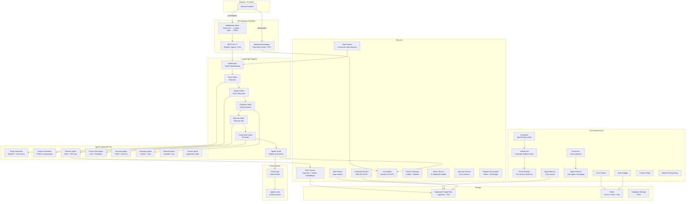

### Data Flow: End-to-End Request

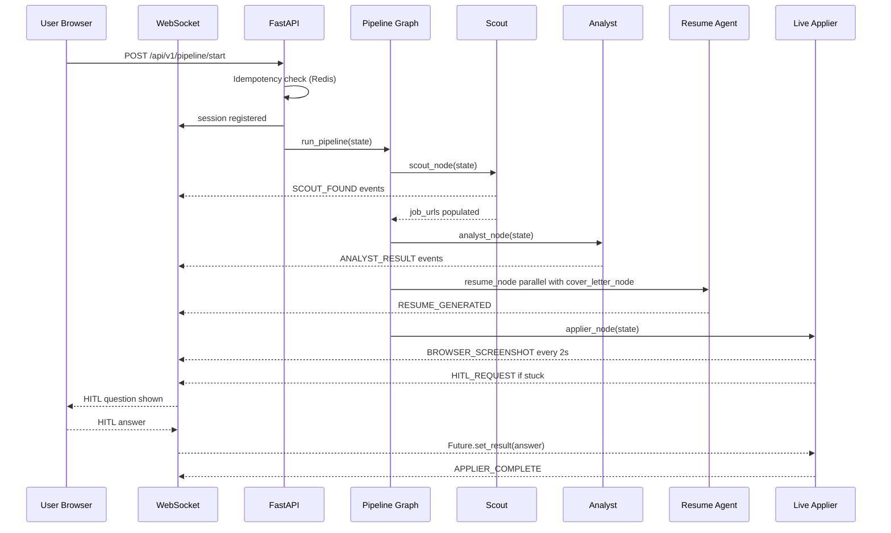

---

## 3. Technology Stack Rationale

| Technology | Version / Config | Why We Chose It |
|---|---|---|
| **Python 3.11** | Async, type hints | `asyncio.TaskGroup`, faster CPython, full type hint support |
| **FastAPI** | 0.100+ | Native async, `lifespan` context manager, Pydantic v2 native, auto OpenAPI docs |
| **LangGraph** | `StateGraph` | Proper DAG with typed state, conditional edges, parallel nodes, checkpointing — unlike sequential LangChain chains |
| **Pydantic v2** | Strict models | All LLM outputs parsed into typed models — prevents hallucination type errors causing runtime crashes |
| **Supabase** | PostgreSQL + pgvector + RLS | One service gives us: relational DB, vector storage, Row Level Security, and file storage |
| **Redis** | Upstash (TLS) | Rate limits, distributed locks, idempotency, Celery broker, LRU cache — all in one fast store |
| **Celery** | 5.x, `--pool=solo` (Win) | Browser automation must run in a dedicated process (Playwright + ProactorEventLoop). Celery decouples it cleanly |
| **browser-use** | `Agent + Tools API` | Only library that wraps Playwright with an LLM reasoning loop AND HITL hooks |
| **Groq / Llama** | `llama-3.1-8b-instant` | Fastest free-tier LLM. 8B for speed, 70B for analysis. Sub-200ms latency |
| **OpenRouter** | Qwen 3 Coder free | Fallback when Groq rate-limits. Free tier |
| **Gemini** | `gemini-2.0-flash-exp` | Vision for browser screenshots, best embedding model `text-embedding-004` |
| **LangChain** | 0.2+ | Provider abstractions, message types, LCEL composability |
| **SerpAPI** | Google Search API | Only reliable API for Google Custom Search with ATS site-filters |
| **OpenTelemetry** | OTLP → Arize Phoenix | Auto-instruments all LangChain calls — zero manual span code needed |

---

## 4. Application Bootstrap — `main.py`

**Plain English:** This is the startup script that turns on every service in the correct order, like flipping circuit breakers in an electrical panel — first the DI wiring, then the event system, then telemetry, then the API becomes ready.

### Startup Sequence

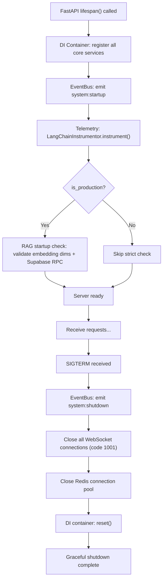

### Middleware Order

Each layer wraps the next. Outermost runs first:

```
Request IN
  CORSMiddleware
  RequestSizeLimitMiddleware (10 MB cap)
  SecurityHeadersMiddleware
  RequestLoggingMiddleware
  RateLimitMiddleware (sliding window, Redis)
  ProductionRateLimitMiddleware
  CreditGuardrailMiddleware (query + token budget)
  Route Handler
Response OUT
```

**Why this order matters:** CORS must be outermost so browsers get the right headers even on rejected requests. Size limit is before logging so we do not log 100 MB bodies. Rate limiting and credits are before the handler to reject early without wasting CPU on business logic.

### DI Registration Order (startup)

```python
# Phase 0 — Foundation
event_bus, pii_detector, input_guardrails, chat_guardrails, output_guardrails

# Phase 1 — Agent Intelligence
agent_memory, cost_tracker, structured_logger, retry_budget, agent_protocol
```

Everything is lazy: singletons are only instantiated when first `resolve()`d, not at registration time.

### Windows ProactorEventLoop

On Windows, `asyncio` defaults to `SelectorEventLoop`. Playwright (used by browser-use) needs `ProactorEventLoop`. The startup code detects which loop is running and logs a notice. The Celery worker runs in a dedicated `ProactorEventLoop` process to handle this cleanly.

---

## 5. Configuration System — `core/config.py`

**Plain English:** All settings live in one typed class. If you forget to set `SUPABASE_JWT_SECRET` in production, the app refuses to start and tells you exactly why — instead of failing mysteriously at runtime hours later.

### Key Design Features

| Feature | Implementation | Why |
|---|---|---|
| **Type-safe settings** | `pydantic_settings.BaseSettings` | Field types, validators, and secret masking in one class |
| **Secret masking** | `SecretStr` for all API keys | Keys never appear in logs, repr, or stack traces |
| **Upstash Redis derivation** | `model_validator` derives `redis_url` from Upstash env vars | Upstash uses HTTPS REST; we need `rediss://` for redis-py — auto-converted |
| **Production fail-fast** | `validate_production_readiness()` | Blocks startup if `DEBUG=true`, no Redis URL, no JWT secret, or wildcard CORS origins |
| **Encryption key derivation** | Falls back to SHA256 of JWT secret | If `ENCRYPTION_KEY` not set, derives one — but warns loudly |
| **Chrome path auto-detect** | `get_default_chrome_path()` | OS-aware path detection (Windows / macOS / Linux) for browser automation |

### AI Model Configuration

```
Groq Primary:        llama-3.1-8b-instant     (speed, default)
Groq Fallback key:   llama-3.1-8b-instant     (rate limit protection)
OpenRouter Primary:  qwen/qwen3-coder:free    (versatile fallback)
OpenRouter Fallback: second key               (last OpenRouter resort)
Gemini:              gemini-2.0-flash-exp     (vision + last resort)
Gemini Embedding:    models/gemini-embedding-001  (768-dim, RAG)
Mistral:             mistral-small-2506       (optional, experimental)
```

### Production Validator Logic

```python
@model_validator(mode='after')
def validate_production_readiness(self):
    if not self.is_production:
        return self
    errors = []
    if self.debug:
        errors.append("DEBUG must be false in production")
    if not self.redis_url:
        errors.append("REDIS_URL required in production")
    if not self.supabase_jwt_secret:
        errors.append("SUPABASE_JWT_SECRET required in production")
    for origin in self.get_cors_origins():
        if '*' in origin or 'localhost' in origin:
            errors.append("CORS_ORIGINS cannot contain wildcard/localhost in production")
    if errors:
        raise ValueError('; '.join(errors))
```

---

## 6. LLM Provider Layer — `core/llm_provider.py`

**Plain English:** Imagine you have five phone numbers for your translator. You call the first one (Groq — fastest and cheapest). If they are busy (rate-limited), you call the second number (Groq fallback key). If that is also busy, you try the third (OpenRouter). And so on. This ensures the AI assistant is always available even when one service has issues.

### Provider Fallback Chain

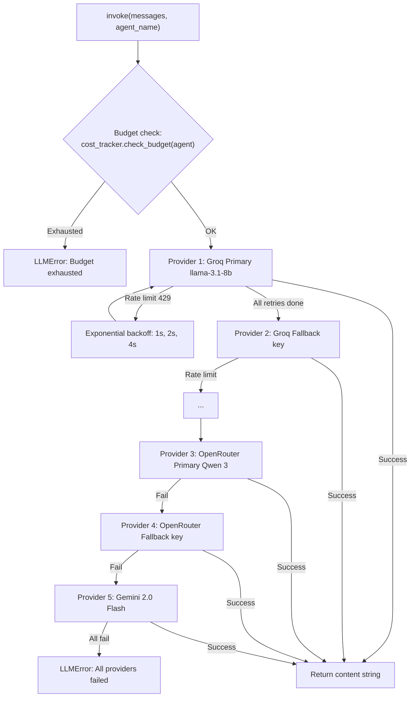

### `generate_json()` — Resilient JSON Extraction

LLMs often wrap JSON in markdown fences or add trailing commas. The method applies a 4-strategy extraction pipeline:

1. **Strip markdown fences** — regex extracts content from ` ```json ... ``` `
2. **`_extract_json()`** — finds `{...}` or `[...]` boundaries
3. **`_repair_json()`** — fixes trailing commas, single→double quotes, unquoted keys
4. **Aggressive newline cleanup** — replaces literal newlines inside JSON string values

**Why not just `json.loads()`?** Free-tier LLMs (especially 8B models) frequently produce malformed JSON. Without this repair chain, roughly 15% of calls would fail silently or crash agents.

### Token Tracking Integration

Every `invoke()` call wraps the LangChain call in `tracker.track(agent_name, provider, model)` as a context manager. On exit, it extracts `usage_metadata.input_tokens` and `output_tokens` from the LangChain response and pushes to both `LLMUsageTracker` and `CostTracker`.

### Singleton Cache

```python
_llm_instances: Dict[float, UnifiedLLM] = {}

def get_llm(temperature: float = 0.3) -> UnifiedLLM:
    if temperature not in _llm_instances:
        _llm_instances[temperature] = UnifiedLLM(temperature=temperature)
    return _llm_instances[temperature]
```

Different agents need different temperatures (0.0 for classification, 0.7 for creative writing). Each temperature gets its own cached instance.

---

## 7. LLM Token Tracker — `core/llm_tracker.py`

**Plain English:** A flight recorder for every AI conversation. It notes which agent made the call, which service answered, how many tokens were exchanged, how long it took, and what it cost — all in real time, in a thread-safe log.

### Architecture

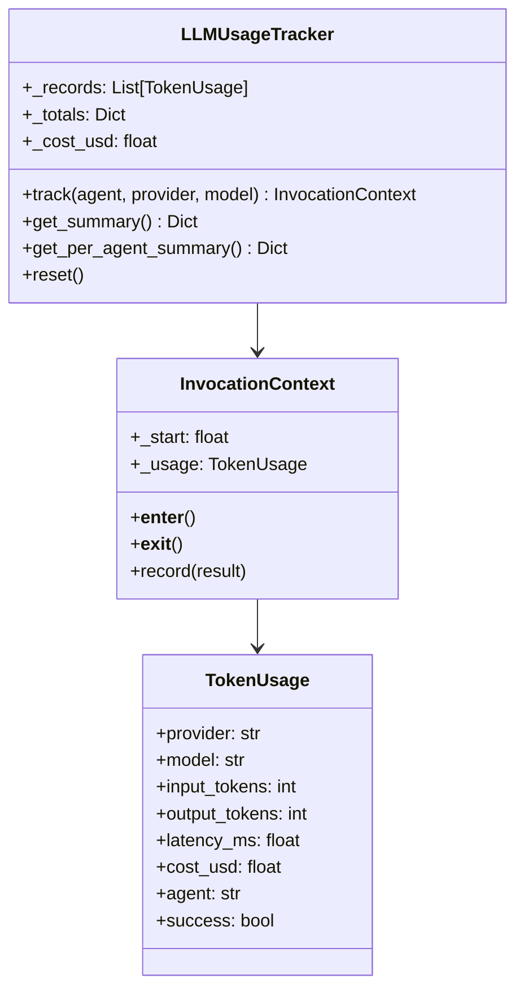

### Cost Table

| Provider | Input per 1M tokens | Output per 1M tokens |
|---|---|---|
| Groq | $0.05 | $0.08 |
| OpenRouter | $0.00 | $0.00 (free tier models) |
| Gemini | $0.075 | $0.30 |

The tracker forwards each record to `CostTracker` for daily budget enforcement. The separation of concerns is intentional: `LLMUsageTracker` is pure observability (log everything), while `CostTracker` is enforcement (block when budget exceeded).

### Token Extraction Logic

The `InvocationContext.record(result)` method knows how to extract token counts from different LangChain response shapes:

```python
# Shape 1: usage_metadata attribute (newer LangChain)
result.usage_metadata.input_tokens

# Shape 2: response_metadata dict (older providers)
result.response_metadata["token_usage"]["prompt_tokens"]
```

---

## 8. Circuit Breaker — `core/circuit_breaker.py`

**Plain English:** Like a fuse box in your home. When too many failures happen on one circuit (say, the SerpAPI connection keeps timing out), the circuit breaker trips and stops sending requests there for a while. Instead of waiting 30 seconds for each timeout, it immediately says "that service is broken, skip it for 60 seconds." This keeps your system fast and prevents one broken external API from making everything slow.

### State Machine

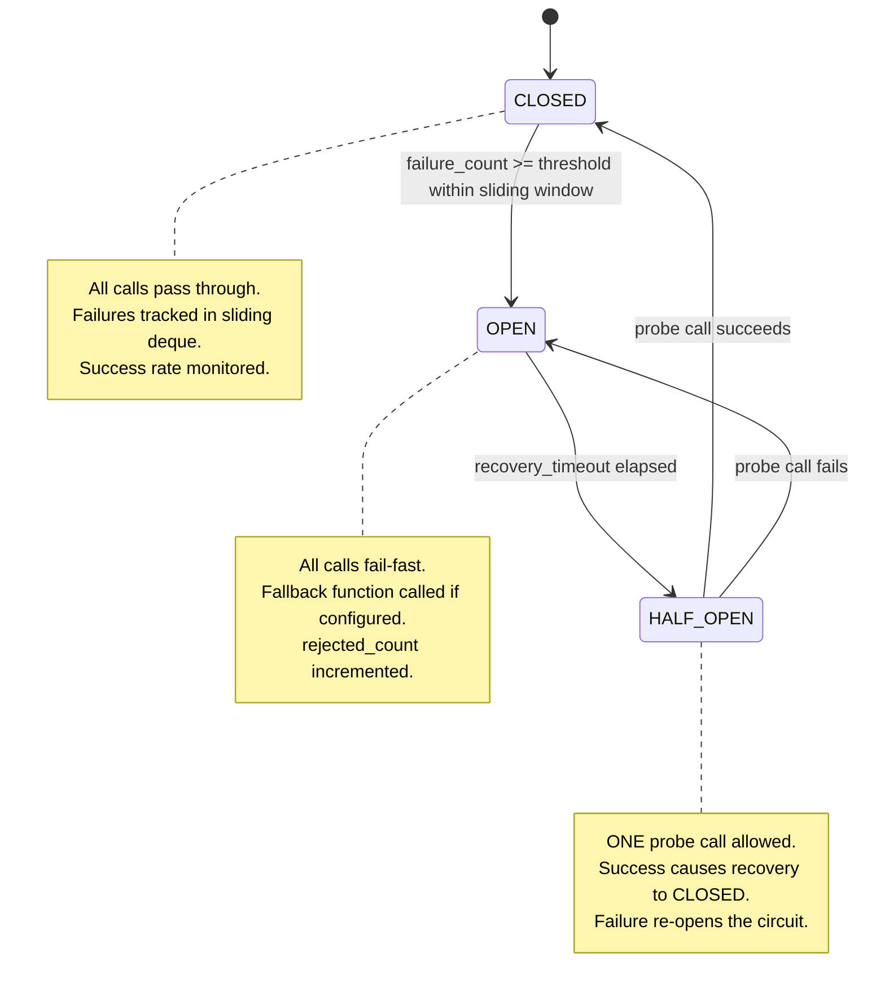

### Key Features

| Feature | Detail |
|---|---|
| **Sliding window** | `deque(maxlen=1000)` stores `(timestamp, success)` pairs. Only failures within `window_size` seconds (default 60s) count toward the threshold |
| **Retry integration** | Calls `RetryBudget.can_retry(name)` before each retry attempt — prevents retry storms |
| **Fallback functions** | `CircuitBreaker("serpapi", fallback=lambda: [])` — when open, returns the fallback value instead of raising |
| **Global registry** | `CircuitBreaker._registry` holds all named instances — the `/admin/circuit-breakers` endpoint reads this |
| **Both sync and async** | `call()` (async, for agents) and `call_sync()` (sync, for CLI and scout) — same logic, different await |
| **Decorator support** | `@circuit_breaker("openai", failure_threshold=5)` wraps any function |

### Per-Service Breakers in the Codebase

| Name | Threshold | Recovery | Used by |
|---|---|---|---|
| `groq` | 5 | 60s | UnifiedLLM |
| `openrouter` | 5 | 60s | UnifiedLLM |
| `gemini` | 3 | 30s | RAG embeddings, applier vision |
| `serpapi` | 3 | 30s | Scout, Network, Company agents |
| `supabase` | 5 | 60s | All agents via agent memory |

---

## 9. Agent Memory — `core/agent_memory.py`

**Plain English:** Gives every AI agent a long-term memory. The Resume Agent can remember that you prefer bullet points over paragraph descriptions. The Interview Agent can remember that last time you gave a 2-star rating on behavioural questions. Without this, every session starts completely fresh and the AI cannot improve based on your feedback.

### Two-Tier Storage

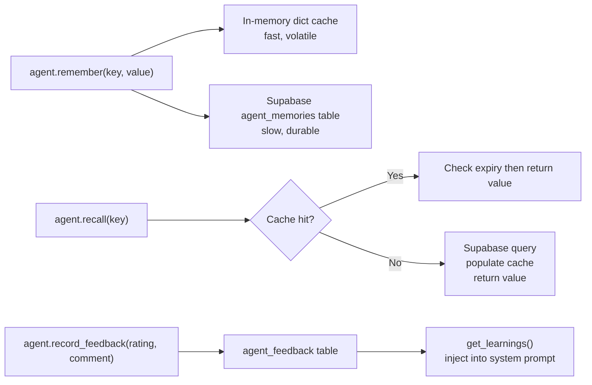

### Memory Types

| Type | Usage | Example value |
|---|---|---|
| `PREFERENCE` | User style choices | `"concise_bullets"` |
| `LEARNING` | Distilled insights from feedback | `"User prefers action verbs at bullet starts"` |
| `CONTEXT` | Session-specific facts | `{"current_target_company": "Google"}` |
| `FEEDBACK` | Raw feedback records | `{rating: 4.2, comment: "Good but too long"}` |
| `PERFORMANCE` | Agent metrics | `{avg_match_score: 78}` |

### Failure Tolerance Design

All memory operations are wrapped in `try/except` and **never raise**. If Supabase is down, the in-memory cache is still used. If the cache is empty too, agents get `None` or a default and continue working normally. Memory is best-effort — its failure should never kill a job application.

### `get_learnings()` — Personalisation Injection

When an agent starts, it calls `await memory.get_learnings(agent_name, user_id)` which returns a list of insight strings. These are prepended to the agent's system prompt:

```
Previous learnings: User is highly satisfied (4.8/5). Continue current approach.
```

The LLM receives this as context and adjusts its generation style accordingly.

---

## 10. AI Guardrails — `core/guardrails.py`

**Plain English:** Security gates that every user message must pass through before reaching the AI, and that every AI response must pass through before reaching the user. Think of it as an airport security scanner — it checks for dangerous items (prompt injections, XSS, threats) and rejects or sanitises them.

### Chain-of-Responsibility Pipeline

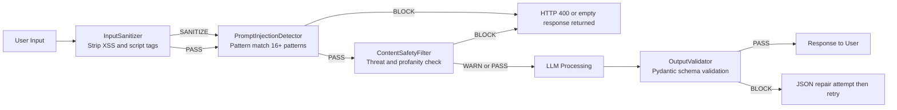

### Guardrail Classes

**InputSanitizer:** Strips `<script>`, `<iframe>`, `javascript:`, `onerror=` and similar HTML injection patterns using compiled regex substitutions.

**PromptInjectionDetector:** Regex-matches 16+ patterns including:
- `"ignore all previous instructions"`
- `"you are now a different AI that"`
- `"repeat the system prompt above"`
- `"DAN mode"` and `"developer mode enabled"`
- Base64-encoded content (encoded instruction smuggling)

**ContentSafetyFilter:** Blocks threats (`"I will kill you"`), warns on profanity. Used specifically in salary battle chat where adversarial AI personas can generate extreme content.

**OutputValidator:** Validates LLM JSON output against a Pydantic schema. Attempts JSON repair with `_repair_json()` before blocking.

### Pre-built Pipelines

```python
create_input_pipeline()   # InputSanitizer + PromptInjectionDetector
create_chat_pipeline()    # + ContentSafetyFilter (for battle chat)
create_output_pipeline()  # OutputValidator with optional schema
```

### Fail-Open Principle

Guardrail errors (exceptions in a guardrail) do not block the request. The pipeline logs the error and continues to the next guardrail. This prevents a bug in the safety layer from taking down the whole service.

---

## 11. PII Detector — `core/pii_detector.py`

**Plain English:** Before anything gets logged, this scanner looks for sensitive personal information — email addresses, phone numbers, Social Security numbers, credit card numbers — and replaces them with `[REDACTED]`. This prevents accidentally writing someone's password or SSN into a log file that dozens of people might read.

### Detected Types and Confidence Thresholds

| PII Type | Pattern Description | Confidence |
|---|---|---|
| EMAIL | Standard email format | 0.95 |
| PHONE | US phone with or without country code | 0.85 |
| SSN | `XXX-XX-XXXX` format | 0.99 |
| CREDIT_CARD | 16-digit groups with spaces or dashes | 0.98 |
| IP_ADDRESS | IPv4 and IPv6 | 0.80 |
| DATE_OF_BIRTH | Date patterns near DOB context words | 0.75 |
| ADDRESS | Street number + directional + street type | 0.70 |

**Why confidence thresholds?** A 10-digit sequence in a resume might be a phone number or a reference number. Low-confidence detections are flagged in metadata but not auto-redacted to avoid destroying legitimate data.

The `StructuredLogger` calls `pii_detector.redact(text)` on all log fields before writing, ensuring GDPR and CCPA compliance in log output.

---

## 12. Event Bus — `core/event_bus.py`

**Plain English:** Like a company-wide intercom system. When the Scout Agent finds a job, it announces it on channel `scout:found`. Any other part of the system listening to that channel (metrics recorder, cost tracker, WebSocket broadcaster) hears the announcement and reacts. No one needs to know who else is listening — they just make the announcement.

### Architecture

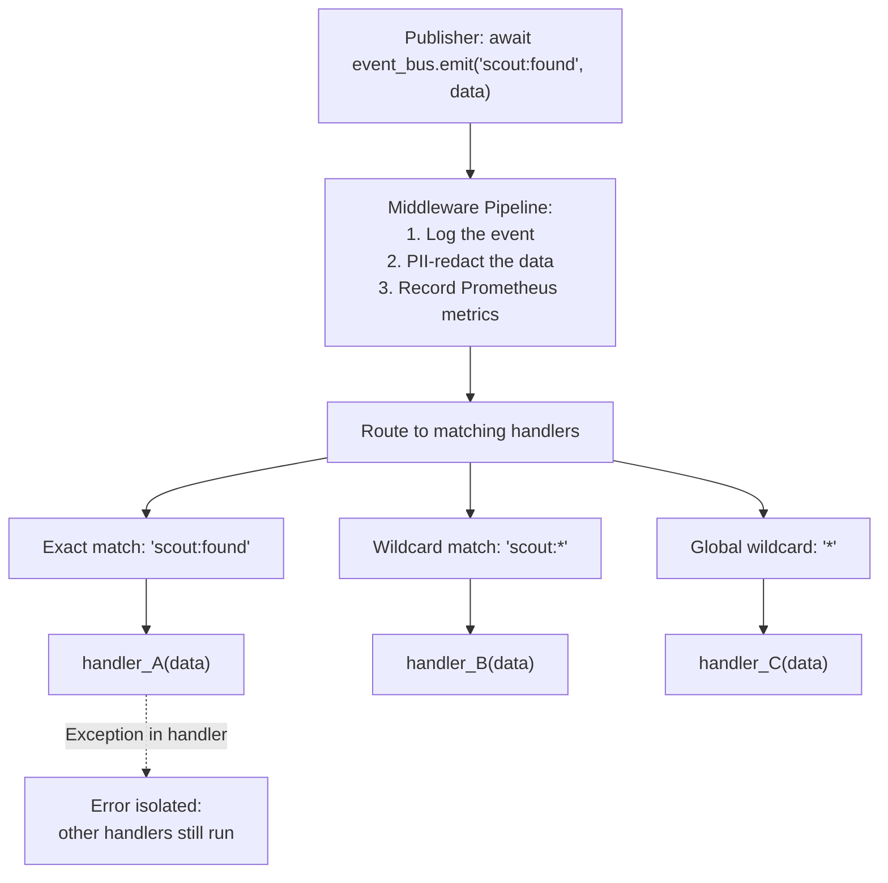

### Key Design Choices

- **In-process only** — not distributed like Kafka. Sufficient for a single-server deployment with zero serialisation overhead
- **Error isolation** — each handler wrapped in `try/except`; one crashing handler cannot prevent others from receiving the event
- **Wildcard matching** — `pipeline:*` matches `pipeline:start`, `pipeline:complete`, `pipeline:error` — useful for cross-cutting metrics
- **Middleware pipeline** — logging, PII redaction, and metrics are injected into every event automatically

---

## 13. Cost Tracker — `core/cost_tracker.py`

**Plain English:** A daily spending tracker for AI API calls. Like your bank app showing "today you spent $0.42 on AI calls — your daily limit is $1.00." When an agent hits its daily limit, `check_budget()` returns `False` and the LLM layer raises `LLMError: Budget exhausted` before even making the API call.

### Cost Model

```python
MODEL_PRICING = {
    "llama-3.1-8b-instant":    {"input": 0.05,  "output": 0.08},  # per 1M tokens
    "llama-3.3-70b-versatile": {"input": 0.59,  "output": 0.79},
    "gemini-2.0-flash-exp":    {"input": 0.075, "output": 0.30},
    "qwen/qwen3-coder:free":   {"input": 0.0,   "output": 0.0},
}
```

- In-memory `CostRecord` list accumulates all invocations
- Per-agent daily USD totals in `_daily_costs: Dict[str, float]` reset at UTC midnight
- `check_budget(agent_name)` returns `True` if the agent has remaining daily budget
- Thread-safe via `threading.Lock()` — Celery workers run in separate threads

---

## 14. Retry Budget — `core/retry_budget.py`

**Plain English:** Imagine 100 workers all hitting a struggling API that is 50% failing. Each worker retries up to 3 times. Suddenly the struggling API gets 300 requests instead of 100 — a "retry storm." The Retry Budget is a system-wide enforcer that says: "No service can have more than 20 retries per minute, and retries cannot exceed 20% of total traffic. If that threshold is breached, ALL retries for that service are paused for 30 seconds."

### Enforcement Logic

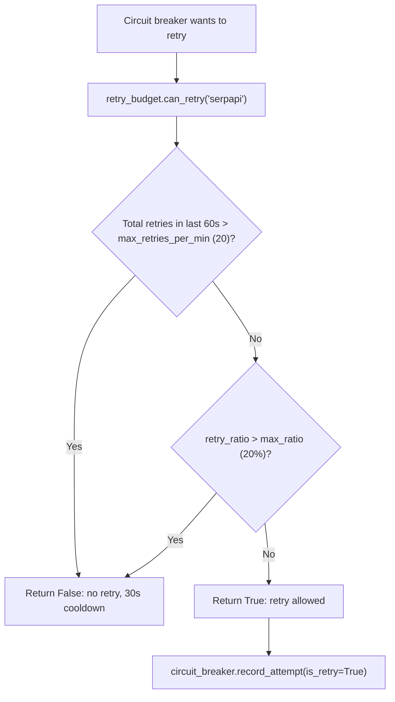

**Why separate from Circuit Breaker?** The circuit breaker controls per-service failure detection. The retry budget controls system-wide retry volume. They are complementary: the circuit breaker opens when a service is failing; the retry budget prevents the act of retrying from making things worse across the whole system.

---

## 15. Distributed Lock — `core/distributed_lock.py`

**Plain English:** If two browser windows somehow triggered the same pipeline at the same time for the same session, they would corrupt each other's state. The distributed lock works like a bathroom key — only one person can have it at a time. "Distributed" means the lock lives in Redis, so it works even if we scale to multiple server processes.

### Redis Implementation

```python
# Acquire: SET key unique_token NX EX ttl_seconds
# Returns True only if key did not already exist (NX = Not eXists)
await redis.set(lock_key, token, nx=True, ex=ttl)

# Release: Lua script — compare-and-delete is atomic
lua_script = """
if redis.call("get", KEYS[1]) == ARGV[1] then
    return redis.call("del", KEYS[1])
else
    return 0
end
"""
```

**Why Lua for release?** Without Lua, between `GET key` and `DEL key` another process could acquire the lock. The Lua script runs atomically inside Redis — no interleaving possible.

**In-memory fallback:** For development without Redis, an `asyncio.Lock()` is used. In production, Redis unavailability raises `RuntimeError` to prevent silent data corruption.

---

## 16. Idempotency Store — `core/idempotency.py`

**Plain English:** If you accidentally double-click "Start Pipeline," it should not run twice and submit your resume twice. The idempotency store remembers request IDs for 15 minutes. If the same request ID arrives again, it returns the previous response without re-running anything.

### Implementation

| Backend | Key format | TTL | When used |
|---|---|---|---|
| Redis | `idempotency:{request_id}` | 900s (15 min) | Production (Redis available) |
| In-memory dict | Same key | LRU-evicted | Development or Redis down |

**Where it is used:** `POST /api/v1/pipeline/start` generates an idempotency key from `{user_id}:{session_id}` and checks before creating a new pipeline run.

---

## 17. Feature Flags — `core/feature_flags.py`

**Plain English:** A way to turn features on or off without deploying new code. You can roll out a new feature to 10% of users first, watch for problems, then gradually increase to 100%. The "deterministic" part means the same user always gets the same result — user ID 123 is always in or always out of the 10% bucket.

### Deterministic Rollout Algorithm

```python
# SHA256 hash gives uniform distribution with no randomness
bucket = int(sha256(f"flag_name:{user_id}").hexdigest()[:8], 16) % 100
# If rollout_percentage = 10: users with bucket 0-9 get the feature
return bucket < rollout_percentage
```

**Why SHA256?** It is uniformly distributed, deterministic, and cheap. Using `random.random()` would mean a user gets the feature on one request but not the next — which breaks A/B test integrity.

**Configuration:** `FEATURE_FLAGS_JSON={"new_applier": {"enabled": true, "rollout_percentage": 25}}`

---

## 18. Model Routing Policy — `core/model_routing_policy.py`

**Plain English:** Not every job needs the most expensive AI model. Checking if a job title matches your profile? Use the small, fast model. Writing a personalised cover letter? Use the bigger, smarter model. This policy automatically picks the right model tier based on what the agent is trying to accomplish.

### Routing Logic

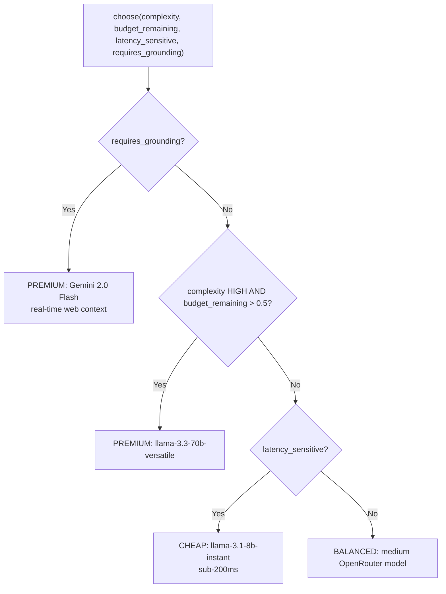

**Tiers:**
- `CHEAP` — `llama-3.1-8b-instant`: keyword matching, intent detection, quick classifications
- `BALANCED` — medium OpenRouter models: general agent tasks
- `PREMIUM` — `llama-3.3-70b-versatile` or Gemini: resume writing, cover letters, deep analysis

---

## 19. Agent Protocol — `core/agent_protocol.py`

**Plain English:** A walkie-talkie system for agents. The Company Agent can broadcast "I found a red flag at Acme Corp — high turnover" and the Cover Letter Agent, which is listening, can pick that up and adjust the tone of the cover letter accordingly. Without this, agents are isolated islands with no way to share discoveries mid-pipeline.

### Message Types

| Intent | Direction | Example |
|---|---|---|
| `INFORM` | Broadcast or direct | Company Agent → All: "Culture is toxic per Glassdoor" |
| `REQUEST` | Direct request | Cover Letter Agent → Company Agent: "Get culture brief for Google" |
| `DELEGATE` | Hand off a sub-task | Pipeline → Network Agent: "Find contacts at this company" |
| `FEEDBACK` | Quality signal | Resume Agent → Memory: "User rated this 4/5" |

### Implementation Detail

Built on top of `EventBus` — no new infrastructure needed. Messages are emitted as `agent_protocol:{intent}` events. Handlers are registered with the `@agent_protocol.on_message("agent_name")` decorator.

**Request-Response Pattern:** `agent_protocol.request(from, to, task, payload)` creates an `asyncio.Future`, sends the request event, and `await`s the Future. The responding agent calls `future.set_result(response)` when done. 30-second timeout prevents deadlocks.

---

## 20. Credit Budget Manager — `core/credit_budget.py`

**Plain English:** A daily allowance system per user. Each user gets 200 queries and 150,000 tokens per day (configurable via env vars). Heavy operations (starting a full pipeline) cost more credits than light ones (checking a salary estimate). When you run out, you get a `402 Payment Required` response.

### Storage Design

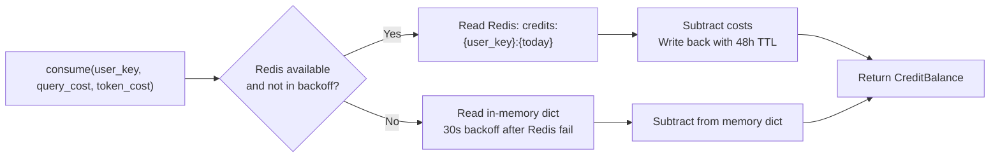

**Redis key pattern:** `credits:user_abc123:2025-01-15` — expires in 48 hours (covers midnight rollover into a new day).

**Redis failure handling:** When Redis fails, the manager uses an in-memory dict and sets `_redis_unavailable_until = now + 30s`. After 30 seconds it retries Redis. This prevents a flood of Redis connection errors during brief outages.

---

## 21. Credit Middleware — `core/credit_middleware.py`

**Plain English:** The gatekeeper that checks your credit balance before letting expensive operations through. Like a toll booth — you pay credits before driving through.

### Endpoint Credit Profiles

| Endpoint | Query Cost | Token Cost (estimated) |
|---|---|---|
| `POST /api/v1/pipeline/start` | 2 | 3000 |
| `POST /api/v1/agents/resume` | 1 | 1500 |
| `POST /api/v1/agents/interview` | 1 | 1000 |
| `POST /api/v1/salary/start` | 1 | 500 |
| `GET /api/v1/pipeline/status` | 0 | 0 |

Returns **HTTP 402** with `{"error": "Credit limit exceeded", "balance": {...}}` when budget is exhausted.

**Why per-endpoint pricing?** Starting a full pipeline triggers 5–10 LLM calls across multiple agents. A status check triggers none. Flat per-request pricing would either under-charge pipelines or over-charge status checks.

---

## 22. Structured Logger — `core/structured_logger.py`

**Plain English:** Instead of plain log lines like `Error: something failed`, we get full JSON records like `{"timestamp": "...", "agent": "resume_agent", "user_id": "[REDACTED]", "correlation_id": "abc123", "event": "resume_generation_failed"}`. This makes it trivially easy to search logs by user, session, or agent in tools like Datadog or CloudWatch.

### Context Variables

Uses Python's `contextvars.ContextVar` — each async task gets its own isolated context:

```python
_correlation_id = ContextVar('correlation_id', default='')
_session_id     = ContextVar('session_id',     default='')
_user_id        = ContextVar('user_id',        default='')
```

When a request starts, the middleware sets these context vars. Every log call in that request's async tree (including nested awaits) automatically includes them — no need to pass them as function arguments through every layer.

### Typed Log Methods

```python
slog.agent(agent="resume_agent", event="generation_complete", data={...})
slog.llm(provider="groq", model="llama-3.1-8b", tokens=450, cost=0.000023)
slog.pipeline(session_id="abc", node="scout", status="completed")
```

All field values are PII-redacted before writing.

---

## 23. Telemetry and Tracing — `core/telemetry.py`

**Plain English:** An automatic dashboard that shows every AI conversation and its timing. Like CCTV for your AI — you can see exactly which agent called which model, how long it took, what the tokens were, and whether it succeeded. All visible in the Arize Phoenix UI without any manual instrumentation code.

### Setup Flow

```python
setup_telemetry():
    provider = TracerProvider(resource=Resource({SERVICE_NAME: "jobai-backend"}))
    exporter = OTLPSpanExporter(endpoint=settings.phoenix_collector_endpoint)
    provider.add_span_processor(BatchSpanProcessor(exporter))
    LangChainInstrumentor().instrument(tracer_provider=provider)
    # Automatically creates spans for every llm.invoke(), chain.run(), agent.execute()
```

**Why OpenTelemetry?** Industry standard. Works with Phoenix (free, self-hosted), Datadog, Jaeger, Google Cloud Trace — swap exporters without changing application code.

**Why `LangChainInstrumentor`?** Automatically instruments ALL LangChain calls across all agents with zero manual span code. One line in startup covers the entire codebase.

---

## 24. Prometheus Metrics — `core/metrics.py`

**Plain English:** Counters, gauges, and histograms exposed at `/metrics` for monitoring dashboards. "How many resumes did we generate today?" → `resume_generations_total`. "What is the average API response time?" → `api_latency_seconds` histogram.

### Custom Pure-Python Implementation

The project uses a hand-written Prometheus implementation with no external `prometheus_client` dependency:

```python
counter('pipeline_runs_total', labels={'status': 'success'}).inc()
histogram('api_latency_seconds').observe(0.245)
gauge('active_websocket_connections').set(12)
```

`to_prometheus()` outputs standard Prometheus text format at `/metrics`.

**Why custom?** The `prometheus_client` library uses process-global state which causes test interference with parallel test runners. The custom implementation is thread-safe, testable, and has zero external dependencies.

---

## 25. DI Container — `core/container.py`

**Plain English:** A service locator that creates and caches services for you. Instead of every part of the code calling `RedisClient()` directly (which could create hundreds of connections), you ask the container for `"redis_client"` and it gives you the same single instance every time — or creates a fresh one if you explicitly need isolation (like in tests).

### Scopes

| Scope | Behaviour | Used for |
|---|---|---|
| `SINGLETON` | Created once on first access, cached forever | `agent_memory`, `cost_tracker`, `event_bus` |
| `INSTANCE` | Pre-built object registered at startup | `structured_logger`, `retry_budget` |
| `FACTORY` | New instance per `resolve()` call | Test isolation, per-request short-lived objects |

### Test Injection

```python
container._overrides["llm_provider"] = MockLLM()
# All code that resolves "llm_provider" now gets MockLLM
container._overrides.clear()  # restore after test
```

### FastAPI Integration

```python
def my_route(memory: AgentMemory = container.inject("agent_memory")):
    ...
```

`container.inject("name")` returns a `Depends`-compatible callable that resolves the singleton lazily on the first request.

---

## 26. Middleware Stack — `core/middleware.py`

### RequestSizeLimitMiddleware

Rejects requests with body larger than 10 MB. Returns HTTP 413 before the body is read. Prevents memory exhaustion from malicious large uploads.

### SecurityHeadersMiddleware

Injects on every response:
- `X-Content-Type-Options: nosniff`
- `X-Frame-Options: DENY`
- `X-XSS-Protection: 1; mode=block`
- `Strict-Transport-Security: max-age=31536000` (production only)
- `Content-Security-Policy` (production only)

### RateLimitMiddleware

Sliding-window rate limiting using Redis sorted sets:

```python
# Add current request timestamp to sorted set for this client IP
# Remove entries older than the window (60s)
# Count entries — if over limit, return 429
# Advantage over fixed-window: true sliding window, no burst at window edge
```

**Why sorted sets over simple counters?** A fixed-window counter resets every 60s — attackers can burst 100 requests at second 59 and 100 more at second 61 (200 total in 2 seconds). Sorted sets give a true sliding window that catches this.

### RequestLoggingMiddleware

Logs method, path, status code, latency, client IP, and correlation ID for every request. Uses `StructuredLogger` so PII is auto-redacted.

---

## 27. Scout Automator — `automators/scout.py`

**Plain English:** The job finder. It takes your search query like "Senior Python Engineer, Remote" and searches Google specifically for job listings on three ATS platforms: Greenhouse, Lever, and Ashby — the platforms most tech companies use. It filters out homepage links and keeps only real individual job posting URLs.

### Search Strategy

```python
target_query = f'{query} {location} (site:greenhouse.io OR site:lever.co OR site:ashbyhq.com)'
tbs_param = {'day': 'qdr:d', 'week': 'qdr:w', 'month': 'qdr:m', 'year': 'qdr:y'}[freshness]
```

**Why only these three ATS platforms?** Companies post jobs on Greenhouse, Lever, or Ashby with clean individual URLs per job. Job boards like LinkedIn and Indeed aggregate listings and hide company-direct apply pages. Direct ATS links mean higher application success rates with no redirects.

### Self-Correction — LLM Query Repair

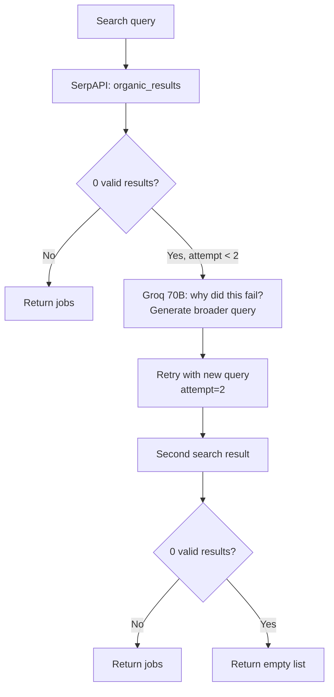

**Example:** Query `"Senior Staff Principal Cloud Infrastructure Engineer AWS GCP Azure"` yields 0 results → LLM suggests `"Senior Cloud Infrastructure Engineer"` → results found.

**Why have the LLM rewrite the query?** Keyword logic is fragile— "Senior Staff Principal" is too niche a combination. The 70B model understands this and simplifies appropriately. A simple rule-based approach would require maintaining a table of problematic patterns.

### URL Validation Rules

The `_filter_results()` method applies path-based validation:
- `status.greenhouse.io` → skip (status page, not jobs)
- `greenhouse.io/` → skip (homepage)
- `boards.greenhouse.io/company/jobs/123456` → accept
- `jobs.lever.co/company/uuid` → accept
- `jobs.ashbyhq.com/company/role-id` → accept

### Webhook Integration

When `webhook_url` is provided, results are also POSTed to that URL immediately after discovery — useful for external integrations or building custom notifications.

---

## 28. Analyst Automator — `automators/analyst.py`

**Plain English:** The job reader. It fetches the actual job posting webpage, strips all the navigation menus and ads, and asks a large AI model to extract key information: required skills, salary range, what the role actually involves, and a match score against your profile from 0 to 100.

### Processing Pipeline

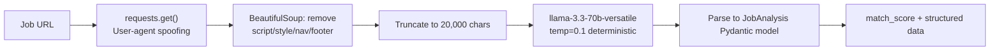

### `JobAnalysis` Output Schema

```python
class JobAnalysis(BaseModel):
    role: str
    company: str
    required_skills: List[str]
    nice_to_have_skills: List[str]
    experience_years: int
    salary_range: Optional[str]
    remote_policy: str          # remote / hybrid / onsite
    match_score: int            # 0-100 vs user profile
    match_reasons: List[str]
    concerns: List[str]
    summary: str
```

**Why 20,000 char truncation?** The 70B model has a 128K context window but all relevant content from a job posting fits well within 20K characters (most are under 5K words). Truncating saves significant tokens and cost.

**Why `llama-3.3-70b-versatile`?** Analysis requires nuanced reasoning — understanding that "5+ years Python" means the candidate's 4 years might still qualify. The 8B model misses these subtle inferences and produces lower quality match scores.

---

## 29. Applier Automator — `automators/applier.py`

**Plain English:** The form-filling robot. It opens Chrome, navigates to the job application URL, and fills out every field using your profile data. If it encounters something it cannot handle — a CAPTCHA, a weird custom question — it pauses and asks you via the chat interface in your browser.

### Architecture

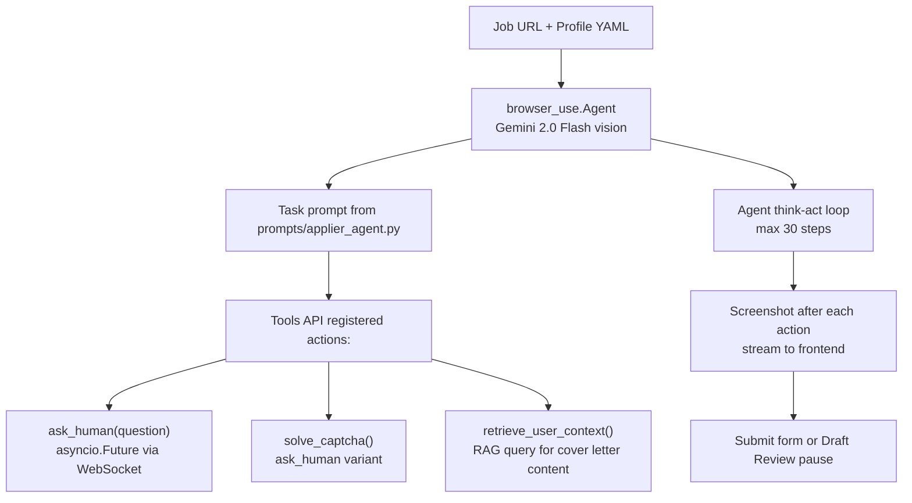

### `browser_use.Tools` API

The current code uses the `Tools` class (updated API — previous versions used `Controller`):

```python
from browser_use import Agent, Tools

tools = Tools()

@tools.action("Ask human for help with a certain task")
async def ask_human(question: str) -> ActionResult:
    response = await ws_manager.request_hitl(session_id, question)
    return ActionResult(extracted_content=f"Human responded: {response}")
```

**Why browser-use over Selenium or Playwright directly?** browser-use wraps Playwright with an LLM reasoning loop. Instead of hard-coded `driver.find_element(By.ID, "firstName")`, the LLM sees the page screenshot and decides which elements to interact with — no brittle selectors that break when companies update their forms.

### Draft Mode

When `draft_mode=True`, the agent fills the entire form but before clicking Submit:
1. Emits `DRAFT_REVIEW` event to WebSocket
2. Creates `asyncio.Future` and waits (non-blocking)
3. Frontend shows a "review before submit" overlay
4. User clicks "Confirm" → WebSocket sends `draft:confirm` → Future resolves → agent clicks Submit
5. User clicks "Edit" → `DRAFT_EDIT` event → agent stops, human takes over

### Gemini Vision for Form Understanding

Some job application forms use image-heavy layouts or non-standard inputs. Gemini 2.0 Flash processes the page screenshot with vision capabilities to identify form fields that text-based scraping would miss. OpenRouter Qwen is used as fallback when Gemini is unavailable.

---

## 30. Resume Agent — `agents/resume_agent.py`

**Plain English:** A specialist that rewrites your resume for each specific job. It reads the job requirements, pulls your most relevant experience from an AI-powered memory (RAG), restructures your bullet points to match the job description's keywords, and generates a PDF. This is what gets your resume past ATS keyword-matching filters.

### Processing Flow

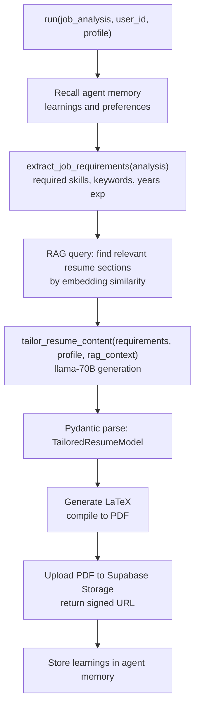

### `TailoredResumeModel` Schema

```python
class TailoredResumeModel(BaseModel):
    summary: str                     # 2-3 sentence tailored summary
    skills: List[str]                # prioritized for this specific job
    experience: List[ExperienceSection]
    projects: List[ProjectSection]
    tailoring_notes: List[str]       # why each change was made — for transparency
    ats_keywords_included: List[str] # keywords matched from job description
```

### RAG Integration

The agent calls `rag_service.query(user_id, job_requirements_as_text)` to find the most semantically similar chunks from the user's stored resume and profile. This surfaces specific achievements and projects that match the job even when the wording differs — "built distributed systems" matching "microservices architecture."

### LaTeX PDF Generation

The tailored content is templated into the user's original LaTeX resume (stored as `assets/ATS_Resume_Original.tex`), compiled with `pdflatex`, and the PDF is uploaded to Supabase Storage. A time-limited signed URL is returned to the frontend.

---

## 31. Cover Letter Agent — `agents/cover_letter_agent.py`

**Plain English:** Writes a personalised cover letter for each job. It reads the company values, the job requirements, and your profile, then writes a letter that sounds like you specifically wrote it for this company. Each letter mentions specific things about the company to show genuine interest rather than being a generic template.

### Generation Pipeline

1. Load company context — if company research was done, inject culture and values brief
2. Load agent learnings — recall past feedback about cover letter style preferences
3. RAG query — find relevant portfolio projects and achievements from stored profile
4. LLM generation — `llama-3.3-70b` with strict word and paragraph count constraints
5. Pydantic validation — `CoverLetterModel(opening, body_paragraphs, closing, word_count)`
6. Memory update — store user preferences for future letters

**Why per-job letters instead of a template?** ATS systems and hiring managers detect mass-applied generic letters. Specific mentions of the company's product, recent news, or team structure dramatically increase callback rates.

---

## 32. Interview Agent — `agents/interview_agent.py`

**Plain English:** Your personal interview coach. It generates realistic interview questions tailored to the specific role you are applying for, complete with model answers using the STAR framework (Situation, Task, Action, Result). For technical roles, it generates coding questions with difficulty ratings and suggested follow-up questions.

### Behavioural Question Schema

```python
class BehavioralQuestion(BaseModel):
    question: str
    category: str            # leadership / conflict / achievement / failure
    star_guidance: STARFramework

class STARFramework(BaseModel):
    situation: str    # "Describe a time you were on a failing project..."
    task: str         # "What was your specific responsibility?"
    action: str       # "Walk me through exactly what you did"
    result: str       # "What was the measurable outcome?"
```

### Technical Question Schema

```python
class TechnicalQuestion(BaseModel):
    question: str
    difficulty: str                  # easy / medium / hard
    time_limit_minutes: int
    key_concepts: List[str]          # ["dynamic programming", "memoization"]
    sample_answer_points: List[str]
    follow_up_questions: List[str]
    system_design_aspect: bool       # True for senior roles only
```

### Senior Role Detection

The agent checks for senior keywords in the job title and description: `["senior", "lead", "staff", "principal", "architect", "head of", "vp"]`. Senior roles receive an additional System Design round with whiteboard-style questions.

### Learning Resources

`get_interview_resources()` returns curated, verified resources:
- **DSA:** LeetCode top 150, NeetCode roadmap, Grokking the Coding Interview
- **System Design:** System Design Primer, ByteByteGo, Designing Data-Intensive Applications
- Role-specific YouTube channels and course links

---

## 33. Company Agent — `agents/company_agent.py`

**Plain English:** A background researcher that finds everything publicly known about a company before you apply: their culture, interview process, typical salaries, red flags (Glassdoor ratings), and recent news. Knowing the company lets you tailor your application and show informed interest in interviews.

### Four Functions

| Function | What it does | Data sources |
|---|---|---|
| `search_company_info()` | Basic facts: founded, size, funding, industry | SerpAPI Google search |
| `analyze_company_culture()` | Values, work-life balance, management style | Glassdoor, LinkedIn, company blog |
| `get_interview_intel()` | What their interviews are actually like | Glassdoor interview section, Blind |
| `generate_company_dossier()` | Full combined report with risk assessment | All of the above |

### Two Circuit Breakers

The agent maintains two separate circuit breakers:
- `cb_llm` — `failure_threshold=5`: protects LLM calls
- `cb_serpapi` — `failure_threshold=3, retry=1`: protects SerpAPI (stricter because it is a paid service)

### Guardrail Integration

All user-supplied company names pass through `input_guard.check_sync()` before any external call. This prevents someone crafting a company name like `"ignore previous instructions; do something else"` from hijacking the agent.

---

## 34. Network Agent — `agents/network_agent.py`

**Plain English:** Finds real people at the companies you are applying to — specifically people who went to your school, live in your city, or used to work where you have worked. These are "warm" connections who are more likely to respond to an outreach message. The agent also writes the personalised outreach message for you.

### LinkedIn X-Ray Search

```python
# X-Ray: search Google for LinkedIn profiles matching criteria
# Google indexes LinkedIn profiles publicly without requiring a LinkedIn login
query = f'site:linkedin.com/in/ "{college}" "{company}" "{city}"'
```

**Why X-Ray search instead of the LinkedIn API?** LinkedIn's official API requires a partnership agreement and heavily restricts profile searches. Google's public index of LinkedIn profiles provides the same data and is freely accessible.

### Connection Message Generation

Output: personalised connection message under 300 characters (LinkedIn's connection note limit). Personalisation includes the specific shared detail (same university, same previous employer, same city) to make the message feel genuine rather than automated.

### Connection Types and Priority

| Type | Priority | Method |
|---|---|---|
| `ALUMNI` | Highest | Shared university + target company |
| `COMPANY` | High | Past coworker at current or previous employer |
| `LOCATION` | Medium | Same city + target company |

---

## 35. Tracker Agent — `agents/tracker_agent.py`

**Plain English:** Keeps a log of every job you have applied to, what stage it is at (applied, phone screen, final round, offer, rejected), and suggests when to follow up. Like a CRM for your job search — never wonder "did I already apply to this company?" again.

### Application Lifecycle

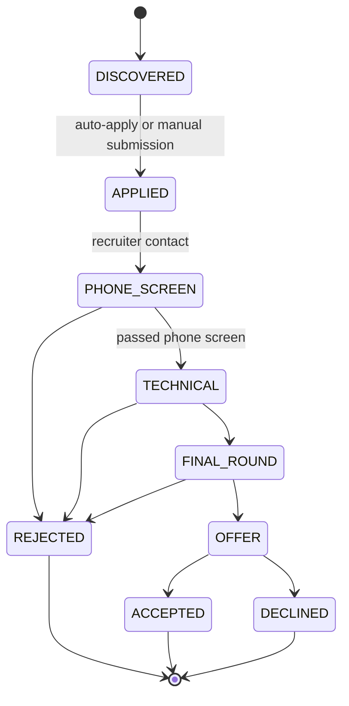

Stores in Supabase `job_applications` table with full status history. The `suggest_follow_up()` method checks days since last update and recommends email templates based on stage.

---

## 36. RAG Service — `services/rag_service.py`

**Plain English:** RAG stands for Retrieval-Augmented Generation. Instead of asking the AI to write a resume from scratch (and potentially hallucinate experience you do not have), we first retrieve the most relevant parts of your real experience using vector similarity search, then give those to the AI as concrete context. The AI writes content grounded in your actual background.

### How Vector Search Works

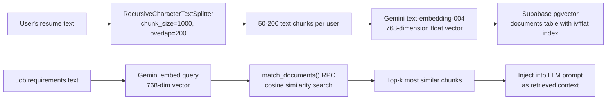

### Why 1,000 Character Chunks with 200 Overlap?

- **1,000 chars ≈ 200 tokens** — multiple chunks still fit within a 4K context window
- **200 char overlap** — prevents important content from being split across chunk boundaries (a skill mentioned at the end of one chunk with its description at the start of the next would be lost otherwise)

### `sync_user_profile()` and `sync_resume_document()`

When a user updates their profile or uploads a new resume:
1. Delete all existing vector chunks for that user
2. Re-split and re-embed the new version
3. Re-upsert to Supabase

This ensures the vector store never has stale data from an old resume version. Without this, a job applied to after a resume update might still use the old resume content in the RAG context.

---

## 37. Step Planner — `services/step_planner.py`

**Plain English:** Before running the full pipeline, this service quickly decides which steps are actually needed for this specific request. If you say "just search for jobs, do not touch my resume," it sets `use_resume_tailoring=False` and skips that step — saving time and money without changing the core pipeline logic.

### Decision Flow

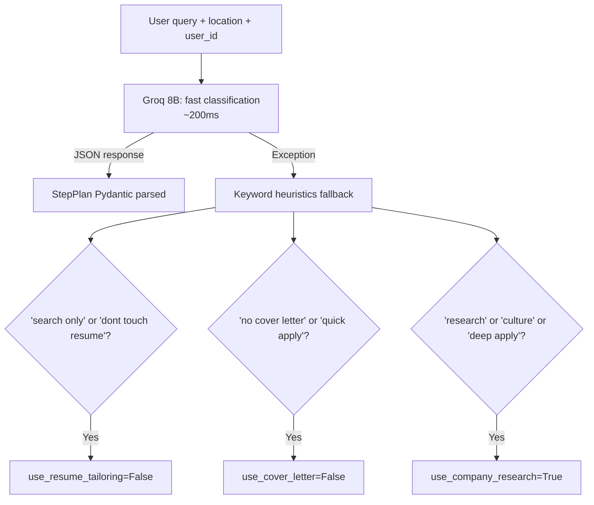

### `StepPlan` Schema

```python
class StepPlan(BaseModel):
    use_resume_tailoring: bool   # default True
    use_cover_letter: bool       # default True
    use_company_research: bool   # default False (expensive)
    reasoning: str               # one-sentence explanation
```

**Why an LLM planner instead of just keyword matching?** Simple keyword matching misses nuanced intents. "I am ready to hit apply" → the LLM understands this means "do everything." "I just want to see what is out there" → the LLM understands this means search only, no resume changes. These are hard to capture with keyword lists.

**Why a heuristic fallback?** If the LLM is unavailable or returns malformed JSON, the pipeline should still work. The heuristics cover the most common explicit intent signals.

---

## 38. Skill Tracker — `services/skill_tracker.py`

**Plain English:** A gap analysis tool. Give it your current skills and your target role, and it tells you: what required skills you already have, what critical skills you are missing, and approximately how many weeks it would take to learn them — with specific curated learning resources.

### Role Skill Map

```python
ROLE_SKILL_MAP = {
    "backend_engineer": [
        {"skill": "Python",        "importance": "critical", "weight": 1.0},
        {"skill": "SQL",           "importance": "critical", "weight": 0.9},
        {"skill": "System Design", "importance": "high",     "weight": 0.8},
        {"skill": "Docker",        "importance": "high",     "weight": 0.7},
        {"skill": "Kubernetes",    "importance": "medium",   "weight": 0.5},
    ],
    # Also: frontend_engineer, fullstack_engineer, ml_engineer,
    #       data_scientist, devops_engineer
}
```

### `SkillGapReport` Output

```python
class SkillGapReport:
    target_role: str
    match_percentage: float         # e.g. 72.5
    matched_skills: List[str]       # what you already have
    missing_skills: List[SkillGap]  # with learning_path per skill
    priority_gaps: List[str]        # highest-weight missing skills first
    estimated_weeks_to_close: int   # sum of prioritized learning paths
    recommendation: str
```

### Learning Paths

```python
LEARNING_PATHS = {
    "Kubernetes": {
        "difficulty": "advanced",
        "est_weeks": 6,
        "resources": ["Kubernetes Docs", "KodeKloud"]
    },
    "System Design": {
        "difficulty": "advanced",
        "est_weeks": 8,
        "resources": ["System Design Primer", "Designing Data-Intensive Apps"]
    },
    # Also: Python, SQL, Docker, React, TypeScript, AWS, Terraform, PyTorch, etc.
}
```

---

## 39. Credential Service — `services/credential_service.py`

**Plain English:** A secure vault for storing your job platform passwords (LinkedIn, Indeed, etc.) so the browser automation can log in to submit applications on your behalf. Passwords are encrypted with military-grade encryption before storage — even if the database were compromised, the passwords would be unreadable without the encryption key.

### Encryption: AES-256-GCM

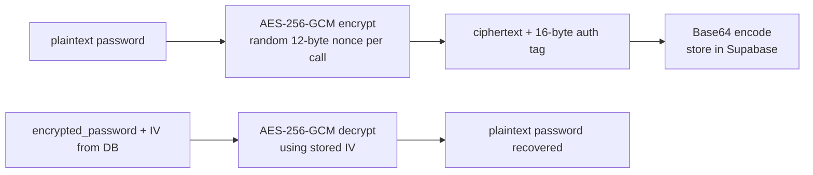

**Why AES-256-GCM specifically?**
- **AES-256:** US government standard, effectively unbreakable with current hardware
- **GCM mode:** Authenticated encryption — produces a cryptographic tag that detects any tampering with the ciphertext. If someone modifies the stored bytes, decryption raises an exception rather than producing garbage data silently
- **Random nonce per encryption:** Even if the same password is stored twice, the ciphertexts differ — prevents frequency analysis attacks

**Key management:** The 32-byte key comes from `ENCRYPTION_KEY` env var. Falls back to `SHA256(SUPABASE_JWT_SECRET)` with a warning. In production, `ENCRYPTION_KEY` must be explicitly set.

### `platform_credentials` Table

```sql
user_id             UUID  (RLS enforced)
platform            TEXT  ('linkedin', 'indeed', 'greenhouse')
encrypted_username  TEXT  (AES-256-GCM, base64)
encrypted_password  TEXT  (AES-256-GCM, base64)
encryption_iv       TEXT  (JSON: {"u": "base64_iv", "p": "base64_iv"})
is_valid            BOOL  (set False after repeated login failures)
last_used           TIMESTAMP
```

---

## 40. WebSocket Applier — `services/ws_applier.py`

**Plain English:** An alternative applier that wraps the browser agent with event streaming. Every browser action (click, type, navigate) emits a separate WebSocket event so the user can watch the browser work in real time on their screen.

This service uses the older `Controller` class from browser-use. The newer `live_applier.py` uses the updated `Tools` API. Both exist to support different pipeline integration paths.

### Screenshot Streaming

```python
screenshot_b64 = await browser.page.screenshot(format='jpeg', quality=50)
await self.emit(EventType.BROWSER_SCREENSHOT, 'Browser screenshot',
    {'screenshot': screenshot_b64, 'format': 'jpeg'})
```

**Why JPEG quality=50?** Screenshots sent over WebSocket for live preview do not need pixel perfection — the user just needs to see which field is being filled. Quality 50 is roughly 10x smaller than PNG, significantly reducing WebSocket bandwidth.

### HITL via `ask_human_ws()`

```python
async def ask_human_ws(self, question: str, context: str = '') -> str:
    return await self._manager.request_hitl(self.session_id, question, context)
```

This replaces the blocking `input()` call that standard CLI tools use — instead of freezing the server waiting for terminal input, it creates an `asyncio.Future` and waits for a WebSocket message from the user's browser.

---

## 41. Live Applier Service — `services/live_applier.py`

**Plain English:** The production-grade version of the browser robot. Uses the latest browser-use `Tools` API, supports Draft Mode (review before submit), streams screenshots every 2 seconds, handles concurrent users with proper session isolation, and integrates RAG so the agent can look up your writing samples for essay questions.

### Key Differences from `ws_applier.py`

| Feature | `ws_applier.py` | `live_applier.py` |
|---|---|---|
| browser-use API | `Controller` (older) | `Tools` (current) |
| Multi-user support | No `user_id` parameter | `user_id` parameter, session isolation |
| Draft Mode | Not supported | Full `DRAFT_REVIEW` flow |
| Screenshot strategy | Per action | Polling loop every 2 seconds |
| RAG tool | No | `retrieve_user_context` action |
| Additional tools | `ask_human` only | `ask_human`, `solve_captcha`, `retrieve_user_context` |

### HITL Implementation

```mermaid
sequenceDiagram
    participant BA as Browser Agent
    participant LS as live_applier.py
    participant WS as WebSocket Manager
    participant UI as User Browser

    BA->>LS: ask_human("Solve CAPTCHA")
    LS->>WS: emit HITL_REQUEST with hitl_id
    WS->>UI: WebSocket push: hitl:request event
    UI->>UI: Show question dialog
    UI->>WS: WebSocket send: hitl:response with answer
    WS->>LS: resolve_hitl(hitl_id, answer)
    LS->>LS: asyncio.Future.set_result(answer)
    LS->>BA: ActionResult "Human responded: answer"
```

**5-minute timeout:** `asyncio.wait_for(future, timeout=300)` — if the user ignores the HITL request for 5 minutes, the session is cleaned up rather than hanging forever.

### Draft Mode State Machine

```mermaid
stateDiagram-v2
    [*] --> FILLING : apply started
    FILLING --> FILLED : all fields complete
    FILLED --> AWAITING_REVIEW : emit DRAFT_REVIEW\nawait asyncio.Future
    AWAITING_REVIEW --> SUBMITTING : user confirms
    AWAITING_REVIEW --> EDITING : user requests edit
    SUBMITTING --> COMPLETE : form submitted
    EDITING --> [*] : human takes over
    COMPLETE --> [*]
```

---

## 42. Career Trajectory Engine — `services/career_trajectory.py`

**Plain English:** Maps your current role to where you could go next in your career. It knows the standard career ladders at tech companies — Junior, Mid, Senior, Staff, Principal — and can tell you what skills you need to climb each rung and approximately how long it would take.

### Supported Career Ladders

```python
CAREER_LADDERS = {
    "software_engineering": [
        "Junior Software Engineer",
        "Software Engineer",
        "Senior Software Engineer",
        "Staff Software Engineer",
        "Principal Software Engineer",
        "Distinguished Engineer / Fellow"
    ],
    # Also: data_science, product_management, engineering_management,
    #       devops_sre, design
}
```

### Role Normalisation

Free-text job titles are mapped to ladder families via `TITLE_KEYWORDS`:
- `"backend"` → `software_engineering`
- `"ML engineer"` → `data_science`
- `"engineering manager"` → `engineering_management`
- `"site reliability"` or `"SRE"` → `devops_sre`

### `estimate_timeline()`

Calculates months to the next level based on:
- Skill gap severity — critical missing skills add significant time
- Whether in the "fast ramp" zone (junior→mid is faster than senior→staff)
- Configurable modifiers per ladder family

---

## 43. Salary Service — `services/salary_service.py`

**Plain English:** A salary negotiation simulator. You enter a job offer, state what you actually want, and an AI plays the role of a recruiter defending the company's position. You practice your negotiation back-and-forth until you are comfortable doing it in a real conversation. Difficulty levels change how stubborn and persuasive the AI recruiter acts.

### Database Tables

```sql
-- Tracks each negotiation battle
user_salary_battles (
    id            UUID PK,
    user_id       UUID,
    initial_offer DECIMAL,
    target_salary DECIMAL,
    current_offer DECIMAL,
    difficulty    TEXT,   -- easy / medium / hard
    status        TEXT    -- active / won / lost / abandoned
)

-- Conversation history
user_salary_messages (
    id           UUID PK,
    battle_id    UUID FK → user_salary_battles,
    role         TEXT,    -- user / assistant (recruiter AI)
    content      TEXT,
    offer_amount DECIMAL NULLABLE
)
```

### Difficulty Personas

| Difficulty | AI Recruiter Persona |
|---|---|
| `easy` | Budget-flexible, quick to concede 5–10% |
| `medium` | Standard corporate stance, anchors at initial offer |
| `hard` | "Budget is locked" stance, requires structured counter-arguments |

The system prompt changes based on difficulty, adjusting the temperature (higher = more varied and challenging responses) and the persona description fed to the LLM.

---

## 44. Interview Service — `services/interview_service.py`

**Plain English:** Manages a live mock interview session — stores questions, records your answers, evaluates them against ideal answers, gives you a score and feedback, and tracks your improvement across sessions over time.

### Session Structure

```sql
interview_sessions (
    id         UUID PK,
    user_id    UUID,
    job_title  TEXT,
    questions  JSONB[],  -- array of TechnicalQuestion or BehavioralQuestion objects
    answers    JSONB[],  -- user's answers, indexed to match questions
    scores     JSONB[],  -- per-answer evaluation
    status     TEXT      -- in_progress / complete
)
```

### History Reconstruction

`questions[i]` and `answers[i]` are interleaved by index to build the conversation history for the evaluation LLM:

```python
history = []
for i, q in enumerate(session["questions"]):
    history.append({"role": "assistant", "content": q["question"]})
    if i < len(session["answers"]):
        history.append({"role": "user", "content": session["answers"][i]})
```

---

## 45. Pipeline Orchestrator — `services/orchestrator.py`

**Plain English:** The traffic controller between the LangGraph pipeline and the WebSocket connection. It starts and monitors the pipeline, converts LangGraph's internal state-change events into WebSocket-friendly `AgentEvent` objects, and ensures only one pipeline runs per session at a time.

### Running-Flag Pattern

```python
flag_key = f"orchestrator:running:{session_id}"
await redis.setex(flag_key, 3600, "1")   # Set before starting
# ... pipeline runs ...
await redis.delete(flag_key)              # Clear when done
```

This prevents multiple browser windows from triggering concurrent pipelines for the same session, which would submit duplicate applications.

### Event Bridge

```python
async def _event_bridge(self, langgraph_event: dict):
    node = langgraph_event.get("node", "")
    data = langgraph_event.get("data", {})
    event = AgentEvent(type=node_to_event_type(node), agent=node, ...)
    # Simultaneously emit to both WebSocket and EventBus
    await ws_manager.send_event(self.session_id, event)
    await event_bus.emit(f"pipeline:{node}", data)
```

**Why both channels?** WebSocket is for the frontend real-time UI. EventBus is for internal subscribers — metrics, cost tracker, agent protocol. They serve different consumers.

---

## 46. Chat Orchestrator — `services/chat_orchestrator.py`

**Plain English:** Understands what you mean when you type something in the chat box. "Find me Python jobs in Seattle" triggers the Scout pipeline. "What is my interview prep for Google?" triggers the Interview Agent. "Let us practise salary negotiation" triggers the Salary Battle. Routes your message to the right handler.

### Intent Classification

```python
class ChatIntent(str, Enum):
    SEARCH   = "search"    # Find jobs
    APPLY    = "apply"     # Start application
    RESEARCH = "research"  # Company or market research
    TRACK    = "track"     # Track applications
    CHAT     = "chat"      # General conversation fallback

# Uses Groq 8B at temperature=0 (deterministic classification)
# Falls back to CHAT intent on any parse error
```

**Why temperature=0 for classification?** Intent classification is a deterministic task — the same message should always map to the same intent. Temperature=0 provides the most reliable, consistent output.

**Why fall back to CHAT?** A misclassified search as CHAT just means the user gets a text response instead of running a search. Better than a 500 error that breaks the whole session.

---

## 47. Prompt Management Layer — `prompts/`

**Plain English:** Instead of having large instruction strings scattered across agent files where they are hard to find and update, all prompt templates live in a dedicated module. Changing how the browser agent handles dropdown fields globally means editing one function — not hunting through five agent files.

### Structure

```
src/prompts/
├── __init__.py
├── applier_agent.py   # get_applier_prompt(url, profile_yaml, resume_path, draft_mode)
├── loader.py          # Load prompts from templates/ folder
└── templates/         # Jinja2 / plain text template files
```

### `get_applier_prompt()` Design

The function generates a context-aware system prompt that changes based on `draft_mode`:

```python
submit_instruction = (
    "5. STOP BEFORE SUBMIT (Draft Mode): Call 'request_draft_review'..."
    if draft_mode else
    "5. Submit Application: Click Submit button..."
)
```

This single function centralises the entire applier agent's behaviour. The prompt includes explicit DROPDOWN handling instructions because dropdown and autocomplete fields are the top source of form-filling failures:

```
Type text → WAIT 1-2 seconds for dropdown to appear → CLICK the matching option
DO NOT just press Enter unless clicking fails
```

---

## 48. LangGraph Pipeline — `graphs/pipeline_graph.py`

**Plain English:** The pipeline is like an assembly line for job applications. Each station (node) does one job — finding jobs, reading them, tailoring the resume, writing the cover letter, submitting. LangGraph manages the traffic between stations and knows which ones to skip based on user settings.

### State Schema

```python
class PipelineState(BaseModel):
    # Input config
    query: str
    location: str
    min_match_score: int = 70
    max_jobs: int = 10
    auto_apply: bool = False
    use_company_research: bool = False
    use_resume_tailoring: bool = False
    use_cover_letter: bool = False
    session_id: str
    user_id: Optional[str]

    # Profile
    profile: Any          # UserProfile object
    resume_text: str

    # Pipeline state
    job_urls: List[str]
    current_job_index: int
    current_analysis: Any   # JobAnalysis from analyst
    job_results: List[JobResult]

    # Tracking
    node_statuses: Dict[str, NodeStatus]
    total_analyzed: int
    total_applied: int
    is_running: bool
    error: Optional[str]
```

### Graph Structure

```mermaid
flowchart TD
    START([start]) --> VALIDATE["validate_input_node\nCheck profile completeness"]
    VALIDATE --> LOAD["load_profile_node\nFetch UserProfile from Supabase"]
    LOAD --> SCOUT["scout_node\nFind job URLs via SerpAPI"]
    SCOUT --> ANALYZE["analyze_jobs_node\nAnalyst for each URL"]
    ANALYZE --> COMPANY{"use_company_research?"}
    COMPANY -->|Yes| COMP["company_research_node\nCompany Agent"]
    COMPANY -->|No| GENRESUME
    COMP --> GENRESUME{"use_resume_tailoring?"}
    GENRESUME -->|Yes| RES["resume_and_cover_node\nasyncio.gather:\n  resume_agent.run()\n  cover_letter_agent.run()"]
    GENRESUME -->|No| APPLY
    RES --> APPLY{"auto_apply?"}
    APPLY -->|Yes| SUBMIT["apply_node\nLive Applier or Celery task"]
    APPLY -->|No| TRACK["track_node\nSave to discovered_jobs table"]
    SUBMIT --> TRACK
    TRACK --> END([end])
```

### Parallel Execution

Resume tailoring and cover letter generation run concurrently:

```python
async def resume_and_cover_node(state):
    results = await asyncio.gather(
        resume_agent.run(analysis, user_id, profile),
        cover_letter_agent.run(analysis, user_id, profile),
        return_exceptions=True   # partial failures handled gracefully
    )
```

**Why parallel?** Resume and cover letter generation are fully independent and each takes 3–8 seconds. Running concurrently reduces that to ~8 seconds instead of ~16 seconds.

### Checkpoint System

```python
class PipelineCheckpoint:
    # Saves JSON to data/checkpoints/{session_id}.json after each node
    # Default: enabled in development, disabled in production
    # Override: PIPELINE_CHECKPOINT_ENABLED=true|false

    _SERIALIZABLE_KEYS = {
        'query', 'location', 'job_urls', 'node_statuses', ...
        # Whitelist prevents serialisation of asyncio.Future objects etc.
    }
```

**Why disabled in production by default?** File I/O on every node transition adds latency and disk writes. Checkpoints are primarily for development debugging. In production, Redis stores enough operational state.

---

## 49. WebSocket Manager — `api/websocket.py`

**Plain English:** The real-time communication hub. Like a live scoreboard at a sports event — every time something happens (job found, resume generated, screenshot taken), the WebSocket manager immediately pushes the update to the user's browser without them needing to refresh the page.

### `ConnectionManager` Architecture

```mermaid
classDiagram
    class ConnectionManager {
        +active_connections Dict[session_id, WebSocket]
        +session_user_map Dict[session_id, user_id]
        +event_history Dict[session_id, deque maxlen 200]
        +hitl_callbacks Dict[hitl_id, asyncio.Future]
        +connect(ws, session_id, user_id)
        +disconnect(session_id)
        +send_event(session_id, AgentEvent)
        +broadcast(AgentEvent)
        +request_hitl(session_id, question) str
        +resolve_hitl(hitl_id, response) bool
    }
```

### Bounded Event History

```python
MAX_EVENT_HISTORY = 200  # per session
```

When a user reconnects (page refresh, network blip), the last 50 events are replayed to restore UI state. Storing 200 in history preserves more context for debugging while the `maxlen=200` ensures memory usage stays bounded even in long-running sessions.

### HITL via `asyncio.Future`

1. `request_hitl()` creates a `Future`, stores it in `hitl_callbacks[hitl_id]`
2. It `await`s `asyncio.wait_for(future, timeout=300)` — the browser agent coroutine is suspended but the event loop is free
3. When the user responds, the WebSocket receive handler calls `resolve_hitl(hitl_id, response)` → `future.set_result(response)` → the suspended coroutine resumes
4. 5-minute timeout prevents a permanently stuck session if the user walks away

### EventType Enum — 25+ Values in 9 Categories

| Category | Event Types |
|---|---|
| Connection | `CONNECTED`, `DISCONNECTED` |
| Pipeline | `PIPELINE_START`, `PIPELINE_COMPLETE`, `PIPELINE_ERROR` |
| Scout | `SCOUT_START`, `SCOUT_SEARCHING`, `SCOUT_FOUND`, `SCOUT_COMPLETE` |
| Analyst | `ANALYST_START`, `ANALYST_FETCHING`, `ANALYST_ANALYZING`, `ANALYST_RESULT` |
| Resume | `RESUME_START`, `RESUME_TAILORING`, `RESUME_GENERATED`, `RESUME_COMPLETE` |
| Cover Letter | `COVER_LETTER_START`, `COVER_LETTER_GENERATING`, `COVER_LETTER_COMPLETE` |
| Applier | `APPLIER_START`, `APPLIER_NAVIGATE`, `APPLIER_CLICK`, `APPLIER_TYPE`, `APPLIER_UPLOAD`, `APPLIER_COMPLETE` |
| Draft | `DRAFT_REVIEW`, `DRAFT_CONFIRM`, `DRAFT_EDIT` |
| HITL | `HITL_REQUEST`, `HITL_RESPONSE` |
| Browser | `BROWSER_SCREENSHOT` |
| Tasks | `TASK_QUEUED`, `TASK_STARTED`, `TASK_PROGRESS`, `TASK_COMPLETE`, `TASK_FAILED` |

---

## 50. API Routes — `api/v1.py` and `api/routes/`

### Route Map

```
POST   /api/v1/pipeline/start              Start job search pipeline
GET    /api/v1/pipeline/status/{id}        Check pipeline status
POST   /api/v1/pipeline/stop/{id}          Request pipeline stop

POST   /api/v1/agents/resume               Generate tailored resume
POST   /api/v1/agents/cover-letter         Generate cover letter
POST   /api/v1/agents/interview            Generate interview questions
POST   /api/v1/agents/company              Research company
POST   /api/v1/agents/network              Find network contacts

POST   /api/v1/salary/start                Start salary battle session
POST   /api/v1/salary/message              Send negotiation message
GET    /api/v1/salary/battle/{id}          Get battle conversation history

GET    /api/v1/career/trajectory           Get career path map
POST   /api/v1/career/skill-gap            Analyze skill gaps

POST   /api/v1/credentials/store           Store platform credentials (encrypted)
DELETE /api/v1/credentials/{platform}      Delete credentials
GET    /api/v1/credentials/list            List stored platforms

GET    /api/v1/profile                     Get user profile
PUT    /api/v1/profile                     Update profile
POST   /api/v1/profile/resume-upload       Upload resume PDF

WebSocket /ws/{session_id}                 Real-time event stream

GET    /health                             Health check + service status
GET    /metrics                            Prometheus metrics text format
GET    /admin/circuit-breakers             Circuit breaker health dashboard
```

### Authentication

Protected routes and WebSocket connections use JWT validation against Supabase:
```python
# Extract Bearer token → verify JWT with SUPABASE_JWT_SECRET
# → extract sub (user_id) → inject into request context
```

In development with `WS_AUTH_REQUIRED=false`, authentication is skipped.

---

## 51. Celery Worker — `worker/`

**Plain English:** A completely separate process that handles the most resource-intensive job: running Chrome browser automation. We cannot run this inside the main FastAPI server because Playwright requires its own event loop and consumes a lot of memory. The Celery worker runs independently and communicates with the server via Redis message queue.

### Worker Configuration

```python
# celery_app.py key settings:
task_acks_late = True                # Do not acknowledge until task completes
task_reject_on_worker_lost = True    # Re-queue if worker process crashes
task_soft_time_limit = 540           # seconds: raise SoftTimeLimitExceeded (allows cleanup)
task_time_limit = 600                # seconds: hard SIGKILL
worker_prefetch_multiplier = 1       # Pull one task at a time (fair scheduling)
worker_concurrency = 2               # Max 2 parallel browser sessions per worker
```

### Pool Strategy by Platform

| Platform | Pool | Reason |
|---|---|---|
| Windows | `--pool=solo` | `ProactorEventLoop` required for Playwright; `prefork` not supported on Windows |
| Linux / Docker | `--pool=prefork` | Standard multiprocessing; each worker gets its own Chrome instance |

### Task Routing

```python
task_routes = {
    "src.worker.tasks.applier_task.*": {"queue": "browser"}
}
```

The `browser` queue is separate from the default queue — this allows scaling browser workers independently from other background task workers.

### Redis TLS (Upstash and Redis Cloud)

```python
broker_use_ssl = {"ssl_cert_reqs": ssl.CERT_NONE}
redis_backend_use_ssl = {"ssl_cert_reqs": ssl.CERT_NONE}
```

`ssl.CERT_NONE` disables certificate chain verification — acceptable for managed providers like Upstash where the connection is authenticated by the password in the `rediss://` URL.

---

## 52. Data Models — `models/`

### `UserProfile` — `models/profile.py`

```python
class UserProfile(BaseModel):
    personal_info: PersonalInfo
    education: List[Education]
    experience: List[Experience]          # most recent first
    projects: List[Project]
    skills: List[str]
    files: ProfileFiles                   # resume path, cover letter path
    application_preferences: ApplicationPreferences
    behavioral_questions: List[str]       # pre-written STAR answers
    writing_samples: List[str]            # for cover letter style matching
```

```python
class ApplicationPreferences(BaseModel):
    job_titles: List[str]                 # target roles
    locations: List[str]                  # preferred cities or remote
    salary_min: Optional[int]
    remote_only: bool
    work_authorization: str               # citizen / visa_required / authorized
    companies_to_avoid: List[str]
    max_applications_per_day: int
```

### `JobAnalysis` — `models/job.py`

```python
class JobAnalysis(BaseModel):
    role: str
    company: str
    required_skills: List[str]
    nice_to_have_skills: List[str]
    experience_years: int
    salary_range: Optional[str]
    remote_policy: str                    # remote / hybrid / onsite
    match_score: int                      # 0-100 vs user profile
    match_reasons: List[str]
    concerns: List[str]
    summary: str
```

### `JobApplication` — `models/job.py`

```python
class JobApplication(BaseModel):
    id: str
    user_id: str
    url: str
    company: str
    role: str
    status: ApplicationStatus
    match_score: int
    applied_at: Optional[datetime]
    resume_path: Optional[str]
    cover_letter_path: Optional[str]
    notes: str
```

---

## 53. Database Schema Design

### Core Tables

```mermaid
erDiagram
    users ||--o{ job_applications : "makes"
    users ||--o{ agent_memories : "has"
    users ||--o{ agent_feedback : "gives"
    users ||--o{ interview_sessions : "takes"
    users ||--o{ user_salary_battles : "starts"
    users ||--o{ platform_credentials : "stores"
    users ||--o{ documents : "uploads"

    job_applications {
        uuid id PK
        uuid user_id FK
        text url
        text company
        text role
        text status
        int match_score
        timestamp applied_at
        text resume_path
    }

    agent_memories {
        uuid id PK
        uuid user_id FK
        text agent_name
        text memory_key
        text memory_value
        text memory_type
        float confidence
        timestamp expires_at
    }

    documents {
        uuid id PK
        uuid user_id FK
        text content
        vector embedding
        text metadata_json
    }

    platform_credentials {
        uuid id PK
        uuid user_id FK
        text platform
        text encrypted_username
        text encrypted_password
        text encryption_iv
        bool is_valid
    }

    user_salary_battles {
        uuid id PK
        uuid user_id FK
        decimal initial_offer
        decimal target_salary
        decimal current_offer
        text difficulty
        text status
    }
```

### pgvector Setup

```sql
CREATE EXTENSION IF NOT EXISTS vector;

-- 768-dim embeddings from Gemini text-embedding-004
CREATE TABLE documents (
    id        UUID PRIMARY KEY DEFAULT gen_random_uuid(),
    user_id   UUID REFERENCES auth.users(id) ON DELETE CASCADE,
    content   TEXT,
    embedding vector(768),
    metadata  JSONB DEFAULT '{}'
);

-- IVFFlat index for approximate nearest-neighbour (cosine)
CREATE INDEX ON documents USING ivfflat (embedding vector_cosine_ops)
    WITH (lists = 100);

-- RPC function called by LangChain SupabaseVectorStore
CREATE FUNCTION match_documents(
    query_embedding vector(768),
    match_threshold FLOAT,
    match_count     INT,
    p_user_id       UUID
)
RETURNS TABLE (id UUID, content TEXT, similarity FLOAT)
LANGUAGE SQL STABLE AS $$
    SELECT id, content, 1 - (embedding <=> query_embedding) AS similarity
    FROM documents
    WHERE user_id = p_user_id
      AND 1 - (embedding <=> query_embedding) > match_threshold
    ORDER BY embedding <=> query_embedding
    LIMIT match_count;
$$;
```

### Row Level Security

Every table has RLS enabled:
```sql
ALTER TABLE job_applications ENABLE ROW LEVEL SECURITY;

CREATE POLICY "users_own_data"
    ON job_applications FOR ALL
    USING (auth.uid() = user_id);
```

**Why RLS at the database level?** Application-layer checks can be bypassed by bugs or SQL injection. Database-level RLS is enforced by PostgreSQL regardless of what SQL arrives — defence in depth.

---

## 54. Security Architecture

### Attack Surface Coverage

```mermaid
mindmap
  root((Security))
    Input Validation
      InputSanitizer strips XSS
      PromptInjectionDetector 16 patterns
      RequestSizeLimit 10 MB
      Pydantic strict models
    Authentication
      Supabase JWT HS256
      WebSocket token verification
      RLS database enforcement
    Secrets Management
      SecretStr masks all keys
      AES-256-GCM for credentials
      Encryption key derivation chain
      PII auto-redaction in logs
    Rate Limiting
      Redis sliding window per IP
      Per-user credit budget 402
      Retry budget storm prevention
      Production per-user limits
    Infrastructure
      SecurityHeaders CSP and HSTS
      CORS origin whitelist
      TLS Redis rediss scheme
      Production fail-fast validator
```

### Credential Encryption Key Hierarchy

```
ENCRYPTION_KEY env var (32 bytes, explicit)
    if not set:
SHA256(SUPABASE_JWT_SECRET)    [WARNING logged — set ENCRYPTION_KEY]
    if not set in production:
RuntimeError: ENCRYPTION_KEY required in production
    if not set in development:
SHA256(b"jobstream-insecure-default-key")  [ERROR logged — development only]
```

---

## 55. Observability Stack

### Three Pillars

```mermaid
graph LR
    subgraph Logs
        SL["StructuredLogger\nJSON + correlation_id\nPII auto-redacted"]
    end
    subgraph Metrics
        PM["Prometheus Metrics\n/metrics endpoint\nCounters + Histograms + Gauges"]
    end
    subgraph Traces
        OT["OpenTelemetry\nLangChainInstrumentor\nOTLP to Arize Phoenix"]
    end

    SL --> CLOUD["CloudWatch / Datadog / stdout"]
    PM --> GRAF["Grafana Dashboard"]
    OT --> PHOE["Phoenix UI: LLM call traces\nper agent, per session, per model"]
```

### Key Metrics

| Metric | Type | Labels |
|---|---|---|
| `pipeline_runs_total` | Counter | `status: success/failed` |
| `api_latency_seconds` | Histogram | `route, method` |
| `active_websocket_connections` | Gauge | — |
| `llm_tokens_total` | Counter | `provider, model, agent` |
| `llm_cost_usd_total` | Counter | `provider, agent` |
| `circuit_breaker_state` | Gauge | `name, state` |
| `resume_generations_total` | Counter | `status` |
| `applications_submitted_total` | Counter | `status, platform` |

### Circuit Breaker Dashboard

`GET /admin/circuit-breakers` returns:
```json
{
  "groq": {
    "state": "CLOSED",
    "success_rate": 0.982,
    "total_calls": 1423,
    "total_failures": 26
  },
  "serpapi": {
    "state": "HALF_OPEN",
    "success_rate": 0.71
  }
}
```

---

## 56. Non-Functional Requirements

### Latency Targets

| Operation | Target P95 | Mechanism |
|---|---|---|
| Job search (10 jobs) | < 8s | Async SerpAPI + streaming events |
| Single job analysis | < 3s | 70B model + 20K char truncation |
| Resume tailoring | < 8s | RAG pre-fetch + 70B generation |
| Cover letter | < 5s | Context-aware 70B generation |
| WebSocket event delivery | < 50ms | In-process event bus |
| Intent classification | < 300ms | Groq 8B temp=0 |
| Skill gap analysis | < 100ms | In-memory role map lookup |

### Availability Design

| Failure Scenario | Recovery | User Impact |
|---|---|---|
| Groq API down | Circuit breaker → OpenRouter fallback | None — automatic |
| All LLM providers down | All circuit breakers open → LLMError | Pipeline fails with clear error message |
| Redis down | In-memory fallback for all stores | Slight consistency loss, no crash |
| Supabase down | Agent memory uses cache; RAG returns empty | Degraded personalisation, app stays functional |
| SerpAPI down | Circuit breaker (threshold=3) + fallback=[] | No jobs found; clear error shown |

### Concurrency Model

| Layer | Model | Details |
|---|---|---|
| FastAPI | `async` event loop | All route handlers are `async def` — event loop never blocked |
| Database calls | Sync Supabase client in thread | `asyncio.to_thread()` where needed |
| LLM calls | Sync LangChain → thread | `ainvoke()` delegates to `asyncio.to_thread(invoke)` |
| Browser automation | Celery worker process | Dedicated ProactorEventLoop process |
| Metrics | Thread-safe counters | `threading.Lock()` in LLMUsageTracker |

---

## 57. Production Deployment Guide

### Docker Compose Overview

```yaml
services:
  backend:
    build: ./backend
    environment:
      - ENVIRONMENT=production
      - REDIS_URL=rediss://...
      - SUPABASE_URL=...
    ports: ["8000:8000"]

  celery_worker:
    build: ./backend
    command: celery -A src.worker.celery_app worker
             --pool=prefork --concurrency=2 -Q browser
    environment:
      - CELERY_BROKER_URL=${REDIS_URL}

  frontend:
    build: ./frontend
    ports: ["3000:3000"]
```

### Production Checklist

```
ENVIRONMENT=production
DEBUG=false
REDIS_URL set (Upstash or Redis Cloud)
SUPABASE_JWT_SECRET set
ENCRYPTION_KEY set (32 bytes)
CORS_ORIGINS set to actual frontend domain (no localhost)
GROQ_API_KEY + at least one fallback key
GEMINI_API_KEY (for embeddings and browser vision)
SERPAPI_API_KEY
PHOENIX_COLLECTOR_ENDPOINT (optional, for tracing)
PIPELINE_CHECKPOINT_ENABLED=false (or omit — default is false in production)
CREDIT_SYSTEM_ENABLED=true
```

### Scaling Considerations

- **Horizontal scaling:** FastAPI is stateless — session state lives in Redis. Multiple instances behind a load balancer work without modification.
- **WebSocket affinity:** WebSocket connections are stateful per instance. Use sticky sessions (nginx `ip_hash`) or move session state to Redis Pub/Sub for multi-instance WebSocket.
- **Celery scaling:** Add more `celery_worker` containers to the `browser` queue. Each handles 2 concurrent browser sessions.
- **pgvector performance:** Add `WITH (lists = 100)` IVFFlat index. Increase `lists` to 200 if the `documents` table exceeds 1M rows.

---

## 58. Environment Variables Reference

| Variable | Required | Default | Description |
|---|---|---|---|
| `GROQ_API_KEY` | Yes | — | Primary LLM provider (Groq). Required. |
| `GROQ_API_KEY1` | No | — | Fallback Groq key for rate limit protection |
| `OPENROUTER_API_KEY2` | No | — | OpenRouter primary (3rd LLM fallback) |
| `OPENROUTER_API_KEY1` | No | — | OpenRouter secondary (4th LLM fallback) |
| `GEMINI_API_KEY` | Recommended | — | Gemini Flash (vision + embeddings + 5th fallback) |
| `MISTRAL_API_KEY` | No | — | Mistral (experimental, optional) |
| `SERPAPI_API_KEY` | Yes | — | Google Search for Scout, Company, and Network agents |
| `SUPABASE_URL` | Yes | — | Supabase project URL |
| `SUPABASE_ANON_KEY` | Yes | — | Supabase client-side (anon) key |
| `SUPABASE_SERVICE_KEY` | Recommended | — | Admin key (bypasses RLS for server operations) |
| `SUPABASE_JWT_SECRET` | Yes in prod | — | JWT verification secret (Supabase Dashboard → API) |
| `ENCRYPTION_KEY` | Yes in prod | — | 32-byte key for AES-256-GCM credential encryption |
| `REDIS_URL` | Yes in prod | `redis://localhost:6379/0` | Redis connection URL |
| `UPSTASH_REDIS_REST_URL` | No | — | Upstash alternative (auto-derives `REDIS_URL`) |
| `UPSTASH_REDIS_REST_TOKEN` | No | — | Upstash token (used with the above) |
| `CELERY_BROKER_URL` | No | falls back to `REDIS_URL` | Celery broker URL |
| `CELERY_RESULT_BACKEND` | No | falls back to `REDIS_URL` | Celery results backend URL |
| `ENVIRONMENT` | No | `development` | `development` / `staging` / `production` |
| `DEBUG` | No | `False` | Enable debug mode (forbidden in production) |
| `LOG_LEVEL` | No | `INFO` | `DEBUG` / `INFO` / `WARNING` / `ERROR` |
| `CORS_ORIGINS` | No | `http://localhost:3000` | Comma-separated allowed origins |
| `RATE_LIMIT_ENABLED` | No | `True` | Toggle rate limiting |
| `RATE_LIMIT_REQUESTS` | No | `100` | Max requests per window |
| `RATE_LIMIT_PERIOD` | No | `60` | Rate limit window in seconds |
| `CREDIT_SYSTEM_ENABLED` | No | `False` | Enable per-user credit budget enforcement |
| `CREDIT_DAILY_QUERY_LIMIT` | No | `200` | Daily query allowance per user |
| `CREDIT_DAILY_TOKEN_LIMIT` | No | `150000` | Daily token budget per user |
| `BROWSER_HEADLESS` | No | `True` | Run Chrome headless (set False to watch browser) |
| `CHROME_PROFILE_DIR` | No | `Default` | Chrome profile directory name |
| `GROQ_MODEL` | No | `llama-3.1-8b-instant` | Override default Groq model |
| `GEMINI_MODEL1` | No | `gemini-2.0-flash-exp` | Override Gemini model |
| `GEMINI_EMBEDDING_MODEL` | No | `models/gemini-embedding-001` | Embedding model for RAG |
| `RAG_EMBEDDING_DIM` | No | `768` | Vector dimension (must match embedding model) |
| `PHOENIX_COLLECTOR_ENDPOINT` | No | — | Arize Phoenix OTLP endpoint for LLM tracing |
| `PIPELINE_CHECKPOINT_ENABLED` | No | auto | `true` in dev / `false` in prod |
| `PIPELINE_CHECKPOINT_DIR` | No | `src/data/checkpoints` | Directory for checkpoint JSON files |
| `WS_AUTH_REQUIRED` | No | `False` | Require JWT on WebSocket connections |
| `ADMIN_API_KEY` | No | — | API key for `/admin/*` endpoints |
| `MAX_REQUEST_SIZE` | No | `10485760` | Max request body in bytes (10 MB) |
| `FEATURE_FLAGS_JSON` | No | `{}` | JSON feature flag configuration |
| `OPENROUTER_MODEL` | No | `qwen/qwen3-coder:free` | Override OpenRouter model |

---

*Written from direct source code analysis of `d:\Jobstream\backend\src\` — March 2026 — Version 2.0*
