# 🚀 JobStream — Day 4: Production Deployment Architecture

> *"My AI agents don't just run on localhost. They survive in the wild."*

---

## Deployment Philosophy

**Zero-downtime. Multi-region edge. Serverless where it counts. Containers where it matters.**

JobStream runs a **split-service deployment** across three specialized cloud platforms — each chosen for exactly what it does best. No Kubernetes tax. No over-provisioned VMs. Just surgical cloud allocation.

---

## 🏗️ High-Level Deployment Topology

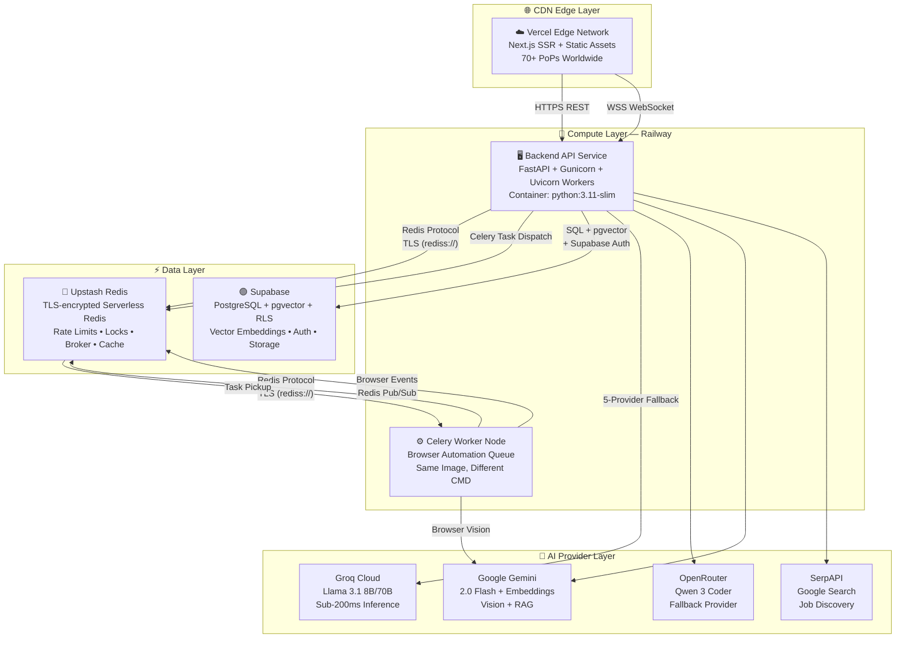
```mermaid
graph TB
    subgraph "🌐 CDN Edge Layer"
        VERCEL["☁️ Vercel Edge Network<br/>Next.js SSR + Static Assets<br/>70+ PoPs Worldwide"]
    end

    subgraph "🔧 Compute Layer — Railway"
        API["🖥️ Backend API Service<br/>FastAPI + Gunicorn + Uvicorn Workers<br/>Container: python:3.11-slim"]
        WORKER["⚙️ Celery Worker Node<br/>Browser Automation Queue<br/>Same Image, Different CMD"]
    end

    subgraph "⚡ Data Layer"
        REDIS["🔴 Upstash Redis<br/>TLS-encrypted Serverless Redis<br/>Rate Limits • Locks • Broker • Cache"]
        SUPA["🟢 Supabase<br/>PostgreSQL + pgvector + RLS<br/>Vector Embeddings • Auth • Storage"]
    end

    subgraph "🤖 AI Provider Layer"
        GROQ["Groq Cloud<br/>Llama 3.1 8B/70B<br/>Sub-200ms Inference"]
        OR["OpenRouter<br/>Qwen 3 Coder<br/>Fallback Provider"]
        GEMINI["Google Gemini<br/>2.0 Flash + Embeddings<br/>Vision + RAG"]
        SERP["SerpAPI<br/>Google Search<br/>Job Discovery"]
    end

    VERCEL -- "HTTPS REST" --> API
    VERCEL -- "WSS WebSocket" --> API
    API -- "Redis Protocol<br/>TLS (rediss://)" --> REDIS
    WORKER -- "Redis Protocol<br/>TLS (rediss://)" --> REDIS
    API -- "Celery Task Dispatch" --> REDIS
    REDIS -- "Task Pickup" --> WORKER
    API -- "SQL + pgvector<br/>+ Supabase Auth" --> SUPA
    WORKER -- "Browser Events<br/>Redis Pub/Sub" --> REDIS
    API -- "5-Provider Fallback" --> GROQ
    API --> OR
    API --> GEMINI
    API --> SERP
    WORKER -- "Browser Vision" --> GEMINI
```

---

## 🐳 Container Architecture

### Multi-Stage Docker Build — Backend

One Dockerfile. Two services. Zero bloat.

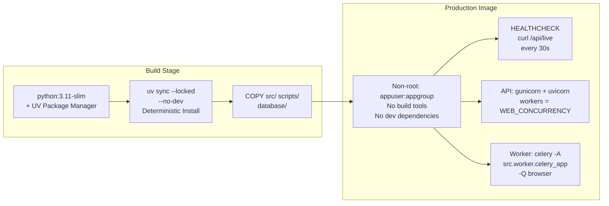
```mermaid
graph LR
    subgraph "Build Stage"
        BASE["python:3.11-slim<br/>+ UV Package Manager"]
        DEPS["uv sync --locked<br/>--no-dev<br/>Deterministic Install"]
        SRC["COPY src/ scripts/<br/>database/"]
    end

    subgraph "Production Image"
        SLIM["Non-root: appuser:appgroup<br/>No build tools<br/>No dev dependencies"]
        HEALTH["HEALTHCHECK<br/>curl /api/live<br/>every 30s"]
        CMD1["API: gunicorn + uvicorn<br/>workers = WEB_CONCURRENCY"]
        CMD2["Worker: celery -A<br/>src.worker.celery_app<br/>-Q browser"]
    end

    BASE --> DEPS --> SRC --> SLIM
    SLIM --> CMD1
    SLIM --> CMD2
    SLIM --> HEALTH
```

### Multi-Stage Docker Build — Frontend

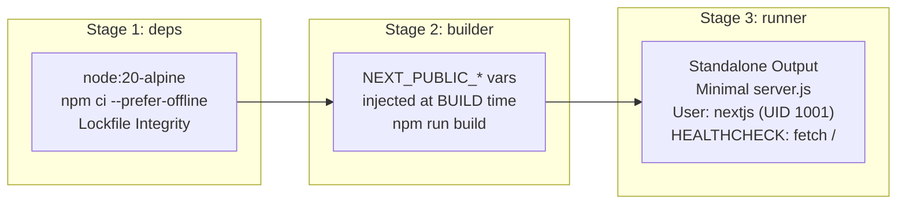
```mermaid
graph LR
    subgraph "Stage 1: deps"
        F_DEPS["node:20-alpine<br/>npm ci --prefer-offline<br/>Lockfile Integrity"]
    end

    subgraph "Stage 2: builder"
        F_BUILD["NEXT_PUBLIC_* vars<br/>injected at BUILD time<br/>npm run build"]
    end

    subgraph "Stage 3: runner"
        F_RUN["Standalone Output<br/>Minimal server.js<br/>User: nextjs (UID 1001)<br/>HEALTHCHECK: fetch /"]
    end

    F_DEPS --> F_BUILD --> F_RUN
```

---

## 🚂 Railway — Backend Deployment Architecture

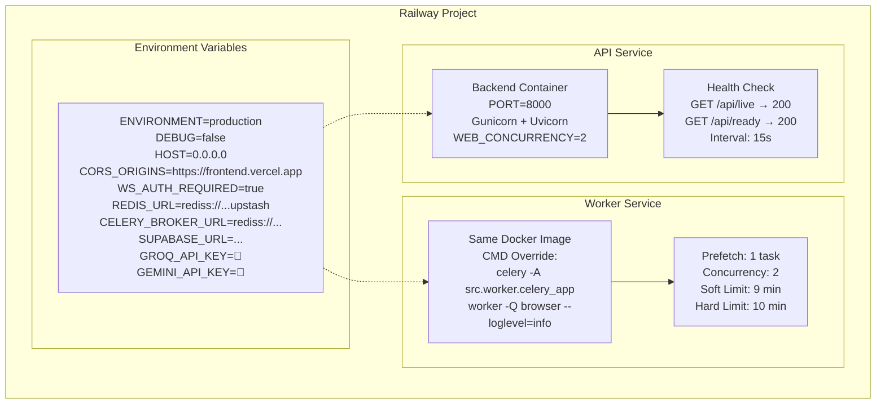
```mermaid
graph TB
    subgraph "Railway Project"
        subgraph "API Service"
            RW_API["Backend Container<br/>PORT=8000<br/>Gunicorn + Uvicorn<br/>WEB_CONCURRENCY=2"]
            RW_API_HC["Health Check<br/>GET /api/live → 200<br/>GET /api/ready → 200<br/>Interval: 15s"]
        end

        subgraph "Worker Service"
            RW_WK["Same Docker Image<br/>CMD Override:<br/>celery -A src.worker.celery_app<br/>worker -Q browser --loglevel=info"]
            RW_WK_CFG["Prefetch: 1 task<br/>Concurrency: 2<br/>Soft Limit: 9 min<br/>Hard Limit: 10 min"]
        end

        subgraph "Environment Variables"
            ENV["ENVIRONMENT=production<br/>DEBUG=false<br/>HOST=0.0.0.0<br/>CORS_ORIGINS=https://frontend.vercel.app<br/>WS_AUTH_REQUIRED=true<br/>REDIS_URL=rediss://...upstash<br/>CELERY_BROKER_URL=rediss://...<br/>SUPABASE_URL=...<br/>GROQ_API_KEY=🔐<br/>GEMINI_API_KEY=🔐"]
        end
    end

    RW_API --> RW_API_HC
    RW_WK --> RW_WK_CFG
    ENV -.-> RW_API
    ENV -.-> RW_WK
```

### Railway Service Separation Pattern

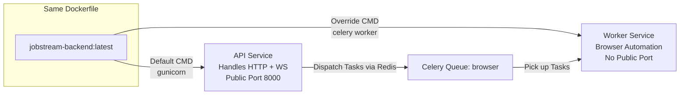
```mermaid
flowchart LR
    subgraph "Same Dockerfile"
        IMG["jobstream-backend:latest"]
    end

    IMG -->|"Default CMD<br/>gunicorn"| SVC1["API Service<br/>Handles HTTP + WS<br/>Public Port 8000"]
    IMG -->|"Override CMD<br/>celery worker"| SVC2["Worker Service<br/>Browser Automation<br/>No Public Port"]

    SVC1 -- "Dispatch Tasks via Redis" --> Q["Celery Queue: browser"]
    Q -- "Pick up Tasks" --> SVC2
```

---

## ▲ Vercel — Frontend Edge Deployment

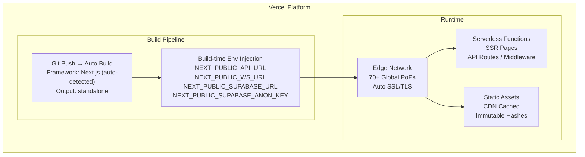
```mermaid
graph TB
    subgraph "Vercel Platform"
        subgraph "Build Pipeline"
            V_SRC["Git Push → Auto Build<br/>Framework: Next.js (auto-detected)<br/>Output: standalone"]
            V_ENV["Build-time Env Injection<br/>NEXT_PUBLIC_API_URL<br/>NEXT_PUBLIC_WS_URL<br/>NEXT_PUBLIC_SUPABASE_URL<br/>NEXT_PUBLIC_SUPABASE_ANON_KEY"]
        end

        subgraph "Runtime"
            V_EDGE["Edge Network<br/>70+ Global PoPs<br/>Auto SSL/TLS"]
            V_SSR["Serverless Functions<br/>SSR Pages<br/>API Routes / Middleware"]
            V_STATIC["Static Assets<br/>CDN Cached<br/>Immutable Hashes"]
        end
    end

    V_SRC --> V_ENV --> V_EDGE
    V_EDGE --> V_SSR
    V_EDGE --> V_STATIC
```

### Frontend → Backend Connection Architecture

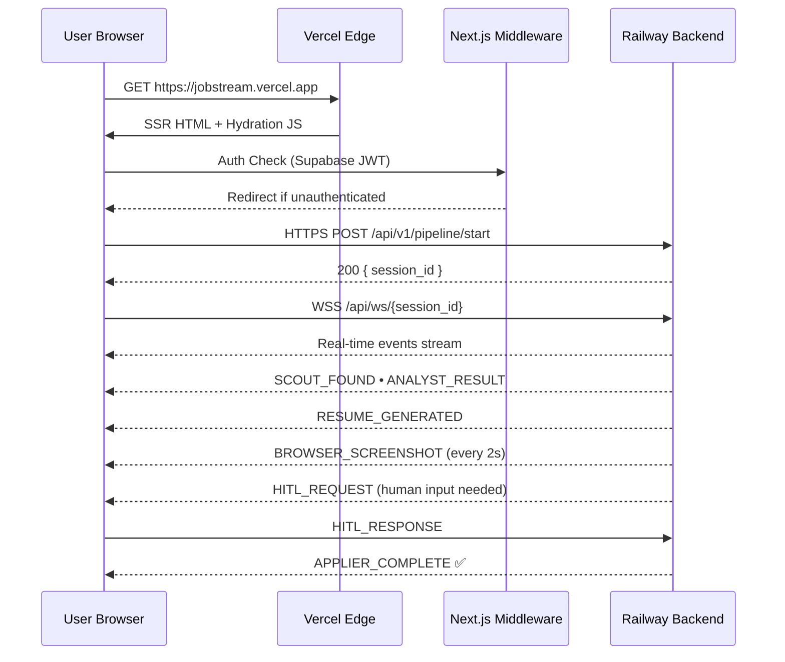
```mermaid
sequenceDiagram
    participant Browser as User Browser
    participant Vercel as Vercel Edge
    participant Middleware as Next.js Middleware
    participant Railway as Railway Backend

    Browser->>Vercel: GET https://jobstream.vercel.app
    Vercel->>Browser: SSR HTML + Hydration JS

    Browser->>Middleware: Auth Check (Supabase JWT)
    Middleware-->>Browser: Redirect if unauthenticated

    Browser->>Railway: HTTPS POST /api/v1/pipeline/start
    Railway-->>Browser: 200 { session_id }

    Browser->>Railway: WSS /api/ws/{session_id}
    Railway-->>Browser: Real-time events stream
    Railway-->>Browser: SCOUT_FOUND • ANALYST_RESULT
    Railway-->>Browser: RESUME_GENERATED
    Railway-->>Browser: BROWSER_SCREENSHOT (every 2s)
    Railway-->>Browser: HITL_REQUEST (human input needed)
    Browser->>Railway: HITL_RESPONSE
    Railway-->>Browser: APPLIER_COMPLETE ✅
```

---

## 🔴 Upstash Redis — Serverless Data Plane

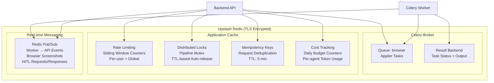
```mermaid
graph TB
    subgraph "Upstash Redis (TLS Encrypted)"
        subgraph "Celery Broker"
            Q1["Queue: browser<br/>Applier Tasks"]
            Q2["Result Backend<br/>Task Status + Output"]
        end

        subgraph "Application Cache"
            RL["Rate Limiting<br/>Sliding Window Counters<br/>Per-user + Global"]
            DL["Distributed Locks<br/>Pipeline Mutex<br/>TTL-based Auto-release"]
            IK["Idempotency Keys<br/>Request Deduplication<br/>TTL: 5 min"]
            CT["Cost Tracking<br/>Daily Budget Counters<br/>Per-agent Token Usage"]
        end

        subgraph "Real-time Messaging"
            PS["Redis Pub/Sub<br/>Worker → API Events<br/>Browser Screenshots<br/>HITL Requests/Responses"]
        end
    end

    API["Backend API"] --> Q1
    API --> RL
    API --> DL
    API --> IK
    API --> CT
    WORKER["Celery Worker"] --> Q1
    WORKER --> Q2
    WORKER --> PS
    API --> PS
```

### Redis TLS Configuration

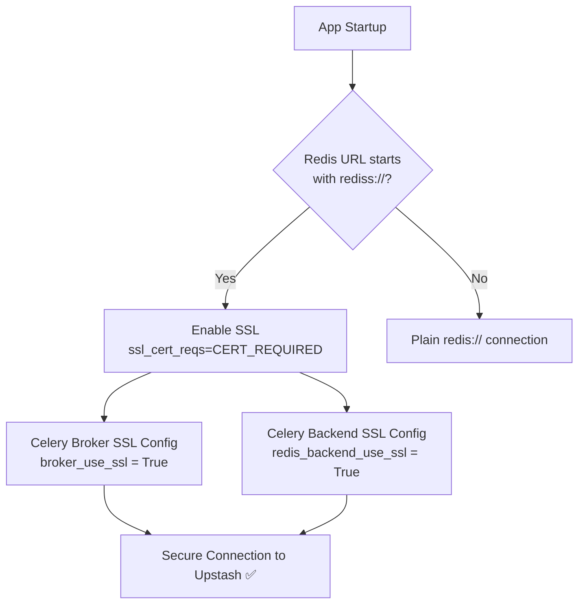
```mermaid
flowchart TD
    A["App Startup"] --> B{"Redis URL starts<br/>with rediss://?"}
    B -->|Yes| C["Enable SSL<br/>ssl_cert_reqs=CERT_REQUIRED"]
    B -->|No| D["Plain redis:// connection"]
    C --> E["Celery Broker SSL Config<br/>broker_use_ssl = True"]
    C --> F["Celery Backend SSL Config<br/>redis_backend_use_ssl = True"]
    E --> G["Secure Connection to Upstash ✅"]
    F --> G
```

---

## 🟢 Supabase — Managed PostgreSQL + pgvector

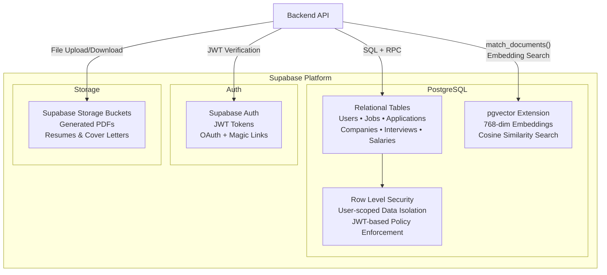
```mermaid
graph TB
    subgraph "Supabase Platform"
        subgraph "PostgreSQL"
            DB["Relational Tables<br/>Users • Jobs • Applications<br/>Companies • Interviews • Salaries"]
            RLS["Row Level Security<br/>User-scoped Data Isolation<br/>JWT-based Policy Enforcement"]
            PGV["pgvector Extension<br/>768-dim Embeddings<br/>Cosine Similarity Search"]
        end

        subgraph "Auth"
            AUTH["Supabase Auth<br/>JWT Tokens<br/>OAuth + Magic Links"]
        end

        subgraph "Storage"
            STOR["Supabase Storage Buckets<br/>Generated PDFs<br/>Resumes & Cover Letters"]
        end
    end

    API["Backend API"] -- "SQL + RPC" --> DB
    API -- "match_documents()<br/>Embedding Search" --> PGV
    API -- "JWT Verification" --> AUTH
    API -- "File Upload/Download" --> STOR
    DB --> RLS
```

---

## 🔄 CI/CD & Docker Hub Release Pipeline

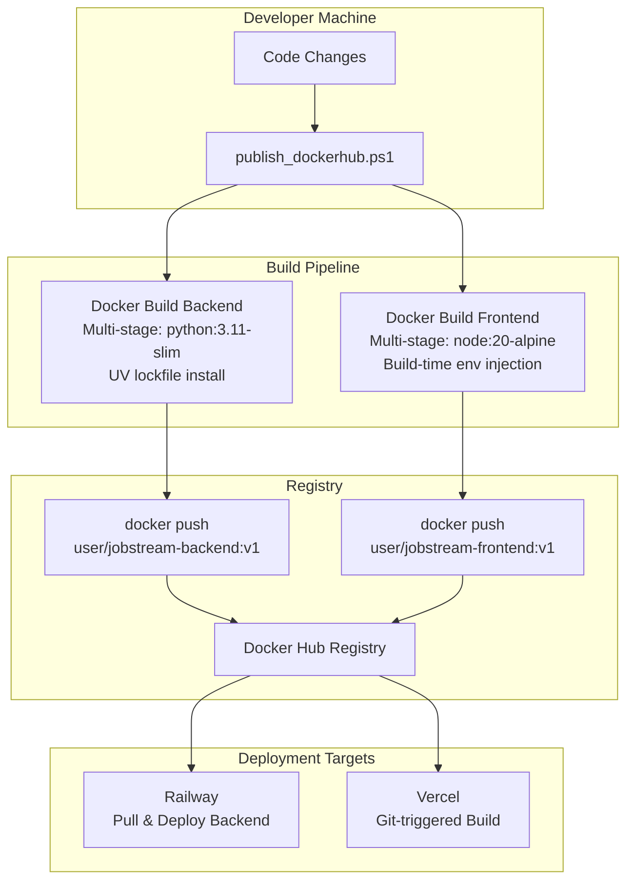
```mermaid
flowchart TD
    subgraph "Developer Machine"
        DEV["Code Changes"] --> BUILD["publish_dockerhub.ps1"]
    end

    subgraph "Build Pipeline"
        BUILD --> BB["Docker Build Backend<br/>Multi-stage: python:3.11-slim<br/>UV lockfile install"]
        BUILD --> BF["Docker Build Frontend<br/>Multi-stage: node:20-alpine<br/>Build-time env injection"]
    end

    subgraph "Registry"
        BB --> PUSH_B["docker push<br/>user/jobstream-backend:v1"]
        BF --> PUSH_F["docker push<br/>user/jobstream-frontend:v1"]
        PUSH_B --> HUB["Docker Hub Registry"]
        PUSH_F --> HUB
    end

    subgraph "Deployment Targets"
        HUB --> RW["Railway<br/>Pull & Deploy Backend"]
        HUB --> VER["Vercel<br/>Git-triggered Build"]
    end
```

---

## 🛡️ Production Security Architecture

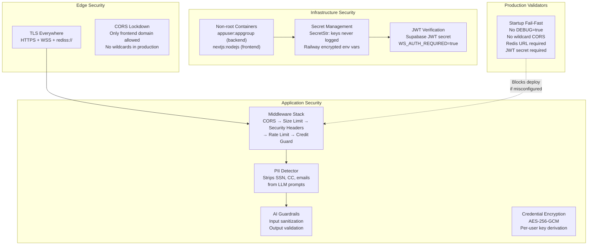
```mermaid
graph TB
    subgraph "Edge Security"
        TLS["TLS Everywhere<br/>HTTPS + WSS + rediss://"]
        CORS["CORS Lockdown<br/>Only frontend domain allowed<br/>No wildcards in production"]
    end

    subgraph "Application Security"
        MW["Middleware Stack<br/>CORS → Size Limit → Security Headers<br/>→ Rate Limit → Credit Guard"]
        PII["PII Detector<br/>Strips SSN, CC, emails<br/>from LLM prompts"]
        GRD["AI Guardrails<br/>Input sanitization<br/>Output validation"]
        CRED["Credential Encryption<br/>AES-256-GCM<br/>Per-user key derivation"]
    end

    subgraph "Infrastructure Security"
        NR["Non-root Containers<br/>appuser:appgroup (backend)<br/>nextjs:nodejs (frontend)"]
        SEC["Secret Management<br/>SecretStr: keys never logged<br/>Railway encrypted env vars"]
        JWT["JWT Verification<br/>Supabase JWT secret<br/>WS_AUTH_REQUIRED=true"]
    end

    subgraph "Production Validators"
        PV["Startup Fail-Fast<br/>No DEBUG=true<br/>No wildcard CORS<br/>Redis URL required<br/>JWT secret required"]
    end

    TLS --> MW
    MW --> PII --> GRD
    NR --> SEC --> JWT
    PV -.->|"Blocks deploy<br/>if misconfigured"| MW
```

---

## 🔥 Resilience Patterns (Production-Grade)

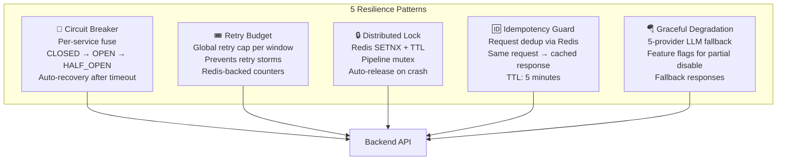
```mermaid
graph TB
    subgraph "5 Resilience Patterns"
        CB["🔌 Circuit Breaker<br/>Per-service fuse<br/>CLOSED → OPEN → HALF_OPEN<br/>Auto-recovery after timeout"]
        RB["🎟️ Retry Budget<br/>Global retry cap per window<br/>Prevents retry storms<br/>Redis-backed counters"]
        DL["🔒 Distributed Lock<br/>Redis SETNX + TTL<br/>Pipeline mutex<br/>Auto-release on crash"]
        IK["🆔 Idempotency Guard<br/>Request dedup via Redis<br/>Same request → cached response<br/>TTL: 5 minutes"]
        GD["🪂 Graceful Degradation<br/>5-provider LLM fallback<br/>Feature flags for partial disable<br/>Fallback responses"]
    end

    CB --> API["Backend API"]
    RB --> API
    DL --> API
    IK --> API
    GD --> API
```

---

## 📡 Real-Time Event Flow (Production)

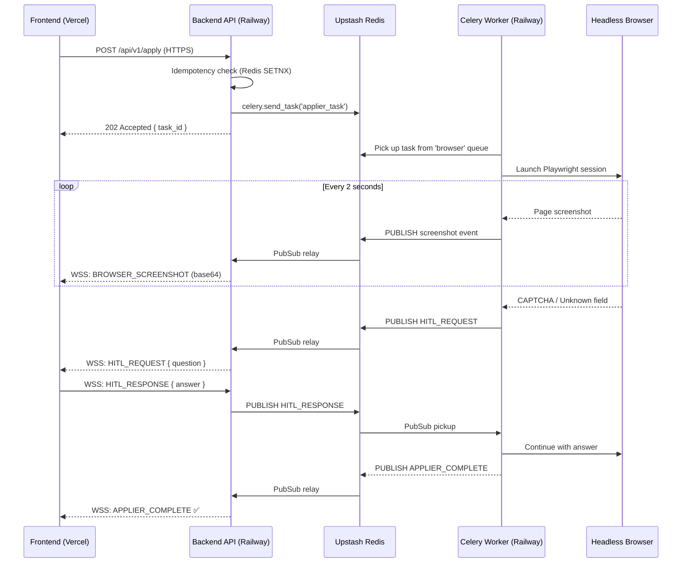
```mermaid
sequenceDiagram
    participant FE as Frontend (Vercel)
    participant API as Backend API (Railway)
    participant Redis as Upstash Redis
    participant Worker as Celery Worker (Railway)
    participant Browser as Headless Browser

    FE->>API: POST /api/v1/apply (HTTPS)
    API->>API: Idempotency check (Redis SETNX)
    API->>Redis: celery.send_task('applier_task')
    API-->>FE: 202 Accepted { task_id }

    Worker->>Redis: Pick up task from 'browser' queue
    Worker->>Browser: Launch Playwright session
    
    loop Every 2 seconds
        Browser-->>Worker: Page screenshot
        Worker->>Redis: PUBLISH screenshot event
        Redis->>API: PubSub relay
        API-->>FE: WSS: BROWSER_SCREENSHOT (base64)
    end

    Browser-->>Worker: CAPTCHA / Unknown field
    Worker->>Redis: PUBLISH HITL_REQUEST
    Redis->>API: PubSub relay
    API-->>FE: WSS: HITL_REQUEST { question }
    FE->>API: WSS: HITL_RESPONSE { answer }
    API->>Redis: PUBLISH HITL_RESPONSE
    Redis->>Worker: PubSub pickup
    Worker->>Browser: Continue with answer

    Worker-->>Redis: PUBLISH APPLIER_COMPLETE
    Redis->>API: PubSub relay
    API-->>FE: WSS: APPLIER_COMPLETE ✅
```

---

## 🏥 Health Check Architecture

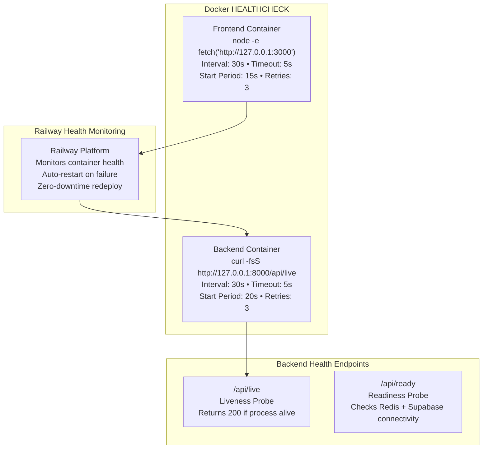
```mermaid
flowchart TD
    subgraph "Backend Health Endpoints"
        LIVE["/api/live<br/>Liveness Probe<br/>Returns 200 if process alive"]
        READY["/api/ready<br/>Readiness Probe<br/>Checks Redis + Supabase connectivity"]
    end

    subgraph "Docker HEALTHCHECK"
        DH_B["Backend Container<br/>curl -fsS http://127.0.0.1:8000/api/live<br/>Interval: 30s • Timeout: 5s<br/>Start Period: 20s • Retries: 3"]
        DH_F["Frontend Container<br/>node -e fetch('http://127.0.0.1:3000')<br/>Interval: 30s • Timeout: 5s<br/>Start Period: 15s • Retries: 3"]
    end

    subgraph "Railway Health Monitoring"
        RW_HC["Railway Platform<br/>Monitors container health<br/>Auto-restart on failure<br/>Zero-downtime redeploy"]
    end

    DH_B --> LIVE
    DH_F --> RW_HC
    RW_HC --> DH_B
```

---

## 📊 Deployment Cost Optimization

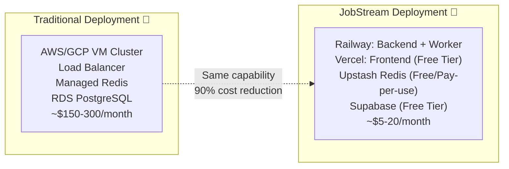
```mermaid
graph LR
    subgraph "Traditional Deployment 💸"
        TRAD["AWS/GCP VM Cluster<br/>Load Balancer<br/>Managed Redis<br/>RDS PostgreSQL<br/>~$150-300/month"]
    end

    subgraph "JobStream Deployment 🎯"
        JS["Railway: Backend + Worker<br/>Vercel: Frontend (Free Tier)<br/>Upstash Redis (Free/Pay-per-use)<br/>Supabase (Free Tier)<br/>~$5-20/month"]
    end

    TRAD -.->|"Same capability<br/>90% cost reduction"| JS
```

---

## 🔀 Request Routing & Load Path

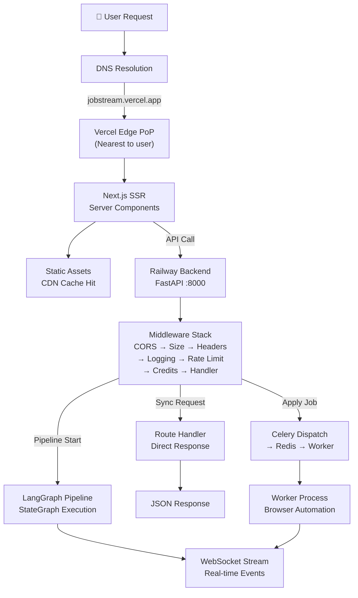
```mermaid
flowchart TD
    USER["👤 User Request"] --> DNS["DNS Resolution"]
    
    DNS -->|"jobstream.vercel.app"| VEDGE["Vercel Edge PoP<br/>(Nearest to user)"]
    VEDGE --> SSR["Next.js SSR<br/>Server Components"]
    SSR --> STATIC["Static Assets<br/>CDN Cache Hit"]
    
    SSR -->|"API Call"| RAPI["Railway Backend<br/>FastAPI :8000"]
    
    RAPI --> MWSTACK["Middleware Stack<br/>CORS → Size → Headers<br/>→ Logging → Rate Limit<br/>→ Credits → Handler"]
    
    MWSTACK -->|"Sync Request"| HANDLER["Route Handler<br/>Direct Response"]
    MWSTACK -->|"Pipeline Start"| GRAPH["LangGraph Pipeline<br/>StateGraph Execution"]
    MWSTACK -->|"Apply Job"| CELERY["Celery Dispatch<br/>→ Redis → Worker"]
    
    HANDLER --> RESP["JSON Response"]
    GRAPH --> WS["WebSocket Stream<br/>Real-time Events"]
    CELERY --> WORKER["Worker Process<br/>Browser Automation"]
    WORKER --> WS
```

---

## 🗂️ Environment Variable Flow

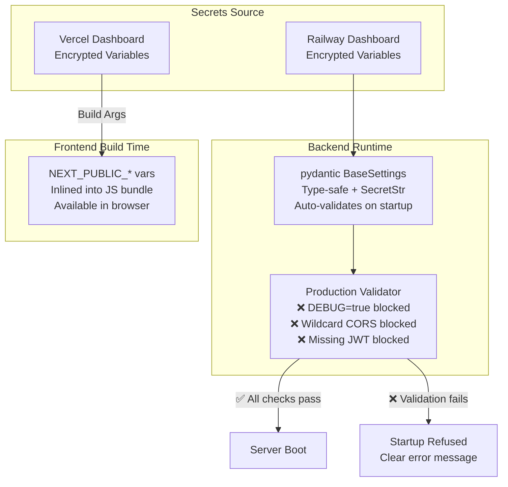
```mermaid
flowchart TD
    subgraph "Secrets Source"
        RW_ENV["Railway Dashboard<br/>Encrypted Variables"]
        VER_ENV["Vercel Dashboard<br/>Encrypted Variables"]
    end

    subgraph "Backend Runtime"
        BE_CFG["pydantic BaseSettings<br/>Type-safe + SecretStr<br/>Auto-validates on startup"]
        BE_VAL["Production Validator<br/>❌ DEBUG=true blocked<br/>❌ Wildcard CORS blocked<br/>❌ Missing JWT blocked"]
    end

    subgraph "Frontend Build Time"
        FE_INJ["NEXT_PUBLIC_* vars<br/>Inlined into JS bundle<br/>Available in browser"]
    end

    RW_ENV --> BE_CFG --> BE_VAL
    VER_ENV -->|"Build Args"| FE_INJ

    BE_VAL -->|"✅ All checks pass"| BOOT["Server Boot"]
    BE_VAL -->|"❌ Validation fails"| CRASH["Startup Refused<br/>Clear error message"]
```

---

## 🐋 Docker Hub Distribution

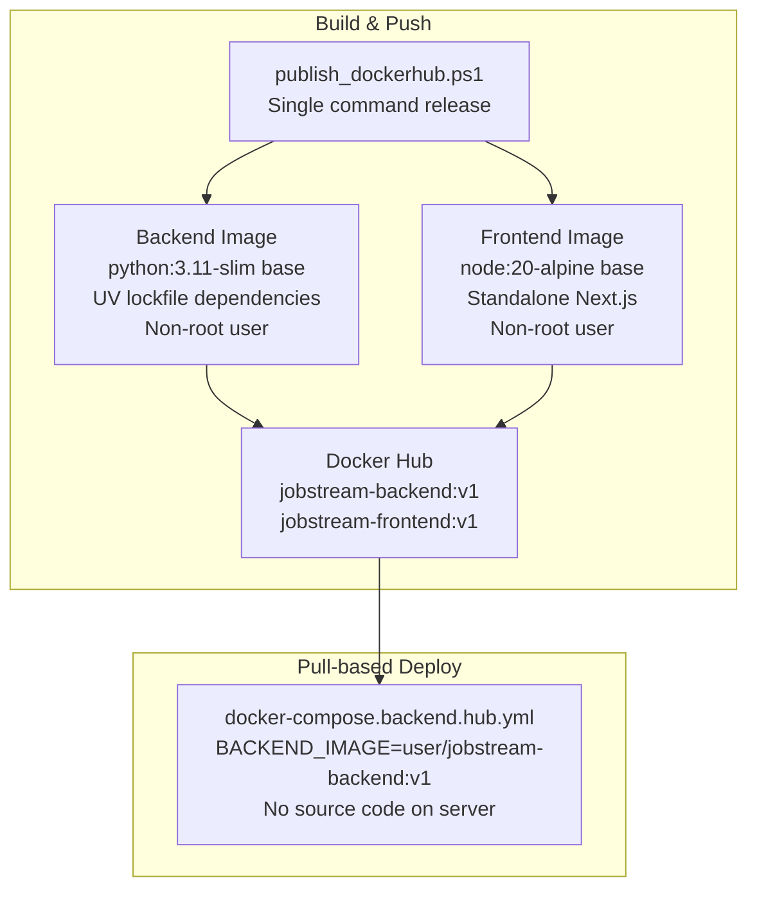
```mermaid
graph TB
    subgraph "Build & Push"
        PS["publish_dockerhub.ps1<br/>Single command release"]
        PS --> B_IMG["Backend Image<br/>python:3.11-slim base<br/>UV lockfile dependencies<br/>Non-root user"]
        PS --> F_IMG["Frontend Image<br/>node:20-alpine base<br/>Standalone Next.js<br/>Non-root user"]
        B_IMG --> HUB["Docker Hub<br/>jobstream-backend:v1<br/>jobstream-frontend:v1"]
        F_IMG --> HUB
    end

    subgraph "Pull-based Deploy"
        HUB --> PULL["docker-compose.backend.hub.yml<br/>BACKEND_IMAGE=user/jobstream-backend:v1<br/>No source code on server"]
    end
```

---

## 🌊 Complete System Flow — Production

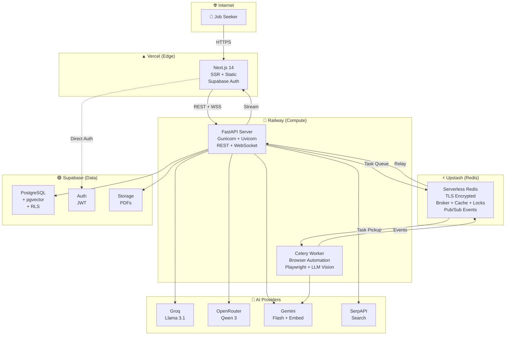
```mermaid
graph TB
    subgraph "🌐 Internet"
        USER["👤 Job Seeker"]
    end

    subgraph "▲ Vercel (Edge)"
        FE["Next.js 14<br/>SSR + Static<br/>Supabase Auth"]
    end

    subgraph "🚂 Railway (Compute)"
        API["FastAPI Server<br/>Gunicorn + Uvicorn<br/>REST + WebSocket"]
        WK["Celery Worker<br/>Browser Automation<br/>Playwright + LLM Vision"]
    end

    subgraph "⚡ Upstash (Redis)"
        RD["Serverless Redis<br/>TLS Encrypted<br/>Broker + Cache + Locks<br/>Pub/Sub Events"]
    end

    subgraph "🟢 Supabase (Data)"
        PG["PostgreSQL<br/>+ pgvector<br/>+ RLS"]
        AU["Auth<br/>JWT"]
        ST["Storage<br/>PDFs"]
    end

    subgraph "🤖 AI Providers"
        G["Groq<br/>Llama 3.1"]
        O["OpenRouter<br/>Qwen 3"]
        GM["Gemini<br/>Flash + Embed"]
        S["SerpAPI<br/>Search"]
    end

    USER -->|"HTTPS"| FE
    FE -->|"REST + WSS"| API
    FE -.->|"Direct Auth"| AU
    API -->|"Task Queue"| RD
    RD -->|"Task Pickup"| WK
    WK -->|"Events"| RD
    RD -->|"Relay"| API
    API -->|"Stream"| FE
    API --> PG
    API --> ST
    API --> G
    API --> O
    API --> GM
    API --> S
    WK --> GM
```

---

## TL;DR — Why This Architecture Wins

| Deployment Decision | Why It's Smart |
|---|---|
| **Railway for Backend** | Container-native PaaS, zero Docker config, auto-SSL, private networking, pay-per-use |
| **Separate Worker Node** | Browser automation is heavy + blocking — isolated from API latency |
| **Vercel for Frontend** | Edge SSR, global CDN, zero-config Next.js, git-push deploys |
| **Upstash Redis** | Serverless pricing, TLS by default, REST + Redis protocol, per-request billing |
| **Supabase as DB** | PostgreSQL + pgvector + Auth + Storage in one service — no separate auth server |
| **One Dockerfile, Two Services** | Backend API and Worker share the same image, different CMD — no image sprawl |
| **Docker Hub Distribution** | Single `publish_dockerhub.ps1` builds + pushes both images — portable deploys anywhere |
| **Non-root Containers** | `appuser` (backend) + `nextjs` (frontend) — zero privilege escalation surface |
| **Fail-fast Validators** | Misconfigured production env? App refuses to start. No silent failures. |
| **5 Resilience Patterns** | Circuit breaker + retry budget + distributed lock + idempotency + graceful degradation |

---

*Built for production. Designed for scale. Deployed for pennies.*
