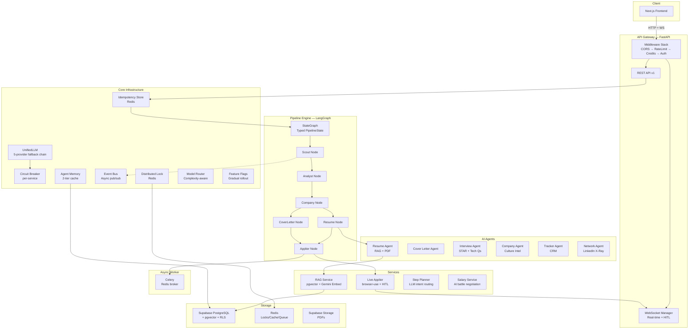
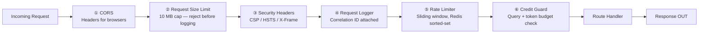
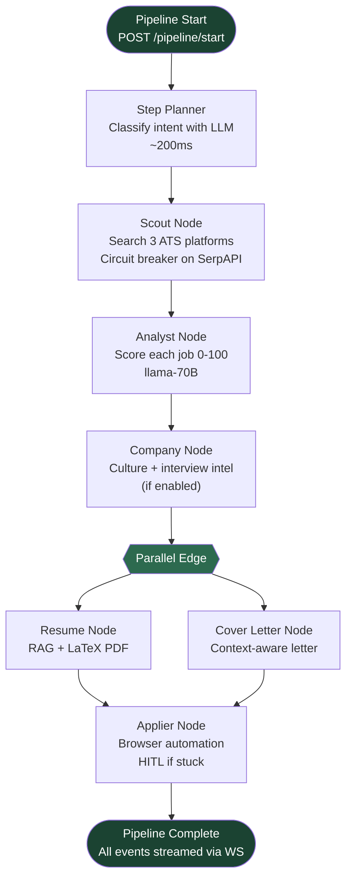
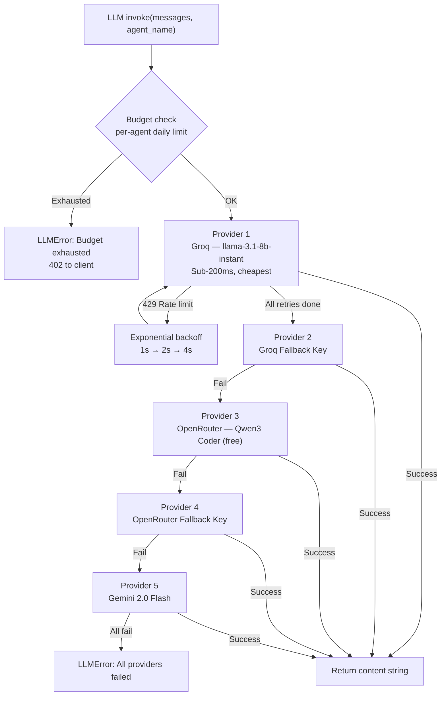
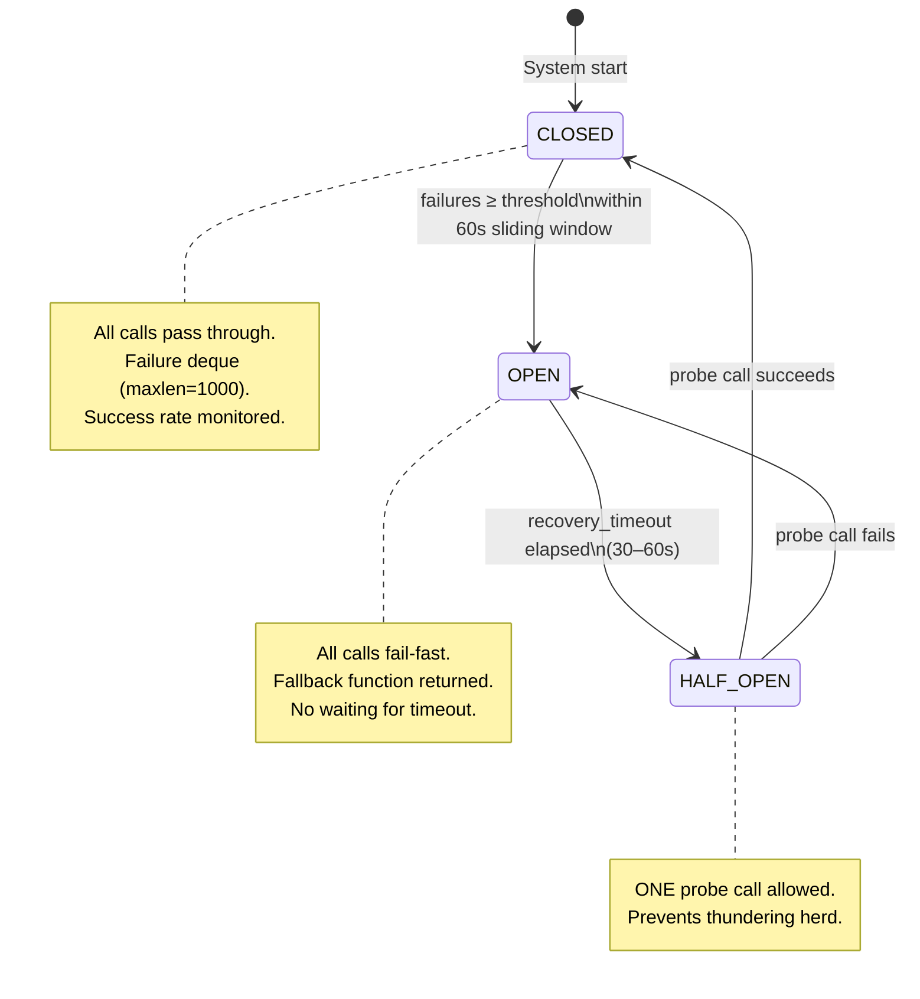
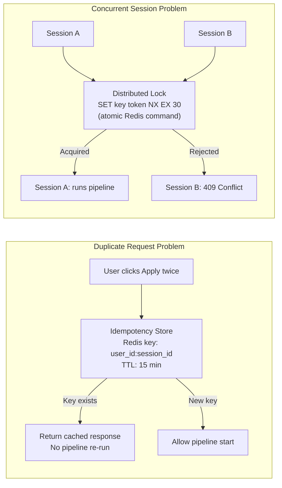
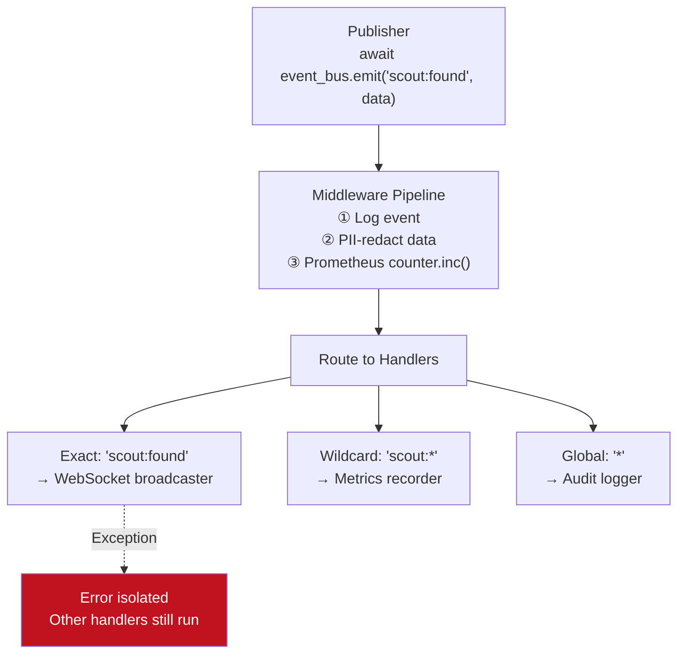
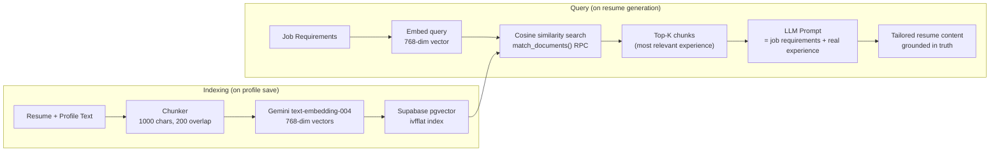
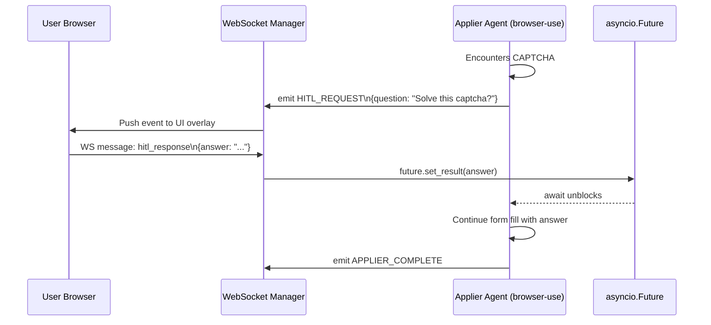
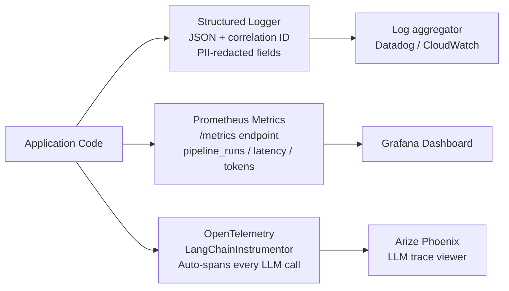

# 🏗️ Day 3 — System Design Deep Dive
## JobStream: How to Architect a Production AI Platform That Actually Survives the Real World

> *"Anyone can build a demo. Very few can build a system that stays alive at 3 AM when Groq rate-limits, Redis hiccups, and two users accidentally double-click Apply at the same time."*

---

## 📐 The Big Picture — What We're Even Solving

JobStream is not a chatbot with a resume button. It's a **distributed, event-driven, multi-agent orchestration platform** built on these core constraints:

| Constraint | Reality |
|---|---|
| AI providers fail and rate-limit | We use 5 different LLM providers |
| Browser automation blocks | Celery isolates it in a dedicated process |
| Duplicate requests from UI | Idempotency guard rejects dupes |
| Concurrent sessions corrupt state | Distributed lock (Redis) prevents it |
| LLMs hallucinate bad JSON | 4-step repair pipeline before parse |
| Users submit private data | PII redaction before any log write |
| Costs spiral without control | Per-agent daily budget + credit middleware |

---

## 1️⃣ Overall System Architecture

**Key insight:** Every layer has a fallback. Every failure is isolated. The pipeline keeps running even when individual providers die.

---

## 2️⃣ The Middleware Onion

Order is everything. Wrong order = security holes or wasted CPU.

> **Why sliding-window rate limiting?** Fixed-window counters allow burst attacks at window edges. Sorted sets give a *true* sliding window — 100 reqs/min means 100 per any rolling 60-second window, not reset at :00 every minute.

---

## 3️⃣ LangGraph Pipeline — DAG Execution with Typed State

Every pipeline stage is an independent **async node** reading from and writing to a shared typed `PipelineState`. Edges can be conditional. Nodes can run in parallel.

**Why LangGraph over vanilla LangChain chains?**
- Typed state — `PipelineState` is a Pydantic model, so type errors surface at compile time, not runtime
- Conditional edges — skip expensive nodes based on user intent
- Parallel nodes — Resume and Cover Letter run **simultaneously**, not sequentially
- Checkpointing — state can be persisted mid-pipeline for restart without rerunning completed nodes

---

## 4️⃣ The 5-Provider LLM Fallback Chain

> **Model Router** picks the tier *before* hitting the chain: 8B for fast classification, 70B for deep analysis, Gemini when vision is needed. Cost-aware from the start.

---

## 5️⃣ Circuit Breaker — Three-State Resilience

Named per-service. A failure at SerpAPI doesn't cascade to your LLM or Supabase.

| Service | Failure Threshold | Recovery |
|---|---|---|
| `groq` | 5 failures | 60s |
| `serpapi` | 3 failures | 30s |
| `gemini` | 3 failures | 30s |
| `supabase` | 5 failures | 60s |

---

## 6️⃣ Distributed Lock + Idempotency — Preventing Chaos at Scale

Two separate weapons against the "what if two things happen at the same time" problem.

> **Why Lua for lock release?** A `GET` + `DEL` across two commands has a race condition — another process could steal the lock between them. Lua executes atomically inside Redis. *This is standard Redlock pattern implementation.*

---

## 7️⃣ Event Bus — Async Pub/Sub Without Kafka

An in-process pub/sub that decouples the entire system. Agents don't know who's listening — they just emit events.

> **No Kafka needed** at single-server scale. Zero serialization overhead. Handler crashes are isolated — one broken subscriber can't take down the pipeline.

---

## 8️⃣ RAG Service — Grounded AI, No Hallucination

> **Why 1000-char chunks with 200 overlap?** Fits multiple chunks in a 4K context window. Overlap prevents important content from being split at chunk boundaries — a skill at end of chunk A, its description at start of chunk B, would otherwise be lost.

---

## 9️⃣ Human-in-the-Loop (HITL) — Real-Time WebSocket Bridge

The browser automation agent can pause mid-form-fill and ask the user a question. The answer travels back through WebSocket → Future → browser agent. All in real time.

> **Why asyncio.Future instead of polling?** No wasted CPU in a loop. The coroutine sleeps until the user responds. The Future is the exact primitive for "wait for an external event" in Python asyncio.

---

## 🔟 Observability Stack — You Can't Fix What You Can't See

> **One line. Entire codebase.** `LangChainInstrumentor().instrument()` — no manual span code needed anywhere. Every LLM call, chain step, and agent execution gets a trace automatically.

---

## 🔑 System Design Concepts Used — At a Glance

| Concept | Pattern | Where Used |
|---|---|---|
| **DAG Orchestration** | LangGraph StateGraph | Pipeline execution |
| **5-Provider Fallback** | Circuit Breaker + Retry | UnifiedLLM |
| **Pub/Sub Event Bus** | In-process Mediator | Agent communication |
| **Distributed Lock** | Redis SET NX + Lua | Concurrent session protection |
| **Idempotency** | Redis key + TTL | Duplicate request prevention |
| **RAG** | Embedding + Vector Search | Resume/Cover Letter grounding |
| **HITL** | WebSocket + asyncio.Future | Browser automation pausing |
| **Sliding Window Rate Limit** | Redis Sorted Sets | API protection |
| **DI Container** | Service Locator (Singleton/Factory) | Dependency management |
| **Feature Flags** | SHA256 deterministic bucketing | Gradual rollout |
| **Model Routing** | Complexity-aware selector | Cost optimization |
| **PII Redaction** | Regex + confidence threshold | GDPR compliance |
| **2-tier Agent Memory** | Redis (hot) + Supabase (cold) | Personalization |
| **Async Task Queue** | Celery + Redis | Browser process isolation |
| **Graceful Degradation** | Try/except at every boundary | Memory, guardrails, locks |
| **OpenTelemetry Tracing** | Auto-instrumentation | LLM observability |
| **Structured Logging** | ContextVar async propagation | Correlation across async tree |

---

## 🧮 Numbers That Matter

| Metric | Value |
|---|---|
| LLM providers in fallback chain | 5 |
| Middleware layers before route handler | 6 |
| Pipeline nodes (async) | 6 |
| Parallel nodes (Resume + Cover Letter) | 2 |
| Vector embedding dimensions | 768 |
| Circuit breaker recovery window | 30–60s |
| Idempotency TTL | 15 minutes |
| Rate limit window | 60s sliding |
| Daily credit budget (queries) | 200 per user |
| Max applier steps (browser agent) | 30 |

---

*Day 1 → Project Overview · Day 2 → AI Architecture · **Day 3 → System Design** · Day 4 → Deployment*
