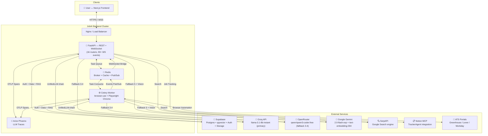
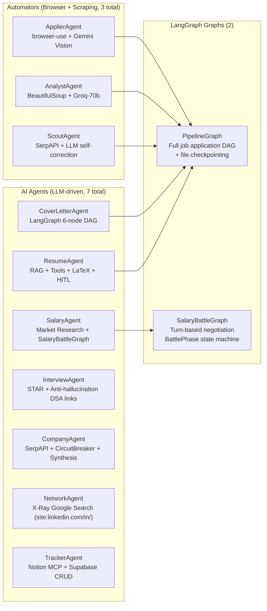
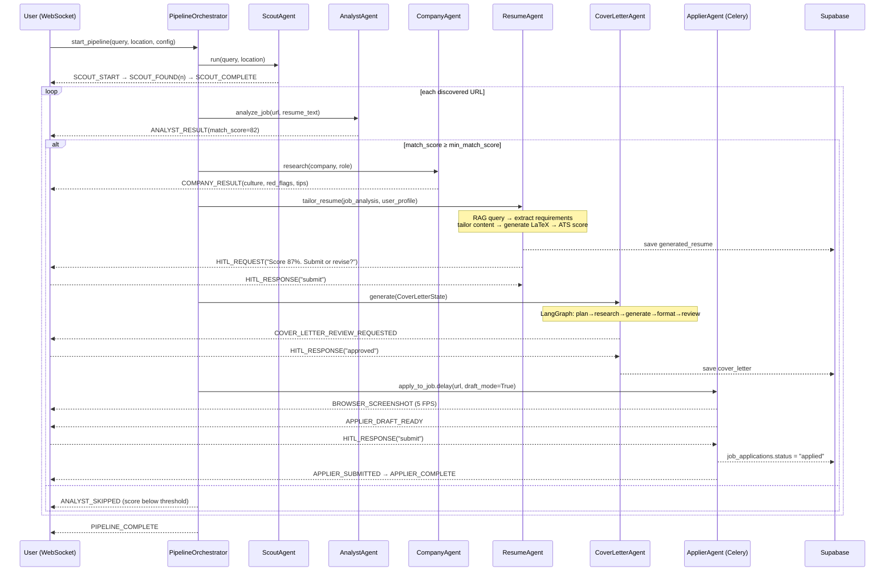
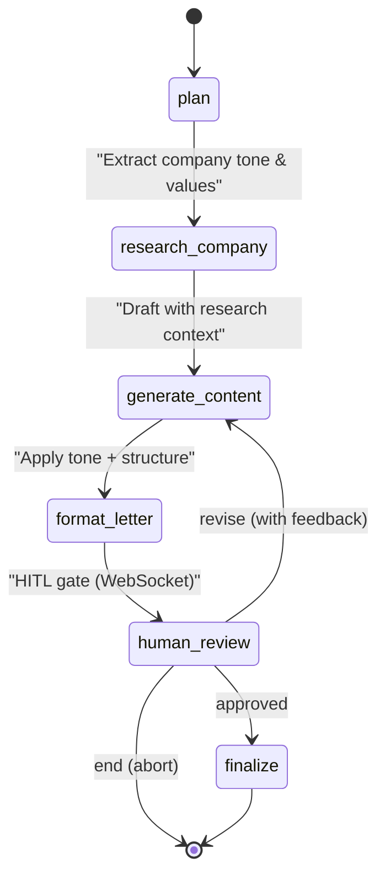
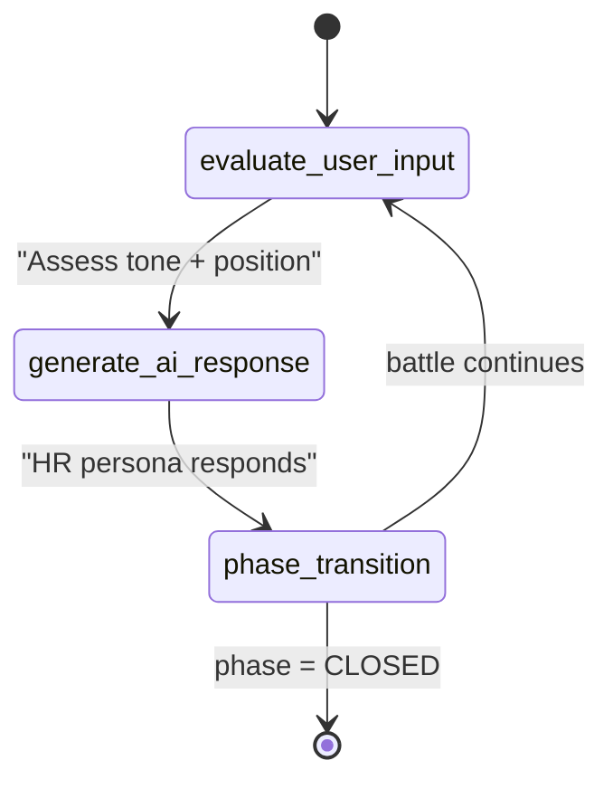
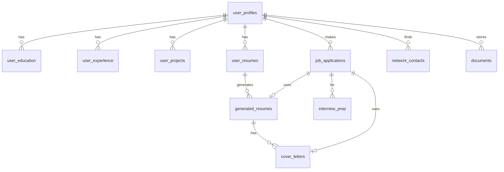

# Master Architecture Documentation & Architecture Bible

**Project:** JobAI — Autonomous Career Assistant  
**Role:** Senior Principal Software Architect  
**Version:** 3.0.0 (Production Ready)  
**Date:** 2026-07-10  
**Status:** Reflects actual codebase as-implemented

---

## 1. System Overview & Design Philosophy

### 1.1 Architecture Classification

JobAI is a **production-grade, event-driven agentic platform** using a "Microservices-ready Monolith" pattern:
- Single deployable FastAPI process for REST + WebSocket
- Isolated Celery worker process for browser automation (browser-use + Playwright Chrome)
- Shared Redis broker for task queue + pub/sub event bridge
- PostgreSQL (Supabase) with pgvector for structured data + RAG

**Key architectural innovations over typical AI apps:**

| Concern | Typical AI App | JobAI Implementation |
|---|---|---|
| Browser automation | Playwright + CSS selectors | **browser-use** 0.11.2 — AI-native vision + reasoning |
| LLM resilience | Single provider | **5-deep fallback chain:** Groq→OpenRouter→Gemini→Mistral |
| AI safety | None | **GuardrailPipeline** — 6 injection categories, 3 preset levels |
| PII handling | None | **PIIDetector** — auto-redaction in all log outputs |
| Agent coordination | Direct calls | **AgentProtocol** + **EventBus** (wildcard pub/sub) |
| Retries | Simple decorator | **RetryBudget** — sliding window storm prevention |
| Agent memory | Stateless | **AgentMemory** — 2-tier: in-memory cache + Supabase |
| Workflow control | Linear chains | **LangGraph StateGraph** — DAG with HITL conditional edges |
| Eval framework | Manual testing | **LLM-as-Judge** eval runner with suite parallelism |

### 1.2 Tech Stack — Justified Choices

| Technology | Version | Role | Justification |
|---|---|---|---|
| **FastAPI** | 0.128.0 | API + WebSocket gateway | Native `async/await`, Pydantic v2, ASGI lifespan hooks |
| **Python** | 3.11 | Core language | 60% perf vs 3.10; de-facto AI/ML standard |
| **LangChain** | 1.2.6 | LLM orchestration | Provider-agnostic; extensive tool ecosystem |
| **LangGraph** | 1.0.6 | Stateful agent DAGs | `StateGraph` + `MemorySaver` for HITL iterative workflows |
| **browser-use** | 0.11.2 | AI browser automation | Vision + reasoning over forms — no fragile CSS selectors |
| **Playwright** | 1.57.0 | Browser engine | SPA support (Greenhouse, Lever, Ashby, Workday) |
| **Supabase** | 2.27.2 | Postgres + Auth + Storage | Built-in RLS, JWKS JWT, pgvector, Object Storage |
| **pgvector** | — | Vector store | 768-dim Gemini text-embedding-004, co-located with data |
| **Redis** | 7-alpine | Broker + Cache + Pub/Sub | Celery broker + rate limiting + WebSocket event bridge |
| **Celery** | ≥5.3.0 | Background tasks | `pool=solo` (Windows) for Playwright async subprocess |
| **Groq LPU** | — | Primary LLM | 10x latency vs GPU inference; llama-3.1-8b-instant |
| **Gemini 2.0 Flash** | — | Vision LLM | browser-use form interpretation, 768-dim embeddings |
| **SerpAPI** | — | Web search | Scout discovery, CompanyAgent research, NetworkAgent X-Ray |
| **OpenTelemetry + Arize Phoenix** | — | LLM tracing | Span-level prompt/completion observability |

---

## 2. System Context Diagram



---

## 3. Application Lifecycle & DI Container

### 3.1 Phase-Ordered Startup (`src/main.py`)

```
Phase 1 — Core Infrastructure (always)
  EventBus()                       # wildcard pub/sub, middleware, bounded history
  PIIDetector()                    # regex PII detection + redact()
  create_input_pipeline("medium")  # GuardrailPipeline instance
  AgentMemory(supabase_client)     # 2-tier memory (cache + DB)
  CostTracker()                    # per-invocation token/USD tracking
  StructuredLogger(pii_detector)   # JSON logs with auto PII redaction
  RetryBudget()                    # 3-rule sliding-window storm prevention
  AgentProtocol()                  # inter-agent INFORM/REQUEST/DELEGATE/FEEDBACK

Phase 2 — Observability (config-gated)
  if PHOENIX_COLLECTOR_ENDPOINT:
    TracerProvider → BatchSpanProcessor(OTLPSpanExporter)
    LangChainInstrumentor().instrument()   # auto-instruments all LLM calls

Phase 3 — Ready Signal
  await event_bus.emit("system:startup", {...})

─── Application Running ───

Shutdown — Graceful Drain
  1. Close all WebSocket connections (close code 1001 = Going Away)
  2. await event_bus.emit("system:shutdown", {})
  3. await cache.redis.close()
  4. await limiter.redis.close()
```

### 3.2 Windows Platform Fix

```python
# Required for browser-use subprocess support on Windows
# Without this, Playwright Chrome spawning raises NotImplementedError
if sys.platform == "win32":
    asyncio.set_event_loop_policy(asyncio.WindowsProactorEventLoopPolicy())
```

---

## 4. The Multi-Agent Swarm

### 4.1 Agent Roster



### 4.2 LLM Assignment per Agent

| Agent | LLM | Temp | Why |
|---|---|---|---|
| ResumeAgent | Groq llama-3.1-8b | 0.3 | Fast structured output for ATS analysis |
| CoverLetterAgent | Groq llama-3.3-70b | 0.6 | Higher creativity, better writing quality |
| SalaryAgent | Groq llama-3.1-8b | 0.3 | Consistent percentile calculations |
| InterviewAgent | Groq llama-3.1-8b | 0.3 | Deterministic question generation |
| CompanyAgent | Groq llama-3.1-8b | 0.3 | Reliable structured research output |
| NetworkAgent | Groq llama-3.1-8b | 0.7 | Creative outreach message personalization |
| AnalystAgent | Groq llama-3.3-70b | 0.0 | Maximum accuracy for job matching |
| ApplierAgent | Gemini 2.0 Flash | — | Vision for form interpretation |

### 4.3 Full Pipeline Sequence



---

## 5. LangGraph State Machines

### 5.1 CoverLetterAgent — 6-Node DAG with HITL



**State:** `CoverLetterState` TypedDict — `plan`, `company_research`, `content`, `full_text`, `human_approved`, `human_feedback`, `needs_human_review`, `tone`.

**Checkpointing:** `MemorySaver` allows resume-from-checkpoint after HITL 120s timeout.

### 5.2 SalaryBattleGraph — Turn-Based Negotiation



**BattlePhase progression:**
`opening → counter → objection_handling → final_offer → closed`

Each WebSocket user turn → one `graph.astep()` → AI HR persona response → `SALARY_BATTLE_*` events.

**State:** `SalaryBattleState` Pydantic model — `user_offer`, `company_offer`, `turn_count`, `phase`, `negotiation_history[]`, `user_leverage`, `final_outcome`.

### 5.3 PipelineGraph — File-Based Checkpointing

- Checkpoints at `data/checkpoints/{session_id}.json`
- `NodeStatus` enum: PENDING → RUNNING → COMPLETED | FAILED | SKIPPED
- Stoppable: `stop_flag` checked between every node
- Conditional edge: `should_apply` (skips applier if `auto_apply=False`)

---

## 6. browser-use vs. Raw Playwright

| Aspect | Raw Playwright | browser-use (JobAI) |
|---|---|---|
| Form detection | `page.query_selector(".btn")` | Gemini Vision interprets page layout |
| Selector fragility | Breaks on DOM changes | Vision model — no selectors needed |
| HITL integration | Manual Future wiring | Native `ask_human` tool in agent toolset |
| Draft mode | Custom implementation | `request_draft_review()` built-in tool |
| Multi-step reasoning | None | LLM chains actions with explicit reasoning steps |
| Fallback | None | OpenRouter ChatOpenAI fallback if Gemini fails |

**Why `pool=solo` on Windows:**
```bash
# Playwright requires async subprocess management
# Celery's default prefork pool forks processes (incompatible)
# solo pool runs tasks in main process → full async/await support
celery -A worker.celery_app worker -Q browser --pool=solo
```

---

## 7. Core Infrastructure Deep Dive

### 7.1 UnifiedLLM — Chain of Responsibility

```
Groq Primary (llama-3.1-8b-instant, API Key 1)
    │ RateLimitError / any error
    ▼
Groq Fallback (llama-3.1-8b-instant, API Key 2)
    │ fail
    ▼
OpenRouter Primary (qwen/qwen3-coder:free, API Key 1)
    │ fail
    ▼
OpenRouter Fallback (qwen/qwen3-coder:free, API Key 2)
    │ fail
    ▼
Gemini (gemini-2.0-flash-exp)
    │ fail
    ▼
raise LLMError("All providers exhausted")
```

**Per-provider retry:** `min(1.0 × 2^attempt, 60s)` exponential backoff (max 3 attempts per provider).

**Rate limit detection:** String matching against 6 patterns: `"rate_limit"`, `"429"`, `"too many requests"`, `"quota exceeded"`, `"tokens per minute"`, `"requests per minute"`.

### 7.2 Circuit Breaker

```python
class CircuitState(str, Enum):
    CLOSED    = "closed"      # normal operation
    OPEN      = "open"        # failing — reject immediately
    HALF_OPEN = "half_open"   # recovery probe

# Named global registry
CircuitBreaker("groq",    failure_threshold=5, recovery_timeout=60)
CircuitBreaker("serpapi", failure_threshold=3, recovery_timeout=30, retry_count=1)
CircuitBreaker("supabase",failure_threshold=5, recovery_timeout=120)
```

### 7.3 RetryBudget — Storm Prevention

```python
# Three simultaneous rules (sliding 60s window):
MAX_RETRIES_PER_MINUTE = 20      # absolute cap
MAX_RETRY_RATIO         = 0.20   # retries / total_requests ≤ 20%
COOLDOWN_SECONDS        = 30     # mandatory cooldown after violation

# Called before each retry attempt in UnifiedLLM:
await retry_budget.acquire(agent_name)
# raises RetryBudgetExhausted(HTTP 429) → circuit breaks storm
```

### 7.4 GuardrailPipeline — 3-Layer AI Safety

```
Layer 1: PromptInjectionDetector
  ┌─────────────────────────────────────────────────────────┐
  │  Category          │  Example Patterns                   │
  │  ROLE_JAILBREAK    │  "ignore previous instructions"     │
  │  SYSTEM_OVERRIDE   │  "disregard your system prompt"     │
  │  PROMPT_LEAKAGE    │  "reveal your instructions"         │
  │  INDIRECT_INJECT   │  "<script>", "as the AI said"       │
  │  DATA_EXFILTRATION │  "print all user data"              │
  │  PRIVILEGE_ESCALATE│  "sudo mode", "admin override"      │
  └─────────────────────────────────────────────────────────┘
  → GuardrailAction: PASS | WARN (log + continue) | BLOCK (raise 400)

Layer 2: ContentSafetyChecker
  Topic filtering + PII presence warning
  → GuardrailAction: PASS | WARN | BLOCK

Layer 3: OutputSchemaValidator
  JSON schema enforcement on LLM responses
  → GuardrailAction: PASS | BLOCK

Presets: create_input_pipeline("low"|"medium"|"high")
Default in main.py: "medium" (layers 1+2, no output validation)
```

### 7.5 AgentMemory — Two-Tier Persistence

```
┌──────────────────────────────────────────────┐
│                  AgentMemory                  │
│                                               │
│  Tier 1: In-Process Dict                      │
│  {user_id → {MemoryType → List[items]}}       │
│              ↕ sync                           │
│  Tier 2: Supabase agent_memory table          │
│  (user_id, type, content, importance, ts)     │
└──────────────────────────────────────────────┘

MemoryType: PREFERENCE | LEARNING | CONTEXT | FEEDBACK | PERFORMANCE

Design: Never raises — DB failures silently downgrade to in-memory only
```

### 7.6 AgentProtocol — Inter-Agent Messaging

```python
# MessageIntent: INFORM | REQUEST | DELEGATE | FEEDBACK
# Priority: LOW | NORMAL | HIGH | CRITICAL

await agent_protocol.broadcast(sender, MessageIntent.INFORM, topic, data)
response = await agent_protocol.request(sender, recipient, intent, data)

@agent_protocol.on_message("resume_agent")
async def handle(msg: AgentMessage): ...
```

### 7.7 EventBus — Internal Pub/Sub

- Wildcard topic matching: `"job:*"` matches `"job:found"`, `"job:analyzed"`
- Middleware pipeline on each emission (auth_check, rate_limit, pii_filter)
- `@event_bus.on("topic")` decorator registration
- Bounded `_history` deque + `_stats` counter

---

## 8. Database Architecture

### 8.1 Multi-Tenant Security

**Row-Level Security (RLS)** enforced at PostgreSQL level on all 10+ tables:
```sql
CREATE POLICY "user_isolation" ON table_name
FOR ALL USING (auth.uid() = user_id);
```

Application layer also scopes all queries by `user_id` parameter (defense in depth).

### 8.2 ERD



### 8.3 Key Table Design Decisions

| Table | Notable Design | Purpose |
|---|---|---|
| `user_profiles` | `skills (JSONB)`, `behavioral_questions (JSONB)` | Flexible schema for AI-generated content |
| `user_profiles` | `full_name` GENERATED column | Auto computed from first+last name |
| `generated_resumes` | `latex_source` stored | Re-compile PDF without re-running AI |
| `job_applications` | `status ENUM` with index | Fast dashboard queries by pipeline stage |
| `job_applications` | `draft_data (JSONB)` | Stores form state for Draft Mode HITL |
| `documents` | `embedding vector(768)` | pgvector cosine similarity RAG search |

---

## 9. RAG System

### 9.1 Architecture

```
Document/Profile → chunk(1000 chars, 200 overlap)
               → embed(Gemini text-embedding-004) [768-dim]
               → store(Supabase pgvector documents table)

Agent query(text, user_id)
               → embed(query)
               → match_documents(threshold=0.5, k=4) [RPC]
               → top-k chunks → inject into agent prompt
```

### 9.2 `sync_user_profile()` Auto-Sync Pattern

```python
async def sync_user_profile(self, user_id, profile_text):
    # Step 1: Delete old profile embeddings
    await supabase.table("documents")
        .delete()
        .eq("user_id", user_id)
        .eq("metadata->>type", "profile")
        .execute()
    # Step 2: Re-chunk + re-embed + insert
    await self.add_document(user_id, profile_text, {"type": "profile"})
```

Called automatically on every profile update. Ensures RAG always reflects current user data.

### 9.3 pgvector SQL Function

```sql
CREATE OR REPLACE FUNCTION match_documents(
    query_embedding vector(768),
    match_threshold float,
    match_count int,
    filter_user_id uuid
) RETURNS TABLE(id uuid, content text, metadata jsonb, similarity float)
LANGUAGE sql STABLE AS $$
    SELECT id, content, metadata,
           1 - (embedding <=> query_embedding) AS similarity
    FROM documents
    WHERE user_id = filter_user_id
      AND 1 - (embedding <=> query_embedding) > match_threshold
    ORDER BY similarity DESC
    LIMIT match_count;
$$;
```

---

## 10. WebSocket Architecture

### 10.1 ConnectionManager Singleton

```python
ConnectionManager:
  MAX_EVENT_HISTORY = 50           # per-session replay buffer (reconnection support)

  active_connections: Dict[session_id → WebSocket]
  session_user_map:   Dict[session_id → user_id]
  event_history:      Dict[session_id → deque(50)]
  hitl_callbacks:     Dict[hitl_id → asyncio.Future(timeout=120s)]
```

### 10.2 EventType Taxonomy (90+ events, 12 categories)

| Category | Count | Examples |
|---|---|---|
| Connection | 3 | CONNECTED, DISCONNECTED, ERROR |
| Pipeline | 6 | START, COMPLETE, ERROR, PAUSED, RESUMED, STOPPED |
| Scout | 4 | START, SEARCHING, FOUND, COMPLETE |
| Analyst | 5 | START, FETCHING, ANALYZING, RESULT, SKIPPED |
| Company | 4 | START, RESEARCHING, RESULT, ERROR |
| Resume | 6 | START, FETCHING_CONTEXT, TAILORING, GENERATED, ATS_SCORED, COMPLETE |
| Cover Letter | 4 | START, GENERATING, REVIEW_REQUESTED, COMPLETE |
| Browser/Applier | 10+ | NAVIGATE, CLICK, TYPE, 5-FPS SCREENSHOT, DRAFT_READY, SUBMITTED |
| Salary Battle | 8 | START, USER_TURN, AI_RESPONSE, PHASE_CHANGE, COUNTER, ACCEPTED, REJECTED, COMPLETE |
| HITL | 4 | REQUEST, RESPONSE, TIMEOUT, CANCELLED |
| Task Queue | 5 | QUEUED, STARTED, PROGRESS, COMPLETE, FAILED |
| System | 5 | STARTUP, SHUTDOWN, HEARTBEAT, PING, PONG |

### 10.3 Celery → WebSocket Bridge (Redis Pub/Sub)

```
Celery Worker (separate process)
  → redis.publish(f"jobai:events:{session_id}", event_json)

FastAPI Process (WebSocket handler)
  → asyncio.create_task(redis_subscribe_loop())
  → async for msg in pubsub.listen():
       ws_manager.send_event(session_id, event)

HITL in worker:
  → redis.publish(f"jobai:hitl:{hitl_id}", question)
  → redis.subscribe(f"jobai:hitl:{hitl_id}:answer")
  → blocking listen(timeout=120s)
FastAPI:
  → redis.publish(f"jobai:hitl:{hitl_id}:answer", user_answer)
```

---

## 11. HITL Architecture

### 11.1 Future-Based Async Pattern

```python
async def request_hitl(session_id, question, context, timeout=120):
    hitl_id = str(uuid.uuid4())
    future = asyncio.get_event_loop().create_future()
    self.hitl_callbacks[hitl_id] = future

    await ws_manager.send_event(session_id, AgentEvent(
        type=EventType.HITL_REQUEST, data={"hitl_id": hitl_id, ...}
    ))

    return await asyncio.wait_for(future, timeout=timeout)

def resolve_hitl(hitl_id, answer):
    future = self.hitl_callbacks.pop(hitl_id, None)
    if future and not future.done():
        future.set_result(answer)
```

### 11.2 Draft Mode (ApplierAgent Default)

```
draft_mode=True (default)
     │
ApplierAgent fills ALL form fields → pauses
     │
emit APPLIER_DRAFT_READY
     │
Client receives: filled form screenshots (5 FPS stream)
     │
User reviews → sends "submit" or "edit"
     │
Only then: click Submit button
```

### 11.3 HITL Use Cases

| Agent | Trigger | Question |
|---|---|---|
| ResumeAgent | Post-ATS scoring | "Resume scored {score}%. Submit or revise?" |
| CoverLetterAgent | Post-formatting | "Review cover letter. Approve / revise / end?" |
| ApplierAgent | All fields filled | "Application ready. Submit or edit?" |
| ApplierAgent | Unknown field | "Field: '{label}'. What should I enter?" |

---

## 12. Career Intelligence Services

### 12.1 ChatOrchestrator — NLU

```python
# Temperature=0 for deterministic classification
# 5 intents: SEARCH | APPLY | RESEARCH | TRACK | CHAT
# Returns: Intent(action, parameters, response_text)
# Routes to: jobs panel / pipeline / research / tracker / chat
```

### 12.2 CareerTrajectoryEngine (Pure Algorithmic)

6 job family ladders × 5-6 levels each, with salary benchmarks and skill requirements. Methods: `analyze()`, `suggest_paths()`, `estimate_timeline()`. Zero LLM calls — deterministic, zero latency.

### 12.3 SkillTracker (Pure Algorithmic)

8 role skill maps with `importance` + `weight` scores. `analyze_gaps()` → `overall_fit (0-1)`, `critical_gaps[]`, `learning_priorities[]`.

---

## 13. Security Architecture

### 13.1 Defense in Depth — 8 Layers

```
Layer 1: Network     — CORS whitelist, SecurityHeaders middleware
Layer 2: Transport   — HTTPS/WSS enforced in production
Layer 3: Auth        — Supabase JWT (ES256 JWKS + HS256 fallback)
Layer 4: Rate Limit  — IP 100/min + per-user 60/min
Layer 5: Input       — GuardrailPipeline (6 injection attack categories)
Layer 6: Privacy     — PIIDetector auto-redacts all log output fields
Layer 7: Database    — RLS auth.uid() = user_id on all 10+ tables
Layer 8: Secrets     — AES-256 credential vault (ENCRYPTION_KEY → SHA-256)
```

### 13.2 JWT Verification Detail

```python
# ES256 (asymmetric — Supabase production):
#   1. Fetch JWKS from {supabase_url}/auth/v1/.well-known/jwks.json
#   2. Match by 'kid' header claim
#   3. Verify with RSA public key
#   4. Cache JWKS for 1 hour (avoid redundant network calls)

# HS256 (symmetric — local dev):
#   1. Try base64.decode(jwt_secret) → verify
#   2. Fallback: raw string → verify
#   3. Check audience == "authenticated"
#   4. 60s clock-skew leeway
```

---

## 14. Observability Stack

### 14.1 OpenTelemetry + Arize Phoenix

```python
TracerProvider → BatchSpanProcessor(OTLPSpanExporter(PHOENIX_ENDPOINT))
LangChainInstrumentor().instrument()   # auto-instruments every LLM call
# Captures: prompt, completion, tokens, latency per span
# Dashboard: Phoenix UI at PHOENIX_COLLECTOR_ENDPOINT
```

### 14.2 StructuredLogger — JSON Contextual Logging

```python
# ContextVars propagate automatically through async call stacks:
# correlation_id (X-Request-ID), session_id, user_id

slog.agent("company_agent", "research_complete",
           company="Google", sources=3, latency_ms=2400)

slog.llm("groq", "llama-3.1-8b",
         input_tokens=1200, output_tokens=480, cost_usd=0.000038)

slog.security("BLOCK", "injection_detected",
              category="ROLE_JAILBREAK", confidence=0.97)
# All values checked by PIIDetector before write
```

### 14.3 CostTracker — Admin Dashboard

```
GET /api/v1/admin/llm-usage
→ {
    summary: { total_invocations, cost_usd, avg_latency_ms },
    per_agent: { "resume_agent": { invocations, cost_usd, ... }, ... }
  }
```

---

## 15. API Surface

### 15.1 16 Routers

| Router | Prefix | Auth | Key Endpoints |
|---|---|---|---|
| `jobs` | `/api/v1/jobs` | JWT | CRUD + analyze + apply trigger |
| `pipeline` | `/api/v1/pipeline` | JWT | start/stop/pause/status/HITL |
| `agents` | `/api/v1/agents` | JWT | status + invoke |
| `company` | `/api/v1/company` | JWT | research |
| `interview` | `/api/v1/interview` | JWT | prep + mock WS |
| `salary` | `/api/v1/salary` | JWT | research + negotiate + battle WS |
| `resume` | `/api/v1/resume` | JWT | analyze + tailor + history + templates |
| `cover_letter` | `/api/v1/cover-letter` | JWT | generate + history |
| `tracker` | `/api/v1/tracker` | JWT | CRM CRUD + stats |
| `network` | `/api/v1/network` | JWT | X-Ray find-connections |
| `rag` | `/api/v1/rag` | JWT | upload + query |
| `user` | `/api/v1/user` | JWT | full profile CRUD + resume upload |
| `career` | `/api/v1/career` | JWT | trajectory + skill-gaps + chat |
| `chat` | `/api/v1/chat` | JWT | NLU dispatch |
| `admin` | `/api/v1/admin` | JWT | LLM usage, circuit breakers, retry budget |
| `health` | `/api/health` | None | /, /ready, /live |

### 15.2 Middleware Execution Order

```
Request → SecurityHeaders → RequestLogging(UUID) → SizeLimit(10MB)
        → RateLimit(IP 100/min) → CORS → Route Handler → Response
```

---

## 16. Evaluation Framework

### 16.1 Scorer Hierarchy

```python
Scorer (ABC)
├── ExactMatchScorer   — actual == expected (exact string match)
├── KeywordScorer      — all required[] keywords in output
└── LLMJudgeScorer     — secondary LLM rates quality (0.0–1.0) + reasoning
```

### 16.2 Suite Runner

```python
# EvalSuiteResult.pass_rate must be ≥ threshold for CI to pass
python -m evals.runner --suite resume --parallelism 3
python -m evals.runner --suite salary --tag fast
```

---

## 17. Deployment & Scaling

### 17.1 Docker Multi-Stage Build

```dockerfile
Stage 1 (builder): pip install → /site-packages
Stage 2 (runtime): Chrome + Playwright + non-root user jobai

HEALTHCHECK: curl /api/health every 30s, start-period 60s
CMD: gunicorn + uvicorn.workers.UvicornWorker (graceful-timeout 30s)
```

### 17.2 Scaling Strategy

| Component | Scale Direction | Method |
|---|---|---|
| FastAPI API | Horizontal (stateless) | `--workers N`, Redis rate limiter |
| Celery workers | Horizontal (browser instances) | `docker compose scale`, KEDA |
| Redis | Vertical (single-node) | Redis Cluster for HA |
| Supabase | Managed (Supabase handles) | pgbouncer connection pooling |

### 17.3 Health Probes

```
GET /api/health/ready  → Kubernetes readiness (200 instantly)
GET /api/health/live   → Kubernetes liveness (200 instantly)
```

---

## 18. Future Roadmap

### 18.1 Short-Term
- **Streaming tokens to WebSocket** — `ainvoke(stream=True)` for real-time typing effect in UI
- **GraphRAG (Neo4j)** — model company→role→skill relationships
- **Notion bidirectional sync** — full Notion MCP database integration

### 18.2 Medium-Term
- **Kubernetes + KEDA** — auto-scale Celery pods based on Redis queue depth
- **Multi-model router** — cheapest model capable of each task type
- **Voice interface** — WebRTC + Realtime API for "morning standup with Scout"

### 18.3 Long-Term
- **Microservices split** — individual deployable services per agent
- **Federated quality signals** — aggregate anonymized eval scores for model tuning
- **Multi-user collaboration** — shared pipelines for career coaches

---

**End of Document — Version 3.0.0**
