# Master Architecture Documentation & Architecture Bible

**Project:** JobAI - Autonomous Career Assistant  
**Role:** Senior Principal Software Architect  
**Version:** 2.0.0 (Production Ready)  
**Date:** 2026-01-27

---

## 1. High-Level Architecture & Ecosystem

### 1.1 System Overview
JobAI is a production-grade, event-driven distributed system designed to automate the end-to-end job application lifecycle. Unlike simple scripts, JobAI employs a "Swarm of Agents" architecture where specialized autonomous workers collaborate asynchronously to execute complex workflows: searching for jobs, analyzing fit, tailoring resumes, and submitting applications via headless browsers.

The system is built with a **Microservices-ready Monolith** pattern, ensuring ease of development while allowing for independent scaling of the Worker nodes involved in heavy AI and Browser automation tasks.

### 1.2 Tech Stack Audit & Justification

| Technology | Role | Technical Justification |
| :--- | :--- | :--- |
| **FastAPI** | Backend API | Chosen over Flask/Django for its native **Asynchronous Support (`async/await`)**, critical for handling long-running AI tasks and WebSocket connections. Its strict **Pydantic** typing ensures data integrity at the edge. |
| **Python 3.11** | Core Language | The de-facto standard for AI/ML. Version 3.11 provides significant performance improvements (up to 60%) for the CPU-bound tasks in the Orchestrator. |
| **Supabase (PostgreSQL)** | Persistence | A "Backend-as-a-Service" wrapper around Postgres. We chose it for its built-in **Row Level Security (RLS)** (simplifying multi-tenancy) and seamless integration with Authentication and Object Storage. |
| **Redis** | Message Broker | Serves as the high-throughput backbone for the **Event-Driven Architecture**. It powers: 1. Celery Task Queue (Broker), 2. Rate Limiting (Token Bucket), 3. Real-time WebSocket Pub/Sub. |
| **Celery** | Async Workers | Handles robust task distribution. Python's standard for distributed task queues allows us to offload heavy operations (headless browsing, LLM inference) from the API event loop. |
| **Groq (Llama 3.3)** | Core LLM | Chosen for its **Language Processing Unit (LPU)** infra, offering 10x lower latency than GPT-4. This speed is critical for "Agentic Loops" where an agent might need 5-10 inference steps per job application. |
| **Arize Phoenix** | Observability | Provides specialized **LLM Tracing**. Traditional APMs (Datadog) struggle to visualize "Chain of Thought". Phoenix captures input/output/latency for every LLM span, enabling "Eval Ops". |
| **Playwright** | Browser Automation | Superior to Selenium for handling modern dynamic SPAs (Single Page Applications) like Greenhouse/Lever, with better reliability and auto-waiting mechanisms. |

### 1.3 System Context Diagram (Container View)

```mermaid
graph TD
    subgraph "External World"
        User[👤 User] 
        ATS[🏢 Applicant Tracking Systems]
        LLM_Provider[🧠 Groq API]
        Search_Provider[🌐 SerpAPI]
    end

    subgraph "JobAI Cluster (Docker Swarm)"
        LB[Load Balancer / Nginx] --> API
        
        API[🚀 FastAPI Gateway] 
        Worker[⚙️ Celery Worker Nodes]
        Redis[(🔴 Redis Broker)]
        
        API --"Produce Task"--> Redis
        Redis --"Consume Task"--> Worker
        Worker --"Pub/Sub Events"--> Redis
        Redis --"WebSockets"--> API
        
        API --"Auth/Data"--> DB[(🐘 Supabase Postgres)]
        Worker --"State Persist"--> DB
        
        Worker --"Trace Spans"--> Phoenix[🦅 Arize Phoenix]
    end

    User --"HTTPS/WSS"--> LB
    Worker --"Apply"--> ATS
    Worker --"Inference"--> LLM_Provider
    Worker --"Search"--> Search_Provider
```



### 1.4 Master Swarm Sequence Diagram (Orchestration)
This diagram illustrates the asynchronous event loop that drives the entire system.


---

## 2. Database & Data Architecture

### 2.1 Schema Deep Dive
The database is normalized to 3NF standards, utilizing PostgreSQL's advanced features (JSONB, RLS, Triggers) to handle the hybrid nature of structured profile data and unstructured AI outputs.

#### Core Tables:

**1. `user_profiles`**
*   **Purpose:** The central identity record. Stores standard Applicant data.
*   **Key Fields:**
    *   `behavioral_questions` (JSONB): Stores "STAR" format answers generated by AI, allowing flexible schema evolution as interview questions change.
    *   `skills` (JSONB): Structured skill tree (Languages, Frameworks) enabling faster "Gap Analysis" queries than relational tables.
*   **Security:** RLS enabled; users can only SELECT/UPDATE their own rows via `auth.uid()`.

**2. `job_applications`**
*   **Purpose:** The "Ledger" of the system. Tracks every interaction with a potential employer.
*   **Key Fields:**
    *   `status` (Enum): `discovered` -> `applied` -> `interviewing` -> `offer`. Indexed for dashboard performance.
    *   `match_score` (Integer): The output of the `AnalystAgent`, allowing users to sort high-value targets.
    *   `draft_data` (JSONB): Stores form state for "Draft Mode" (Human-in-the-Loop), allowing users to review AI choices before submission.

**3. `generated_resumes`**
*   **Purpose:** Stores the result of the `ResumeTailorAgent`.
*   **Key Fields:**
    *   `latex_source` (Text): The raw LaTeX code used to generate the PDF. Stored to allow re-compilation if the user wants manual edits.
    *   `ats_score` (Integer): Predicted success rate score.

**4. `network_contacts`** (NetworkAI)
*   **Purpose:** Stores X-Ray search results from LinkedIn.
*   **Key Fields:**
    *   `connection_type` (Enum): `alumni`, `company_match`. Used by the `OutreachAgent` to customize message templates.

### 2.2 Entity Relationship Diagram (ERD)


### 2.3 Critical Implementation Details
*   **Row Level Security (RLS):** We strictly enforce tenant isolation at the database level. Even if the API contains a bug that queries `SELECT * FROM job_applications`, Postgres will return **only** the rows belonging to the authenticated User ID (`auth.uid()`). This is a Defense-In-Depth strategy.
*   **Audit Triggers:** Every table uses a `BEFORE UPDATE` trigger to automatically update the `updated_at` timestamp, ensuring data integrity for synchronization logic.

---

## 3. API & Service Layer Architecture

### 3.1 RESTful Interface (FastAPI)
The API is designed as a **Hypermedia-driven Gateway** that orchestrates the interactions between the User, the Database, and the AI Agents.

#### Core Endpoints:
*   `POST /jobs/search`: **Synchronous Agent Trigger.** Invokes the `ScoutAgent`. We allow this to be sync because the initial search (SerpAPI) is relatively fast (1-2s).
*   `POST /jobs/analyze/{id}`: **On-Demand Intelligence.** Triggers the `AnalystAgent`. Checks for cached analysis in `job_applications` first to save LLM tokens (Cost Optimization).
*   `POST /jobs/apply/{id}`: **Hybrid Async Trigger.**
    *   **Default:** Creates a database record (`status=queued`).
    *   **With `?trigger_agent=true`:** Pushes a task to the **Celery Queue** (`worker.tasks.applier_task`). This offloads the heavy browser automation (which can take 2-5 minutes) from the API.
*   `GET /pipeline/status`: **Polling Fallback.** Used by the frontend to sync state if WebSocket connection drops.
*   `WS /pipeline/ws/{user_id}`: **Real-Time Event Stream.** Pushes live updates ("Browser opened", "Form filled", "Error encountered") to the UI.

### 3.2 Authentication & Security Module
Security is not an afterthought; it is baked into the dependency injection layer.

*   **JWT Middleware (`src.core.auth`):**
    *   Decodes **Supabase Access Tokens**.
    *   Supports both **Symmetric (HS256)** and **Asymmetric (ES256)** verification.
    *   **Performance:** Caches JWKS (JSON Web Key Set) for 1 hour to prevent redundant network calls to Supabase Auth servers.
*   **Dependency Injection:**
    *   `verify_token`: Used for WebSocket connections (since they cannot send HTTP Headers easily).
    *   `get_current_user`: Standard dependency for HTTP routes. Fails fast (401) if token is invalid or expired.

### 3.3 Orchestration Logic
Currently, we employ a **Decentralized Orchestration** pattern.
*   **State:** Mapped in-memory in `api/routes/pipeline.py` (`pipeline_states`).
*   **Persistence:** The Database (`job_applications` table) acts as the source of truth for long-running workflows.
*   **Scaling:** In the next phase (Kubernetes), this in-memory state will move to **Redis** to allow stateless API scaling.

### 3.4 Core Internal Services
Beyond standard CRUD, the monolithic core calls upon specialized service classes:
*   **ResumeService (`src.services.resume_service`):**
    *   **Function:** Handles the complex logic of compiling raw user data (JSON) into professional PDFs.
    *   **Tech:** Uses a local LaTeX runtime (`pdflatex`) for pixel-perfect rendering, far superior to HTML-to-PDF converters.
    *   **ATS Optimization:** runs a heuristic algorithm to verify keyword density before compilation.
*   **RAGService (`src.services.rag_service`):**
    *   **Function:** Provides agents with "Long Term Memory".
    *   **Storage:** Uses **Supabase Vector Store** (`pgvector`) to store chunks of user documents (past resumes, cover letters).
    *   **Retrieval:** Uses semantic similarity search to inject relevant user history into Agent prompts (e.g., "Find the project where I used Kubernetes" -> Agent uses that in the cover letter).

---

## 4. The Agentic Swarm Architecture

The core of JobAI is a "Swarm" of specialized AI agents, each designed to handle a specific phase of the job hunt lifecycle. Unlike simple chatbots, these are autonomous workers that can use tools (browsers, search APIs, databases) and coordinate with each other.

### 4.1. The "Deep Agent" Pattern
Several agents (specifically `CoverLetterAgent`) utilize the **Deep Agent** pattern powered by **LangGraph**. This allows for:
- **Stateful Execution:** The agent maintains context across multiple steps (Plan → Research → Draft → Review).
- **Human-in-the-Loop (HITL):** Critical steps (like finalizing a cover letter) pause and request user approval via WebSocket before proceeding.
- **Self-Correction:** If an output (e.g., JSON) is malformed, the agent can catch the error and retry automatically.

### 4.2. Agent Roster & Responsibilities

#### 🕵️ 1. Scout Agent ("The Hunter")
- **Source:** `src/automators/scout.py`
- **Role:** Discovers hidden job opportunities.
- **Key Capability:** Uses **SerpAPI (Google Search)** with advanced boolean operators ("site:greenhouse.io", "site:lever.co") and time-based filtering (`qdr:d`, `qdr:w`).
- **Self-Correction:** If a search yields zero results, it uses an LLM to "reflect" on the query, broaden the terms, and retry the search automatically.


#### 🧠 2. Analyst Agent ("The Brain")
- **Source:** `src/automators/analyst.py`
- **Role:** Evaluates job fit and strategy.
- **Logic:**
    1.  **Scrapes** the full job description URL.
    2.  **Compares** it against the user's structured profile (skills, experience).
    3.  **Generates** a `MatchScore` (0-100) and a `Gap Analysis`.
    4.  **Extracts** "killer keywords" for resume tailoring.


#### 🖐️ 3. Applier Agent ("The Hand")
- **Source:** `worker/tasks/applier_task.py`
- **Role:** Executes the application.
- **Technology:** **Playwright** (headless browser).
- **Process:**
    1.  Navigates to the application portal.
    2.  Maps user profile fields to HTML form inputs (intelligent selector matching).
    3.  Uploads the *tailored* PDF resume.
    4.  Submits the application (or saves as draft).
    5.  Takes screenshot evidence of the confirmation page.


#### 🤝 4. Network Agent ("The Connector")
- **Source:** `src/agents/network_agent.py`
- **Role:** Finds human connections to bypass the "Application Black Hole".
- **Technique:** **LinkedIn X-Ray Search** (searching LinkedIn via Google `site:linkedin.com/in/` to avoid account bans).
- **Strategies:**
    - **Alumni Search:** Finds employees who went to the user's university.
    - **Location Search:** Finds employees in the user's city.
    - **Past Company Search:** Finds former colleagues now at the target company.
- **Output:** Generates hyper-personalized connection request drafts (under 300 chars) referencing the specific shared ground.

#### ✍️ 5. Cover Letter Agent ("The Scribe")
- **Source:** `src/agents/cover_letter_agent.py`
- **Architecture:** **LangGraph StateGraph**.
- **Workflow:**
    1.  **Plan:** Outlines the letter structure.
    2.  **Research:** Infers company culture from the job description (e.g., "Startup vibe" vs. "Corporate formal").
    3.  **Draft:** Writes content matching the inferred tone.
    4.  **Review (HITL):** Pauses for user feedback/editing via CLI or WebSocket.
    5.  **Finalize:** Compiles the final text.


#### 🎨 6. Resume Agent ("The Tailor")
- **Source:** `src/agents/resume_agent.py`
- **Role:** Optimizes the resume for ATS (Applicant Tracking Systems).
- **Logic:**
    1.  **Extracts** hard requirements from the job description.
    2.  **Rewrites** bullet points to emphasize matching skills (using the "XYZ formula" - Accomplished X as measured by Y, by doing Z).
    3.  **Injects** missing keywords naturally into the summary or skills section.
    4.  **Compiles** the final PDF using LaTeX (via `ResumeService`).


#### 🕵️‍♀️ 7. Company Agent ("The Detective")
- **Source:** `src/agents/company_agent.py`
- **Role:** Deep due diligence.
- **Capabilities:**
    - **Culture Analysis:** Scrapes Glassdoor/Reddit summaries (via Google) to gauge work-life balance.
    - **Red Flag Search:** Actively looks for "layoffs", "lawsuits", or "toxic culture" news.
    - **Interview Insights:** Finds recent interview questions shared by other candidates.

#### 🎤 8. Interview Agent ("The Coach")
- **Source:** `src/agents/interview_agent.py`
- **Role:** Prepares the user for the big day.
- **Features:**
    - **Question Generation:** Predicts technical and behavioral questions based on the specific tech stack and role level.
    - **STAR Answer Builder:** drafts "Situation, Task, Action, Result" answers using the user's *actual* project history.
    - **Practice Mode:** An interactive CLI loop where the AI asks a question, the user types an answer, and the AI gives feedback on length/content.


#### 💰 9. Salary Agent ("The Negotiator")
- **Source:** `src/agents/salary_agent.py`
- **Role:** Maximizes compensation.
- **Capabilities:**
    - **Market Research:** Estimates salary bands (p25, p50, p90) based on role/location knowledge.
    - **Offer Analyzer:** Rates an offer ("Low ball" vs "Great") and calculates a leverage score.
    - **Script Generator:** Writes exact email/phone scripts for the counter-offer ("I/We" language, anchoring techniques).

### 4.3. The Orchestration Layer
While agents can run individually, the **Orchestrator** (`src/services/orchestrator.py`) binds them together. It manages the global state (e.g., "Job Found" -> "Analyzed" -> "Networked" -> "Applied") and routes events via Redis Pub/Sub to the frontend, ensuring the user sees the "Swarm" working in real-time.

### 4.4 LLM Strategy (Groq Integration)
*   **Model:** `llama-3.3-70b-versatile`.
*   **Temperature:**
    *   `0.0` for **Action/Extraction** (Analyst), ensuring consistent JSON.
    *   `0.2` for **Reflection** (Scout Retry), allowing slight creativity in query reformulation.
*   **Traceability:** All LLM calls are wrapped with OpenTelemetry spans and sent to **Arize Phoenix**, allowing us to debug "Why did the agent think Python was a missing skill?" by viewing the exact prompt and completion.

---

## 5. Deployment & DevOps Strategy

### 5.1 Infrastructure as Code (Docker)
The entire ecosystem is containerized for "Write Once, Run Anywhere".
*   **API Container:** Lightweight Python 3.11 Slim image. Heavily optimized for fast startup.
*   **Worker Container:** Identical image to API but instantiated with a different entrypoint (`celery -A worker...`). This ensures code parity between generic logic and async tasks.
*   **Orchestration:** `docker-compose.yml` handles the local swarm, defining networking namespaces to allow the `api` to talk to `redis` by hostname.

### 5.2 CI/CD Pipeline (GitHub Actions)
We implement a **Strict Gatekeeper** pattern. Code cannot be merged unless it passes both Unit Tests and AI Evaluations.
*   **Trigger:** On `push` to `main` or `pull_request`.
*   **Job 1: Unit Tests:** Runs `pytest` for logic verification (e.g., proper Pydantic validation, Auth checks).
*   **Job 2: LLM Evaluation (The "Judge"):**
    *   This is an advanced "AI Verification" step.
    *   It runs `scripts/verify_analyst.py`, which triggers the Analyst Agent against a known job description.
    *   A secondary LLM (The Judge) compares the Agent's output against Ground Truth.
    *   **Pass Condition:** The Agent must score > 4/5 on accuracy. If the Agent hallucinates, the build **fails**.

### 5.3 Scalability Considerations
*   **Vertical Scaling:** The `API` is largely I/O bound (waiting on DB), so it needs minimal CPU.
*   **Horizontal Scaling:** The `Worker` nodes are CPU bound (parsing HTML, rendering Browsers). To scale:
    ```bash
    docker-compose up -d --scale worker=10
    ```
    This instantly spins up 10 concurrent browser agents without changing a line of code.

---

## 6. Future Roadmap (Post-Production)

### 6.1 Kubernetes Migration
*   Move from Docker Compose to **Helm Charts**.
*   Implement KEDA (Kubernetes Event-driven Autoscaling) to scale Worker pods based on Redis Queue length automatically.

### 6.2 Advanced RAG (GraphRAG)
*   Replace standard similarity search with **Knowledge Graph RAG (Neo4j)** for modeling complex relationships (e.g., "Companies that hire Remote Engineers" -> "Employees who worked there" -> "Their technical skills").

### 6.3 Voice Interface
*   Integrate `OpenAI Realtime API` (WebRTC) to allow the user to have a spoken "Daily Standup" with the Scout Agent while driving to work.

---

**End of Document**
