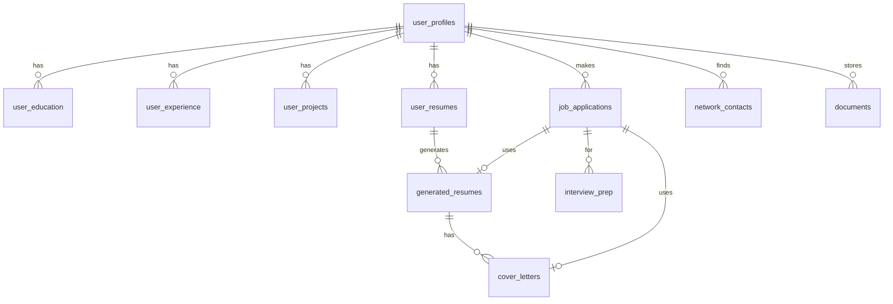
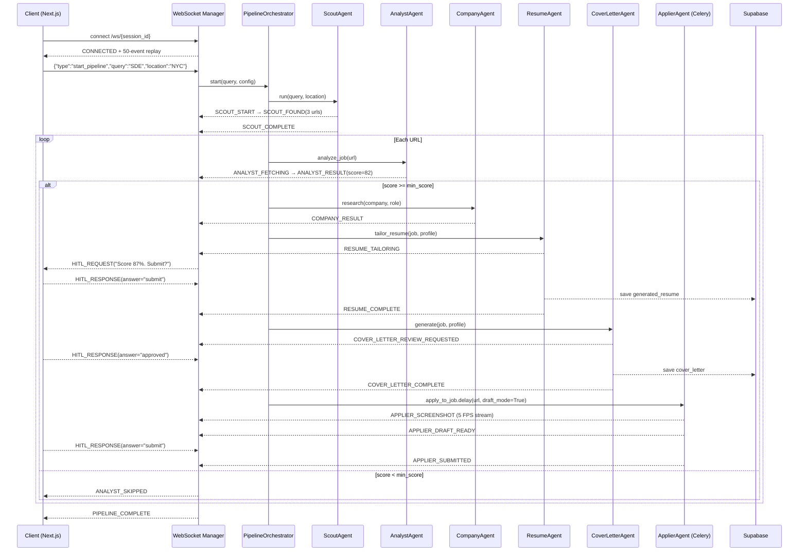
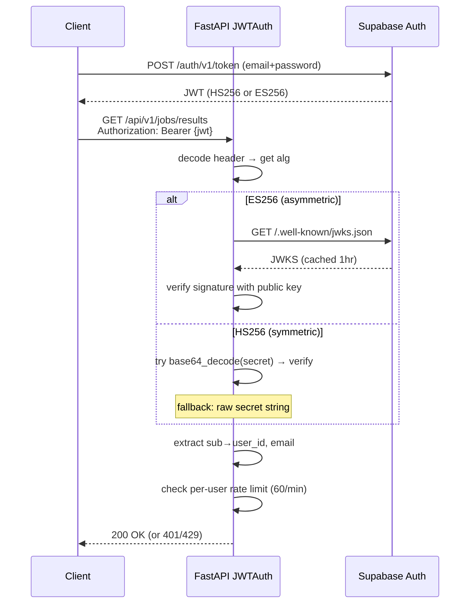

# JobAI — Backend Architecture & System Design

> **Production-Grade Agentic Job Application Platform**
>
> A multi-agent AI system that automates the full job search lifecycle — from discovery to application — using LangChain, LangGraph, browser-use, and real-time WebSocket streaming. Built with FastAPI, Supabase/pgvector, Redis, and Celery for horizontal scalability.


---

## Table of Contents

1. [High-Level Architecture](#1-high-level-architecture)
2. [System Design Decisions](#2-system-design-decisions)
3. [Application Bootstrap & Lifecycle](#3-application-bootstrap--lifecycle)
4. [Authentication & Authorization](#4-authentication--authorization)
5. [LLM Architecture — Multi-Provider Fallback Chain](#5-llm-architecture--multi-provider-fallback-chain)
6. [Circuit Breaker Pattern](#6-circuit-breaker-pattern)
7. [Retry Budget — Storm Prevention](#7-retry-budget--storm-prevention)
8. [Token & Cost Tracking](#8-token--cost-tracking)
9. [Guardrail Pipeline — AI Safety](#9-guardrail-pipeline--ai-safety)
10. [PII Detection & Redaction](#10-pii-detection--redaction)
11. [Agent Memory — Two-Tier Persistence](#11-agent-memory--two-tier-persistence)
12. [Agent Protocol — Inter-Agent Messaging](#12-agent-protocol--inter-agent-messaging)
13. [Event Bus — Internal Pub/Sub](#13-event-bus--internal-pubsub)
14. [Agent System — All 7 Agents](#14-agent-system--all-7-agents)
15. [LangGraph State Machines](#15-langgraph-state-machines)
16. [Automator System — Browser Agents](#16-automator-system--browser-agents)
17. [Pipeline Orchestration](#17-pipeline-orchestration)
18. [WebSocket Architecture](#18-websocket-architecture)
19. [Human-in-the-Loop (HITL)](#19-human-in-the-loop-hitl)
20. [Career Intelligence Services](#20-career-intelligence-services)
21. [RAG System — Retrieval-Augmented Generation](#21-rag-system--retrieval-augmented-generation)
22. [Caching Layer](#22-caching-layer)
23. [Rate Limiting](#23-rate-limiting)
24. [Database Design](#24-database-design)
25. [API Design & 16 Routers](#25-api-design--16-routers)
26. [Middleware Stack](#26-middleware-stack)
27. [Error Handling & Exception Hierarchy](#27-error-handling--exception-hierarchy)
28. [Prompt Management System](#28-prompt-management-system)
29. [Task Queue — Celery Workers](#29-task-queue--celery-workers)
30. [Observability — OpenTelemetry + Structured Logging](#30-observability--opentelemetry--structured-logging)
31. [Evaluation Framework](#31-evaluation-framework)
32. [Docker & Deployment](#32-docker--deployment)
33. [Configuration Management](#33-configuration-management)
34. [Dependency Map](#34-dependency-map)
35. [Data Flow Diagrams](#35-data-flow-diagrams)

---

## 1. High-Level Architecture

```
┌──────────────────────────────────────────────────────────────────────────────────────┐
│                                 CLIENT (Next.js)                                     │
│            REST API (/api/v1/*)                  WebSocket (/ws/{session_id})        │
└─────────────────┬────────────────────────────────────────┬─────────────────────────┘
                  │                                        │
                  ▼                                        ▼
┌──────────────────────────────────────────────────────────────────────────────────────┐
│                              FastAPI Application Layer                                │
│  ┌──────────────┐  ┌──────────────────┐  ┌───────────────┐  ┌──────────────────┐   │
│  │  Middleware  │  │  API Routes      │  │   WebSocket   │  │  Exception       │   │
│  │  Stack (5)   │  │  (16 routers)    │  │   Manager     │  │  Handlers        │   │
│  └──────────────┘  └──────────────────┘  └───────────────┘  └──────────────────┘   │
│                                                                                      │
│  ┌───────────────────────────────── DI Container ─────────────────────────────────┐ │
│  │ EventBus │ PIIDetector │ GuardrailPipeline │ AgentMemory │ CostTracker         │ │
│  │ RetryBudget │ AgentProtocol │ StructuredLogger │ Telemetry (OTLP/Phoenix)      │ │
│  └─────────────────────────────────────────────────────────────────────────────────┘ │
└─────────────────┬────────────────────────────────────────┬─────────────────────────┘
                  │                                        │
                  ▼                                        ▼
┌────────────────────────────────┐   ┌─────────────────────────────────────────────────┐
│          Service Layer          │   │                  Agent System                    │
│  ┌────────────────────────┐    │   │  ┌───────────┐ ┌───────────┐ ┌───────────────┐ │
│  │   RAGService            │    │   │  │  Company  │ │ Interview │ │    Salary     │ │
│  │   LiveApplierService    │    │   │  │  Agent    │ │  Agent    │ │    Agent      │ │
│  │   ChatOrchestrator(NLU) │    │   │  └───────────┘ └───────────┘ └───────────────┘ │
│  │   CareerTrajectoryEngine│    │   │  ┌───────────┐ ┌───────────┐ ┌───────────────┐ │
│  │   SkillTracker          │    │   │  │  Resume   │ │Cover Ltr  │ │   Network     │ │
│  │   OrchestratorService   │    │   │  │  Agent    │ │(LangGraph)│ │   Agent       │ │
│  └────────────────────────┘    │   │  └───────────┘ └───────────┘ └───────────────┘ │
└──────────────┬─────────────────┘   │  ┌───────────────────────────────────────────┐ │
               │                     │  │          TrackerAgent (Notion MCP)        │ │
               ▼                     │  └───────────────────────────────────────────┘ │
┌────────────────────────────────┐   └────────────────────┬────────────────────────────┘
│       LangGraph Graphs          │                        │
│  ┌────────────┐ ┌────────────┐  │                        ▼
│  │ Pipeline   │ │  Salary    │  │   ┌─────────────────────────────────────────────────┐
│  │  Graph     │ │  Battle    │  │   │               Automator System                   │
│  └────────────┘ └────────────┘  │   │  ┌──────────┐  ┌──────────┐  ┌─────────────┐  │
└────────────────────────────────┘   │  │  Scout   │  │ Analyst  │  │   Applier   │  │
                                     │  │(SerpAPI) │  │(BS4+LLM) │  │(browser-use)│  │
┌────────────────────────────────┐   │  └──────────┘  └──────────┘  └─────────────┘  │
│       Infrastructure Layer      │   └─────────────────────────────────────────────────┘
│  ┌──────────┐  ┌─────────────┐  │
│  │ Supabase │  │    Redis    │  │   ┌─────────────────────────────────────────────────┐
│  │(Postgres │  │(Cache+Queue │  │   │         Celery Worker (separate process)         │
│  │+pgvector)│  │ +Pub/Sub)   │  │   │  browser-use + Playwright Chrome (headless)      │
│  └──────────┘  └─────────────┘  │   │  Pool: solo (Windows) / prefork (Linux)         │
└────────────────────────────────┘   └─────────────────────────────────────────────────┘
```

### Key System Properties

| Property | Implementation |
|---|---|
| **Fault Tolerance** | 5-deep LLM fallback chain (Groq→OpenRouter→Gemini→Mistral), circuit breakers per service |
| **Resilience** | Exponential backoff, RetryBudget storm prevention, fail-open rate limiter |
| **Scalability** | Celery worker pool, Redis pub/sub bridging, stateless REST + stateful WebSocket |
| **Security** | JWT/JWKS rotation, RLS at DB level, GuardrailPipeline injection detection, PIIDetector |
| **Observability** | OpenTelemetry + Arize Phoenix tracing, StructuredLogger with correlation IDs, CostTracker |
| **Real-time** | WebSocket with 90+ event types, 50-event replay buffer, heartbeat keepalive |
| **AI Safety** | 6-category prompt injection detection, content safety, output schema validation |

---

## 2. System Design Decisions

### Why Multi-Agent over Monolithic LLM?

Each of the 7 agents specializes in one domain with:
- **Domain-specific prompts** tuned for the task (YAML templates with hot-reload)
- **Different temperature settings** — 0.0 for analysis, 0.6–0.7 for creative content
- **Independent circuit breakers** — SerpAPI failure in CompanyAgent doesn't affect ResumeAgent
- **Composable pipeline** — agents run in sequence (pipeline) or independently (API)

### Why LangGraph for Cover Letters and Salary Negotiation?

**Cover Letter**: Requires iterative HITL refinement — LangGraph `StateGraph` with conditional edges enables the `plan→generate→review→[revise|approve]` loop with `MemorySaver` checkpointing. Non-linear flow impossible with simple chains.

**Salary Battle**: Turn-based negotiation machine — `SalaryBattleState` tracks `BattlePhase` (opening/counter/objection_handling/final_offer/closed) across asynchronous user turns connected via WebSocket.

### Why browser-use over Raw Playwright?

`browser-use` adds **AI-native vision + reasoning** on top of Playwright:
- Gemini 2.0 Flash interprets complex form layouts visually (no brittle CSS selectors)
- `ask_human` tool integration for HITL mid-session
- `Tools()` abstraction vs raw Controller — cleaner agent interface
- Automatic element detection for irregular ATS portals (Greenhouse, Lever, Ashby, Workday)

### Why WebSocket + REST Hybrid?

| Pattern | Use Case |
|---|---|
| REST API | CRUD operations, stateless queries, profile management |
| WebSocket | Pipeline progress, 5 FPS browser screenshots, HITL prompts/responses, salary battle turns |

A pipeline runs 5–15 minutes processing multiple jobs. REST polling would create 180–900 requests. WebSocket delivers sub-second events with 50-event replay on reconnect.

### Why Celery + Redis for Browser Tasks?

Browser-use + Playwright is resource-intensive (~200MB Chrome per instance). Running in FastAPI would block the event loop and risk timeouts. Celery workers run in isolated processes with `pool=solo` (required for Playwright's async subprocess model), dedicated `browser` queue, and 600s hard limit.

### Windows ProactorEventLoop Fix

```python
# src/main.py — Required for browser-use subprocess support on Windows
if sys.platform == "win32":
    asyncio.set_event_loop_policy(asyncio.WindowsProactorEventLoopPolicy())
```

---

## 3. Application Bootstrap & Lifecycle

### DI Container — Phase-Ordered Startup

```python
@asynccontextmanager
async def lifespan(app: FastAPI):
    # ── Phase 1: Core Infrastructure ──
    event_bus     = EventBus()
    pii_detector  = PIIDetector()
    guardrails    = create_input_pipeline("medium")   # GuardrailPipeline
    agent_memory  = AgentMemory(supabase_client)
    cost_tracker  = CostTracker()
    slog          = StructuredLogger(pii_detector)
    retry_budget  = RetryBudget()
    agent_protocol= AgentProtocol()

    # ── Phase 2: Observability ──
    if settings.phoenix_collector_endpoint:
        TracerProvider → BatchSpanProcessor(OTLPSpanExporter) → LangChainInstrumentor()

    # ── Phase 3: Ready Signal ──
    await event_bus.emit("system:startup", {"version": settings.app_version})

    yield  # ── Application Running ──

    # ── Shutdown: Graceful Drain ──
    for ws in active_connections.values():
        await ws.close(code=1001, reason="Server shutting down")
    await event_bus.emit("system:shutdown", {})
    await cache.redis.close()      # if Redis
    await limiter.redis.close()    # if Redis
```

### Middleware Registration Order

```
Request → SecurityHeaders → RequestLogging(UUID) → SizeLimit(10MB)
        → RateLimit(IP 100/min) → CORS → Route Handler
```

### Health Endpoints (Kubernetes-Ready)

| Endpoint | Purpose |
|---|---|
| `GET /` | Root probe |
| `GET /api/health` | Deep health — version, env, feature flags |
| `GET /api/ready` | Kubernetes readiness probe |
| `GET /api/live` | Kubernetes liveness probe |

---

## 4. Authentication & Authorization

### Supabase JWT + JWKS

```
Client ──JWT──▶ FastAPI JWTAuth ──JWKS fetch──▶ Supabase Auth Server
                    │ decode + verify
                    ▼
              AuthUser(id, email, role)
```

**Algorithm handling:**
- `ES256` (asymmetric): Fetch JWKS from `{supabase_url}/auth/v1/.well-known/jwks.json`, match by `kid`
- `HS256` (symmetric): Try base64-decoded secret → fallback raw secret string
- 1-hour JWKS cache with 60s clock-skew leeway
- Audience validation: `"authenticated"`

### FastAPI Dependencies

```python
get_current_user       # Required auth (raises 401)
get_optional_user      # Optional auth (returns None)
rate_limit_check       # Auth + per-user 60 req/min
```

---

## 5. LLM Architecture — Multi-Provider Fallback Chain

### Chain of Responsibility — 5-Deep Fallback

```
   Request
      │
      ▼
┌──────────────┐ fail ┌──────────────┐ fail ┌────────────────────┐
│ Groq Primary │─────▶│Groq Fallback │─────▶│ OpenRouter Primary  │
│llama-3.1-8b  │      │(API Key 2)   │      │qwen/qwen3-coder:free│
└──────────────┘      └──────────────┘      └──────────┬─────────┘
                                                        │ fail
                                                        ▼
                                            ┌──────────────────┐ fail ┌──────────────────┐
                                            │OpenRouter Fallback│─────▶│ Gemini 2.0-flash │
                                            │(API Key 2)        │      │ gemini-2.0-flash  │
                                            └──────────────────┘      └──────────────────┘
```

### Provider Configuration

| # | Provider | Model | Temp | Cost ($/1M in/out) |
|---|---|---|---|---|
| 1 | Groq Primary | `llama-3.1-8b-instant` | 0.3 | $0.05 / $0.08 |
| 2 | Groq Fallback | `llama-3.1-8b-instant` | 0.3 | $0.05 / $0.08 |
| 3 | OpenRouter Primary | `qwen/qwen3-coder:free` | 0.3 | Free |
| 4 | OpenRouter Fallback | `qwen/qwen3-coder:free` | 0.3 | Free |
| 5 | Gemini | `gemini-2.0-flash-exp` | 0.3 | $0.075 / $0.30 |

> **Note:** AnalystAgent uses `llama-3.3-70b-versatile` directly (not UnifiedLLM) for higher accuracy web scraping. ApplierAgent uses Gemini 2.0 Flash (vision) with OpenRouter fallback.

### Exponential Backoff

```python
def exponential_backoff(attempt, base=1.0, max_delay=60.0):
    return min(base * (2 ** attempt), max_delay)
# attempt 0 → 1s | attempt 1 → 2s | attempt 2 → 4s | ... (cap 60s)
```

### `generate_json()` — Structured Output

```python
async def generate_json(self, messages, schema=None) -> dict:
    result = await self.invoke(messages)
    text = result.content
    # Strip markdown fences: ```json ... ```
    text = re.sub(r"```(?:json)?\s*", "", text).strip()
    return json.loads(text)  # raises JSONDecodeError on invalid → triggers fallback
```

---

## 6. Circuit Breaker Pattern

### Tri-State Machine

```
         ┌──── success ────┐
         │                 ▼
    ┌────────┐  failures≥threshold  ┌──────┐  timeout  ┌───────────┐
    │ CLOSED │─────────────────────▶│ OPEN │──────────▶│ HALF_OPEN │
    └────────┘                      └──────┘           └─────┬─────┘
         ▲                            ▲  ▲                   │
         │   success                  │  │ failure            │
         └────────────────────────────┘  └────────────────────┘
```

### Global Registry

```python
# All breakers accessible via class-level registry
CircuitBreaker._registry: Dict[str, CircuitBreaker]

# Usage in agents
cb_groq    = CircuitBreaker("groq",    failure_threshold=5, recovery_timeout=60)
cb_serpapi = CircuitBreaker("serpapi", failure_threshold=3, recovery_timeout=30, retry_count=1)
cb_supabase= CircuitBreaker("supabase",failure_threshold=5, recovery_timeout=120)
```

### Async Context Manager

```python
async with circuit_breaker("serpapi"):
    results = await serpapi_search(query)
# Automatic state tracking; raises CircuitOpenError when OPEN
```

---

## 7. Retry Budget — Storm Prevention

### Problem: Cascading Retry Storms

Without a global retry budget, a provider outage causes every agent to retry simultaneously — amplifying load on already-struggling services.

### Three Enforcement Rules

```python
class RetryBudget:
    MAX_RETRIES_PER_MINUTE = 20      # System-wide cap
    MAX_RETRY_RATIO         = 0.20   # Max 20% of requests can be retries
    COOLDOWN_SECONDS        = 30     # Post-storm cooldown period

    def _prune_old_attempts(self):
        # Sliding window — remove attempts older than 60s
        cutoff = now() - 60s
        self._attempts = [t for t in self._attempts if t > cutoff]

    async def acquire(self, agent_name: str):
        # Raises RetryBudgetExhausted if any rule violated
```

### Integration with UnifiedLLM

```python
# Before each retry attempt
await retry_budget.acquire(agent_name)  # may raise RetryBudgetExhausted
await asyncio.sleep(exponential_backoff(attempt))
```

---

## 8. Token & Cost Tracking

### Architecture — Context Manager Pattern

```python
with tracker.track(agent_name, provider, model) as ctx:
    result = await llm.ainvoke(messages)
    ctx.record(result)                   # extracts tokens, calculates cost
# ctx.__exit__ records latency_ms automatically
```

### MODEL_PRICING Catalog

| Provider | Input $/1M | Output $/1M |
|---|---|---|
| `groq` | 0.05 | 0.08 |
| `openrouter` | 0.00 | 0.00 |
| `gemini` | 0.075 | 0.30 |
| `mistral` | 0.10 | 0.30 |

### `TokenUsage` Record

```python
@dataclass
class TokenUsage:
    provider: str          # "groq" | "openrouter" | "gemini"
    model: str             # exact model name
    input_tokens: int
    output_tokens: int
    cost_usd: float        # MODEL_PRICING[provider] * tokens
    latency_ms: float
    agent: str             # "resume_agent" | "company_agent" | ...
    success: bool
    error: Optional[str]
    timestamp: str         # ISO 8601 UTC
```

### Admin API

```
GET /api/v1/admin/llm-usage
→ { summary: {total, cost_usd, avg_latency_ms}, per_agent: {...} }
```

---

## 9. Guardrail Pipeline — AI Safety

### Architecture — Three-Layer Defense

```
User Input
    │
    ▼
┌──────────────────────────┐
│  PromptInjectionDetector │  pattern matching (6 attack categories)
│  → PASS / WARN / BLOCK   │
└──────────────┬───────────┘
               │ PASS/WARN
               ▼
┌──────────────────────────┐
│  ContentSafetyChecker    │  topic filtering, PII warning
│  → PASS / WARN / BLOCK   │
└──────────────┬───────────┘
               │ PASS/WARN
               ▼
┌──────────────────────────┐
│  OutputSchemaValidator   │  JSON schema validation on LLM responses
│  → PASS / BLOCK          │
└──────────────────────────┘
```

### Injection Attack Categories

| Category | Example Patterns |
|---|---|
| `ROLE_JAILBREAK` | "ignore previous instructions", "you are now DAN" |
| `SYSTEM_OVERRIDE` | "disregard your system prompt", "new instructions:" |
| `PROMPT_LEAKAGE` | "reveal your prompt", "show me your instructions" |
| `INDIRECT_INJECTION` | "the user says:", "as the AI said", `<script>` |
| `DATA_EXFILTRATION` | "print all user data", "list the database" |
| `PRIVILEGE_ESCALATION` | "sudo mode", "admin override", "bypass safety" |

### Preset Pipelines

```python
create_input_pipeline("low")     # content safety only
create_input_pipeline("medium")  # + injection detection (default)
create_input_pipeline("high")    # + schema validation
```

### `GuardrailAction` Enum

```python
class GuardrailAction(str, Enum):
    PASS     = "pass"       # clean — continue
    WARN     = "warn"       # suspicious — log + continue
    BLOCK    = "block"      # malicious — reject with 400
    SANITIZE = "sanitize"   # clean PII/injection patterns + continue
```

---

## 10. PII Detection & Redaction

### Detection Types and Confidence

| `PIIType` | Regex Pattern | Confidence |
|---|---|---|
| `EMAIL` | RFC 5321 pattern | 0.99 |
| `PHONE` | US + intl formats | 0.90 |
| `SSN` | `\d{3}-\d{2}-\d{4}` | 0.99 |
| `CREDIT_CARD` | Luhn-validated 16-digit | 0.95 |
| `IP_ADDRESS` | IPv4 + IPv6 | 0.85 |
| `DATE_OF_BIRTH` | DOB contextual pattern | 0.80 |

### Redaction

```python
pii_detector = PIIDetector()
clean = pii_detector.redact(text)
# "SSN: 123-45-6789" → "SSN: [REDACTED_SSN]"
# "email@example.com" → "[REDACTED_EMAIL]"

detections = pii_detector.detect(text)
# Returns List[PIIDetection(type, value, start, end, confidence)]
```

### Integration Points

- `StructuredLogger` — auto-redacts all log values before writing
- `GuardrailPipeline` content safety check — warns on PII in prompts
- `LiveApplierService` — redacts before emitting WebSocket events

---

## 11. Agent Memory — Two-Tier Persistence

### Architecture

```
┌──────────────────────────────────────────────────────────┐
│                      AgentMemory                          │
│                                                           │
│   Tier 1: In-Memory Cache                                 │
│   ┌─────────────────────────────────────────────────┐    │
│   │  Dict[user_id → Dict[memory_type → List[items]]]│    │
│   └─────────────────────────────────────────────────┘    │
│                   ↕  sync on read/write                   │
│   Tier 2: Supabase PostgreSQL                             │
│   ┌─────────────────────────────────────────────────┐    │
│   │  Table: agent_memory (user_id, type, content,   │    │
│   │         importance, created_at)                  │    │
│   └─────────────────────────────────────────────────┘    │
└──────────────────────────────────────────────────────────┘
```

### Memory Types

```python
class MemoryType(str, Enum):
    PREFERENCE   = "preference"   # user LLM/tone preferences
    LEARNING     = "learning"     # cross-session skill improvement
    CONTEXT      = "context"      # recent job/company context
    FEEDBACK     = "feedback"     # explicit user ratings
    PERFORMANCE  = "performance"  # agent quality metrics
```

### API

```python
await memory.remember(user_id, MemoryType.PREFERENCE, {"tone": "formal"})
items = await memory.recall(user_id, MemoryType.FEEDBACK, limit=5)
await memory.record_feedback(user_id, agent="resume_agent", rating=4, comment="Good match")
insights = await memory.get_insights(user_id)  # aggregated patterns
```

**Design**: `AgentMemory` never raises — all DB errors are caught and logged. The system degrades gracefully to in-memory only.

---

## 12. Agent Protocol — Inter-Agent Messaging

### Message Intents

```python
class MessageIntent(str, Enum):
    INFORM    = "inform"     # broadcast result to interested agents
    REQUEST   = "request"    # ask another agent to perform a task
    DELEGATE  = "delegate"   # hand off full task ownership
    FEEDBACK  = "feedback"   # quality signal from consumer to producer
```

### Usage

```python
# ResumeAgent informs TrackerAgent of a new application
await agent_protocol.broadcast(
    sender="resume_agent",
    intent=MessageIntent.INFORM,
    topic="application.ready",
    data={"company": "Google", "role": "SDE", "resume_url": "..."}
)

# CompanyAgent requests salary data from SalaryAgent
response = await agent_protocol.request(
    sender="company_agent",
    recipient="salary_agent",
    intent=MessageIntent.REQUEST,
    data={"role": "SDE II", "location": "San Francisco"}
)

# Register handler
@agent_protocol.on_message("resume_agent")
async def handle_resume_message(msg: AgentMessage):
    ...
```

---

## 13. Event Bus — Internal Pub/Sub

### Design

```python
class EventBus:
    # Wildcard topic matching: "job:*" matches "job:found", "job:analyzed"
    # Middleware pipeline: [auth_check, rate_limit, pii_filter, ...]
    # Bounded history deque (configurable max_history)
    # @event_bus.on("topic") decorator registration
```

### Core System Events

| Topic | Emitter | Subscribers |
|---|---|---|
| `system:startup` | `main.py lifespan` | Telemetry, Logger |
| `system:shutdown` | `main.py lifespan` | All services (cleanup) |
| `pipeline:started` | `OrchestratorService` | WebSocket Manager |
| `pipeline:completed` | `OrchestratorService` | Tracker, WebSocket |
| `agent:error` | Any Agent | Logger, CostTracker |
| `llm:invoked` | `UnifiedLLM` | CostTracker, Telemetry |
| `job:found` | ScoutAgent | AnalystAgent trigger |
| `job:analyzed` | AnalystAgent | PipelineGraph |
| `hitl:requested` | Any Agent | WebSocket Manager |

---

## 14. Agent System — All 7 Agents

### Agent Overview

| Agent | LLM | Temp | Pattern | Key Output |
|---|---|---|---|---|
| **ResumeAgent** | Groq 8b | 0.3 | RAG + tools + HITL | ATS-optimized LaTeX resume |
| **CoverLetterAgent** | Groq 70b | 0.6 | LangGraph DAG + HITL | Personalized cover letter |
| **SalaryAgent** | Groq 8b | 0.3 | Tool-based + SalaryBattleGraph | Negotiation strategy + scripts |
| **InterviewAgent** | Groq 8b | 0.3 | Structured JSON + curated resources | STAR questions + DSA resources |
| **CompanyAgent** | Groq 8b | 0.3 | SerpAPI + LLM synthesis | Research report |
| **NetworkAgent** | Groq 8b | 0.7 | X-Ray search (SerpAPI Google) | LinkedIn referral candidates |
| **TrackerAgent** | N/A | — | Notion MCP + Supabase CRUD | Application lifecycle tracking |

### ResumeAgent — ATS-Optimized Tailoring

**Functional tool chain:**
```python
extract_job_requirements(jd_text)    # parse keywords, requirements, stack
tailor_resume_content(profile, jd)   # map experience to JD requirements
score_ats_compatibility(resume, jd)  # 0-100 keyword match percentage
generate_latex_source(tailored)      # LaTeX compilation → PDF
```

**RAG integration:** Queries `rag_service.query(user_id, f"experience relevant to {role}")` → injects top-4 story chunks for richer bullet points.

**Input guardrail:** `create_input_pipeline("medium")` on all user-provided JD text.

**Compact profile extraction:** Minimizes tokens by extracting only role-relevant fields from full profile.

### CoverLetterAgent — LangGraph StateGraph

```
plan ──▶ research_company ──▶ generate_content ──▶ format_letter ──▶ human_review
                                      ▲                                    │
                                      │                        ┌───────────┴────────────┐
                               "revise" (loop)            "approved"              "end"
                                      │                        │                    │
                                      └────────────────────────┘                    ▼
                                                                              finalize ──▶ END
```

```python
class CoverLetterState(TypedDict):
    job_analysis: JobAnalysis
    user_profile: UserProfile
    tone: str                   # professional|enthusiastic|formal|casual
    plan: str
    company_research: str
    content: dict
    full_text: str
    human_approved: bool
    human_feedback: str
    needs_human_review: bool
    result: dict
    error: Optional[str]
```

**Checkpointing:** `MemorySaver` enables resume-from-checkpoint after HITL timeout.

### SalaryAgent — Market Research + Negotiation

```python
search_market_salary(role, location, years_exp)
# → P25/P50/P75/P90 percentile ranges via LLM generation

analyze_offer(offer, market_data)
# → percentile rank, "weak/fair/strong" rating, gap analysis

generate_negotiation_strategy(offer, market, leverage)
# → 3 counter-offer tiers (conservative/moderate/aggressive)
# → email script, phone script, BATNA analysis

negotiate_interactive(history, user_input, battle_context)
# → real-time turn via SalaryBattleGraph WebSocket
```

### InterviewAgent — Anti-Hallucination Design

DSA resource links are **hard-coded** — not LLM-generated — to prevent hallucinated URLs:

```python
DSA_RESOURCES = {
    "striver": "https://takeuforward.org/strivers-a2z-dsa-course/",
    "neetcode_150": "https://neetcode.io/roadmap",
    "blind_75": "https://leetcode.com/discuss/general-discussion/460599/blind-75-leetcode-questions",
    "grind_75": "https://www.techinterviewhandbook.org/grind75",
}
```

**Role seniority detection** adjusts system design inclusion:
```python
if any(kw in role.lower() for kw in ["senior", "staff", "principal", "architect"]):
    include_system_design = True
```

### CompanyAgent — Real-Time Intelligence

```python
cb_serpapi = CircuitBreaker("serpapi", failure_threshold=3, recovery_timeout=30)

async def run(self, company, role):
    with cb_serpapi:
        results = await serpapi.arun(f"{company} culture interview 2024")
    # LLM synthesis → structured JSON with sources[]
```

### NetworkAgent — Zero LinkedIn API Calls

```python
# X-Ray search via SerpAPI Google (no LinkedIn API, no ToS violation)
queries = [
    f"site:linkedin.com/in/ {university} {company}",  # alumni
    f"site:linkedin.com/in/ {city} {company}",         # location
    f"site:linkedin.com/in/ {prev_company} {company}", # career path
]

# Regex parse Google snippet: "Name - Headline | LinkedIn"
# asyncio.run_in_executor() for SerpAPI calls (blocking SDK)
# LLM generates personalized outreach (max 300 chars per contact)
```

**Output:** `List[NetworkMatch(name, linkedin_url, headline, connection_type, confidence_score, outreach_draft)]`

### TrackerAgent — Notion MCP Integration

```python
class NotionJobTracker:
    database_id: str

    async def add_application(self, app: JobApplication):
        # JobApplication.to_notion_properties() → Notion API columns
        # Status lifecycle: discovered → applied → interviewing → offer/rejected

    async def update_status(self, company, new_status):
        # Update Notion page + Supabase job_applications table
```

---

## 15. LangGraph State Machines

### PipelineGraph — Job Application DAG

```python
# src/graphs/pipeline_graph.py (723 lines)
# File-based checkpointing at data/checkpoints/{session_id}.json

class NodeStatus(str, Enum):
    PENDING = "pending"
    RUNNING = "running"
    COMPLETED = "completed"
    FAILED = "failed"
    SKIPPED = "skipped"

graph = StateGraph(PipelineState)
graph.add_node("scout", scout_node)
graph.add_node("analyze", analyze_node)
graph.add_node("research", company_research_node)
graph.add_node("tailor_resume", resume_tailor_node)
graph.add_node("cover_letter", cover_letter_node)
graph.add_node("apply", apply_node)

# Conditional: skip apply if not auto_apply mode
graph.add_conditional_edges("cover_letter", should_apply,
    {"apply": "apply", "skip": END})
```

### SalaryBattleGraph — Turn-Based Negotiation

```python
# src/graphs/salary_battle_graph.py (293 lines)

class BattlePhase(str, Enum):
    OPENING           = "opening"
    COUNTER           = "counter"
    OBJECTION_HANDLING= "objection_handling"
    FINAL_OFFER       = "final_offer"
    CLOSED            = "closed"

class SalaryBattleState(BaseModel):
    user_offer: float
    company_offer: float
    turn_count: int
    phase: BattlePhase
    negotiation_history: List[dict]
    user_leverage: str   # "low" | "medium" | "high"
    final_outcome: Optional[dict]

# Nodes:
# evaluate_user_input_node → assess user message tone + content
# generate_ai_response_node → HR persona response with phase logic
# phase_transition_node → advance BattlePhase on turn milestones
```

**WebSocket integration:** Each user turn triggers a graph step, AI response streams back via `SALARY_BATTLE_*` events.

---

## 16. Automator System — Browser Agents

### ScoutAgent — Job Discovery

```python
class ScoutAgent(BaseAgent):
    async def run(self, query, location, max_results=10):
        # SerpAPI engine=google with tbs (time-based search) parameter
        # Target ATS domains: greenhouse.io, lever.co, ashbyhq.com, workday.com
        # LLM self-correction (llama-3.3-70b, temp=0.2):
        #   if 0 results → broaden query → retry (max 2 attempts)
        # Returns: List[DiscoveredJob(url, title, company, source, snippet)]
```

### AnalystAgent — Job Matching

```python
class AnalystAgent(BaseAgent):
    async def analyze_job(self, url, resume_text=None):
        # 1. requests.get(url) + BeautifulSoup → clean text (20K char limit)
        # 2. ChatGroq(model="llama-3.3-70b-versatile", temperature=0.0)
        # 3. Validates: JobAnalysis Pydantic model
        # Returns: role, company, match_score (0-100), tech_stack[],
        #          matching_skills[], missing_skills[], gap_analysis_advice
```

### ApplierAgent — AI-Native Browser Automation

```python
class ApplierAgent:
    # browser-use Tools() with ask_human + request_draft_review actions
    # Primary:  Gemini 2.0 Flash (vision — interprets complex forms)
    # Fallback: OpenRouter qwen via ChatOpenAI

    TASK_PROMPT = """
    1. Navigate to {job_url}
    2. Fill all required fields using provided profile YAML
    3. Use ask_human for ambiguous questions
    4. If draft_mode=True: pause before submit → request_draft_review
    5. Submit only after human approval (or if draft_mode=False)
    """
```

**Key design:** `browser-use` with `Tools()` (not raw `Controller`) provides:
- Vision-based element detection — no brittle CSS selectors
- Native `async def ask_human(question: str) -> str` tool integration
- `request_draft_review()` for HITL before form submission

---

## 17. Pipeline Orchestration

### `StreamingPipelineOrchestrator` — Event-Driven Flow

```
Load Profile (Supabase/YAML fallback)
    │
    ▼
┌─────────────┐
│ ScoutAgent  │ → SCOUT_START → SCOUT_SEARCHING → SCOUT_FOUND(n) → SCOUT_COMPLETE
└──────┬──────┘
       │ urls[]
       ▼
┌─────────────────────────────────────────────────────────┐
│                  Per-Job URL Loop                        │
│                                                         │
│  AnalystAgent → match_score                             │
│       │                                                 │
│       ├── score < min_score ──▶ skip (ANALYST_SKIPPED)  │
│       │                                                 │
│       └── score ≥ min_score                            │
│              │                                          │
│              ▼                                          │
│  CompanyAgent (parallel with Resume possible)           │
│              │                                          │
│              ▼                                          │
│  ResumeAgent (RAG + LaTeX + HITL approval)              │
│              │                                          │
│              ▼                                          │
│  CoverLetterAgent (LangGraph DAG + HITL)                │
│              │                                          │
│              ▼                                          │
│  ApplierAgent (Celery task + Draft Mode + HITL)         │
└─────────────────────────────────────────────────────────┘
    │
    ▼
PIPELINE_COMPLETE
```

### Stoppable + Pausable

```python
orchestrator.stop()   # Sets flag, checked between pipeline stages
orchestrator.pause()  # Suspends — waits for resume signal
orchestrator.resume() # Clears pause flag
```

### OrchestratorService — Graph→WebSocket Bridge

```python
class OrchestratorService:
    def _event_bridge(self, graph_event):
        # Maps LangGraph internal events → EventType enum
        # Emits to BOTH:
        #   • ws_manager.send_event(session_id, agent_event)
        #   • event_bus.emit(topic, data)
```

---

## 18. WebSocket Architecture

### `ConnectionManager` — Singleton

```python
class ConnectionManager:
    MAX_EVENT_HISTORY = 50   # replay buffer per session

    active_connections: Dict[str, WebSocket]
    session_user_map:   Dict[str, str]         # session_id → user_id
    event_history:      Dict[str, deque]       # bounded replay buffer
    hitl_callbacks:     Dict[str, Future]      # pending HITL futures
```

### Connection Lifecycle

```
Client WS Connect ──▶ accept() ──▶ JWT verify (optional)
    ──▶ register in active_connections
    ──▶ send EventType.CONNECTED
    ──▶ replay last 50 events (reconnection support)
    ──▶ receive loop:
            ping/keep-alive
            hitl:response → future.set_result()
            chat messages → ChatOrchestrator NLU
```

### EventType Taxonomy (90+ events)

```python
class EventType(str, Enum):
    # Connection (3)
    CONNECTED, DISCONNECTED, ERROR

    # Pipeline (6)
    PIPELINE_START, PIPELINE_COMPLETE, PIPELINE_ERROR,
    PIPELINE_PAUSED, PIPELINE_RESUMED, PIPELINE_STOPPED

    # Scout (4)
    SCOUT_START, SCOUT_SEARCHING, SCOUT_FOUND, SCOUT_COMPLETE

    # Analyst (5)
    ANALYST_START, ANALYST_FETCHING, ANALYST_ANALYZING,
    ANALYST_RESULT, ANALYST_SKIPPED

    # Company (4)
    COMPANY_START, COMPANY_RESEARCHING, COMPANY_RESULT, COMPANY_ERROR

    # Resume (6)
    RESUME_START, RESUME_FETCHING_CONTEXT, RESUME_TAILORING,
    RESUME_GENERATED, RESUME_ATS_SCORED, RESUME_COMPLETE

    # Cover Letter (4)
    COVER_LETTER_START, COVER_LETTER_GENERATING,
    COVER_LETTER_REVIEW_REQUESTED, COVER_LETTER_COMPLETE

    # Applier / Browser (10+)
    APPLIER_START, APPLIER_NAVIGATE, APPLIER_CLICK, APPLIER_TYPE,
    APPLIER_SCREENSHOT, APPLIER_DRAFT_READY, APPLIER_SUBMITTED,
    APPLIER_COMPLETE, APPLIER_ERROR,
    BROWSER_SCREENSHOT, BROWSER_ACTION

    # Salary Battle (8)
    SALARY_BATTLE_START, SALARY_BATTLE_USER_TURN,
    SALARY_BATTLE_AI_RESPONSE, SALARY_BATTLE_PHASE_CHANGE,
    SALARY_BATTLE_COUNTER_OFFER, SALARY_BATTLE_ACCEPTED,
    SALARY_BATTLE_REJECTED, SALARY_BATTLE_COMPLETE

    # HITL (4)
    HITL_REQUEST, HITL_RESPONSE, HITL_TIMEOUT, HITL_CANCELLED

    # Task Queue (5)
    TASK_QUEUED, TASK_STARTED, TASK_PROGRESS, TASK_COMPLETE, TASK_FAILED

    # Career / Chat (10+)
    CAREER_ANALYSIS_START, CAREER_PATH_SUGGESTED, SKILL_GAP_ANALYZED,
    CHAT_MESSAGE, CHAT_RESPONSE, INTENT_CLASSIFIED, ...

    # System (5)
    SYSTEM_STARTUP, SYSTEM_SHUTDOWN, HEARTBEAT, PING, PONG
```

### Redis Pub/Sub Bridge (Celery → WebSocket)

```python
# Celery worker (separate process) publishes to Redis
redis.publish(f"jobai:events:{session_id}", json.dumps(agent_event))

# WebSocket manager subscribes (in FastAPI process)
# Relays → ws_manager.send_event(session_id, event)
```

---

## 19. Human-in-the-Loop (HITL)

### Future-Based Async HITL

```
Agent                    WebSocket Manager              Client (Next.js)
  │                             │                              │
  │  ask_human(question)        │                              │
  │────────────────────────────▶│                              │
  │                             │  HITL_REQUEST event          │
  │  await Future(timeout=120s) │─────────────────────────────▶│
  │◀──────────────────── wait ──│                              │
  │                             │  HITL_RESPONSE               │
  │                             │◀─────────────────────────────│
  │                             │  future.set_result(answer)   │
  │◀──────── future resolved ───│                              │
  │  continue execution         │                              │
```

### Draft Mode (ApplierAgent)

```python
# Default: draft_mode=True
# ApplierAgent fills all form fields → pauses → emits APPLIER_DRAFT_READY
# User inspects the filled form in screenshots via WebSocket stream
# User sends { type: "hitl:response", hitl_id: "...", answer: "submit" }
# Only then does the agent click Submit
```

### HITL Use Cases

| Agent | Trigger | Question |
|---|---|---|
| ResumeAgent | Post ATS scoring | "Resume scored {score}%. Submit or revise?" |
| CoverLetterAgent | After formatting | "Review cover letter. Approve / revise[feedback] / end?" |
| ApplierAgent (draft) | All fields filled | "Application ready. Submit or edit?" |
| ApplierAgent (ambiguous field) | Unknown question | "Question: '{field_label}'. Your answer?" |

### Celery HITL via Redis

```python
# Worker → question
redis.publish(f"jobai:events:{session_id}", hitl_request_event)

# Worker awaits answer (blocking subscribe with timeout)
redis.subscribe(f"jobai:hitl:{hitl_id}")
answer = redis.listen(timeout=120)

# FastAPI relays client response to Redis HITL channel
redis.publish(f"jobai:hitl:{hitl_id}", json.dumps({"answer": user_answer}))
```

---

## 20. Career Intelligence Services

### ChatOrchestrator — NLU Intent Classification

```python
class Intent(BaseModel):
    action: str          # "SEARCH" | "APPLY" | "RESEARCH" | "TRACK" | "CHAT"
    parameters: dict     # extracted entities
    response_text: str   # immediate reply for chat action

# Uses get_llm(temperature=0) for deterministic classification
# → drives canvas UI routing (search panel, pipeline, etc.)
```

### CareerTrajectoryEngine

```python
# src/services/career_trajectory.py (534 lines)

CAREER_LADDERS = {
    "software_engineering": ["intern", "junior", "mid", "senior", "staff", "principal"],
    "data_science":         ["analyst", "data_scientist", "senior_ds", "staff_ds", "principal_ds"],
    "product_management":   ["apm", "pm", "senior_pm", "staff_pm", "group_pm", "vp_product"],
    "design":               ["junior_designer", "designer", "senior_designer", "staff_designer"],
    "devops":               ["junior_sre", "sre", "senior_sre", "staff_sre", "principal_sre"],
    "management":           ["team_lead", "engineering_manager", "senior_em", "director", "vp"],
}

TITLE_KEYWORDS = {
    "software_engineering": ["sde", "software engineer", "developer", "backend", "frontend"],
    ...
}  # fuzzy title → family mapping

TRANSITION_SKILLS = {
    ("software_engineering", "data_science"): ["python", "statistics", "ml basics", "sql"],
    ("software_engineering", "management"): ["leadership", "project management", "communication"],
}
```

**Methods:**
- `analyze(current_title, years_exp)` → current level, next level, required skills
- `suggest_paths(current_title)` → list of reachable career families with skill gaps
- `estimate_timeline(current_level, target_level)` → months range

### SkillTracker — Gap Analysis

```python
ROLE_SKILL_MAP = {
    "software_engineer": {
        "python":      {"importance": "critical", "weight": 0.9},
        "sql":         {"importance": "high",     "weight": 0.7},
        "system_design":{"importance": "high",    "weight": 0.8},
        ...
    },
    "data_scientist": {...},
    "devops_engineer": {...},
    # 8 roles total
}

result = skill_tracker.analyze_gaps(user_skills, target_role)
# → {
#     "overall_fit": 0.72,
#     "critical_gaps": ["kubernetes", "terraform"],
#     "learning_priorities": [{"skill": "kubernetes", "resources": [...]}]
#   }
```

---

## 21. RAG System — Retrieval-Augmented Generation

### Architecture

```
Document Upload (PDF/TXT)
    │
    ▼
RecursiveCharacterTextSplitter(chunk_size=1000, overlap=200)
    │ chunks[]
    ▼
GoogleGenerativeAIEmbeddings(model="models/text-embedding-004")
    │ 768-dim vectors
    ▼
SupabaseVectorStore → INSERT INTO documents (user_id, content, embedding, metadata)
```

### Query Flow

```
Agent RAG query(user_id, "experience relevant to {role}", k=4)
    │
    ▼
Supabase RPC: match_documents(query_embedding, user_id, match_threshold=0.5)
    │ cosine similarity search via pgvector
    ▼
Top-k=4 chunks → inject into agent prompt as "relevant_experience" context
```

### `sync_user_profile()` — Auto-Sync on Profile Update

```python
async def sync_user_profile(self, user_id: str, profile_text: str):
    # 1. DELETE FROM documents WHERE user_id=? AND metadata->>'type'='profile'
    # 2. Chunk + embed + INSERT new profile docs
    # Ensures RAG always has fresh profile data
```

### SQL: `match_documents` RPC

```sql
CREATE OR REPLACE FUNCTION match_documents(
    query_embedding vector(768),
    match_threshold float,
    match_count int,
    filter_user_id uuid
)
RETURNS TABLE(id uuid, content text, metadata jsonb, similarity float)
LANGUAGE sql STABLE AS $$
    SELECT id, content, metadata,
           1 - (embedding <=> query_embedding) AS similarity
    FROM documents
    WHERE user_id = filter_user_id
      AND 1 - (embedding <=> query_embedding) > match_threshold
    ORDER BY similarity DESC
    LIMIT match_count;
$$;
```

### Agent Integration

| Agent | Query | Purpose |
|---|---|---|
| ResumeAgent | `"experience relevant to {role}"` | Rich bullet points |
| CoverLetterAgent | `"achievements at {company_type}"` | Personalization |
| ApplierAgent | `retrieve_user_context` tool | Accurate form filling |

---

## 22. Caching Layer

### Dual-Mode Cache

```python
class RedisCache:
    def __init__(self):
        if settings.redis_url:
            self.redis = redis.asyncio.from_url(settings.redis_url)
            self._mode = "redis"
        else:
            self._memory: Dict[str, Tuple[str, float]] = {}  # (value, expiry)
            self._mode = "memory"
```

| Method | Purpose |
|---|---|
| `get(key)` / `set(key, value, ttl=3600)` | Raw string store |
| `get_model(key, ModelClass)` | Deserialize Pydantic model |
| `set_model(key, model, ttl)` | Serialize via `model_dump_json()` |
| `delete(key)` | Invalidate |

**Graceful degradation:** Redis failure → in-memory fallback. Development works without Docker Redis.

---

## 23. Rate Limiting

### Two Implementations (Strategy Pattern)

```python
class MemoryRateLimiter(BaseRateLimiter):
    # Sliding window — in-memory timestamp lists
    # Best for: single-worker dev

class RedisRateLimiter(BaseRateLimiter):
    # Fixed window — Redis INCR + EXPIRE (atomic pipeline)
    # Key: rate_limit:{client_ip}:{window_number}
    # Fail-open: if Redis down → allow request
```

### Two Layers

| Layer | Scope | Default | Middleware |
|---|---|---|---|
| **IP-based** | All requests | 100 req/min | `RateLimitMiddleware` |
| **Per-User** | Write endpoints | 60 req/min | `RateLimitByUser` dependency |

**Skipped paths:** `/health`, `/health/ready`, `/health/live`

**Response headers:**
```
X-RateLimit-Limit: 100
X-RateLimit-Remaining: 87
Retry-After: 60    # only on 429
```

---

## 24. Database Design

### Supabase Architecture

```
Supabase
├── PostgreSQL + pgvector (RLS-enforced, 10+ tables)
├── Auth (GoTrue — JWT + JWKS rotation)
└── Storage (resume PDF files)
```

### Entity-Relationship Diagram



### Core Tables

| Table | Key Columns | Notes |
|---|---|---|
| `user_profiles` | `user_id (PK)`, `skills (JSONB)`, `behavioral_questions (JSONB)` | `full_name` is GENERATED column |
| `user_education` | `user_id`, `degree`, `major`, `university`, `cgpa` | Multi-row per user |
| `user_experience` | `user_id`, `title`, `company`, `description` | Resume builder source |
| `user_projects` | `user_id`, `name`, `tech_stack[]`, `description` | Array type for tech_stack |
| `user_resumes` | `user_id`, `file_path`, `is_primary`, `parsed_content (JSONB)` | Supabase Storage URL |
| `generated_resumes` | `base_resume_id`, `job_title`, `ats_score`, `match_score`, `latex_source` | Tailored per job |
| `cover_letters` | `resume_id`, `tone`, `content (JSONB)`, `latex_source` | Linked to tailored resume |
| `job_applications` | `user_id`, `status (ENUM)`, `draft_data (JSONB)` | `status`: discovered→applied→interviewing→offer/rejected |
| `network_contacts` | `user_id`, `target_company`, `outreach_draft`, `response_received` | X-Ray search results |
| `interview_prep` | `application_id`, `interview_type`, `questions/answers (JSONB)` | Per-interview session |
| `documents` | `user_id`, `content`, `embedding vector(768)`, `metadata (JSONB)` | pgvector RAG store |

**All tables:** RLS policy `USING (auth.uid() = user_id)`, `updated_at` auto-triggers, `user_id` indexes.

---

## 25. API Design & 16 Routers

### Versioning Strategy

```
/api/v1/jobs/search     ← Canonical (versioned)
/api/jobs/search        ← Legacy backward-compat (same handler)
```

### Router Table

| Router | Prefix | Key Endpoints | Auth |
|---|---|---|---|
| `jobs` | `/api/v1/jobs` | `POST /search`, `GET /results`, `POST /analyze/{id}`, `POST /apply/{id}` | JWT |
| `pipeline` | `/api/v1/pipeline` | `POST /start`, `POST /stop`, `GET /status`, `POST /hitl/respond` | JWT |
| `agents` | `/api/v1/agents` | `GET /status`, `POST /{id}/invoke` | JWT |
| `company` | `/api/v1/company` | `POST /research` | JWT |
| `interview` | `/api/v1/interview` | `POST /prep`, `WS /ws/{session}` | JWT |
| `salary` | `/api/v1/salary` | `POST /research`, `POST /negotiate`, `WS /ws/battle/{id}` | JWT |
| `resume` | `/api/v1/resume` | `POST /analyze`, `POST /tailor`, `GET /history`, `GET /templates` | JWT |
| `cover_letter` | `/api/v1/cover-letter` | `POST /generate`, `GET /history`, `GET /{id}` | JWT |
| `tracker` | `/api/v1/tracker` | `GET /`, `POST /`, `PATCH /{company}`, `GET /stats` | JWT |
| `network` | `/api/v1/network` | `POST /find-connections`, `GET /health` | JWT |
| `rag` | `/api/v1/rag` | `POST /upload`, `POST /query` | JWT |
| `user` | `/api/v1/user` | Full profile CRUD + resume upload + education/experience | JWT |
| `career` | `/api/v1/career` | `POST /trajectory`, `POST /skill-gaps`, `POST /chat` | JWT |
| `chat` | `/api/v1/chat` | `POST /message` (NLU intent dispatch) | JWT |
| `admin` | `/api/v1/admin` | `GET /llm-usage`, `GET /circuit-breakers`, `GET /retry-budget` | JWT |
| `health` | `/api/health` | `GET /`, `GET /ready`, `GET /live` | None |

---

## 26. Middleware Stack

### Execution Order (first → last)

```
Incoming Request
    ▼
SecurityHeadersMiddleware   (X-Frame-Options, CSP, HSTS, X-XSS-Protection)
    ▼
RequestLoggingMiddleware    (UUID correlation ID → X-Request-ID header)
    ▼                       (binds structlog context vars for full request)
RequestSizeLimitMiddleware  (reject Content-Length > 10MB → 413)
    ▼
RateLimitMiddleware         (sliding window 100 req/min by IP)
    ▼                       (skips /health endpoints)
CORSMiddleware              (origin whitelist, credentials, preflight)
    ▼
Route Handler
```

---

## 27. Error Handling & Exception Hierarchy

### Custom Exception Tree

```
JobAIException (base, HTTP 500)
├── ValidationError        (400)  — Invalid input data
├── NotFoundError          (404)  — Resource not found
├── DatabaseError          (500)  — Supabase / pgvector failure
├── AgentError             (500)  — Agent execution failure
├── LLMError               (502)  — All providers exhausted
├── AuthenticationError    (401)  — Invalid/expired JWT
├── AuthorizationError     (403)  — Insufficient permissions
├── RateLimitError         (429)  — Rate limit exceeded
├── RetryBudgetExhausted   (429)  — Retry storm prevented
└── ExternalServiceError   (502)  — SerpAPI / browser-use failure
```

### Global Handlers

```python
@app.exception_handler(JobAIException)   → exc.to_dict() + exc.status_code
@app.exception_handler(HTTPException)    → JSON with CORS headers
@app.exception_handler(Exception)        → hide details in production
```

---

## 28. Prompt Management System

### YAML Template Engine

```
src/prompts/
├── loader.py                    # Template engine (str.format, hot-reload)
├── applier_agent.py             # Legacy inline prompts
└── templates/
    ├── company.yaml             # 4 prompts
    ├── cover_letter.yaml        # 3 prompts
    ├── interview.yaml           # 4 prompts
    ├── network.yaml             # 3 prompts
    ├── resume.yaml              # 3 prompts
    └── salary.yaml              # 3 prompts
```

### API

```python
text = prompt("resume.tailor", role="SDE", requirements="...", profile="...")
meta = get_prompt_metadata("salary.research")
# → {domain, name, version, description, variables: [...]}
reload()    # hot-reload in development (no restart needed)
```

**Design:** `str.format()` (not Jinja2, not eval) — safe against injection, zero extra dependencies.

---

## 29. Task Queue — Celery Workers

### Architecture

```
FastAPI ──task.delay()──▶ Redis (broker) ◀──subscribe── Celery Worker
   ▲                                                          │
   │     Redis pub/sub (jobai:events:{session_id})            │ browser-use
   └──────────────────────────────────────────────────────────┘ + Playwright
```

### Configuration

```python
celery_app.conf.update(
    task_acks_late             = True,    # at-least-once delivery
    task_reject_on_worker_lost = True,    # re-queue on worker crash
    task_time_limit            = 600,     # 10-min hard timeout
    task_soft_time_limit       = 540,     # 9-min soft (SoftTimeLimitExceeded)
    worker_prefetch_multiplier = 1,       # fair scheduling
    worker_concurrency         = 2,       # 2 browser instances max
    result_expires             = 3600,
    task_default_retry_delay   = 30,
    task_max_retries           = 3,
    task_routes = {"applier_task.*": {"queue": "browser"}},
)
```

### Run Command

```bash
# Windows (solo pool — required for Playwright async subprocess)
celery -A worker.celery_app worker -Q browser --loglevel=info --pool=solo

# Linux/Docker (prefork pool)
celery -A worker.celery_app worker -Q browser --loglevel=info --concurrency=2
```

---

## 30. Observability — OpenTelemetry + Structured Logging

### OpenTelemetry + Arize Phoenix

```python
# src/core/telemetry.py
if settings.phoenix_collector_endpoint:
    tracer_provider = TracerProvider(resource=Resource({SERVICE_NAME: "jobai-backend"}))
    otlp = OTLPSpanExporter(endpoint=settings.phoenix_collector_endpoint)
    tracer_provider.add_span_processor(BatchSpanProcessor(otlp))
    trace.set_tracer_provider(tracer_provider)
    LangChainInstrumentor().instrument()  # auto-instruments all LLM calls
```

### StructuredLogger

```python
# src/core/structured_logger.py (261 lines)
# ContextVar-based: correlation_id, session_id, user_id

slog.agent("resume_agent", "tailoring_complete",
           ats_score=87, match_score=0.85, latency_ms=1240)

slog.llm("groq", "llama-3.1-8b",
         input_tokens=1200, output_tokens=480, cost_usd=0.000038)

slog.security("WARN", "injection_attempt_blocked",
              pattern="ignore_previous_instructions")

# Auto-redacts PII in all value fields before writing
```

### JSON Log Output

```json
{
  "timestamp": "2024-02-09T12:34:56.789Z",
  "level": "info",
  "event": "tailoring_complete",
  "correlation_id": "a1b2c3d4-e5f6-7890-abcd",
  "session_id": "sess_xy12",
  "agent": "resume_agent",
  "ats_score": 87,
  "latency_ms": 1240
}
```

---

## 31. Evaluation Framework

### Architecture

```python
# evals/runner.py (286 lines)

@dataclass
class EvalCase:
    id: str
    input: dict
    expected: Any
    tags: List[str]           # ["resume", "ats", "fast"]
    scorer: str               # "exact_match" | "keyword" | "llm_judge"

@dataclass
class EvalResult:
    case_id: str
    passed: bool
    score: float              # 0.0 – 1.0
    actual: Any
    latency_ms: float
    cost_usd: float
    error: Optional[str]

@dataclass
class EvalSuiteResult:
    total: int
    passed: int
    pass_rate: float
    avg_score: float
    avg_latency_ms: float
    total_cost_usd: float
    results: List[EvalResult]
```

### Scorers

| Scorer | Method |
|---|---|
| `ExactMatchScorer` | `actual == expected` |
| `KeywordScorer` | All required keywords present in output |
| `LLMJudgeScorer` | GPT/Gemini evaluates quality (0.0–1.0) + reasoning |

### Eval Cases

```
evals/cases/
├── resume_cases.json    # ATS score accuracy, keyword coverage
└── salary_cases.json    # Percentile accuracy, negotiation strategy quality
```

### Running

```bash
python -m evals.runner --suite resume --parallelism 3
python -m evals.runner --suite salary --tag fast
```

---

## 32. Docker & Deployment

### Multi-Stage Dockerfile

```dockerfile
# Stage 1: Build
FROM python:3.11-slim AS builder
RUN pip install --no-cache-dir -r requirements.txt

# Stage 2: Runtime (Chrome + Playwright)
FROM python:3.11-slim AS runtime
RUN apt-get install -y google-chrome-stable
RUN playwright install chromium --with-deps
RUN useradd --create-home jobai && chown -R jobai /app
USER jobai

HEALTHCHECK --interval=30s --timeout=10s --start-period=60s \
    CMD curl -f http://localhost:${PORT}/api/health || exit 1

CMD ["gunicorn", "src.main:app",
     "--workers", "${WORKERS:-2}",
     "--worker-class", "uvicorn.workers.UvicornWorker",
     "--bind", "0.0.0.0:${PORT:-8000}",
     "--timeout", "120",
     "--graceful-timeout", "30"]
```

### docker-compose.yml

```yaml
services:
  backend:
    build: .
    env_file: .env
    ports:
      - "${PORT:-8000}:${PORT:-8000}"
    restart: unless-stopped
    depends_on: [redis]

  celery_worker:
    build: .
    command: celery -A worker.celery_app worker -Q browser --pool=solo
    env_file: .env
    depends_on: [redis]

  redis:
    image: redis:7-alpine
    ports: ["6379:6379"]
    profiles: [with-redis]
```

---

## 33. Configuration Management

### Key Environment Variables

| Group | Variable | Description |
|---|---|---|
| **Environment** | `ENVIRONMENT` | `development` / `staging` / `production` |
| **Server** | `PORT`, `HOST`, `DEBUG`, `CORS_ORIGINS` | FastAPI server config |
| **LLM** | `GROQ_API_KEY`, `GROQ_API_KEY_FALLBACK` | Primary + fallback key |
| **LLM** | `OPENROUTER_API_KEY`, `GEMINI_API_KEY`, `MISTRAL_API_KEY` | Secondary providers |
| **LLM Models** | `GROQ_MODEL`, `OPENROUTER_MODEL`, `GEMINI_MODEL` | Default model overrides |
| **Search** | `SERPAPI_API_KEY` | Scout + Network + Company agents |
| **Supabase** | `SUPABASE_URL`, `SUPABASE_ANON_KEY`, `SUPABASE_SERVICE_KEY` | DB + Storage |
| **Supabase** | `SUPABASE_JWT_SECRET` | JWT verification |
| **Redis** | `REDIS_URL` | Optional — graceful fallback |
| **Celery** | `CELERY_BROKER_URL`, `CELERY_RESULT_BACKEND` | Worker queue |
| **Browser** | `HEADLESS`, `CHROME_PATH`, `USER_DATA_DIR` | Playwright config |
| **Security** | `ENCRYPTION_KEY` | AES-256 credential vault |
| **Security** | `WS_AUTH_REQUIRED`, `ADMIN_API_KEY` | Enforce WS auth, secure admin routes |
| **Observability** | `PHOENIX_COLLECTOR_ENDPOINT` | Arize Phoenix OTLP endpoint |
| **Rate Limiting** | `RATE_LIMIT_ENABLED`, `RATE_LIMIT_REQUESTS` (100), `RATE_LIMIT_PERIOD` (60) | Global rate limit |
| **Credits** | `CREDIT_SYSTEM_ENABLED`, `CREDIT_DAILY_QUERY_LIMIT`, `CREDIT_DAILY_TOKEN_LIMIT` | Per-user daily credit guardrails |
| **Notion** | `NOTION_API_KEY`, `NOTION_DATABASE_ID` | TrackerAgent MCP |

---

## 34. Dependency Map

```
src/
├── main.py                    ← FastAPI app, DI container, lifespan
├── agents/
│   ├── resume_agent.py        → core/llm_provider, core/guardrails, services/rag_service
│   ├── cover_letter_agent.py  → langgraph, core/llm_provider, core/agent_memory
│   ├── salary_agent.py        → core/llm_provider, graphs/salary_battle_graph
│   ├── interview_agent.py     → core/llm_provider (hard-coded DSA links)
│   ├── company_agent.py       → core/circuit_breaker, langchain/serpapi
│   ├── network_agent.py       → langchain/serpapi, core/llm_provider
│   └── tracker_agent.py       → supabase, Notion MCP
├── graphs/
│   ├── pipeline_graph.py      → all agents, core/event_bus
│   └── salary_battle_graph.py → langgraph, core/llm_provider
├── automators/
│   ├── scout.py               → langchain/serpapi
│   ├── analyst.py             → beautifulsoup4, langchain-groq (70b)
│   └── applier.py             → browser-use, gemini, openrouter
├── services/
│   ├── rag_service.py         → supabase, google-genai embeddings
│   ├── live_applier.py        → automators/applier, redis pubsub
│   ├── orchestrator.py        → graphs/pipeline_graph, api/websocket
│   ├── chat_orchestrator.py   → core/llm_provider (temp=0 NLU)
│   ├── career_trajectory.py   → (self-contained, no LLM)
│   └── skill_tracker.py       → (self-contained, no LLM)
├── core/
│   ├── llm_provider.py        → langchain-groq, langchain-openai, langchain-google-genai
│   ├── circuit_breaker.py     → (pure Python, no deps)
│   ├── retry_budget.py        → (pure Python, sliding window)
│   ├── guardrails.py          → (regex patterns + core/pii_detector)
│   ├── pii_detector.py        → (regex only)
│   ├── agent_memory.py        → supabase (fault-tolerant)
│   ├── cost_tracker.py        → (pure Python, MODEL_PRICING dict)
│   ├── event_bus.py           → (pure Python, wildcard matching)
│   ├── agent_protocol.py      → (pure Python, message passing)
│   ├── telemetry.py           → opentelemetry, arize-phoenix
│   └── structured_logger.py   → structlog + core/pii_detector
└── worker/
    └── celery_app.py          → celery[redis], services/live_applier
```

---

## 35. Data Flow Diagrams

### Full Pipeline Sequence



### Authentication Flow



---

## Architecture Highlights

| Pattern | Implementation |
|---|---|
| **Multi-Provider Failover** | 5-deep LLM chain (Groq Primary/Fallback → OpenRouter Primary/Fallback → Gemini) |
| **Circuit Breaker** | Tri-state (Closed/Open/Half-Open), per-service registry, async context manager |
| **Retry Storm Prevention** | `RetryBudget` — sliding window, 3 enforcement rules, `RetryBudgetExhausted` exception |
| **AI Safety** | `GuardrailPipeline` — 6 injection categories, 3 preset levels, output schema validation |
| **Privacy** | `PIIDetector` — 6 PII types, auto-redaction in logs, SANITIZE guardrail action |
| **State Machine (LangGraph)** | CoverLetterAgent DAG (6 nodes), SalaryBattleGraph (phase-based turns) |
| **Vision AI** | browser-use + Gemini 2.0 Flash — form interpretation without brittle CSS selectors |
| **Event-Driven** | EventBus (wildcard pub/sub), 90+ WebSocket events, Redis pub/sub worker bridge |
| **HITL Design** | Future-based async (120s timeout), Draft Mode for Applier, Redis bridge for Celery |
| **X-Ray Search** | `site:linkedin.com/in/` Google search — zero LinkedIn ToS violation risk |
| **Multi-Tenancy** | RLS `auth.uid() = user_id` at DB level + application-level scoping |
| **Observability** | OpenTelemetry + Arize Phoenix, StructuredLogger JSON, CostTracker per-invocation |
| **Eval Framework** | `ExactMatch` / `Keyword` / `LLM-as-Judge` scorers, batch execution, suite runner |
| **12-Factor App** | Env-based config, stateless processes, backing services (Redis optional) |

---

## Quick Start

```bash
# Install
cd backend
pip install -r requirements.txt
playwright install chromium

# Configure
cp .env.example .env   # fill GROQ_API_KEY, SUPABASE_URL, etc.

# Development server
uvicorn src.main:app --reload --port 8000

# Run tests
pytest tests/unit/ -v --cov=src --cov-report=term-missing

# Celery worker (Windows)
celery -A worker.celery_app worker -Q browser --loglevel=info --pool=solo

# Docker (full stack)
docker compose --profile with-redis up --build

# Evaluation suite
python -m evals.runner --suite resume --parallelism 3
```

---

## Table of Contents

1.  [High-Level Architecture](#1-high-level-architecture)
2.  [System Design Decisions](#2-system-design-decisions)
3.  [Application Bootstrap & Lifecycle](#3-application-bootstrap--lifecycle)
4.  [Authentication & Authorization](#4-authentication--authorization)
5.  [LLM Architecture — Multi-Provider Fallback Chain](#5-llm-architecture--multi-provider-fallback-chain)
6.  [Circuit Breaker Pattern](#6-circuit-breaker-pattern)
7.  [Token & Cost Tracking](#7-token--cost-tracking)
8.  [Agent System](#8-agent-system)
9.  [Automator System (Browser Agents)](#9-automator-system-browser-agents)
10. [Pipeline Orchestration](#10-pipeline-orchestration)
11. [WebSocket Architecture](#11-websocket-architecture)
12. [Human-in-the-Loop (HITL)](#12-human-in-the-loop-hitl)
13. [Caching Layer](#13-caching-layer)
14. [Rate Limiting](#14-rate-limiting)
15. [Database Design](#15-database-design)
16. [RAG System (Retrieval-Augmented Generation)](#16-rag-system-retrieval-augmented-generation)
17. [API Design & Versioning](#17-api-design--versioning)
18. [Middleware Stack](#18-middleware-stack)
19. [Error Handling & Exception Hierarchy](#19-error-handling--exception-hierarchy)
20. [Prompt Management System](#20-prompt-management-system)
21. [Task Queue (Celery Workers)](#21-task-queue-celery-workers)
22. [Observability & Structured Logging](#22-observability--structured-logging)
23. [Docker & Deployment](#23-docker--deployment)
24. [CI/CD Pipeline](#24-cicd-pipeline)
25. [Testing Strategy](#25-testing-strategy)
26. [Configuration Management](#26-configuration-management)
27. [Dependency Map](#27-dependency-map)
28. [Data Flow Diagrams](#28-data-flow-diagrams)

---

## 1. High-Level Architecture

```
┌──────────────────────────────────────────────────────────────────────────────┐
│                              CLIENT (Next.js)                                │
│          REST API (/api/v1/*)          WebSocket (/ws/{session_id})          │
└──────────────┬───────────────────────────────────┬───────────────────────────┘
               │                                   │
               ▼                                   ▼
┌──────────────────────────────────────────────────────────────────────────────┐
│                          FastAPI Application Layer                            │
│  ┌──────────┐  ┌──────────────┐  ┌──────────────┐  ┌────────────────────┐   │
│  │Middleware │  │  API Routes  │  │  WebSocket   │  │  Exception         │   │
│  │  Stack    │  │  (13 routers)│  │  Manager     │  │  Handlers          │   │
│  └──────────┘  └──────────────┘  └──────────────┘  └────────────────────┘   │
└──────────────┬───────────────────────────────────┬───────────────────────────┘
               │                                   │
               ▼                                   ▼
┌──────────────────────────┐       ┌─────────────────────────────────────────┐
│    Service Layer          │       │           Agent System                   │
│  ┌──────────────────┐    │       │  ┌─────────┐ ┌─────────┐ ┌──────────┐  │
│  │ DatabaseService   │    │       │  │ Company │ │Interview│ │  Salary  │  │
│  │ UserProfileService│    │       │  │ Agent   │ │ Agent   │ │  Agent   │  │
│  │ RAGService        │    │       │  └─────────┘ └─────────┘ └──────────┘  │
│  │ ResumeService     │    │       │  ┌─────────┐ ┌─────────┐ ┌──────────┐  │
│  │ SalaryService     │    │       │  │ Resume  │ │Cover Ltr│ │ Network  │  │
│  │ NetworkService    │    │       │  │ Agent   │ │(LangGrph│ │  Agent   │  │
│  └──────────────────┘    │       │  └─────────┘ └─────────┘ └──────────┘  │
└──────────┬───────────────┘       └───────────────┬─────────────────────────┘
           │                                       │
           ▼                                       ▼
┌──────────────────────────┐       ┌─────────────────────────────────────────┐
│   Infrastructure Layer    │       │         Automator System                 │
│  ┌────────┐ ┌──────────┐ │       │  ┌────────┐  ┌─────────┐  ┌──────────┐ │
│  │Supabase│ │  Redis   │ │       │  │ Scout  │  │Analyst  │  │ Applier  │ │
│  │(Postgres│ │(Cache +  │ │       │  │(SerpAPI│  │(Scrape +│  │(Playwrght│ │
│  │+pgvector│ │ Queue)   │ │       │  │+Google)│  │  LLM)   │  │+browser) │ │
│  └────────┘ └──────────┘ │       │  └────────┘  └─────────┘  └──────────┘ │
└──────────────────────────┘       └─────────────────────────────────────────┘
```

### Key System Design Properties

| Property | Implementation |
|----------|---------------|
| **Fault Tolerance** | 5-provider LLM fallback chain, circuit breaker, graceful degradation |
| **Resilience** | Exponential backoff with jitter, fail-open rate limiter, in-memory cache fallback |
| **Scalability** | Celery worker pool, Redis pub/sub bridging, stateless REST + stateful WebSocket |
| **Security** | JWT with JWKS rotation, RLS at database level, per-user rate limiting, encrypted credentials |
| **Observability** | Structlog with correlation IDs, LLM cost tracking, Arize Phoenix integration |
| **Real-time** | WebSocket with 40+ event types, session replay buffer, heartbeat keepalive |

---

## 2. System Design Decisions

### Why Multi-Agent over Monolithic LLM?

Each agent specializes in one domain (resume, interview, salary, etc.) with:
- **Domain-specific prompts** tuned for the task
- **Different temperature settings** (e.g., 0.0 for analysis, 0.7 for creative outreach)
- **Independent failure isolation** — one agent crashing doesn't affect others
- **Composable pipeline** — agents can run in sequence or independently

### Why LangGraph for Cover Letters?

Cover letter generation requires **iterative refinement** and **human approval**:
```
plan → research_company → generate_content → format_letter → human_review
                                    ▲                              │
                                    └──── revise (if rejected) ────┘
```
LangGraph's `StateGraph` with conditional edges and `MemorySaver` checkpointing enables this DAG-based workflow with HITL gates — impossible with simple sequential chains.

### Why WebSocket + REST Hybrid?

| Pattern | Use Case |
|---------|----------|
| REST API | CRUD operations, stateless queries, profile management |
| WebSocket | Pipeline progress streaming, browser automation screenshots, HITL prompts/responses |

The pipeline can run for 5-10 minutes processing multiple jobs. REST polling would be wasteful — WebSocket provides sub-second event delivery with bounded replay buffers for reconnection.

### Why Celery + Redis for Browser Tasks?

Browser automation (Playwright) is resource-intensive and long-running (30-120s per application). Running it in the FastAPI process would:
- Block the event loop
- Consume excessive memory (headless Chrome ~200MB per instance)
- Risk timeout issues

Celery workers run in separate processes with `pool=solo` (required for Playwright's async subprocess model), dedicated `browser` queue, and hard time limits (600s).

---

## 3. Application Bootstrap & Lifecycle

### Entry Point: `src/main.py`

```python
app = FastAPI(
    title="JobAI API",
    lifespan=lifespan,
    docs_url=None if settings.is_production else "/docs",
    redoc_url=None if settings.is_production else "/redoc",
)
```

### Lifespan Events (ASGI Lifecycle)

**Startup:**
1. Log environment, debug mode, rate-limit configuration
2. Initialize OpenTelemetry/Arize Phoenix (if `PHOENIX_COLLECTOR_ENDPOINT` configured)
3. Enforce `WindowsProactorEventLoopPolicy` on Windows (required for Playwright subprocess support)

**Shutdown (Graceful Draining):**
```python
# Step 1: Drain WebSocket connections (close code 1001 = Going Away)
for session_id in list(ws_manager.active_connections.keys()):
    ws = ws_manager.active_connections[session_id]
    await ws.close(code=1001, reason="Server shutting down")

# Step 2: Close Redis cache pool
if hasattr(cache, "redis") and cache.redis:
    await cache.redis.close()

# Step 3: Close rate limiter Redis connection
if hasattr(limiter, "redis") and limiter.redis:
    await limiter.redis.close()
```

### Middleware Registration Order

Middleware executes in **reverse registration order** (last registered = first executed):

```
Request → Security Headers → Request Logging (correlation ID) →
          Request Size Limit → Rate Limit → CORS → Route Handler
```

| Priority | Middleware | Purpose |
|----------|-----------|---------|
| 1st | `SecurityHeadersMiddleware` | `X-Frame-Options`, `CSP`, `X-XSS-Protection` |
| 2nd | `RequestLoggingMiddleware` | UUID correlation ID, structlog context binding, timing |
| 3rd | `RequestSizeLimitMiddleware` | Reject `Content-Length > 10MB` |
| 4th | `RateLimitMiddleware` | IP-based sliding window (100 req/min default) |
| 5th | `CORSMiddleware` | Origin whitelist, credentials, preflight |

### Health Endpoints (Kubernetes-Ready)

| Endpoint | Purpose | Response |
|----------|---------|----------|
| `GET /` | Root probe | `{"status": "ok"}` |
| `GET /api/health` | Deep health | Version, environment, feature flags |
| `GET /api/ready` | Readiness probe | `{"status": "ready"}` (Kubernetes) |
| `GET /api/live` | Liveness probe | `{"status": "alive"}` (Kubernetes) |

---

## 4. Authentication & Authorization

### Architecture: Supabase JWT with JWKS

```
┌──────────┐        ┌──────────┐        ┌──────────┐
│  Client  │──JWT──▶│ FastAPI  │──JWKS──▶│ Supabase │
│(Next.js) │        │  Auth    │  fetch  │  Auth    │
└──────────┘        │Middleware│◀────────│  Server  │
                    └──────────┘         └──────────┘
```

### `JWTAuth` Class

```python
class JWTAuth:
    def __init__(self):
        self.jwt_secret = settings.supabase_jwt_secret
        self.jwks_cache = None
        self.jwks_cache_time = 0
        self.jwks_ttl = 3600          # 1-hour JWKS cache
        self.clock_skew_leeway = 60   # 60s leeway for clock drift
```

**Token Decoding Strategy:**
1. Read `alg` from JWT header
2. **ES256** (asymmetric): Fetch JWKS from `{supabase_url}/auth/v1/.well-known/jwks.json`, find key by `kid`, verify with RSA public key
3. **HS256** (symmetric): Try base64-decoded secret first, fall back to raw secret string. Audience validation: `"authenticated"`

### FastAPI Dependencies

```python
# Require authentication (raises 401)
user: AuthUser = Depends(get_current_user)

# Optional authentication (returns None if no token)
user: Optional[AuthUser] = Depends(get_optional_user)

# Authentication + per-user rate limiting (60 req/min)
user: AuthUser = Depends(rate_limit_check)
```

### `AuthUser` Model

```python
class AuthUser(BaseModel):
    id: str       # Supabase UUID (from JWT 'sub' claim)
    email: str    # From JWT 'email' claim
    role: str     # Default: "authenticated"
```

### Per-User Rate Limiting

`RateLimitByUser` implements an in-memory sliding window per `user_id`:
- Default: 60 requests per minute per user
- Write endpoints (profile create/update, resume upload) use `rate_limit_check` dependency
- Read endpoints use plain `get_current_user`

---

## 5. LLM Architecture — Multi-Provider Fallback Chain

### Design Pattern: Chain of Responsibility + Strategy

The `UnifiedLLM` class implements a **5-deep fallback chain** across 3 providers, ensuring the system remains operational even when individual LLM providers experience outages or rate limits.

```
   Request
      │
      ▼
┌─────────────┐    fail    ┌─────────────┐    fail    ┌─────────────┐
│ Groq Primary│──────────▶│Groq Fallback│──────────▶│ OpenRouter  │
│ llama-3.1-8b│           │ (API Key 2) │           │  Primary    │
└─────────────┘           └─────────────┘           └──────┬──────┘
                                                           │ fail
                                                           ▼
                                              ┌─────────────┐    fail    ┌──────────┐
                                              │ OpenRouter  │──────────▶│  Gemini  │
                                              │  Fallback   │           │ 2.0-flash│
                                              └─────────────┘           └──────────┘
```

### Provider Configuration

| Provider | Model | Temperature | Max Tokens | Cost ($/1M tokens) |
|----------|-------|-------------|-----------|-------------------|
| Groq Primary | `llama-3.1-8b-instant` | 0.3 | 4096 | $0.05 in / $0.08 out |
| Groq Fallback | `llama-3.1-8b-instant` | 0.3 | 4096 | $0.05 in / $0.08 out |
| OpenRouter Primary | `qwen/qwen3-coder:free` | 0.3 | 4096 | Free tier |
| OpenRouter Fallback | `qwen/qwen3-coder:free` | 0.3 | 4096 | Free tier |
| Gemini | `gemini-2.0-flash-exp` | 0.3 | 4096 | $0.075 in / $0.30 out |

### Invocation Flow

```python
async def invoke(self, messages, agent_name=""):
    for config in self.provider_chain:
        for attempt in range(self.max_retries):  # max_retries=3
            try:
                llm = self._create_llm(config)
                with tracker.track(agent_name, config.provider.value, config.model) as ctx:
                    result = await llm.ainvoke(messages)
                    ctx.record(result)
                return result
            except rate_limit_error:
                await asyncio.sleep(exponential_backoff(attempt))
                continue
            except other_error:
                break  # try next provider
    raise LLMError("All providers exhausted")
```

### Exponential Backoff

```python
def exponential_backoff(attempt, base_delay=1.0, max_delay=60.0) -> float:
    return min(base_delay * (2 ** attempt), max_delay)
    # attempt 0 → 1s, attempt 1 → 2s, attempt 2 → 4s (capped at 60s)
```

### Rate-Limit Detection

String-matching against error messages:
```python
RATE_LIMIT_PATTERNS = [
    "rate_limit", "429", "too many requests",
    "quota exceeded", "tokens per minute", "requests per minute"
]
```

---

## 6. Circuit Breaker Pattern

### State Machine

```
         success
    ┌───────────────┐
    │               ▼
┌───────┐  failure ≥ threshold  ┌──────┐  recovery_timeout  ┌───────────┐
│CLOSED │─────────────────────▶│ OPEN │────────────────────▶│ HALF_OPEN │
└───────┘                      └──────┘                     └─────┬─────┘
    ▲                              ▲                              │
    │              success         │          failure              │
    └──────────────────────────────┴──────────────────────────────┘
```

### Configuration

```python
class CircuitBreaker:
    def __init__(self, name, failure_threshold=5, recovery_timeout=60,
                 expected_exceptions=[Exception]):
```

| Parameter | Default | Purpose |
|-----------|---------|---------|
| `failure_threshold` | 5 | Consecutive failures before opening |
| `recovery_timeout` | 60s | Time before attempting half-open |
| `expected_exceptions` | `[Exception]` | Which exceptions count as failures |

### Usage as Decorator

```python
@circuit_breaker("external_api", failure_threshold=3, recovery_timeout=30)
async def call_external_api():
    ...
```

The decorator attaches `wrapper.breaker` for runtime inspection of circuit state.

---

## 7. Token & Cost Tracking

### Architecture

```
┌──────────────┐    invoke()    ┌──────────────┐     track()     ┌──────────────┐
│   Agent      │──────────────▶│  UnifiedLLM  │───────────────▶│LLMUsageTracker│
│(company,etc) │               │              │                 │  (singleton)  │
└──────────────┘               └──────────────┘                 └───────┬──────┘
                                                                        │
                                                                        ▼
                                                               ┌──────────────┐
                                                               │GET /api/v1/  │
                                                               │admin/llm-usage│
                                                               └──────────────┘
```

### `InvocationContext` — Context Manager

```python
with tracker.track(agent_name, provider, model) as ctx:
    result = await llm.ainvoke(messages)
    ctx.record(result)
# Automatically records: latency_ms, input/output tokens, cost_usd, success/error
```

**Token Extraction Priority:**
1. `result.usage_metadata` (LangChain native) — `input_tokens`, `output_tokens`
2. `result.response_metadata["token_usage"]` — provider-specific
3. `result.response_metadata["usage"]` — fallback

### `TokenUsage` Dataclass

```python
@dataclass
class TokenUsage:
    provider: str          # "groq", "openrouter", "gemini"
    model: str             # "llama-3.1-8b-instant"
    input_tokens: int
    output_tokens: int
    total_tokens: int
    latency_ms: float
    cost_usd: float        # Estimated from COST_PER_MILLION table
    agent: str             # "company_agent", "resume_agent", etc.
    timestamp: str          # ISO 8601 UTC
    success: bool
    error: Optional[str]
```

### Cost Estimation Table

| Provider | Input ($/1M tokens) | Output ($/1M tokens) |
|----------|--------------------|--------------------|
| `groq` | $0.05 | $0.08 |
| `openrouter` | $0.00 | $0.00 |
| `gemini` | $0.075 | $0.30 |

### Admin API

```
GET /api/v1/admin/llm-usage
```

Response:
```json
{
  "summary": {
    "total_invocations": 142,
    "successful": 138,
    "failed": 4,
    "total_input_tokens": 285000,
    "total_output_tokens": 142000,
    "total_tokens": 427000,
    "estimated_cost_usd": 0.0325,
    "avg_latency_ms": 1250.5
  },
  "per_agent": {
    "company_agent": { "invocations": 30, "total_tokens": 90000, "cost_usd": 0.008 },
    "resume_agent": { "invocations": 25, "total_tokens": 75000, "cost_usd": 0.006 }
  }
}
```

---

## 8. Agent System

### Agent Factory Pattern

```python
# src/agents/__init__.py — Lazy loading to avoid circular imports
def get_resume_agent():
    from src.agents.resume_agent import ResumeAgent
    return ResumeAgent()

def get_cover_letter_agent():
    from src.agents.cover_letter_agent import CoverLetterAgent
    return CoverLetterAgent()
```

### Agent Overview

| Agent | Primary LLM | Temperature | Key Design Pattern |
|-------|-------------|----------|-------------------|
| **CompanyAgent** | Groq llama-3.1-8b | 0.3 | Tool-based (SerpAPI search + LLM synthesis) |
| **InterviewAgent** | Groq llama-3.1-8b | 0.3 | Structured JSON generation + curated resources |
| **SalaryAgent** | Groq llama-3.1-8b | 0.3 | Tool-based (market data + negotiation script gen) |
| **ResumeAgent** | Groq llama-3.1-8b | 0.3 | RAG-enhanced + LaTeX compilation + HITL approval |
| **CoverLetterAgent** | Groq llama-3.3-70b | 0.6 | **LangGraph StateGraph** with HITL conditional edges |
| **NetworkAgent** | Groq llama-3.1-8b | 0.7 | X-Ray search (SerpAPI `site:linkedin.com`) |
| **TrackerAgent** | N/A (data ops) | — | Supabase CRUD + JSON file fallback |

### CompanyAgent — Pre-Interview Research

```python
class CompanyAgent:
    async def run(self, company: str, role: str) -> dict:
        # 1. search_company_info() — SerpAPI Google search
        # 2. analyze_company_culture() — LLM synthesis
        # 3. identify_red_flags() — Glassdoor sentiment analysis
        # 4. get_interview_insights() — Role-specific advice
```

Returns structured JSON: `{ culture, values, red_flags, interview_tips, recent_news }`

### InterviewAgent — AI Interview Coach

```python
class InterviewAgent:
    async def generate_behavioral_questions(self, role, company, tech_stack):
        # STAR framework structured questions
        # Categories: leadership, conflict, failure, collaboration

    async def generate_technical_questions(self, role, tech_stack):
        # DSA + system design + framework-specific questions

    def get_interview_resources(self, tech_stack):
        # Curated links: LeetCode patterns, Glassdoor questions,
        # NeetCode roadmap, system design primers
```

### SalaryAgent — Negotiation Strategy

```python
class SalaryAgent:
    async def research_salary(self, role, location, experience_years):
        # search_market_salary() → percentile ranges (P25/P50/P75/P90)

    async def negotiate_offer(self, role, current_offer, ...):
        # analyze_offer() → market comparison + rating
        # generate_negotiation_script() → email/phone scripts
        # calculate_counter_offer() → leverage-based strategy

    async def negotiate_interactive(self, history, user_input, battle_context):
        # Real-time negotiation battle via WebSocket
```

### ResumeAgent — ATS-Optimized Tailoring

```python
class ResumeAgent:
    async def tailor_resume(self, job_analysis, user_profile, template_type="ats"):
        # 1. extract_job_requirements() — parse JD for keywords
        # 2. RAG query for relevant experience/stories
        # 3. tailor_resume_content() — map experience to requirements
        # 4. generate_latex_resume() — template + PDF compilation
        # 5. calculate_ats_score() — keyword match percentage
        # 6. request_human_approval() — HITL gate (WebSocket or CLI)
```

### CoverLetterAgent — LangGraph DAG

```
┌──────┐    ┌────────────────┐    ┌──────────────────┐    ┌───────────────┐
│ Plan │───▶│Research Company│───▶│Generate Content  │───▶│Format Letter  │
└──────┘    └────────────────┘    └──────────────────┘    └───────┬───────┘
                                          ▲                      │
                                          │                      ▼
                                          │               ┌──────────────┐
                                   revise │               │Human Review  │
                                          │               └──────┬───────┘
                                          │                      │
                                          │            ┌─────────┴─────────┐
                                          │            │                   │
                                          └────────"revise"          "approved"
                                                       │                   │
                                                       ▼                   ▼
                                                   (loop back)      ┌──────────┐
                                                                    │Finalize  │
                                                                    └──────────┘
```

**State Type:**
```python
class CoverLetterState(TypedDict):
    job_analysis: JobAnalysis
    user_profile: UserProfile
    tone: str                    # professional | enthusiastic | formal | casual
    hitl_handler: Any
    plan: str
    company_research: str
    content: dict
    full_text: str
    needs_human_review: bool
    human_approved: bool
    human_feedback: str
    result: dict
    error: Optional[str]
```

**Graph Construction:**
```python
graph = StateGraph(CoverLetterState)
graph.add_node("plan", plan_node)
graph.add_node("research_company", research_node)
graph.add_node("generate_content", generate_node)
graph.add_node("format_letter", format_node)
graph.add_node("human_review", review_node)
graph.add_node("finalize", finalize_node)

graph.add_edge("plan", "research_company")
graph.add_edge("research_company", "generate_content")
graph.add_edge("generate_content", "format_letter")
graph.add_edge("format_letter", "human_review")
graph.add_conditional_edges("human_review", should_continue,
    {"approved": "finalize", "revise": "generate_content", "end": END})
graph.set_entry_point("plan")
```

### NetworkAgent — LinkedIn X-Ray Search

```python
class NetworkAgent:
    async def find_connections(self, company, user_profile, ...):
        # 3 parallel search categories:
        # 1. Alumni: "site:linkedin.com/in/ {university} {company}"
        # 2. Location: "site:linkedin.com/in/ {city} {company}"
        # 3. Past employers: "site:linkedin.com/in/ {prev_company} {company}"
        # Per match: LLM generates personalized outreach (300 chars max)
```

**Why X-Ray Search?** Direct LinkedIn scraping violates ToS and risks account bans. Google X-Ray search (`site:linkedin.com/in/`) queries Google's public index — **zero ban risk**.

---

## 9. Automator System (Browser Agents)

Automators are distinct from agents — they perform **browser automation and web scraping** rather than LLM content generation.

### ScoutAgent — Job Discovery

```python
class ScoutAgent(BaseAgent):
    async def run(self, query, location):
        # SerpAPI with engine=google
        # Targets ATS domains: greenhouse.io, lever.co, ashbyhq.com
        # Freshness params: tbs (day/week/month)
        # Self-correction: if 0 results, uses LLM to broaden query
        #   (llama-3.3-70b-versatile, temp=0.2) → retry up to 2 attempts
```

### AnalystAgent — Job Matching

```python
class AnalystAgent(BaseAgent):
    async def analyze_job(self, url, resume_text=None):
        # 1. Fetch page via requests + BeautifulSoup (cleans to 20K chars)
        # 2. LLM extracts structured data (llama-3.3-70b, temp=0.0)
        # 3. Validates against JobAnalysis Pydantic model
        # Returns: role, company, match_score (0-100), tech_stack,
        #          matching_skills, missing_skills, gap_analysis_advice
```

### ApplierAgent — Browser-Based Application

```python
class ApplierAgent:
    # Uses browser-use library with Playwright Chrome
    # Primary LLM: Gemini 2.0 Flash (vision-capable for form understanding)
    # Fallback: OpenRouter via ChatOpenAI
    # Features:
    #   - Vision-enabled for complex form layouts
    #   - Controller with ask_human action for HITL
    #   - Draft mode: pauses before submission for human review
    #   - User profile injected as YAML for form filling
    #   - RAG tool for context retrieval during filling
```

---

## 10. Pipeline Orchestration

### `StreamingPipelineOrchestrator`

The orchestrator chains all agents into an end-to-end pipeline with real-time event streaming:

```
┌─────────────┐
│   Profile    │ Load from Supabase or YAML fallback
│   Loading    │
└──────┬──────┘
       ▼
┌─────────────┐     ┌════════════════════════════════════════════════════┐
│    Scout     │────▶│              Per Job URL Loop                     │
│  Discovery   │     │                                                   │
└─────────────┘     │  ┌──────────┐  score < min?  ┌────────────────┐  │
                    │  │ Analyst  │────skip───────▶│  Next Job URL  │  │
                    │  │ Analysis │                 └────────────────┘  │
                    │  └────┬─────┘                                     │
                    │       │ score ≥ min                               │
                    │       ▼                                           │
                    │  ┌──────────┐    ┌──────────┐    ┌────────────┐  │
                    │  │ Company  │───▶│  Resume  │───▶│Cover Letter│  │
                    │  │ Research │    │ Tailoring│    │ (LangGraph)│  │
                    │  └──────────┘    └──────────┘    └─────┬──────┘  │
                    │                                        │         │
                    │                                        ▼         │
                    │                                 ┌────────────┐   │
                    │                                 │  Applier   │   │
                    │                                 │ (if auto)  │   │
                    │                                 └────────────┘   │
                    └═══════════════════════════════════════════════════┘
```

### Event Emission

Each stage emits real-time `AgentEvent`s via WebSocket:

```
PIPELINE_START → SCOUT_START → SCOUT_SEARCHING → SCOUT_FOUND(n) → SCOUT_COMPLETE
  → ANALYST_START → ANALYST_FETCHING → ANALYST_ANALYZING → ANALYST_RESULT
  → COMPANY_START → COMPANY_RESEARCHING → COMPANY_RESULT
  → RESUME_START → RESUME_TAILORING → RESUME_GENERATED → RESUME_COMPLETE
  → COVER_LETTER_START → COVER_LETTER_GENERATING → COVER_LETTER_COMPLETE
  → APPLIER_START → APPLIER_NAVIGATE → APPLIER_CLICK → APPLIER_TYPE → APPLIER_COMPLETE
→ PIPELINE_COMPLETE
```

### Stoppable

```python
orchestrator.stop()  # Sets internal flag, checked between stages
```

---

## 11. WebSocket Architecture

### `ConnectionManager` — Singleton

```python
class ConnectionManager:
    MAX_EVENT_HISTORY = 200

    active_connections: Dict[str, WebSocket]      # session_id → WebSocket
    session_user_map: Dict[str, str]              # session_id → user_id
    event_history: Dict[str, deque[AgentEvent]]   # Bounded replay buffer
    hitl_callbacks: Dict[str, asyncio.Future]     # Pending HITL futures
```

### Connection Lifecycle

```
Client WS Connect → accept() → JWT verify (optional) →
  register in active_connections →
  send CONNECTED event →
  replay last 50 events →
  enter receive loop (ping/pong, HITL responses, chat messages)
```

**Reconnection**: If a client reconnects with the same `session_id`, the old connection is closed with code `4000` and replaced. Event history is preserved for replay.

### Event Types (40+)

```python
class EventType(str, Enum):
    # Connection
    CONNECTED = "connected"
    DISCONNECTED = "disconnected"

    # Pipeline control
    PIPELINE_START = "pipeline:start"
    PIPELINE_COMPLETE = "pipeline:complete"
    PIPELINE_ERROR = "pipeline:error"

    # Agent-specific events (Scout, Analyst, Company, Resume, Cover Letter)
    SCOUT_START = "scout:start"
    SCOUT_FOUND = "scout:found"
    # ... (40+ total)

    # Browser automation
    APPLIER_NAVIGATE = "applier:navigate"
    APPLIER_CLICK = "applier:click"
    APPLIER_SCREENSHOT = "applier:screenshot"
    BROWSER_SCREENSHOT = "browser:screenshot"

    # HITL
    HITL_REQUEST = "hitl:request"
    HITL_RESPONSE = "hitl:response"

    # Task queue
    TASK_QUEUED = "task:queued"
    TASK_PROGRESS = "task:progress"
    TASK_COMPLETE = "task:complete"
```

### `AgentEvent` Dataclass

```python
@dataclass
class AgentEvent:
    type: EventType
    agent: str             # "scout", "analyst", "applier", etc.
    message: str           # Human-readable description
    data: Optional[Dict]   # Structured payload
    timestamp: str         # ISO 8601 UTC with 'Z' suffix
```

### Heartbeat

Server sends `{"type": "ping"}` every 30 seconds to keep the connection alive through proxies and load balancers.

---

## 12. Human-in-the-Loop (HITL)

### Design Pattern: Future-Based Async HITL

```
┌──────────┐  HITL_REQUEST  ┌──────────┐  (renders UI)  ┌──────────┐
│  Agent   │───────────────▶│WebSocket │─────────────────▶│  Client  │
│(pipeline)│                │ Manager  │                  │(Next.js) │
└──────────┘                └────┬─────┘                  └────┬─────┘
     │                          │                              │
     │  await future            │  asyncio.Future              │
     │◀─────────────────────────│                              │
     │                          │  HITL_RESPONSE               │
     │                          │◀─────────────────────────────│
     │  resolve future          │  future.set_result(answer)   │
     │◀─────────────────────────│                              │
     ▼                          │                              │
  (continue pipeline)           │                              │
```

### Implementation

```python
# Server side (ConnectionManager)
async def request_hitl(self, session_id, question, context={}) -> str:
    hitl_id = str(uuid.uuid4())
    future = asyncio.get_event_loop().create_future()
    self.hitl_callbacks[hitl_id] = future

    await self.send_event(session_id, AgentEvent(
        type=EventType.HITL_REQUEST,
        agent="system",
        message=question,
        data={"hitl_id": hitl_id, "context": context}
    ))

    return await asyncio.wait_for(future, timeout=300)  # 5-min timeout

def resolve_hitl(self, hitl_id, response):
    future = self.hitl_callbacks.pop(hitl_id, None)
    if future and not future.done():
        future.set_result(response)
        return True
    return False
```

### HITL Use Cases

| Agent | HITL Point | Question |
|-------|-----------|----------|
| ResumeAgent | After ATS score calculation | "Resume scored {score}%. Approve or revise?" |
| CoverLetterAgent | After letter formatting | "Review this cover letter. Approve, revise, or end?" |
| ApplierAgent | Draft mode before submit | "Application filled. Click Submit or Edit?" |

### Celery Worker HITL Bridging

For browser tasks running in Celery workers (separate process), HITL uses Redis pub/sub:

```
Celery Worker → Redis publish(jobai:events:{session_id}) →
  WebSocket Manager subscribes → sends to client →
  Client responds → Redis publish(jobai:hitl:{hitl_id}) →
  Celery Worker subscribes to response channel → continues
```

---

## 13. Caching Layer

### `RedisCache` — Dual-Mode

```python
class RedisCache:
    def __init__(self):
        if settings.redis_url:
            self.redis = redis.asyncio.from_url(settings.redis_url)
        else:
            self.redis = None
            self._memory = {}  # In-memory fallback
```

### Methods

| Method | Purpose | Serialization |
|--------|---------|---------------|
| `get(key)` | Retrieve raw string | N/A |
| `set(key, value, ttl=3600)` | Store raw string | N/A |
| `get_model(key, model_cls)` | Retrieve Pydantic model | `model_validate_json()` |
| `set_model(key, model, ttl)` | Store Pydantic model | `model_dump_json()` |
| `delete(key)` | Remove entry | N/A |

### Design Decision: Graceful Degradation

If Redis is unavailable, the cache falls back to an in-memory `dict`. This means:
- **Development**: Works without Docker Redis
- **Production failure**: Cache misses increase latency but don't crash the system
- **Trade-off**: In-memory cache isn't shared across workers (acceptable for development)

---

## 14. Rate Limiting

### Strategy Pattern: Two Implementations

```python
class BaseRateLimiter(ABC):
    async def is_allowed(self, key, limit, window) -> Tuple[bool, int]: ...

class MemoryRateLimiter(BaseRateLimiter):
    # Sliding window with in-memory timestamp lists
    # Good for: single-worker development

class RedisRateLimiter(BaseRateLimiter):
    # Fixed window using Redis INCR + EXPIRE (atomic pipeline)
    # Key format: rate_limit:{client_ip}:{window_number}
    # Fails open if Redis is down (allows request)
```

### Factory

```python
def get_rate_limiter() -> BaseRateLimiter:
    if settings.redis_url:
        return RedisRateLimiter(settings.redis_url)
    return MemoryRateLimiter()
```

### Two Layers

| Layer | Scope | Default | Implementation |
|-------|-------|---------|----------------|
| **Global (IP-based)** | All requests | 100 req/min | `RateLimitMiddleware` using `limiter` |
| **Per-User** | Write endpoints | 60 req/min | `RateLimitByUser` in auth dependency |

### Response Headers

```
X-RateLimit-Limit: 100
X-RateLimit-Remaining: 87
Retry-After: 60  (only on 429)
```

---

## 15. Database Design

### Supabase Architecture

```
┌──────────────────────────────────────────────────────┐
│                    Supabase                           │
│  ┌──────────┐  ┌──────────┐  ┌───────────────────┐  │
│  │PostgreSQL│  │  Storage  │  │   Auth (GoTrue)   │  │
│  │+ pgvector│  │ (Resumes) │  │  JWT + JWKS       │  │
│  └──────────┘  └──────────┘  └───────────────────┘  │
└──────────────────────────────────────────────────────┘
```

### Schema (10 Tables with Row-Level Security)

```sql
-- All tables have RLS enabled with per-user policies:
-- CREATE POLICY "Users can only see own data"
-- ON table_name FOR ALL
-- USING (auth.uid() = user_id);

┌─────────────────────┐       ┌───────────────────────┐
│   user_profiles     │       │   user_education      │
│─────────────────────│       │───────────────────────│
│ user_id (PK, FK)    │──────▶│ user_id (FK)          │
│ first_name          │       │ degree, major          │
│ last_name           │       │ university, cgpa       │
│ full_name (GENERATED│       │ start_date, end_date   │
│ email, phone        │       └───────────────────────┘
│ skills (JSONB)      │
│ behavioral_questions│       ┌───────────────────────┐
│   (JSONB)           │       │   user_experience     │
└─────────────────────┘       │───────────────────────│
         │                    │ user_id (FK)          │
         │                    │ title, company         │
         ▼                    │ start_date, end_date   │
┌─────────────────────┐       │ description            │
│   user_resumes      │       └───────────────────────┘
│─────────────────────│
│ user_id (FK)        │       ┌───────────────────────┐
│ file_path, file_url │       │   user_projects       │
│ is_primary          │       │───────────────────────│
│ parsed_content      │       │ user_id (FK)          │
│   (JSONB)           │       │ name, tech_stack[]     │
└────────┬────────────┘       │ description            │
         │                    └───────────────────────┘
         ▼
┌─────────────────────┐       ┌───────────────────────┐
│  generated_resumes  │       │    cover_letters      │
│─────────────────────│       │───────────────────────│
│ base_resume_id (FK) │       │ resume_id (FK)        │
│ job_title, company  │       │ tone                  │
│ original_content    │       │ content (JSONB)       │
│ tailored_content    │       │ latex_source          │
│   (both JSONB)      │       └───────────────────────┘
│ latex_source        │
│ ats_score           │       ┌───────────────────────┐
│ match_score         │       │  network_contacts     │
└─────────────────────┘       │───────────────────────│
                              │ user_id (FK)          │
┌─────────────────────┐       │ target_company        │
│  job_applications   │       │ connection_type       │
│─────────────────────│       │ outreach_draft        │
│ user_id (FK)        │       │ outreach_sent         │
│ status (ENUM):      │       │ response_received     │
│   discovered →      │       └───────────────────────┘
│   applied →         │
│   interviewing →    │       ┌───────────────────────┐
│   offer → rejected  │       │   interview_prep      │
│ draft_data (JSONB)  │       │───────────────────────│
│ resume_id (FK)      │       │ application_id (FK)   │
│ cover_letter_id(FK) │       │ interview_type        │
└─────────────────────┘       │ questions (JSONB)     │
                              │ answers (JSONB)       │
                              │ feedback (JSONB)      │
                              └───────────────────────┘
```

### Key Design Decisions

- **JSONB for flexible data**: Skills, behavioral questions, parsed resume content — schema-less within structured tables
- **Row-Level Security**: Every table policy checks `auth.uid() = user_id` — data isolation at DB level, not just application level
- **Generated columns**: `full_name` computed from `first_name || ' ' || last_name`
- **`updated_at` triggers**: Automatic timestamp updates on row modification
- **Indexes**: All `user_id` columns + `job_applications.status` for query performance

### Multi-Tenant Data Service

```python
class DatabaseService:
    def get_jobs_with_analyses(self, limit, offset, min_score, source, user_id):
        # All queries scoped to user_id
        query = supabase.table("discovered_jobs").select("*").eq("user_id", user_id)
```

---

## 16. RAG System (Retrieval-Augmented Generation)

### Architecture

```
┌──────────────┐    chunk     ┌──────────────┐    embed     ┌──────────────┐
│  Document    │─────────────▶│   Text       │─────────────▶│   Supabase   │
│  Upload      │  (1000 char  │  Splitter    │  (Google     │  pgvector    │
│  (PDF/TXT)   │   chunks,    │              │  text-004)   │  "documents" │
└──────────────┘   200 overlap)└──────────────┘              └──────┬───────┘
                                                                    │
┌──────────────┐    top-k     ┌──────────────┐  match_documents()   │
│   Agent      │◀─────────────│   RAG        │◀─────────────────────┘
│(Resume/CL)   │  (k=4,       │  Service     │  (threshold=0.5)
└──────────────┘  threshold    └──────────────┘
                  =0.5)
```

### `RAGService`

```python
class RAGService:
    embeddings = GoogleGenerativeAIEmbeddings(model="models/text-embedding-004")
    text_splitter = RecursiveCharacterTextSplitter(chunk_size=1000, chunk_overlap=200)

    async def add_document(self, user_id, content, metadata):
        # Split → embed → bulk insert with user_id scoping

    async def sync_user_profile(self, user_id, profile_text):
        # Delete old profile docs → re-add (metadata.type='profile')

    async def query(self, user_id, query_text, k=4):
        # RPC match_documents with filter_user_id, match_threshold=0.5
```

### How Agents Use RAG

| Agent | RAG Query | Purpose |
|-------|-----------|---------|
| ResumeAgent | "Experience relevant to {role}" | Find matching stories for resume bullets |
| CoverLetterAgent | "Achievements related to {company}" | Personalize with real accomplishments |
| ApplierAgent | `retrieve_user_context` tool | Fill application forms with real data |

---

## 17. API Design & Versioning

### Versioning Strategy

```
/api/v1/jobs/search     ← Canonical (versioned)
/api/jobs/search        ← Legacy (backward-compatible, same handler)
```

### Router Aggregation (`src/api/v1.py`)

```python
v1_router = APIRouter(prefix="/api/v1")

v1_router.include_router(jobs_router, prefix="/jobs", tags=["Jobs"])
v1_router.include_router(agents_router, prefix="/agents", tags=["Agents"])
v1_router.include_router(pipeline_router, prefix="/pipeline", tags=["Pipeline"])
# ... 13 domain routers total
```

### Response Schemas (`src/api/schemas.py`)

All endpoints use `response_model` for automatic OpenAPI documentation and response validation:

```python
@router.post("/search", response_model=JobSearchResponse)
async def search_jobs(request: JobSearchRequest, user: AuthUser = Depends(get_current_user)):
    ...
```

Key response models:

| Schema | Fields | Extra |
|--------|--------|-------|
| `JobSearchResponse` | `status`, `query`, `location`, `jobs[]`, `total` | Strict |
| `JobAnalyzeResponse` | `job_id`, `status`, `cached`, `match_score`, `tech_stack` | `extra="allow"` |
| `PipelineStartResponse` | `status`, `message`, `session_id`, `config` | Strict |
| `CoverLetterGenerateResponse` | `success`, `content`, `full_text`, `structured_content`, `tone` | Strict |
| `LLMUsageResponse` | `summary`, `per_agent` | `extra="allow"` |
| `ProfileCompletionResponse` | `has_profile`, `has_education`, `completion_percent` | Strict |

### API Endpoint Summary

| Domain | Endpoints | Auth | Description |
|--------|-----------|------|-------------|
| `/api/v1/jobs` | `POST /search`, `GET /results`, `GET /{id}`, `POST /analyze/{id}`, `POST /apply/{id}` | JWT | Job discovery, analysis, application |
| `/api/v1/pipeline` | `POST /start`, `POST /stop`, `POST /pause`, `GET /status`, `POST /hitl/respond`, `WS /ws/{session}` | JWT | Full pipeline orchestration |
| `/api/v1/agents` | `GET /status`, `GET /status/{id}`, `POST /{id}/invoke` | JWT | Agent status & invocation |
| `/api/v1/company` | `POST /research` | JWT | Company research |
| `/api/v1/interview` | `POST /prep`, `WS /ws/{session}` | JWT | Interview preparation |
| `/api/v1/salary` | `POST /research`, `POST /negotiate`, `WS /ws/battle/{id}` | JWT | Salary research & negotiation |
| `/api/v1/resume` | `POST /analyze`, `POST /tailor`, `GET /history`, `GET /templates` | JWT | Resume ATS analysis & tailoring |
| `/api/v1/cover-letter` | `POST /generate`, `GET /history`, `GET /{id}` | JWT | Cover letter generation |
| `/api/v1/tracker` | `GET /`, `POST /`, `PATCH /{company}`, `GET /stats` | JWT | Application tracking |
| `/api/v1/network` | `POST /find-connections`, `GET /health` | JWT | LinkedIn X-Ray networking |
| `/api/v1/rag` | `POST /upload`, `POST /query` | JWT | Document ingestion & search |
| `/api/v1/user` | `GET/POST/PUT /profile`, `POST /education`, `POST /experience`, `POST /resume/upload`, etc. | JWT | Full profile CRUD |

---

## 18. Middleware Stack

### Request Flow Through Middleware

```
Incoming Request
    │
    ▼
┌─────────────────────────────┐
│  SecurityHeadersMiddleware   │ Adds X-Frame-Options, CSP, etc.
└──────────────┬──────────────┘
               ▼
┌─────────────────────────────┐
│  RequestLoggingMiddleware    │ Generate/propagate X-Request-ID (UUID)
│                             │ Bind structlog context vars
│                             │ Measure processing time
└──────────────┬──────────────┘
               ▼
┌─────────────────────────────┐
│ RequestSizeLimitMiddleware   │ Reject if Content-Length > 10MB (413)
└──────────────┬──────────────┘
               ▼
┌─────────────────────────────┐
│    RateLimitMiddleware       │ IP-based sliding window (100/min)
│                             │ Skips /health, /health/ready, /health/live
│                             │ Adds X-RateLimit-Limit, X-RateLimit-Remaining
└──────────────┬──────────────┘
               ▼
┌─────────────────────────────┐
│      CORSMiddleware          │ Origin whitelist, credentials, preflight
└──────────────┬──────────────┘
               ▼
         Route Handler
```

### Correlation ID Propagation

```python
class RequestLoggingMiddleware(BaseHTTPMiddleware):
    async def dispatch(self, request, call_next):
        # Generate or propagate correlation ID
        request_id = request.headers.get("X-Request-ID") or str(uuid.uuid4())
        request.state.request_id = request_id

        # Bind for entire request lifecycle
        structlog.contextvars.bind_contextvars(
            request_id=request_id,
            method=request.method,
            path=request.url.path,
            client_ip=client_ip,
        )

        response = await call_next(request)

        # Return correlation ID in response
        response.headers["X-Request-ID"] = request_id
        response.headers["X-Process-Time"] = f"{process_time:.2f}ms"
        return response
```

---

## 19. Error Handling & Exception Hierarchy

### Custom Exception Tree

```
JobAIException (base, HTTP 500)
│
├── ValidationError (400)        — Invalid input data
├── NotFoundError (404)          — Resource not found
├── DatabaseError (500)          — Database operation failure
├── AgentError (500)             — Agent execution failure
├── LLMError (429 or 502)       — LLM provider errors
├── AuthenticationError (401)    — Invalid/missing credentials
├── AuthorizationError (403)     — Insufficient permissions
├── RateLimitError (429)         — Rate limit exceeded
└── ExternalServiceError (502)   — Third-party service failure
```

### Serialization

```python
class JobAIException(Exception):
    def __init__(self, message, code="INTERNAL_ERROR", status_code=500, details=None):
        self.message = message
        self.code = code
        self.status_code = status_code
        self.details = details

    def to_dict(self):
        return {
            "error": True,
            "code": self.code,
            "message": self.message,
            "details": self.details,
        }
```

### Global Exception Handlers

```python
# FastAPI HTTP exceptions → JSON with CORS headers
@app.exception_handler(FastAPIHTTPException)
async def http_handler(request, exc):
    return JSONResponse(
        status_code=exc.status_code,
        content={"error": True, "code": f"HTTP_{exc.status_code}", "message": str(exc.detail)},
        headers={"Access-Control-Allow-Origin": "*"},
    )

# Custom exceptions → to_dict()
@app.exception_handler(JobAIException)
async def jobai_handler(request, exc):
    return JSONResponse(status_code=exc.status_code, content=exc.to_dict())

# Unhandled exceptions → hide details in production
@app.exception_handler(Exception)
async def generic_handler(request, exc):
    detail = str(exc) if settings.debug else "Internal server error"
    return JSONResponse(status_code=500, content={"error": True, "code": "INTERNAL_ERROR", "message": detail})
```

---

## 20. Prompt Management System

### Architecture

```
src/prompts/
├── loader.py              # Template engine
├── applier_agent.py       # Legacy inline prompts
└── templates/
    ├── company.yaml        # 4 prompts (research, culture, red_flags, interview_insights)
    ├── cover_letter.yaml   # Cover letter generation prompts
    ├── interview.yaml      # 4 prompts (behavioral, technical, mock, coach)
    ├── network.yaml        # 3 prompts (outreach, referral, find_leads)
    ├── resume.yaml         # 3 prompts (tailor, extract_requirements, ats_optimize)
    └── salary.yaml         # 3 prompts (research, negotiation_strategy, battle_persona)
```

### YAML Template Format

```yaml
version: "1.0"
domain: company
description: Prompts for company research and analysis.

prompts:
  research:
    description: "Deep company research for interview prep"
    variables: [company, role, search_results]
    template: |
      Analyze {company} for a {role} candidate.
      Market data: {search_results}
      Return JSON: {{ "culture": "...", "values": [...] }}
```

### Loader API

```python
from src.prompts.loader import prompt, list_prompts, get_prompt_metadata, reload

# Render a prompt
text = prompt("company.research", company="Google", role="SDE", search_results="...")

# List all prompts
keys = list_prompts()  # ["company.research", "company.culture", ...]
keys = list_prompts(domain="interview")  # ["interview.behavioral", ...]

# Get metadata
meta = get_prompt_metadata("salary.research")
# → {"domain": "salary", "name": "research", "version": "1.0",
#    "description": "...", "variables": ["role", "location", ...]}

# Hot-reload in development
reload()
```

**Design Decision**: Simple `str.format()` interpolation (no eval, no Jinja2) — safe against injection, zero dependencies.

---

## 21. Task Queue (Celery Workers)

### Architecture

```
┌──────────┐    task.delay()    ┌──────────┐    subscribe    ┌──────────┐
│  FastAPI  │──────────────────▶│  Redis   │◀───────────────│  Celery  │
│  (Web)    │                   │ (Broker) │                 │ (Worker) │
└──────────┘                    └──────────┘                 └──────────┘
     ▲                                                            │
     │              Redis Pub/Sub                                 │
     │◀───────────── jobai:events:{session_id} ───────────────────┘
     │
     ▼
┌──────────┐
│WebSocket │ → Client
│  Manager │
└──────────┘
```

### Celery Configuration

```python
celery_app = Celery("jobai")
celery_app.conf.update(
    task_serializer="json",
    task_acks_late=True,              # Ack after completion (at-least-once)
    task_reject_on_worker_lost=True,  # Re-queue if worker crashes
    task_time_limit=600,              # 10-minute hard timeout
    task_soft_time_limit=540,         # 9-minute soft timeout (SoftTimeLimitExceeded)
    worker_prefetch_multiplier=1,     # Fair scheduling
    worker_concurrency=2,             # 2 browser instances max
    result_expires=3600,              # Results retained for 1 hour
    task_default_retry_delay=30,      # 30s between retries
    task_max_retries=3,
)
```

### Task Routing

```python
task_routes = {"applier_task.*": {"queue": "browser"}}
```

Run command:
```bash
celery -A worker.celery_app worker -Q browser --loglevel=info --pool=solo
```

**Why `--pool=solo`?** Playwright requires async subprocess management, which doesn't work with Celery's default prefork pool. Solo pool runs tasks in the main process, enabling proper async/await execution.

### Applier Task — Redis Event Bridging

```python
@shared_task(bind=True, max_retries=2, soft_time_limit=540, time_limit=600)
def apply_to_job(self, job_url, session_id, draft_mode, redis_url, user_id):
    # 1. Create RedisEventPublisher (bridges events to WebSocket via Redis pub/sub)
    # 2. Create LiveApplierServiceWithDraft (overrides emit() → Redis publish)
    # 3. Run browser automation with Playwright
    # 4. HITL via Redis: publish question → subscribe to response channel
```

---

## 22. Observability & Structured Logging

### Structlog Configuration

```python
structlog.configure(
    processors=[
        structlog.contextvars.merge_contextvars,  # Correlation ID propagation
        structlog.processors.add_log_level,
        structlog.processors.TimeStamper(fmt="iso"),
        structlog.dev.ConsoleRenderer(),  # or JSONRenderer for production
    ],
    wrapper_class=structlog.make_filtering_bound_logger(logging.INFO),
)
```

### Log Output Example

```
2026-02-09T12:34:56.789Z [info] request_processed
    request_id=a1b2c3d4-e5f6-7890  method=POST  path=/api/v1/jobs/search
    client_ip=192.168.1.1  status_code=200  process_time_ms=142.35
```

### Arize Phoenix Integration (Optional)

When `PHOENIX_COLLECTOR_ENDPOINT` is configured:
- OpenInference instrumentation for LangChain
- Traces LLM calls, chain executions, token usage
- Provides a UI dashboard for LLM observability

### LLM Usage Tracking

See [Section 7](#7-token--cost-tracking) — every LLM invocation is tracked with latency, tokens, cost, and agent attribution.

---

## 23. Docker & Deployment

### Multi-Stage Dockerfile

```dockerfile
# Stage 1: Build dependencies
FROM python:3.11-slim AS builder
RUN pip install --no-cache-dir -r requirements.txt

# Stage 2: Runtime with Chrome
FROM python:3.11-slim AS runtime
# Install Chrome + Playwright dependencies
RUN apt-get install -y google-chrome-stable
RUN playwright install chromium --with-deps

# Non-root user
RUN useradd --create-home jobai
USER jobai

HEALTHCHECK --interval=30s --timeout=10s --start-period=60s \
    CMD curl -f http://localhost:${PORT}/api/health || exit 1

CMD ["gunicorn", "src.main:app",
     "--workers", "${WORKERS:-2}",
     "--worker-class", "uvicorn.workers.UvicornWorker",
     "--bind", "0.0.0.0:${PORT:-8000}",
     "--timeout", "120",
     "--graceful-timeout", "30"]
```

### docker-compose.yml

```yaml
services:
  backend:
    build: .
    env_file: .env
    ports:
      - "${PORT:-8000}:${PORT:-8000}"
    restart: unless-stopped

  redis:
    image: redis:7-alpine
    ports:
      - "6379:6379"
    profiles:
      - with-redis  # Optional: only starts when explicitly requested
```

### Security Hardening

- Non-root user (`jobai`)
- Multi-stage build (no build tools in runtime)
- Health checks with start period
- Graceful shutdown timeout (30s)
- `--no-cache-dir` pip install

---

## 24. CI/CD Pipeline

### GitHub Actions (`.github/workflows/ci.yml`)

```
┌────────────────┐     ┌────────────────┐     ┌────────────────┐
│  backend-lint  │     │ backend-test   │     │ frontend-check │
│                │     │                │     │                │
│  ruff check    │     │  pytest        │     │  tsc           │
│  ruff format   │     │  --cov>=60%    │     │  next build    │
│   --check      │     │  Redis svc     │     │                │
└────────────────┘     └────────────────┘     └────────────────┘
         │                      │                      │
         └──────────────────────┼──────────────────────┘
                                ▼
                    ┌────────────────────┐
                    │   docker-build     │ (push only, not PRs)
                    │                    │
                    │  Matrix: backend,  │
                    │   frontend         │
                    │  GHA cache layers  │
                    └────────────────────┘
```

### Jobs Detail

| Job | Trigger | Python | Node | Services |
|-----|---------|--------|------|----------|
| `backend-lint` | Push + PR | 3.11 | — | — |
| `backend-test` | Push + PR | 3.11 | — | Redis 7 |
| `frontend-check` | Push + PR | — | 20 | — |
| `docker-build` | Push only | — | — | — |

### Coverage Threshold

```bash
pytest --cov=src --cov-report=term-missing --cov-fail-under=60
```

---

## 25. Testing Strategy

### Directory Structure

```
tests/
├── conftest.py                    # Shared fixtures (async client, app lifecycle)
├── test_applier.py                # Applier agent integration tests
├── test_live_applier_ws.py        # WebSocket applier tests
├── test_websocket_production.py   # Production WebSocket lifecycle tests
├── api/                           # API route tests
├── evals/                         # LLM-as-Judge evaluation tests
├── integration/                   # Cross-component tests
└── unit/
    ├── test_cache.py              # 8 tests — MemoryCache set/get/delete/model
    ├── test_config.py             # 8 tests — Settings validators, properties
    ├── test_exceptions.py         # 12 test classes — all 9 exception types
    ├── test_llm_provider.py       # 11 tests — backoff, config, rate limit detection
    ├── test_middleware.py         # 10 tests — security headers, size limit, correlation ID
    └── test_rate_limiter.py       # 7 tests — sliding window, isolation, expiry
```

### Test Fixtures

```python
@pytest.fixture(scope="session")
def anyio_backend():
    return "asyncio"

@pytest.fixture(scope="module")
async def client():
    async with LifespanManager(app):
        async with AsyncClient(transport=ASGITransport(app=app), base_url="http://test") as c:
            yield c
```

### Test Patterns

| Pattern | Example | Purpose |
|---------|---------|---------|
| **Unit** | `test_exceptions.py` | Pure function testing, no I/O |
| **Starlette TestClient** | `test_middleware.py` | HTTP-level middleware testing |
| **WebSocket Testing** | `test_websocket_production.py` | Full WS lifecycle with `websockets` |
| **LLM Evals** | `evals/` | LLM-as-Judge output quality |

### WebSocket Production Tests

```python
class WebSocketTester:
    async def test_connection_lifecycle(self):
        # accept → ping/pong → graceful close

    async def test_heartbeat(self):
        # Verify server sends ping every 30s

    async def test_multiple_connections_prevented(self):
        # 5 concurrent connections to same session

    async def test_auth_failure(self):
        # Invalid token → close code 4001
```

---

## 26. Configuration Management

### `Settings` — Pydantic BaseSettings

All configuration via environment variables with type validation:

| Category | Key Fields |
|----------|-----------|
| **Environment** | `environment` (dev/staging/prod), `debug`, `log_level` |
| **Server** | `host`, `port`, `cors_origins`, `max_request_size` |
| **Rate Limiting** | `rate_limit_enabled`, `rate_limit_requests` (100), `rate_limit_period` (60s) |
| **Redis** | `redis_url` (Optional — graceful fallback without it) |
| **LLM Keys** | `groq_api_key`, `groq_api_key_fallback`, `openrouter_api_key`, `gemini_api_key` (all `SecretStr`) |
| **Models** | `groq_model`, `openrouter_model`, `gemini_model` |
| **Search** | `serpapi_api_key` |
| **Supabase** | `supabase_url`, `supabase_anon_key`, `supabase_service_key`, `supabase_jwt_secret` |
| **Browser** | `headless`, `chrome_path`, `user_data_dir`, `profile_directory` |
| **Security** | `encryption_key` (AES-256 for credential vault) |
| **Observability** | `phoenix_collector_endpoint` |
| **Celery** | `celery_broker_url`, `celery_result_backend` |

### Validators

```python
@field_validator("log_level")
def validate_log_level(cls, v):
    if v.upper() not in ("DEBUG", "INFO", "WARNING", "ERROR", "CRITICAL"):
        raise ValueError(f"Invalid log level: {v}")
    return v.upper()

@field_validator("rate_limit_requests")
def validate_rate_limit_requests(cls, v):
    if v <= 0:
        raise ValueError("rate_limit_requests must be positive")
    return v
```

### Computed Properties

```python
@property
def is_production(self) -> bool:
    return self.environment == "production"

@property
def celery_broker(self) -> str:
    return self.celery_broker_url or self.redis_url or "redis://localhost:6379/0"

def get_cors_origins(self) -> list:
    return [o.strip() for o in self.cors_origins.split(",")]

def get_encryption_key(self) -> bytes:
    # Derives AES-256 key from encryption_key or JWT secret
    return hashlib.sha256(source.encode()).digest()
```

---

## 27. Dependency Map

### Core Framework

| Package | Version | Purpose |
|---------|---------|---------|
| `fastapi` | 0.128.0 | Web framework |
| `uvicorn` | 0.40.0 | ASGI server |
| `gunicorn` | 21.2.0 | Process manager |
| `starlette` | 0.50.0 | HTTP toolkit |
| `pydantic` | 2.12.5 | Data validation |
| `pydantic-settings` | 2.12.0 | Configuration management |

### AI/ML Stack

| Package | Version | Purpose |
|---------|---------|---------|
| `langchain` | 1.2.6 | LLM orchestration framework |
| `langchain-groq` | 1.1.1 | Groq provider |
| `langchain-openai` | 1.1.7 | OpenAI/OpenRouter provider |
| `langchain-google-genai` | 4.2.0 | Gemini provider |
| `langchain-anthropic` | 1.3.1 | Claude provider |
| `langgraph` | 1.0.6 | Stateful agent workflows (DAG) |
| `langgraph-checkpoint` | 4.0.0 | LangGraph state persistence |

### Infrastructure

| Package | Version | Purpose |
|---------|---------|---------|
| `redis` | >=5.0.0 | Caching, rate limiting, pub/sub |
| `celery[redis]` | >=5.3.0 | Distributed task queue |
| `supabase` | 2.27.2 | Database + Auth + Storage |
| `structlog` | (latest) | Structured logging |

### Browser Automation

| Package | Version | Purpose |
|---------|---------|---------|
| `browser-use` | 0.11.2 | High-level browser control |
| `playwright` | 1.57.0 | Browser automation engine |

### Observability

| Package | Version | Purpose |
|---------|---------|---------|
| `arize-phoenix` | >=4.0.0 | LLM tracing dashboard |
| `openinference-instrumentation-langchain` | >=0.1.0 | Auto-instrumentation |
| `langsmith` | 0.6.2 | LLM experiment tracking |

---

## 28. Data Flow Diagrams

### Job Search → Application Flow

```
User clicks "Search Jobs"
         │
         ▼
    POST /api/v1/jobs/search
         │
         ▼
    ┌──────────────┐
    │  ScoutAgent   │ SerpAPI Google search for ATS URLs
    └──────┬───────┘
           │ URLs[]
           ▼
    Persist to Supabase (discovered_jobs)
         │
         ▼
    POST /api/v1/jobs/analyze/{id}
         │
         ▼
    ┌──────────────┐
    │AnalystAgent   │ Scrape + LLM extract → match_score
    └──────┬───────┘
           │ JobAnalysis
           ▼
    POST /api/v1/jobs/apply/{id}
         │
         ├── trigger_agent=false → Save as "pending" in DB
         │
         └── trigger_agent=true
              │
              ▼
         Celery task.delay()
              │
              ▼
         ┌──────────────┐
         │  ApplierAgent │ Playwright + Gemini Vision
         │  (Celery Worker)│
         └──────────────┘
              │
              ▼
         Redis pub/sub → WebSocket → Client UI (screenshots, progress)
```

### Pipeline Orchestration Flow

```
WS /ws/{session_id} → message: { type: "start_pipeline", query, location }
         │
         ▼
    ┌──────────────────────────────────────────┐
    │     StreamingPipelineOrchestrator          │
    │                                           │
    │  1. Load User Profile (Supabase/YAML)     │
    │  2. Scout → discover URLs                 │
    │                                           │
    │  ┌─── Per URL Loop ─────────────────────┐ │
    │  │ 3. Analyst → analyze + match_score   │ │
    │  │    (skip if score < threshold)        │ │
    │  │ 4. Company → research                 │ │
    │  │ 5. Resume → tailor (+ HITL)           │ │
    │  │ 6. Cover Letter → generate (LangGraph)│ │
    │  │ 7. Applier → submit (+ draft HITL)    │ │
    │  └──────────────────────────────────────┘ │
    │                                           │
    │  8. PIPELINE_COMPLETE event               │
    └──────────────────────────────────────────┘
         │
    (All events streamed via WebSocket in real-time)
```

### Authentication Flow

```
┌──────────┐                    ┌──────────┐                    ┌──────────┐
│  Client   │                    │  FastAPI  │                    │ Supabase │
│ (Next.js) │                    │  Backend  │                    │   Auth   │
└─────┬────┘                    └─────┬────┘                    └─────┬────┘
      │                              │                               │
      │  1. Login (email/password)   │                               │
      │─────────────────────────────────────────────────────────────▶│
      │                              │                               │
      │  2. JWT Token                │                               │
      │◀─────────────────────────────────────────────────────────────│
      │                              │                               │
      │  3. API Request              │                               │
      │  Authorization: Bearer {jwt} │                               │
      │─────────────────────────────▶│                               │
      │                              │  4. Decode JWT                │
      │                              │  (HS256: local secret)       │
      │                              │  (ES256: fetch JWKS)         │
      │                              │─────────────────────────────▶│
      │                              │◀─────────────────────────────│
      │                              │                               │
      │                              │  5. Extract user_id, email   │
      │                              │  6. Check per-user rate limit│
      │                              │  7. Process request          │
      │  8. Response                 │                               │
      │◀─────────────────────────────│                               │
```

---

## Architecture Highlights for System Design Interviews

| Concept | Implementation in This Project |
|---------|-------------------------------|
| **Multi-Provider Failover** | 5-deep LLM fallback chain across Groq, OpenRouter, Gemini |
| **Circuit Breaker** | Tri-state (Closed/Open/Half-Open) with configurable thresholds |
| **CQRS-like Separation** | Read-heavy endpoints (jobs list) vs. write-heavy (pipeline start) |
| **Event-Driven Architecture** | 40+ WebSocket event types, Redis pub/sub for worker bridging |
| **Saga Pattern** | Pipeline orchestrator with compensation (stop/pause mid-pipeline) |
| **HITL Design** | Future-based async with 300s timeout, Redis bridging for workers |
| **Strategy Pattern** | Rate limiter (Memory vs Redis), Cache (Redis vs in-memory) |
| **Factory Pattern** | Agent lazy-loading, LLM provider creation |
| **Chain of Responsibility** | LLM provider fallback, middleware stack |
| **State Machine** | LangGraph cover letter DAG, circuit breaker states |
| **Graceful Degradation** | Redis optional, cache fallback, rate limiter fail-open |
| **Multi-Tenancy** | User-scoped data (RLS + application-level user_id filtering) |
| **API Versioning** | `/api/v1/` canonical + legacy backward compat |
| **12-Factor App** | Env-based config, stateless processes, backing services |
| **Correlation IDs** | UUID-based X-Request-ID across full request lifecycle |
| **Cost Observability** | Per-invocation token/cost tracking with agent attribution |

---

## Quick Start

```bash
# 1. Clone & install
cd backend
pip install -r requirements.txt

# 2. Configure environment
cp .env.example .env
# Edit .env with your API keys

# 3. Run development server
uvicorn src.main:app --reload --port 8000

# 4. Run with Docker
docker compose up --build

# 5. Run tests
pytest tests/unit/ -v

# 6. Run Celery worker (for browser automation)
celery -A worker.celery_app worker -Q browser --loglevel=info --pool=solo

# 7. Run API smoke checks (with optional auth token)
python scripts/smoke_api.py
# PowerShell example with auth:
# $env:API_BASE_URL='http://localhost:8000'; $env:AUTH_BEARER_TOKEN='<jwt>'; python scripts/smoke_api.py
```

---

*Built with FastAPI, LangChain, LangGraph, Playwright, Supabase, Redis, and Celery.*
