# JobAI: Autonomous Career Assistant
> **A Production-Grade, Event-Driven AI Agent System for automated job applications.**


JobAI is not just a script; it is a **distributed system** designed to automate the wearying process of job hunting. It employs a "Swarm of Agents" architecture where specialized AI workers (Scout, Analyst, Applier) collaborate asynchronously to find, vet, and apply to high-quality roles.

## 🏗️ Advanced System Architecture

The system is designed as an **Event-Driven Microservices** architecture. Below are the detailed views of the system's internals.

### 1. Infrastructure Layer (Container View)
This view shows how the Docker containers interact and how data flows between the API, Workers, and Persistence layers.


### 2. Agent Logic Flow (Sequence View)
How the "Swarm" collaborates on a single job search request. Note the **Self-Correction Loop**.

```mermaid
sequenceDiagram
    participant User
    participant API
    participant Scout as 🕵️ Scout Agent
    participant LLM as "🤖 Brain (Groq)"
    participant Analyst as 🧠 Analyst Agent

    User->>API: POST /jobs/search (query="Python Dev")
    API->>Scout: Dispatch Task (Async)
    activate Scout
    
    loop Self-Correction Strategy
        Scout->>Scout: Execute Search
        alt 0 Results Found
            Scout->>LLM: "Why did I fail? Generate broader query."
            LLM-->>Scout: "Try 'Software Engineer' instead."
            Scout->>Scout: Retry with New Query
        end
    end

    Scout-->>API: Return [Job Links]
    deactivate Scout

    User->>API: POST /jobs/analyze (url)
    API->>Analyst: Dispatch Analysis
    activate Analyst
    Analyst->>LLM: "Extract Skills & Salary"
    LLM-->>Analyst: {JSON Data}
    Analyst-->>API: Saved to DB (JobAnalysis)
    deactivate Analyst
```



### 3. Observability & Eval Pipeline (Data View)
How we ensure quality using "Eval Ops" and Distributed Tracing.

```mermaid
flowchart LR
    subgraph "Runtime"
        Agent[🤖 Agent Action] -->|Instrumentation| OTel[🔭 OpenTelemetry SDK]
    end

    subgraph "Observability Stack"
        OTel -->|gRPC Spans| Phoenix[🦅 Arize Phoenix]
        Phoenix -->|Visualize| Dashboard[Trace UI]
    end

    subgraph "CI/CD Eval Loop"
        CodePush[💻 Git Push] -->|Trigger| GitHub[GitHub Actions]
        GitHub -->|Run Script| Judge[scripts/verify_analyst.py]
        Judge -->|1. Mock Input| Agent
        Agent -->|2. Output| Judge
        Judge -->|3. Validate| LLM[⚖️ Judge LLM (GPT-4)]
        LLM -->|Pass/Fail| GitHub
    end
```

## 🚀 Key Features (SDE 2 Level)

### 1. **Resilient AI Agents (Self-Healing)**
- The **Scout Agent** implements a **Reflection Loop**. If a search yields zero results, it doesn't fail; it pauses, analyzes its own query semantic density, generates a broader strategy, and retries automatically.

### 2. **Eval Ops (Scientific Reliability)**
- We don't guess if the AI works. We prove it.
- **LLM-as-a-Judge:** A dedicated evaluation pipeline (`scripts/verify_analyst.py`) grades the extraction quality of the Analyst Agent against a "Golden Dataset" on every CI run.

### 3. **Production Observability**
- **Arize Phoenix Integration:** visualization of "Chain of Thought" execution.
- **OpenTelemetry:** Distributed tracing across the entire stack.

## 🛠️ Tech Stack
- **Languages:** Python 3.11, TypeScript (Next.js)
- **Frameworks:** FastAPI, LangChain, Celery
- **Infrastructure:** Docker, Redis, Supabase (PostgreSQL)
- **LLM Ops:** Arize Phoenix, Groq (Llama 3.3 70B)

## 📦 Rapid Deployment
```bash
# 1. Clone & Configure
git clone https://github.com/yourusername/jobai.git
cp .env.example .env

# 2. Run Infrastructure (One-Click)
docker-compose up --build -d

# 3. Verify
# API: http://localhost:8000/docs
# Ops: http://localhost:6006 (Phoenix UI)
```