# JobAI: Backend System & API Documentation

> **A Production-Grade, Event-Driven AI Agent System for automated job applications.**


## 📖 Introduction
JobAI is a distributed system designed to automate the job hunting process. It replaces the manual labor of finding, analyzing, and applying to jobs with a "Swarm" of autonomous AI agents.

This repository contains the **Backend API**, **Celery Workers**, and **Orchestration Logic**.

---

## 🏗️ Architecture & Tech Stack

**Core Components:**
*   **FastAPI:** High-performance async API gateway.
*   **Celery + Redis:** Distributed task queue for long-running AI operations.
*   **Supabase (PostgreSQL):** Persistence layer with Row Level Security (RLS).
*   **Groq (Llama 3.3):** Ultra-low latency LLM inference.
*   **Playwright:** Headless browser automation for applying to jobs.
*   **Arize Phoenix:** LLM observability and tracing.

**System Diagram:**

```mermaid
graph TD
    User -->|API Request| FastAPI
    FastAPI -->|Enqueue Task| Redis
    Redis -->|Consume| Celery_Worker
    Celery_Worker -->|Trigger| Agents[🤖 AI Agents]
    Agents -->|Search| SerpAPI
    Agents -->|Inference| Groq
    Agents -->|Apply| Playwright
    Agents -->|Store Data| Supabase
```


---

## ✨ Key Features (Inputs & Outputs)

### 1. Scout Agent ("The Hunter")
**Purpose:** Discovers relevant job listings from across the web.
*   **Input:**
    *   `query`: "Senior Python Engineer"
    *   `location`: "New York (Remote)"
    *   `days_old`: 3
*   **Output:** List of `Job` objects.
    ```json
    [
      {
        "title": "Senior Python Developer",
        "company": "TechCorp",
        "url": "https://boards.greenhouse.io/techcorp/jobs/12345",
        "date_posted": "2 days ago"
      }
    ]
    ```

### 2. Analyst Agent ("The Brain")
**Purpose:** Scrapes a specific job URL, analyzes fit against your profile, and generates match scores.
*   **Input:**
    *   `job_url`: "https://..."
    *   `user_profile`: (Fetched from DB)
*   **Output:** `JobAnalysis` object.
    ```json
    {
      "match_score": 85,
      "reasoning": "Strong match for Python and FastAPI, but missing Kubernetes experience.",
      "missing_skills": ["Kubernetes", "Terraform"],
      "salary_estimate": "$140k - $180k"
    }
    ```

### 3. Applier Agent ("The Hand")
**Purpose:** Autonomously navigates the job portal, fills the form, uploads your custom resume, and submits.
*   **Input:**
    *   `job_id`: UUID of the job to apply to.
*   **Output:** `ApplicationStatus`
    ```json
    {
      "status": "APPLIED",
      "screenshot_url": "https://storage.supabase.co/.../confirmation.png"
    }
    ```

### 4. Resume Tailor Agent
**Purpose:** Re-writes your resume content to specifically target the keywords of a job.
*   **Input:** `job_description`, `base_resume`
*   **Output:** A new PDF file path.

---

## 🚀 Getting Started

### Prerequisites
*   Docker & Docker Compose
*   Python 3.11+ (for local dev)
*   Supabase Account (or local instance)
*   API Keys: OpenAI, Groq, SerpAPI

### Option A: Run via Docker (Recommended)
This spins up the entire stack: API, Redis, Workers, and Observability.

```bash
# 1. Clone the repo
git clone https://github.com/your-org/jobai-backend.git
cd jobai-backend

# 2. Setup Env
cp .env.example .env
# Edit .env with your keys

# 3. Launch
docker-compose up --build -d

# 4. Access
# API Docs: http://localhost:8000/docs
# Phoenix Tracing: http://localhost:6006
```

### Option B: Run Locally (Dev Mode)
For rapid iteration on the API or Agents.

```bash
# 1. Install dependencies
pip install -r requirements.txt

# 2. Start Redis (required)
docker run -d -p 6379:6379 redis

# 3. Run FastAPI
uvicorn src.main:app --reload
```

---

## 📡 API Reference

Full interactive documentation is available at `http://localhost:8000/docs`.

### Core Endpoints

#### `POST /jobs/search`
Trigger a search for new roles.
*   **Body:** `{ "query": "string", "location": "string" }`
*   **Async:** Returns a task ID immediately. Results stream via WebSocket.

#### `POST /jobs/analyze/{job_id}`
Analyze a specific job.
*   **Returns:** Detailed breakdown of skills match and gaps.

#### `POST /jobs/apply/{job_id}`
Start the application process.
*   **Query Params:** `?trigger_agent=true` (Set to false to just mark as applied manually).

#### `GET /pipeline/status`
View the status of active agents.

### WebSocket Events
Connect to `ws://localhost:8000/pipeline/ws/{user_id}` used for real-time updates.

| Event Type | Description | Payload Data |
| :--- | :--- | :--- |
| `JOB_DISCOVERED` | Scout found a new link | `{"count": 5, "jobs": [...]}` |
| `BROWSER_ACTION` | Applier performed an action | `{"action": "clicked_submit", "url": "..."}` |
| `ERROR` | System error | `{"message": "Login failed"}` |

---

## 🧪 Testing

Run the test suite including E2E agent tests:

```bash
pytest
```

## 🛠️ Typical Development Workflow
1.  **Modify Agent Logic:** Edit `src/agents/analyst_agent.py`.
2.  **Verify Logic:** Run `pytest tests/unit/test_analyst.py`.
3.  **Run E2E:** Use the Swagger UI (`/docs`) to trigger a real analysis on a live URL.
4.  **Check Traces:** Look at Arize Phoenix (`http://localhost:6006`) to see the LLM's thought process.