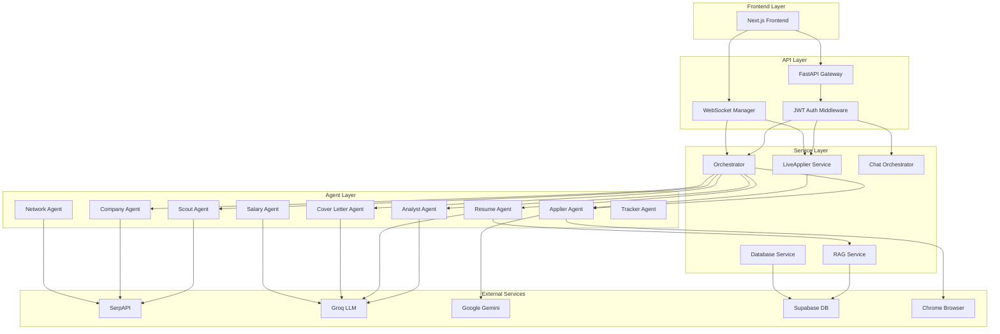

# 🚀 JobAI Backend - Comprehensive Architecture & Feature Documentation

> **Complete Technical Reference for JobAI Backend System**
> 
> Version: 2.0.0 | Production Ready | Last Updated: February 2026


---

## 📑 Table of Contents

1. [System Overview](#system-overview)
2. [Architecture Layers](#architecture-layers)
3. [Core Components](#core-components)
4. [AI Agents Deep Dive](#ai-agents-deep-dive)
5. [Automators (Pipeline Executors)](#automators-pipeline-executors)
6. [API Endpoints](#api-endpoints)
7. [Services & Infrastructure](#services--infrastructure)
8. [WebSocket Real-Time System](#websocket-real-time-system)
9. [Data Models](#data-models)
10. [Configuration & Security](#configuration--security)
11. [Workflows & Orchestration](#workflows--orchestration)
12. [Deployment Architecture](#deployment-architecture)

---

## 🏗️ System Overview

### Purpose
JobAI Backend is a production-grade, event-driven AI agent system that automates the entire job application lifecycle - from discovering opportunities to submitting applications with tailored resumes and cover letters.

### Core Technology Stack

| Component | Technology | Purpose |
|-----------|-----------|---------|
| **API Framework** | FastAPI | High-performance async HTTP/WebSocket server |
| **AI Models** | Groq (Llama 3.1/3.3), Google Gemini 2.0, OpenRouter | LLM inference for agents |
| **Browser Automation** | browser-use (Playwright) | Intelligent form filling and job applications |
| **Database** | Supabase (PostgreSQL) | User profiles, job listings, application tracking |
| **Vector DB** | Supabase pgvector | RAG (Retrieval Augmented Generation) for resume context |
| **Search** | SerpAPI | Job discovery and company research |
| **Real-Time** | WebSocket | Live agent updates and HITL (Human-in-the-Loop) |
| **Authentication** | JWT | Secure multi-tenant user management |
| **Task Queue** | Celery + Redis | Background job processing (optional) |
| **Observability** | Arize Phoenix (optional) | LLM tracing and monitoring |

### System Architecture Diagram



---

## 🧩 Architecture Layers

### Layer 1: Entry Points

#### 1.1 FastAPI Application (`src/main.py`)
**Purpose:** Main HTTP/WebSocket server gateway

**Key Features:**
- Async lifecycle management with ProactorEventLoop (Windows compatibility)
- CORS middleware with configurable origins
- Rate limiting (production-ready with Redis backend)
- Security headers middleware
- Request logging and size validation
- Custom exception handlers
- Development mode with Swagger docs (`/docs`, `/redoc`)

**Startup Sequence:**
```python
1. Initialize event loop (ProactorEventLoop for Windows)
2. Load environment configuration
3. Setup telemetry (Arize Phoenix if available)
4. Mount middleware stack:
   - RateLimitMiddleware
   - SecurityHeadersMiddleware
   - RequestLoggingMiddleware
   - RequestSizeLimitMiddleware
5. Register API routes
6. Start WebSocket manager
7. Begin serving on configured host:port
```

**Configuration:**
- Default: `0.0.0.0:8000`
- Environment-based docs (disabled in production)
- JWT authentication required for protected endpoints

#### 1.2 CLI Interface (`src/cli.py`)
**Purpose:** Command-line access to all agents for testing and scripting

**Available Commands:**

| Command | Description | Example |
|---------|-------------|---------|
| `search` | Full pipeline: find + analyze + apply | `python -m src.cli search "Python Dev" "Remote"` |
| `interview` | Interview prep with company research | `python -m src.cli interview "SWE" "Google" --tech Python,Django` |
| `salary` | Salary research and negotiation advice | `python -m src.cli salary "SDE" "NYC" --offer 150000` |
| `company` | Deep company culture research | `python -m src.cli company "Microsoft" --role "PM"` |
| `track` | Job application tracking | `python -m src.cli track --add "Google" "SWE"` |
| `network` | Find referrals via X-Ray search | `python -m src.cli network "Google" --alumni` |
| `resume` | Tailor resume for job | `python -m src.cli resume --job-url <url>` |
| `cover-letter` | Generate cover letter | `python -m src.cli cover-letter --job-url <url> --tone professional` |

**Usage Pattern:**
```bash
# Full pipeline with options
python -m src.cli search "Senior Python Engineer" "Remote" \
  --min-score 80 \
  --no-cover \
  --auto-apply

# Interview prep with specific tech stack
python -m src.cli interview "Backend Engineer" "Meta" \
  --tech "Python,Django,PostgreSQL,Redis"

# Salary negotiation
python -m src.cli salary "ML Engineer" "San Francisco" \
  --offer 180000
```

---

## 🤖 AI Agents Deep Dive

### Overview of Agent System

All agents inherit from `BaseAgent` abstract class providing:
- Standardized `run()` interface
- Access to `settings` (environment config)
- Logging via `logger`
- Error handling patterns

### Agent 1: Company Agent

**File:** `src/agents/company_agent.py`

**Purpose:** Pre-interview company research using AI and web search

**Architecture:**
- Uses LangChain's tool-based pattern
- Integrates SerpAPI for real-time company data
- Groq LLM (llama-3.1-8b-instant) for analysis

**Key Functions:**

#### `search_company_info(company: str, role: str = "") -> Dict`
**Input:**
- `company`: Company name (e.g., "Google")
- `role`: Target role for context (optional)

**Process:**
1. Constructs search query: `"{company} company overview facts mission competitors"`
2. Fetches results via SerpAPI
3. Sends to Groq LLM with structured prompt
4. Parses JSON response

**Output Schema:**
```json
{
  "company_name": "Google",
  "industry": "Tech",
  "size": "Enterprise",
  "employee_count": "150,000+",
  "founded": "1998",
  "headquarters": "Mountain View, CA",
  "mission": "Organize world's information...",
  "values": ["Innovation", "User Focus"],
  "tech_stack": ["Python", "Go", "TensorFlow"],
  "products": ["Search", "Cloud", "Android"],
  "competitors": ["Microsoft", "Amazon", "Meta"],
  "recent_news": ["Launched Gemini 2.0", "Q4 Earnings Beat"],
  "interview_tips": [
    "Mention their mission about...",
    "Show interest in their AI initiatives"
  ],
  "questions_to_ask": [
    "How does the team use AI in daily work?",
    "What's the culture around innovation?"
  ],
  "sources": ["https://about.google/", "https://news.google.com/..."]
}
```

#### `analyze_company_culture(company: str, role: str = "") -> Dict`
**Input:**
- Company name and target role

**Process:**
1. Search for culture reviews: `"{company} work culture employee reviews glassdoor {role}"`
2. LLM analyzes sentiment and patterns
3. Generates culture profile

**Output Schema:**
```json
{
  "work_life_balance": "4.2/5",
  "employee_satisfaction": "High",
  "culture_keywords": ["Fast-paced", "Collaborative", "Data-driven"],
  "pros": ["Great benefits", "Learning opportunities"],
  "cons": ["High expectations", "Long hours during crunch"],
  "interview_focus_areas": [
    "Demonstrate ability to work in fast-paced env",
    "Show data-driven decision making examples"
  ]
}
```

**Usage in Workflow:**
```python
from src.agents.company_agent import CompanyAgent

agent = CompanyAgent()
result = await agent.run(company="Stripe", role="Backend Engineer")
# Returns comprehensive company profile
```

---

### Agent 2: Interview Agent

**File:** `src/agents/interview_agent.py`

**Purpose:** Personalized interview preparation with curated resources

**Key Functions:**

#### `analyze_job_requirements(role, company, tech_stack, job_description) -> Dict`
**Input:**
- Job role and company
- Required tech stack list
- Full job description (optional)

**Process:**
1. Categorize skills: technical, soft, leadership
2. Detect seniority level from keywords
3. Determine interview round structure
4. Calculate preparation priorities

**Output:**
```json
{
  "role": "Senior Backend Engineer",
  "company": "Stripe",
  "is_senior_role": true,
  "technical_focus": ["Python", "PostgreSQL", "Redis", "Kubernetes"],
  "soft_skills_focus": ["Communication", "Mentoring"],
  "leadership_focus": ["Team Leadership", "Technical Decision Making"],
  "interview_rounds": [
    "Phone Screen",
    "Technical Round",
    "System Design",
    "Behavioral Round",
    "Hiring Manager"
  ],
  "preparation_priority": {
    "technical": 40,
    "behavioral": 30,
    "system_design": 20,
    "company_knowledge": 10
  }
}
```

#### `get_interview_resources(role, tech_stack, include_system_design) -> Dict`
**Purpose:** Provide curated learning resources

**Output:**
```json
{
  "dsa_sheets": [
    {
      "name": "Striver's SDE Sheet",
      "url": "https://takeuforward.org/interviews/strivers-sde-sheet...",
      "description": "180 problems covering all DSA topics",
      "difficulty": "Medium-Hard"
    },
    {
      "name": "NeetCode 150",
      "url": "https://neetcode.io/practice",
      "description": "Curated 150 LeetCode problems by topic",
      "difficulty": "Easy-Hard"
    }
  ],
  "leetcode_practice": [...],
  "system_design_resources": [...],
  "behavioral_guides": [...]
}
```

#### `generate_mock_questions(role, company, tech_stack, difficulty) -> List[Dict]`
**Output:**
```json
[
  {
    "type": "technical",
    "category": "algorithms",
    "question": "Implement an LRU cache with O(1) operations",
    "difficulty": "medium",
    "hints": ["Use HashMap + Doubly Linked List"],
    "optimal_solution_time": "O(1)",
    "optimal_solution_space": "O(capacity)"
  },
  {
    "type": "behavioral",
    "category": "leadership",
    "question": "Tell me about a time you had to make a difficult technical decision",
    "framework": "STAR (Situation, Task, Action, Result)"
  },
  {
    "type": "system_design",
    "question": "Design a URL shortener like bit.ly",
    "requirements": ["High availability", "Low latency", "Analytics"]
  }
]
```

---

### Agent 3: Resume Agent

**File:** `src/agents/resume_agent.py`

**Purpose:** AI-powered resume tailoring with RAG context

**Architecture:**
- Uses tool-based pattern (not full DeepAgent)
- Integrates RAG service for relevant experience retrieval
- Groq LLM (llama-3.1-8b-instant) for fast tailoring
- PDF generation via LaTeX/resume_service

**Key Functions:**

#### `extract_job_requirements(role, company, tech_stack, matching_skills, missing_skills) -> Dict`
**Input:**
- Job metadata and skill analysis

**Output:**
```json
{
  "role": "Backend Engineer",
  "company": "Stripe",
  "must_have": ["Python", "PostgreSQL", "REST APIs"],
  "keywords": ["Python", "PostgreSQL", "REST APIs", "Microservices"],
  "matching_skills": ["Python", "PostgreSQL"],
  "missing_skills": ["Kubernetes"],
  "experience_level": "mid-senior"
}
```

#### `tailor_resume_content(profile_json, requirements_json, feedback, rag_context) -> str`
**Purpose:** Main AI tailoring function

**Process:**
1. Parse user profile and job requirements
2. Query RAG service for relevant past experience
3. Construct prompt with compact profile + RAG context
4. Send to Groq LLM with structured output instructions
5. Validate and merge with original profile data

**Input:**
```json
{
  "profile_json": "{\"name\": \"John Doe\", \"skills\": {...}}",
  "requirements_json": "{\"role\": \"SDE\", \"keywords\": [...]}",
  "feedback": "Emphasize leadership experience more",
  "rag_context": "Relevant projects: 1) Led team of 5..."
}
```

**Output:**
```json
{
  "summary": "Results-driven Backend Engineer with 5 years experience...",
  "skills": {
    "primary": ["Python", "PostgreSQL", "REST APIs"],
    "secondary": ["Docker", "CI/CD"],
    "tools": ["Git", "Jira", "VS Code"]
  },
  "experience": [
    {
      "company": "TechCorp",
      "title": "Senior Backend Engineer",
      "highlights": [
        "Led migration to microservices architecture...",
        "Reduced API latency by 40%..."
      ]
    }
  ],
  "tailoring_notes": "Emphasized PostgreSQL and API design experience"
}
```

#### `generate_latex_resume(tailored_content_json, template) -> str`
**Purpose:** Convert tailored content to LaTeX

**Output:** LaTeX string ready for PDF compilation

#### `compile_pdf(latex_content, output_path) -> str`
**Process:**
1. Write LaTeX to temp file
2. Run `pdflatex` (requires LaTeX installed)
3. Return path to generated PDF

**Complete Workflow:**
```python
from src.agents.resume_agent import ResumeAgent

agent = ResumeAgent()
result = await agent.run(
    profile=user_profile,
    job_analysis=analyst_result,
    output_path="tailored_resume.pdf"
)
# result.resume_path = path to generated PDF
# result.tailoring_notes = what was changed
```

---

### Agent 4: Salary Agent

**File:** `src/agents/salary_agent.py`

**Purpose:** Market salary research and negotiation strategy

**Key Functions:**

#### `search_market_salary(role, location, experience_years, company) -> Dict`
**Input:**
- Role, location, experience level
- Optional specific company

**Output:**
```json
{
  "role": "Software Engineer",
  "location": "San Francisco",
  "experience_years": 3,
  "salary_range": {
    "p25": 120000,
    "p50": 145000,
    "p75": 170000,
    "p90": 200000
  },
  "total_compensation": {
    "base_salary": 145000,
    "bonus_percentage": 15,
    "equity_range": "50000-150000"
  },
  "factors_affecting_salary": [
    "Tech stack (Python, Go)",
    "High COL area (SF)",
    "Hot job market for SWE"
  ],
  "market_trend": "growing",
  "demand_level": "high",
  "data_sources": ["Levels.fyi", "Glassdoor", "LinkedIn Salary"],
  "notes": "FAANG companies pay 20-30% above market"
}
```

#### `analyze_offer(base_salary, bonus, equity, benefits, role, location) -> Dict`
**Purpose:** Evaluate job offer against market

**Output:**
```json
{
  "base_salary": 150000,
  "total_comp": 180000,
  "market_percentile": "75th",
  "rating": "Good",
  "vs_market": "+15%",
  "strengths": ["Above market base", "Strong equity package"],
  "weaknesses": ["Bonus below industry standard"],
  "negotiation_leverage": "Medium",
  "recommendations": [
    "Request 10% bonus increase to match market",
    "Ask about promotion timeline",
    "Negotiate signing bonus"
  ]
}
```

#### `generate_negotiation_script(offer_analysis, target_increase, user_situation) -> Dict`
**Output:**
```json
{
  "opening_line": "Thank you for the offer. I'm excited about the role...",
  "justification": "Based on my research and market data for similar roles...",
  "counter_offer": {
    "base_salary": 165000,
    "justification": "Aligned with 75th percentile for SF market"
  },
  "alternative_asks": [
    "10% sign-on bonus",
    "Earlier equity vest schedule",
    "Remote work flexibility"
  ],
  "closing": "I'm confident we can reach an agreement that works for both...",
  "email_template": "Full email text...",
  "phone_script": "Talking points for call..."
}
```

---

### Agent 5: Network Agent

**File:** `src/agents/network_agent.py`

**Purpose:** LinkedIn X-Ray search for referral connections

**Unique Feature:** Safe public search (no LinkedIn ban risk)

**Architecture:**
- Uses SerpAPI to search Google's LinkedIn index
- No direct LinkedIn API calls
- Alumni matching from user education
- Location-based connections

**Key Functions:**

#### `find_contacts(company: str, profile: UserProfile) -> NetworkSearchResult`
**Input:**
- Target company
- User profile with education/experience history

**Process:**
1. Extract search criteria from profile:
   - Alumni: user's universities
   - Location: user's city
   - Past employers: shared work history
2. Build X-Ray search queries
3. Execute parallel searches via SerpAPI
4. Parse and deduplicate results
5. Generate personalized outreach messages

**X-Ray Search Examples:**
```python
# Alumni search
"site:linkedin.com/in/ Google Stanford University"

# Location search  
"site:linkedin.com/in/ Google San Francisco"

# Past employer search
"site:linkedin.com/in/ Google Microsoft"
```

**Output:**
```json
{
  "company": "Google",
  "total_matches": 15,
  "matches": [
    {
      "name": "Jane Smith",
      "headline": "Software Engineer at Google",
      "profile_url": "https://linkedin.com/in/janesmith",
      "connection_type": "alumni",
      "college_match": "Stanford University",
      "confidence_score": 0.9,
      "outreach_message": "Hi Jane, I noticed we're both Stanford alums..."
    },
    {
      "name": "John Doe",
      "headline": "Engineering Manager at Google",
      "profile_url": "https://linkedin.com/in/johndoe",
      "connection_type": "location",
      "location_match": "San Francisco",
      "confidence_score": 0.7,
      "outreach_message": "Hi John, I'm a fellow SF-based engineer..."
    }
  ],
  "outreach_tips": [
    "Mention shared college experiences",
    "Ask about team culture, not jobs directly",
    "Keep initial message under 100 words"
  ]
}
```

**Outreach Message Generation:**
```python
async def _generate_outreach(match: NetworkMatch, user: UserProfile, company: str) -> str:
    """Uses Groq LLM to generate personalized message"""
    
prompt = f"""
Generate a LinkedIn connection request message:
- User: {user.personal_information.first_name}
- Target: {match.name} at {company}
- Connection: {match.connection_type} ({match.college_match or match.location_match})
- Keep under 100 words
- Sound genuine, not salesy
"""
```

---

### Agent 6: Cover Letter Agent

**File:** `src/agents/cover_letter_agent.py`

**Purpose:** Multi-step cover letter generation with LangGraph workflow

**Architecture:**
- LangGraph StateGraph for multi-step workflow
- Groq LLM (llama-3.3-70b-versatile) for creative writing
- Human-in-the-Loop verification
- Memory checkpointing for revisions

**State Machine:**
```python
class CoverLetterState(TypedDict):
    # Input
    job_analysis: Dict
    user_profile: Dict
    tone: str
    hitl_handler: Optional[Callable]
    
    # Planning
    plan: list
    current_step: int
    
    # Processing
    company_research: Dict
    content: Dict
    full_text: str
    
    # HITL
    needs_human_review: bool
    human_approved: bool
    human_feedback: str
    
    # Output
    result: Dict
    error: str
```

**Workflow Nodes:**

#### 1. `_plan_node`
- Creates 5-step plan
- Sets tone (professional/enthusiastic/formal/casual)

#### 2. `_research_company_node`
- Infers company culture from job posting
- Identifies key values to highlight

#### 3. `_generate_content_node`
- Main content generation
- Uses RAG for relevant experiences
- Tone-aware writing

**Output Schema:**
```json
{
  "opening": "Paragraph introducing yourself...",
  "body": [
    "Paragraph 1: Relevant experience...",
    "Paragraph 2: Skills match...",
    "Paragraph 3: Why this company..."
  ],
  "closing": "Enthusiastic closing...",
  "call_to_action": "I'd love to discuss..."
}
```

#### 4. `_format_letter_node`
- Assembles full letter with proper formatting
- Adds signature block

#### 5. `_human_review_node`
- Presents draft to user via WebSocket
- Waits for approval/feedback

#### 6. `_finalize_node`
- Saves approved version
- Returns final text

**Conditional Flow:**
```python
def _should_continue(state: CoverLetterState):
    if state["human_approved"]:
        return "approved"
    elif state["human_feedback"]:
        return "revise"
    else:
        return "end"
```

**Usage:**
```python
from src.agents.cover_letter_agent import CoverLetterAgent

agent = CoverLetterAgent()
result = await agent.run(
    job_analysis=analyst_result,
    user_profile=profile,
    tone="enthusiastic",
    hitl_handler=websocket_handler
)
# result.cover_letter = final text
# result.tailoring_notes = customization details
```

---

### Agent 7: Tracker Agent

**File:** `src/agents/tracker_agent.py`

**Purpose:** Job application tracking with Notion integration

**Data Model:**
```python
class JobApplication:
    company: str
    role: str
    status: str  # Applied, Phone Screen, Interview, Offer, Rejected
    applied_date: str
    url: str
    salary_range: str
    notes: str
    next_step: str
    priority: str  # High, Medium, Low
    last_updated: str
```

**Key Functions:**

#### `add_job_application(company, role, url, salary_range, notes, priority) -> Dict`
**Purpose:** Track new application

**Output:**
```json
{
  "status": "success",
  "message": "Added Google - Software Engineer",
  "application": {
    "company": "Google",
    "role": "Software Engineer",
    "status": "Applied",
    "applied_date": "2026-02-04",
    "priority": "High"
  }
}
```

#### `update_application_status(company, role, new_status, notes) -> Dict`
**Purpose:** Update status (Applied → Phone Screen → Interview → Offer)

#### `get_applications(status_filter, priority_filter) -> List[JobApplication]`
**Purpose:** Query tracked applications

#### `generate_report() -> Dict`
**Purpose:** Analytics dashboard

**Output:**
```json
{
  "total_applications": 25,
  "by_status": {
    "Applied": 15,
    "Phone Screen": 5,
    "Interview": 3,
    "Offer": 1,
    "Rejected": 1
  },
  "success_rate": "4%",
  "avg_response_time": "7 days",
  "top_companies": ["Google", "Meta", "Amazon"],
  "insights": [
    "Higher response rate from startups",
    "Tech stack: Python jobs have 60% response rate"
  ]
}
```

---

## 🔧 Automators (Pipeline Executors)

### Overview
Automators are the execution layer that coordinates agents into complete workflows. They handle:
- Multi-agent orchestration
- Error handling and retries
- Progress tracking
- State management

### Automator 1: Scout Agent

**File:** `src/automators/scout.py`

**Purpose:** Job discovery via targeted web search

**Architecture:**
- SerpAPI for Google search
- Groq LLM for query optimization
- Self-correction on failure
- ATS platform targeting

**Key Features:**

#### 1. Targeted ATS Search
```python
ats_domains = [
    "site:greenhouse.io",
    "site:lever.co", 
    "site:ashbyhq.com"
]

query = f'{job_query} {location} ({" OR ".join(ats_domains)})'
```

**Why ATS platforms?**
- Standardized application forms (easier automation)
- Higher quality job postings
- Direct employer listings (no spam)

#### 2. Time-Based Filtering
```python
tbs_map = {
    "day": "qdr:d",    # Last 24 hours
    "week": "qdr:w",   # Last week
    "month": "qdr:m",  # Last month
    "year": "qdr:y"    # Last year
}
```

#### 3. Self-Correction (Reflection Pattern)
**Scenario:** Search returns 0 results

**Process:**
1. Detect failure (no valid ATS links)
2. Send query to LLM: "Why did this search fail?"
3. LLM generates broader query
4. Retry with new query (max 2 attempts)

**Example:**
```
Original: "Senior Principal Staff Software Engineer Python Remote"
↓
Optimized: "Senior Software Engineer Python Remote"
(removed overly specific seniority levels)
```

**Complete Run Method:**
```python
async def run(
    self, 
    query: str, 
    location: str = "", 
    freshness: str = "month", 
    attempt: int = 1
) -> List[str]:
    """
    Returns list of valid job URLs
    """
    # 1. Construct search query
    full_query = f'{query} {location}'.strip()
    target_query = f'{full_query} ({" OR ".join(self.ats_domains)})'
    
    # 2. Execute search via SerpAPI
    raw_results = self.search.results(target_query)
    organic_results = raw_results.get('organic_results', [])
    
    # 3. Filter for valid ATS domains
    valid_urls = self._filter_results(organic_results)
    
    # 4. Self-correct if needed
    if not valid_urls and attempt < 2:
        return await self._reflect_and_retry(query, location, freshness, attempt)
    
    return valid_urls
```

**Input/Output Example:**

**Input:**
```python
await scout.run(
    query="Backend Engineer", 
    location="Remote", 
    freshness="week"
)
```

**Output:**
```python
[
    "https://boards.greenhouse.io/stripe/jobs/123456",
    "https://jobs.lever.co/netflix/backend-engineer",
    "https://jobs.ashbyhq.com/notion/engineer-backend",
    ...
]
```

---

### Automator 2: Analyst Agent

**File:** `src/automators/analyst.py`

**Purpose:** Job-resume matching analysis

**Architecture:**
- Web scraping with BeautifulSoup
- Groq LLM (llama-3.3-70b-versatile) for analysis
- Structured output (Pydantic validation)

**Process Flow:**

#### 1. Fetch Job Posting
```python
def _fetch_page_content(url: str) -> str:
    """
    1. HTTP GET with user-agent header
    2. Parse HTML with BeautifulSoup
    3. Remove scripts, styles, nav, footer
    4. Extract clean text
    5. Limit to 20,000 chars (LLM context)
    """
```

#### 2. AI Analysis
**Prompt Structure:**
```
You are an expert HR Analyst.

JOB POSTING URL: {url}
JOB POSTING TEXT:
{job_text}

CANDIDATE RESUME:
{resume_text}

Return valid JSON with:
- role: Job title
- company: Company name
- salary: Salary range or "Not mentioned"
- tech_stack: Key technologies (max 8)
- matching_skills: Skills candidate has (max 6)
- missing_skills: Skills candidate is missing (max 6)
- gap_analysis_advice: Actionable advice (2 sentences)
- match_score: 0-100 score
- reasoning: Explanation (2-3 sentences)
```

#### 3. Structured Output
```python
class JobAnalysis(BaseModel):
    role: str
    company: str
    match_score: int
    matching_skills: List[str]
    missing_skills: List[str]
    tech_stack: List[str]
    gap_analysis_advice: Optional[str]
    salary: Optional[str]
    reasoning: Optional[str]
```

**Example Output:**
```json
{
  "role": "Senior Backend Engineer",
  "company": "Stripe",
  "match_score": 85,
  "salary": "$150,000 - $200,000",
  "tech_stack": [
    "Python",
    "PostgreSQL",
    "Redis",
    "Kubernetes",
    "AWS",
    "Terraform"
  ],
  "matching_skills": [
    "Python",
    "PostgreSQL",
    "AWS",
    "Docker"
  ],
  "missing_skills": [
    "Kubernetes",
    "Terraform"
  ],
  "gap_analysis_advice": "Add 'Kubernetes' to your skills section and highlight any container orchestration experience. Mention infrastructure-as-code experience even if not using Terraform specifically.",
  "reasoning": "Strong match on core backend skills (Python, PostgreSQL). Missing some DevOps tools but not critical for role. Previous fintech experience is valuable."
}
```

**Rich Console Output:**
The agent provides formatted console output:
```
╔══════════════════════════════════════════════════════════════╗
║             🧠 JOB ANALYSIS REPORT                          ║
╠══════════════════════════════════════════════════════════════╣
║ Role:     Senior Backend Engineer                           ║
║ Company:  Stripe                                             ║
║ Salary:   $150,000 - $200,000                               ║
║ Match:    85/100 ⭐⭐⭐⭐                                     ║
╠══════════════════════════════════════════════════════════════╣
║ Tech Stack: Python, PostgreSQL, Redis, Kubernetes...        ║
║ ✅ Matching: Python, PostgreSQL, AWS, Docker                ║
║ ❌ Missing:  Kubernetes, Terraform                          ║
╠══════════════════════════════════════════════════════════════╣
║ 💡 Advice: Add 'Kubernetes' to your skills section...       ║
╚══════════════════════════════════════════════════════════════╝
```

---

### Automator 3: Applier Agent

**File:** `src/automators/applier.py`

**Purpose:** Intelligent browser automation for job applications

**Architecture:**
- browser-use library (Playwright wrapper)
- Google Gemini 2.0 Flash (vision-enabled)
- OpenRouter Qwen (fallback)
- YAML profile parsing
- Human-in-the-loop via `ask_human` action

**Key Components:**

#### 1. Browser Configuration
```python
browser = Browser(
    executable_path=settings.chrome_path,
    user_data_dir=settings.user_data_dir,  # Persistent session
    profile_directory=settings.profile_directory,
    headless=settings.headless  # Default: False (visible)
)
```

#### 2. LLM Configuration
```python
# Primary: Gemini 2.0 Flash (vision + speed)
fallback_llm = ChatGoogle(
    model='gemini-2.0-flash-exp',
    api_key=settings.gemini_api_key.get_secret_value()
)

# Fallback: OpenRouter Qwen (free)
llm = ChatOpenAI(
    model=settings.openrouter_model,
    base_url='https://openrouter.ai/api/v1',
    api_key=settings.get_openrouter_key()
)
```

**Why Gemini for Applier?**
- Vision support (screenshot → action mapping)
- Fast inference (sub-second responses)
- Accurate form field detection
- Cost-effective (free tier generous)

#### 3. Task Prompt Template
```python
task_prompt = f"""
GOAL: Navigate to {url} and apply for the job using my profile data.

👤 CANDIDATE PROFILE:
{profile_yaml}

📋 EXECUTION STEPS:
1. Navigation: Go to URL, handle login via 'ask_human' if needed
2. Form Filling:
   - Map 'First Name', 'Last Name', 'Email', 'Phone' from PROFILE
   - LinkedIn/GitHub: Use URLs from profile
   - Experience: Calculate from dates
   - Sponsorship: "No" / "Authorized to work"
3. Smart Answers: For "Why this job?" → concise 2-sentence answer
4. File Upload: Upload resume from "{resume_path}" (click input, no drag-drop)
5. Final Review: Click 'Submit' or 'Apply'

⚠️ CRITICAL RULES:
- If missing data (e.g. SSN), use 'ask_human'
- Prioritize "Easy Apply" if available
- Multi-action sequences preferred (fill multiple fields at once)
"""
```

#### 4. Human-in-the-Loop (HITL)
```python
@controller.action(description='Ask human for help')
def ask_human(question: str) -> str:
    """
    Pauses automation, requests user input via console
    """
    answer = input(f'\n  ❓ {question}\n  Your answer > ')
    return f'Human responded: {answer}'
```

**Example HITL Scenarios:**
- Login required (captcha, 2FA)
- Missing data (SSN, references)
- Ambiguous form fields
- Confirmation before submit

#### 5. Speed Optimizations
```python
SPEED_OPTIMIZATION_PROMPT = """
- Be extremely concise
- Use multi-action sequences (fill multiple fields in one go)
- Do not scroll unless necessary
- Skip unnecessary page loads
"""
```

**Complete Workflow:**
```python
async def run(self, url: str, profile: UserProfile) -> str:
    """
    1. Load profile (YAML format)
    2. Initialize browser with persistent session
    3. Configure Gemini + fallback LLMs
    4. Create browser_use Agent with:
       - Task prompt
       - Profile data
       - Resume path
       - HITL controller
       - Vision enabled
    5. Run agent (async)
    6. Handle errors/HITL requests
    7. Return success/failure
    """
```

**Input:**
```python
await applier.run(
    url="https://boards.greenhouse.io/stripe/jobs/123456",
    profile=user_profile
)
```

**Output:**
```python
"Application process finished."
# OR raises exception with error details
```

**Console Output:**
```
╔══════════════════════════════════════════════════════════════╗
║         🚀 APPLIER AGENT - JOB APPLICATION                  ║
╠══════════════════════════════════════════════════════════════╣
║ URL: https://boards.greenhouse.io/stripe/jobs/123456        ║
╠══════════════════════════════════════════════════════════════╣
║ [1/5] Preparing application...                              ║
║ [2/5] Initializing browser (Chrome)...                      ║
║ [3/5] Navigating to job posting...                          ║
║ [4/5] Filling form fields...                                ║
║       ✓ Name: John Doe                                      ║
║       ✓ Email: john@example.com                             ║
║       ✓ Phone: +1-234-567-8900                              ║
║       ✓ Uploaded: resume.pdf                                ║
║ [5/5] Submitting application...                             ║
╠══════════════════════════════════════════════════════════════╣
║ ✅ APPLICATION COMPLETE                                      ║
╚══════════════════════════════════════════════════════════════╝
```

---

## 🌐 API Endpoints

### Overview
REST API built with FastAPI providing access to all agents and services.

### Authentication
```python
from src.core.auth import get_current_user, AuthUser

@router.get("/protected")
async def protected_route(user: AuthUser = Depends(get_current_user)):
    # user.id = user's unique ID
    # user.email = user's email
    pass
```

**JWT Token Format:**
```json
{
  "sub": "user_123",
  "email": "user@example.com",
  "exp": 1706832000
}
```

**Authentication Flow:**
1. User logs in → receives JWT token
2. Frontend includes token in requests: `Authorization: Bearer <token>`
3. Middleware validates token
4. User object injected into route handler

---

### Endpoint Category 1: Jobs API

**File:** `src/api/routes/jobs.py`

#### `POST /api/jobs/search`
**Purpose:** Search for jobs using Scout Agent

**Request:**
```json
{
  "query": "Backend Engineer",
  "location": "Remote",
  "platforms": ["greenhouse", "lever", "ashby"],
  "min_match_score": 70
}
```

**Response:**
```json
{
  "status": "success",
  "query": "Backend Engineer",
  "location": "Remote",
  "jobs": [
    "https://boards.greenhouse.io/stripe/jobs/123",
    "https://jobs.lever.co/netflix/engineer-backend"
  ],
  "total": 15
}
```

#### `GET /api/jobs/results`
**Purpose:** Get analyzed job results from database

**Query Parameters:**
- `limit` (1-100, default 20)
- `offset` (pagination, default 0)
- `min_score` (filter by match score)
- `source` (filter by source: scout, manual)

**Response:**
```json
{
  "jobs": [
    {
      "id": "job_123",
      "title": "Backend Engineer",
      "company": "Stripe",
      "location": "Remote",
      "url": "https://...",
      "match_score": 85,
      "platform": "greenhouse",
      "salary": "$150k-$200k",
      "tech_stack": ["Python", "PostgreSQL"],
      "matching_skills": ["Python", "PostgreSQL"],
      "missing_skills": ["Kubernetes"]
    }
  ],
  "total": 45,
  "page": 1,
  "limit": 20
}
```

#### `GET /api/jobs/{job_id}`
**Purpose:** Get detailed job analysis

**Response:**
```json
{
  "id": "job_123",
  "url": "https://...",
  "title": "Backend Engineer",
  "company": "Stripe",
  "analysis": {
    "match_score": 85,
    "tech_stack": ["Python", "PostgreSQL", "Redis"],
    "matching_skills": ["Python", "PostgreSQL"],
    "missing_skills": ["Kubernetes"],
    "gap_analysis_advice": "Add Kubernetes to skills...",
    "reasoning": "Strong backend match..."
  },
  "created_at": "2026-02-04T10:30:00Z",
  "analyzed_at": "2026-02-04T10:31:00Z"
}
```

#### `POST /api/jobs/analyze`
**Purpose:** Analyze specific job URL

**Request:**
```json
{
  "url": "https://boards.greenhouse.io/stripe/jobs/123",
  "user_id": "user_123"
}
```

**Response:**
```json
{
  "analysis": { /* JobAnalysis object */ },
  "saved": true,
  "job_id": "job_456"
}
```

#### `POST /api/jobs/apply`
**Purpose:** Apply to job via Applier Agent

**Request:**
```json
{
  "job_id": "job_123",
  "user_id": "user_123",
  "draft_mode": true
}
```

**Response:**
```json
{
  "status": "queued",
  "task_id": "task_789",
  "message": "Application started. Connect to WebSocket for live updates."
}
```

---

### Endpoint Category 2: User Profile API

**File:** `src/api/routes/user.py`

#### `POST /api/user/profile`
**Purpose:** Create user profile (onboarding)

**Request:**
```json
{
  "full_name": "John Doe",
  "email": "john@example.com",
  "phone": "+1-234-567-8900",
  "location": "San Francisco, CA",
  "linkedin_url": "https://linkedin.com/in/johndoe",
  "summary": "Backend engineer with 5 years experience...",
  "skills": ["Python", "PostgreSQL", "Docker"],
  "years_of_experience": 5,
  "desired_roles": ["Backend Engineer", "Full Stack Engineer"],
  "min_salary": 150000,
  "work_authorization": "Authorized",
  "relocation": "No"
}
```

**Response:**
```json
{
  "status": "success",
  "user_id": "user_123",
  "profile": { /* complete UserProfile object */ }
}
```

#### `GET /api/user/profile`
**Purpose:** Get current user's profile

**Response:**
```json
{
  "user_id": "user_123",
  "personal_information": {
    "first_name": "John",
    "last_name": "Doe",
    "full_name": "John Doe",
    "email": "john@example.com",
    "phone": "+1-234-567-8900",
    "location": {
      "city": "San Francisco",
      "country": "USA",
      "address": "San Francisco, CA"
    },
    "urls": {
      "linkedin": "https://linkedin.com/in/johndoe",
      "github": "https://github.com/johndoe"
    }
  },
  "skills": {
    "primary": ["Python", "PostgreSQL"],
    "secondary": ["Docker", "Redis"],
    "tools": ["Git", "VS Code"]
  },
  "experience": [
    {
      "title": "Senior Backend Engineer",
      "company": "TechCorp",
      "start_date": "2020-01",
      "end_date": "2025-12",
      "description": "Led backend team..."
    }
  ],
  "education": [...],
  "projects": [...]
}
```

#### `PUT /api/user/profile`
**Purpose:** Update profile

**Request:** Partial update (only send changed fields)
```json
{
  "summary": "Updated professional summary...",
  "skills": {
    "primary": ["Python", "Go", "PostgreSQL"]
  }
}
```

#### `POST /api/user/education`
**Purpose:** Add education entry

**Request:**
```json
{
  "degree": "Bachelor of Science",
  "major": "Computer Science",
  "university": "Stanford University",
  "start_date": "2015-09",
  "end_date": "2019-06",
  "cgpa": "3.8"
}
```

#### `POST /api/user/experience`
**Purpose:** Add work experience

**Request:**
```json
{
  "title": "Senior Backend Engineer",
  "company": "TechCorp",
  "start_date": "2020-01",
  "end_date": "2025-12",
  "is_current": true,
  "description": "Led team of 5 engineers..."
}
```

#### `POST /api/user/upload-resume`
**Purpose:** Upload resume PDF

**Request:** multipart/form-data
- `file`: PDF file
- `user_id`: User ID

**Response:**
```json
{
  "status": "success",
  "file_path": "users/user_123/resume.pdf",
  "text_extracted": true,
  "rag_synced": true
}
```

**Process:**
1. Upload file to Supabase Storage
2. Extract text using PyPDF2
3. Sync to RAG (vector database)
4. Update user profile with file path

---

### Endpoint Category 3: Chat API

**File:** `src/api/routes/chat.py`

#### `POST /api/chat/message`
**Purpose:** Send message to AI assistant

**Request:**
```json
{
  "content": "Find me backend engineering jobs in San Francisco",
  "session_id": "session_123"
}
```

**Response:**
```json
{
  "id": "msg_456",
  "role": "assistant",
  "content": "I'll search for backend engineering jobs in San Francisco for you.",
  "intent": {
    "action": "search_jobs",
    "parameters": {
      "query": "Backend Engineer",
      "location": "San Francisco"
    }
  },
  "timestamp": "10:30 AM"
}
```

**Intent Types:**
- `search_jobs`: Trigger job search
- `analyze_job`: Analyze specific job
- `apply_job`: Start application
- `tailor_resume`: Generate tailored resume
- `interview_prep`: Provide interview resources
- `salary_research`: Research salary data
- `network_search`: Find referral connections

---

### Endpoint Category 4: Pipeline API

**File:** `src/api/routes/pipeline.py` (implied)

#### `POST /api/pipeline/start`
**Purpose:** Start full pipeline with WebSocket streaming

**Request:**
```json
{
  "query": "Backend Engineer",
  "location": "Remote",
  "min_match_score": 75,
  "auto_apply": false,
  "options": {
    "use_company_research": true,
    "use_resume_tailoring": true,
    "use_cover_letter": true
  },
  "session_id": "ws_session_123"
}
```

**Response:**
```json
{
  "status": "started",
  "session_id": "ws_session_123",
  "message": "Connect to WebSocket for live updates"
}
```

**WebSocket Event Flow:**
```
→ pipeline:start
→ scout:start
→ scout:searching
→ scout:found (15 jobs)
→ scout:complete
→ analyst:start
→ analyst:analyzing (job 1/15)
→ analyst:result (match_score: 85)
→ company:start
→ company:researching
→ company:result
→ resume:start
→ resume:tailoring
→ resume:generated
→ cover_letter:start
→ cover_letter:generating
→ cover_letter:complete
→ pipeline:complete
```

---

## 🔌 WebSocket Real-Time System

**File:** `src/api/websocket.py`

### Overview
WebSocket system enables real-time bidirectional communication for:
- Live agent progress updates
- Browser screenshots during application
- Human-in-the-Loop (HITL) requests
- Draft mode confirmations
- Multi-client broadcasting

### Architecture

```python
class ConnectionManager:
    active_connections: Dict[str, WebSocket]  # session_id → WebSocket
    event_history: List[AgentEvent]  # Last 50 events
    hitl_callbacks: Dict[str, asyncio.Future]  # HITL request tracking
```

### Event Types

```python
class EventType(str, Enum):
    # Connection
    CONNECTED = "connected"
    DISCONNECTED = "disconnected"
    
    # Pipeline
    PIPELINE_START = "pipeline:start"
    PIPELINE_COMPLETE = "pipeline:complete"
    PIPELINE_ERROR = "pipeline:error"
    
    # Scout
    SCOUT_START = "scout:start"
    SCOUT_SEARCHING = "scout:searching"
    SCOUT_FOUND = "scout:found"
    SCOUT_COMPLETE = "scout:complete"
    
    # Analyst
    ANALYST_START = "analyst:start"
    ANALYST_FETCHING = "analyst:fetching"
    ANALYST_ANALYZING = "analyst:analyzing"
    ANALYST_RESULT = "analyst:result"
    
    # Company Research
    COMPANY_START = "company:start"
    COMPANY_RESEARCHING = "company:researching"
    COMPANY_RESULT = "company:result"
    
    # Resume Tailoring
    RESUME_START = "resume:start"
    RESUME_TAILORING = "resume:tailoring"
    RESUME_GENERATED = "resume:generated"
    RESUME_COMPLETE = "resume:complete"
    
    # Cover Letter
    COVER_LETTER_START = "cover_letter:start"
    COVER_LETTER_GENERATING = "cover_letter:generating"
    COVER_LETTER_COMPLETE = "cover_letter:complete"
    
    # Applier
    APPLIER_START = "applier:start"
    APPLIER_NAVIGATE = "applier:navigate"
    APPLIER_CLICK = "applier:click"
    APPLIER_TYPE = "applier:type"
    APPLIER_UPLOAD = "applier:upload"
    APPLIER_SCREENSHOT = "applier:screenshot"
    APPLIER_COMPLETE = "applier:complete"
    
    # Draft Mode (Trust-Building)
    DRAFT_REVIEW = "draft:review"      # Form filled, awaiting confirmation
    DRAFT_CONFIRM = "draft:confirm"    # User confirmed, proceed to submit
    DRAFT_EDIT = "draft:edit"          # User wants to edit
    
    # HITL
    HITL_REQUEST = "hitl:request"
    HITL_RESPONSE = "hitl:response"
    
    # Browser
    BROWSER_SCREENSHOT = "browser:screenshot"
    
    # Chat
    CHAT_MESSAGE = "chat:message"
    
    # Task Queue
    TASK_QUEUED = "task:queued"
    TASK_STARTED = "task:started"
    TASK_PROGRESS = "task:progress"
    TASK_COMPLETE = "task:complete"
    TASK_FAILED = "task:failed"
    
    # NetworkAI
    NETWORK_SEARCH_START = "network:search_start"
    NETWORK_MATCH_FOUND = "network:match_found"
    NETWORK_SEARCH_COMPLETE = "network:search_complete"
```

### Event Structure

```python
@dataclass
class AgentEvent:
    type: EventType
    agent: str
    message: str
    data: Optional[Dict] = None
    timestamp: str = None
```

**Example Event:**
```json
{
  "type": "analyst:result",
  "agent": "analyst",
  "message": "Analyzed Stripe - Backend Engineer",
  "data": {
    "job_id": "job_123",
    "match_score": 85,
    "company": "Stripe",
    "role": "Backend Engineer",
    "matching_skills": ["Python", "PostgreSQL"],
    "missing_skills": ["Kubernetes"]
  },
  "timestamp": "10:30:45"
}
```

### Connection Flow

#### 1. Client Connects
```javascript
const ws = new WebSocket('ws://localhost:8000/ws');
ws.onopen = () => {
  // Send authentication
  ws.send(JSON.stringify({
    type: 'auth',
    token: 'jwt_token_here',
    session_id: 'session_123'
  }));
};
```

#### 2. Server Authenticates
```python
@app.websocket("/ws")
async def websocket_endpoint(websocket: WebSocket):
    await websocket.accept()
    
    # Wait for auth message
    auth_data = await websocket.receive_json()
    token = auth_data.get('token')
    session_id = auth_data.get('session_id')
    
    # Validate JWT
    payload = verify_token(token)
    user_id = payload['sub']
    
    # Register connection
    await manager.connect(websocket, session_id, token)
    
    # Send event history (last 50 events for reconnection)
    for event in manager.event_history[-50:]:
        await websocket.send_json(event.to_dict())
    
    # Keep connection alive
    try:
        while True:
            data = await websocket.receive_json()
            await handle_client_message(websocket, session_id, data)
    except WebSocketDisconnect:
        manager.disconnect(session_id)
```

### Broadcasting Events

```python
# Broadcast to all connected clients
await manager.broadcast(AgentEvent(
    type=EventType.SCOUT_FOUND,
    agent="scout",
    message="Found 15 job listings",
    data={"count": 15, "urls": [...]}
))

# Send to specific session
await manager.send_event(session_id, AgentEvent(...))
```

### Human-in-the-Loop (HITL)

#### Server Side (Applier Agent)
```python
async def request_hitl(session_id: str, question: str) -> str:
    """
    Request human input and wait for response
    """
    hitl_id = f"hitl_{timestamp()}"
    future = asyncio.get_running_loop().create_future()
    
    # Store future
    manager.hitl_callbacks[hitl_id] = future
    
    # Send request to client
    await manager.send_event(session_id, AgentEvent(
        type=EventType.HITL_REQUEST,
        agent="applier",
        message=question,
        data={"hitl_id": hitl_id}
    ))
    
    # Wait for response (2 min timeout)
    try:
        response = await asyncio.wait_for(future, timeout=120)
        return response
    except asyncio.TimeoutError:
        return "No response, skipping"
```

#### Client Side (Frontend)
```javascript
ws.onmessage = (event) => {
  const data = JSON.parse(event.data);
  
  if (data.type === 'hitl:request') {
    // Show input modal to user
    showHITLModal(data.message, data.data.hitl_id);
  }
};

// User responds
function submitHITL(hitl_id, response) {
  ws.send(JSON.stringify({
    type: 'hitl:response',
    hitl_id: hitl_id,
    response: response
  }));
}
```

#### Server Receives Response
```python
async def handle_client_message(websocket, session_id, data):
    if data['type'] == 'hitl:response':
        hitl_id = data['hitl_id']
        response = data['response']
        
        # Resolve future
        if hitl_id in manager.hitl_callbacks:
            future = manager.hitl_callbacks[hitl_id]
            future.set_result(response)
            del manager.hitl_callbacks[hitl_id]
```

### Draft Mode

**Purpose:** Build trust by showing form before submission

#### Workflow
```python
# 1. Applier fills form
await emit_event(EventType.APPLIER_TYPE, "Filling name field...")

# 2. Form complete, request review
await emit_event(EventType.DRAFT_REVIEW, "Form filled. Review before submit?", {
    "screenshot": "base64_image_data",
    "fields_filled": ["name", "email", "phone", "resume"]
})

# 3. Wait for user confirmation
response = await wait_for_confirmation(session_id)

# 4. User confirms
if response == "confirm":
    await emit_event(EventType.DRAFT_CONFIRM, "Submitting application...")
    click_submit_button()
elif response == "edit":
    await emit_event(EventType.DRAFT_EDIT, "Pausing for manual edits...")
    pause_automation()
```

### Screenshot Streaming

```python
async def stream_screenshot_loop(session_id: str, browser):
    """
    Capture and send browser screenshots every 2 seconds
    """
    while applier_is_running:
        # Capture screenshot
        screenshot_bytes = await browser.screenshot()
        screenshot_b64 = base64.b64encode(screenshot_bytes).decode()
        
        # Send to client
        await manager.send_event(session_id, AgentEvent(
            type=EventType.BROWSER_SCREENSHOT,
            agent="applier",
            message="Browser screenshot",
            data={"image": f"data:image/png;base64,{screenshot_b64}"}
        ))
        
        await asyncio.sleep(2)
```

---

## 🗄️ Data Models

### UserProfile

**File:** `src/models/profile.py`

```python
class UserProfile(BaseModel):
    personal_information: PersonalInfo
    education: List[Education]
    experience: List[Experience]
    projects: List[Project]
    skills: Dict[str, List[str]]
    files: Files
    application_preferences: Optional[ApplicationPreferences]
    behavioral_questions: Optional[Dict[str, str]]

class PersonalInfo(BaseModel):
    first_name: str
    last_name: str
    full_name: str
    email: str
    phone: str
    location: Location
    urls: Urls
    summary: Optional[str]

class Education(BaseModel):
    degree: str
    major: str
    university: str
    start_date: str
    end_date: str
    cgpa: Optional[str]
    is_current: Optional[bool]

class Experience(BaseModel):
    title: str
    company: str
    start_date: str
    end_date: str
    description: str

class ApplicationPreferences(BaseModel):
    expected_salary: str
    notice_period: str
    work_authorization: str
    relocation: str
    employment_type: List[str]
```

**Storage:**
- Database: Supabase `user_profiles` table
- RAG: Synced to `documents` table (vector embeddings)
- Files: Supabase Storage (`users/{user_id}/`)

---

### JobAnalysis

**File:** `src/models/job.py`

```python
class JobAnalysis(BaseModel):
    role: str
    company: str
    match_score: int
    matching_skills: List[str]
    missing_skills: List[str]
    tech_stack: List[str]
    gap_analysis_advice: Optional[str]
    salary: Optional[str]
    reasoning: Optional[str]
```

**Storage:**
- Database: Supabase `job_analyses` table
- Linked to: `jobs` table (foreign key)

---

### NetworkMatch

**File:** `src/models/profile.py`

```python
class NetworkMatch(BaseModel):
    name: str
    headline: str
    profile_url: str
    connection_type: str  # alumni, location, company
    confidence_score: float
    college_match: Optional[str]
    location_match: Optional[str]
    company_match: Optional[str]
    outreach_message: Optional[str]
```

---

## 🔧 Services & Infrastructure

### Service 1: RAG Service

**File:** `src/services/rag_service.py`

**Purpose:** Vector database for resume context retrieval

**Architecture:**
- Supabase pgvector extension
- Google Gemini text-embedding-004
- LangChain integration

**Key Methods:**

#### `add_document(user_id, content, metadata)`
**Purpose:** Add document to vector store

**Process:**
1. Split text into chunks (1000 chars, 200 overlap)
2. Generate embeddings via Gemini
3. Store in Supabase `documents` table with user_id

**Schema:**
```sql
CREATE TABLE documents (
    id UUID PRIMARY KEY,
    user_id UUID NOT NULL,
    content TEXT NOT NULL,
    metadata JSONB,
    embedding VECTOR(768),
    created_at TIMESTAMP DEFAULT NOW()
);
```

#### `sync_user_profile(user_id, profile_text)`
**Purpose:** Keep profile RAG in sync

**Process:**
1. Delete old profile documents
2. Add new profile text
3. Tag with `metadata->type = 'profile'`

#### `query_relevant_experience(user_id, job_requirements, k=3)`
**Purpose:** Retrieve relevant experience for job

**Process:**
1. Embed job requirements
2. Similarity search in user's documents
3. Return top k relevant chunks

**Example:**
```python
results = await rag_service.query_relevant_experience(
    user_id="user_123",
    job_requirements="Python, PostgreSQL, Microservices",
    k=3
)
# Returns:
[
    "Led migration to microservices at TechCorp...",
    "Built REST API with Python and PostgreSQL...",
    "Implemented caching layer with Redis..."
]
```

---

### Service 2: Database Service

**File:** `src/services/db_service.py`

**Purpose:** Supabase client wrapper with RLS support

**Key Methods:**

#### `get_jobs_with_analyses(limit, offset, min_score, source)`
**Purpose:** Query jobs with analysis data

**SQL:**
```sql
SELECT 
    jobs.*, 
    job_analyses.match_score,
    job_analyses.matching_skills,
    job_analyses.missing_skills,
    job_analyses.reasoning
FROM jobs
LEFT JOIN job_analyses ON jobs.id = job_analyses.job_id
WHERE user_id = current_user_id()
  AND match_score >= {min_score}
ORDER BY match_score DESC
LIMIT {limit} OFFSET {offset}
```

#### `save_job_analysis(job_url, analysis, user_id)`
**Purpose:** Persist analysis results

**Process:**
1. Upsert into `jobs` table
2. Insert into `job_analyses` table
3. Return job_id

#### `update_application_status(job_id, status, notes)`
**Purpose:** Track application progress

**Statuses:**
- `applied`
- `phone_screen`
- `interview`
- `offer`
- `rejected`

---

### Service 3: Resume Storage Service

**File:** `src/services/resume_storage_service.py`

**Purpose:** Manage resume file uploads and versions

**Key Methods:**

#### `upload_resume(user_id, file: UploadFile)`
**Purpose:** Upload and store resume PDF

**Process:**
1. Validate file (PDF, < 10MB)
2. Generate filename: `users/{user_id}/resume_{timestamp}.pdf`
3. Upload to Supabase Storage
4. Extract text via PyPDF2
5. Sync to RAG
6. Update user profile with file path

#### `get_latest_resume(user_id)`
**Purpose:** Retrieve most recent resume

#### `list_resume_versions(user_id)`
**Purpose:** Get all historical resume versions

---

### Service 4: Orchestrator

**File:** `src/services/orchestrator.py`

**Purpose:** Pipeline orchestration with WebSocket streaming

**Architecture:**
```python
class StreamingPipelineOrchestrator:
    def __init__(self, session_id, user_id):
        self.session_id = session_id
        self.user_id = user_id
        self._manager = WebSocketManager
    
    async def emit(self, event_type, agent, message, data):
        """Emit event to connected clients"""
    
    async def run(self, query, location, options):
        """Execute full pipeline with streaming"""
```

**Workflow:**
```python
async def run(self, query, location, min_match_score=70, 
              auto_apply=False, use_company_research=False,
              use_resume_tailoring=False, use_cover_letter=False):
    
    # 1. Emit start event
    await self.emit(EventType.PIPELINE_START, "system", 
                   f"Starting search: {query} in {location}")
    
    # 2. Scout Phase
    scout = ScoutAgent()
    job_urls = await scout.run(query, location)
    await self.emit(EventType.SCOUT_COMPLETE, "scout",
                   f"Found {len(job_urls)} jobs")
    
    # 3. Analyst Phase (parallel)
    analyst = AnalystAgent()
    analyses = []
    for url in job_urls:
        result = await analyst.run(url, user_profile.to_resume_text())
        await self.emit(EventType.ANALYST_RESULT, "analyst",
                       f"Analyzed: {result.company} - {result.role}")
        if result.match_score >= min_match_score:
            analyses.append(result)
    
    # 4. Filter high-scoring jobs
    high_score_jobs = [a for a in analyses if a.match_score >= min_match_score]
    
    # 5. Optional: Company Research
    if use_company_research:
        for analysis in high_score_jobs:
            company_agent = CompanyAgent()
            company_info = await company_agent.run(
                analysis.company, analysis.role
            )
            await self.emit(EventType.COMPANY_RESULT, "company",
                           f"Researched {analysis.company}")
    
    # 6. Optional: Resume Tailoring
    if use_resume_tailoring:
        for analysis in high_score_jobs[:5]:  # Top 5
            resume_agent = ResumeAgent()
            tailored = await resume_agent.run(user_profile, analysis)
            await self.emit(EventType.RESUME_COMPLETE, "resume",
                           f"Tailored resume for {analysis.company}")
    
    # 7. Optional: Cover Letter
    if use_cover_letter:
        for analysis in high_score_jobs[:5]:
            cover_letter_agent = CoverLetterAgent()
            letter = await cover_letter_agent.run(
                job_analysis=analysis,
                user_profile=user_profile,
                tone="professional"
            )
            await self.emit(EventType.COVER_LETTER_COMPLETE, "cover_letter",
                           f"Generated cover letter for {analysis.company}")
    
    # 8. Optional: Auto-Apply
    if auto_apply:
        applier = ApplierAgent()
        for analysis in high_score_jobs[:3]:  # Top 3
            await applier.run(analysis.url, user_profile)
            await self.emit(EventType.APPLIER_COMPLETE, "applier",
                           f"Applied to {analysis.company}")
    
    # 9. Pipeline complete
    await self.emit(EventType.PIPELINE_COMPLETE, "system",
                   f"Pipeline complete. {len(high_score_jobs)} matches found.")
    
    return {
        "total_found": len(job_urls),
        "matches": len(high_score_jobs),
        "applied": len(high_score_jobs) if auto_apply else 0
    }
```

---

### Service 5: Live Applier Service

**File:** `src/services/live_applier.py`

**Purpose:** Direct URL application with live streaming

**Unique Features:**
- Persistent browser session (no restart overhead)
- Live screenshot streaming (2 FPS)
- WebSocket HITL (no blocking console input)
- Draft mode (default ON)
- Multi-user support

**Architecture:**
```python
class LiveApplierService:
    def __init__(self, session_id, draft_mode=True, user_id=None):
        self.session_id = session_id
        self.draft_mode = draft_mode
        self.user_id = user_id
        self._browser = None  # Persistent
        self._agent = None
        self._screenshot_task = None
```

**Key Methods:**

#### `start_application(url: str)`
**Purpose:** Begin application with live updates

**Process:**
```python
1. Load user profile (from DB if user_id provided)
2. Initialize persistent browser (if not already running)
3. Start screenshot streaming task
4. Create applier agent with HITL tools
5. Execute application
6. Stream progress events to WebSocket
7. Draft mode: pause before submit
8. Wait for user confirmation
9. Submit or abort
10. Keep browser alive for next application
```

#### `handle_hitl_response(hitl_id, response)`
**Purpose:** Resolve HITL request

**Process:**
1. Locate pending future by hitl_id
2. Set result with user's response
3. Resume agent execution

#### `stream_screenshot()`
**Purpose:** Continuous screenshot updates

```python
async def stream_screenshot(self):
    while self._is_running:
        screenshot = await self._browser.screenshot()
        b64 = base64.b64encode(screenshot).decode()
        await self.emit(EventType.BROWSER_SCREENSHOT, "applier",
                       "Live view", {"image": f"data:image/png;base64,{b64}"})
        await asyncio.sleep(0.5)  # 2 FPS
```

#### `pause_for_draft_review()`
**Purpose:** Draft mode confirmation

**Process:**
```python
# 1. Take final screenshot
screenshot = await self._browser.screenshot()

# 2. Send draft review event
await self.emit(EventType.DRAFT_REVIEW, "applier",
               "Application ready. Review before submit?",
               {
                   "screenshot": screenshot_b64,
                   "fields_filled": ["name", "email", "phone", "resume"],
                   "ready_to_submit": True
               })

# 3. Wait for confirmation (timeout: 5 min)
confirmed = await self.wait_for_draft_confirmation(timeout=300)

# 4. Proceed or abort
if confirmed:
    await self.submit_application()
else:
    await self.abort_application()
```

---

## ⚙️ Configuration & Security

### Configuration System

**File:** `src/core/config.py`

**Architecture:**
- Pydantic Settings with `.env` support
- Type-safe with SecretStr for sensitive data
- Environment-based defaults

**Key Settings:**

#### Environment
```python
environment: Literal["development", "staging", "production"]
debug: bool
log_level: str  # INFO, DEBUG, WARNING, ERROR
```

#### Server
```python
host: str = "0.0.0.0"
port: int = 8000
cors_origins: str = "http://localhost:3000,..."
```

#### Rate Limiting
```python
rate_limit_enabled: bool = True
rate_limit_requests: int = 100
rate_limit_period: int = 60  # seconds
```

#### AI Models
```python
# Groq
groq_api_key: SecretStr
groq_api_key_fallback: Optional[SecretStr]

# Google Gemini
gemini_api_key: SecretStr

# OpenRouter (fallback)
openrouter_api_key: SecretStr
openrouter_model: str = "qwen/qwen-2.5-72b-instruct:free"
```

#### Browser Automation
```python
chrome_path: str  # Auto-detected
user_data_dir: str = "chrome_data"
profile_directory: str = "Default"
headless: bool = False
```

#### Supabase
```python
supabase_url: str
supabase_anon_key: str
supabase_service_key: Optional[SecretStr]
```

#### Search & APIs
```python
serpapi_api_key: SecretStr
```

#### Redis (Production)
```python
redis_url: Optional[str]
celery_broker_url: Optional[str]
celery_result_backend: Optional[str]
```

**Usage:**
```python
from src.core.config import settings

# Access config
api_key = settings.groq_api_key.get_secret_value()
is_dev = settings.is_development
log_level = settings.get_log_level()
```

---

### Security Features

#### 1. JWT Authentication
**File:** `src/core/auth.py`

```python
def create_access_token(data: dict, expires_delta: timedelta = None):
    """Generate JWT token"""
    to_encode = data.copy()
    expire = datetime.utcnow() + (expires_delta or timedelta(hours=24))
    to_encode.update({"exp": expire})
    encoded = jwt.encode(to_encode, SECRET_KEY, algorithm="HS256")
    return encoded

def verify_token(token: str) -> dict:
    """Validate JWT token"""
    try:
        payload = jwt.decode(token, SECRET_KEY, algorithms=["HS256"])
        return payload
    except JWTError:
        raise HTTPException(status_code=401, detail="Invalid token")

async def get_current_user(token: str = Depends(oauth2_scheme)) -> AuthUser:
    """Dependency for protected routes"""
    payload = verify_token(token)
    return AuthUser(id=payload['sub'], email=payload['email'])
```

#### 2. Rate Limiting
**File:** `src/core/rate_limit.py`

**Development:** In-memory rate limiter
**Production:** Redis-backed rate limiter

```python
class ProductionRateLimitMiddleware:
    def __init__(self, app, redis_url, requests=100, period=60):
        self.redis = redis.from_url(redis_url)
        self.requests = requests
        self.period = period
    
    async def __call__(self, request, call_next):
        # Get client IP
        client_ip = request.client.host
        
        # Check rate limit
        key = f"ratelimit:{client_ip}"
        current = await self.redis.incr(key)
        
        if current == 1:
            await self.redis.expire(key, self.period)
        
        if current > self.requests:
            raise HTTPException(status_code=429, detail="Too many requests")
        
        response = await call_next(request)
        response.headers['X-RateLimit-Limit'] = str(self.requests)
        response.headers['X-RateLimit-Remaining'] = str(self.requests - current)
        return response
```

#### 3. CORS Configuration
```python
app.add_middleware(
    CORSMiddleware,
    allow_origins=settings.get_cors_origins(),  # Configurable
    allow_credentials=True,
    allow_methods=["*"],
    allow_headers=["*"],
)
```

#### 4. Request Size Limits
```python
class RequestSizeLimitMiddleware:
    def __init__(self, max_size=10 * 1024 * 1024):  # 10MB
        self.max_size = max_size
    
    async def __call__(self, request, call_next):
        content_length = request.headers.get('content-length')
        if content_length and int(content_length) > self.max_size:
            raise HTTPException(status_code=413, detail="Request too large")
        return await call_next(request)
```

#### 5. Security Headers
```python
class SecurityHeadersMiddleware:
    async def __call__(self, request, call_next):
        response = await call_next(request)
        response.headers['X-Content-Type-Options'] = 'nosniff'
        response.headers['X-Frame-Options'] = 'DENY'
        response.headers['X-XSS-Protection'] = '1; mode=block'
        response.headers['Strict-Transport-Security'] = 'max-age=31536000'
        return response
```

#### 6. Row Level Security (RLS)
**Supabase:**
```sql
-- Enable RLS on all tables
ALTER TABLE user_profiles ENABLE ROW LEVEL SECURITY;
ALTER TABLE jobs ENABLE ROW LEVEL SECURITY;
ALTER TABLE job_analyses ENABLE ROW LEVEL SECURITY;
ALTER TABLE documents ENABLE ROW LEVEL SECURITY;

-- Policy: Users can only access their own data
CREATE POLICY "Users can access own profile"
ON user_profiles FOR ALL
USING (user_id = auth.uid());

CREATE POLICY "Users can access own jobs"
ON jobs FOR ALL
USING (user_id = auth.uid());

CREATE POLICY "Users can access own documents"
ON documents FOR ALL
USING (user_id = auth.uid());
```

---

## 🔄 Workflows & Orchestration

### Workflow 1: Full Pipeline

**Trigger:** `POST /api/pipeline/start`

**Steps:**
```
1. Load User Profile (DB or YAML)
2. Scout Agent → Find jobs (SerpAPI)
3. Analyst Agent → Analyze each job (parallel)
4. Filter by min_match_score
5. [Optional] Company Research
6. [Optional] Resume Tailoring (top 5)
7. [Optional] Cover Letter (top 5)
8. [Optional] Auto-Apply (top 3)
9. Save results to DB
10. Emit pipeline:complete event
```

**WebSocket Events:**
```
pipeline:start → scout:start → scout:searching → scout:found → 
scout:complete → analyst:start → analyst:analyzing (per job) → 
analyst:result (per job) → company:start → company:result → 
resume:start → resume:tailoring → resume:generated → 
cover_letter:start → cover_letter:generating → cover_letter:complete → 
applier:start → applier:navigate → applier:click → applier:type → 
applier:upload → applier:complete → pipeline:complete
```

---

### Workflow 2: Direct Application

**Trigger:** `POST /api/jobs/apply` or LiveApplier Service

**Steps:**
```
1. Authenticate user
2. Load user profile
3. Initialize LiveApplier Service
4. Connect WebSocket
5. Start browser (persistent session)
6. Navigate to job URL
7. Fill form fields (AI-powered)
8. Upload resume
9. [Draft Mode] Pause for review
10. User confirms via WebSocket
11. Submit application
12. Save status to DB
13. Keep browser alive for next application
```

**HITL Flow:**
```
Application starts → Field requires input → 
HITL request via WebSocket → User responds → 
Agent continues → Form complete → 
Draft review → User confirms → Submit
```

---

### Workflow 3: Resume Tailoring

**Trigger:** `POST /api/resume/tailor`

**Steps:**
```
1. Extract job requirements
2. Query RAG for relevant experience
3. Tailor content via Groq LLM
4. Generate LaTeX from template
5. Compile PDF (pdflatex)
6. Upload to Supabase Storage
7. Update user profile with new resume path
8. Return download URL
```

**RAG Integration:**
```
Job Requirements: "Python, PostgreSQL, Microservices"
↓
RAG Query → Vector Similarity Search
↓
Retrieved Chunks:
- "Built microservices with Python and Flask..."
- "Designed PostgreSQL schema for e-commerce..."
- "Migrated monolith to microservices..."
↓
LLM Prompt: Tailor resume using these experiences
↓
Tailored Resume with highlighted relevant experience
```

---

## 🚀 Deployment Architecture

### Local Development

```bash
# 1. Install dependencies
pip install -r requirements.txt

# 2. Configure .env
cp .env.example .env
# Edit .env with API keys

# 3. Run server
python -m src.main
# Server starts on http://localhost:8000

# 4. Run CLI
python -m src.cli search "Backend Engineer" "Remote"
```

---

### Production (Render / Railway)

**Architecture:**
```
Load Balancer
   ↓
FastAPI Instances (Auto-scaling)
   ↓
Redis (Rate Limiting + Celery)
   ↓
Celery Workers (Background Tasks)
   ↓
Supabase (PostgreSQL + Storage + Auth)
```

**render.yaml:**
```yaml
services:
  - type: web
    name: jobai-api
    env: python
    buildCommand: pip install -r requirements.txt
    startCommand: uvicorn src.main:app --host 0.0.0.0 --port $PORT
    envVars:
      - key: ENVIRONMENT
        value: production
      - key: GROQ_API_KEY
        sync: false
      - key: SUPABASE_URL
        sync: false
    autoDeploy: true
    
  - type: worker
    name: jobai-celery-worker
    env: python
    buildCommand: pip install -r requirements.txt
    startCommand: celery -A src.worker.celery_app worker --loglevel=info
```

---

### Docker Deployment

**Dockerfile:**
```dockerfile
FROM python:3.11-slim

WORKDIR /app

# Install LaTeX for PDF generation
RUN apt-get update && apt-get install -y \
    texlive-latex-base \
    texlive-fonts-recommended \
    texlive-latex-extra \
    && rm -rf /var/lib/apt/lists/*

# Install Python dependencies
COPY requirements.txt .
RUN pip install --no-cache-dir -r requirements.txt

# Copy application code
COPY . .

# Expose port
EXPOSE 8000

# Start server
CMD ["uvicorn", "src.main:app", "--host", "0.0.0.0", "--port", "8000"]
```

**docker-compose.yml:**
```yaml
version: '3.8'

services:
  api:
    build: .
    ports:
      - "8000:8000"
    environment:
      - ENVIRONMENT=production
      - REDIS_URL=redis://redis:6379
    depends_on:
      - redis
    volumes:
      - ./chrome_data:/app/chrome_data
  
  redis:
    image: redis:7-alpine
    ports:
      - "6379:6379"
  
  celery-worker:
    build: .
    command: celery -A src.worker.celery_app worker --loglevel=info
    depends_on:
      - redis
    environment:
      - CELERY_BROKER_URL=redis://redis:6379
```

---

## 📊 Monitoring & Observability

### Arize Phoenix (LLM Tracing)

**File:** `src/core/telemetry.py`

```python
def setup_telemetry():
    """Initialize Arize Phoenix for LLM observability"""
    try:
        import phoenix as px
        from phoenix.trace.langchain import LangChainInstrumentor
        
        # Start Phoenix server
        px.launch_app()
        
        # Auto-instrument LangChain
        LangChainInstrumentor().instrument()
        
        logger.info("✅ Arize Phoenix telemetry enabled")
    except ImportError:
        logger.warning("⚠️ Phoenix not installed. Skipping telemetry.")
```

**Features:**
- LLM call tracing (latency, tokens, cost)
- Prompt/response logging
- Error tracking
- Performance analytics
- UI at `http://localhost:6060`

---

### Logging

```python
# Structured logging
logger.info("🚀 Application started", extra={
    "environment": settings.environment,
    "port": settings.port,
    "cors_origins": settings.get_cors_origins()
})

logger.error("❌ Application failed", extra={
    "error": str(e),
    "traceback": traceback.format_exc(),
    "job_url": url,
    "user_id": user_id
})
```

**Log Files:**
- Development: Console only
- Production: `logs/app.log` (rotated daily)

---

## 🎯 Summary

### Key Capabilities

1. **AI-Powered Job Discovery**
   - SerpAPI-based ATS search
   - Self-correcting query optimization
   - Time-based filtering

2. **Intelligent Job Matching**
   - Resume-job compatibility analysis
   - Gap analysis with actionable advice
   - 0-100 scoring system

3. **Browser Automation**
   - Gemini 2.0 vision-powered form filling
   - Human-in-the-loop for complex scenarios
   - Draft mode for user confidence
   - Persistent browser sessions

4. **Resume Optimization**
   - RAG-enhanced tailoring
   - LaTeX PDF generation
   - Version control

5. **Real-Time Communication**
   - WebSocket event streaming
   - Live browser screenshots
   - HITL via WebSocket (no blocking)

6. **Production-Ready Infrastructure**
   - JWT authentication
   - Rate limiting (Redis-backed)
   - Row Level Security (Supabase)
   - Multi-tenant architecture
   - Celery task queue
   - Comprehensive logging

### Technology Highlights

- **FastAPI**: High-performance async framework
- **Groq**: Ultra-fast LLM inference (< 500ms)
- **Gemini 2.0**: Vision-enabled automation
- **Supabase**: PostgreSQL + Auth + Storage + Vector DB
- **browser-use**: Intelligent browser automation
- **SerpAPI**: Reliable job discovery
- **LangChain**: Agent orchestration framework

---

## 🔗 Related Documentation

- [Master Architecture](../MASTER_ARCHITECTURE.md)
- [RAG Architecture](../Readme/RAG_ARCHITECTURE.md)
- [WebSocket System](../readmes/WEBSOCKET_SYSTEM.md)
- [Frontend Architecture](../../frontend/FRONTEND_ARCHITECTURE_LEVEL_1.md)
- [Deployment Guide](../DEPLOYMENT.md)

---

**Document Version:** 1.0
**Last Updated:** February 4, 2026
**Maintainer:** JobAI Team
